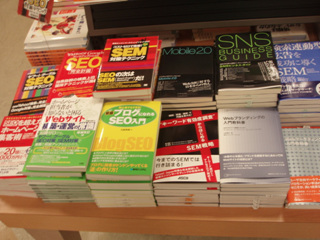
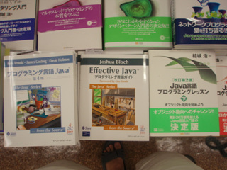

= 일본서점 컴퓨터 책 코너 탐방기
정상혁
2007-09-21
:jbake-type: post
:jbake-status: published
:jbake-tags: 책
:idprefix:

지난 8월4~7일 여름휴가로 일본 동경을 갔다왔습니다. 동경의 번화가를 구경하는데 4일을 다 썼어도 아쉬움이 남을 정도로 구경거리가 많더군요. 그 와중에서도 일본에는 어떤 컴퓨터 책들이 나오고 있을까 하는 호기심을 참지못해 시부야에 있는 북퍼스트와  신주쿠의 기노쿠니아 서점을 가 봤었습니다. 사실 일본어는 '다꾸앙','와리바시','덴뿌라' 수준의 단어 밖에 모르고, 글자는 전혀 읽을 줄 모르기 때문에 책표지만 감상할 수 밖에 없었습니다. 그래도 전체적인 기류는 명확히 와 닿았기에 인상적인 경험이였습니다.

image:img/japanese-book/kinoku.jpg[kinoku.jpg,title="01kinoku.jpg",width=320,height=240]

역시 웹2.0, SNS(Social Network Service), SEM(Search Engine Marketing), SEO(Search Engine Optimization, 검색엔진 최적화) 에 관련된 책들이 컴퓨터 서적코너의 앞 쪽을 차지하고 있었습니다. 인터넷 비지니스에 대한 열기는 일본에서도 뜨겁게 느껴집니다.
SEM/SEO는 아직 국내에서는 책 제목으로 붙일 정도로 보편화된 용어는 아닌 것 같은데 일본에서는 어느정도 알려졌나 봅니다.

image:img/japanese-book/web2-0-magazine.jpg[web2-0-magazine.jpg]

image:img/japanese-book/web2-0_1.jpg[web2-0_1.jpg]

image:img/japanese-book/web2-0_3.jpg[web2-0_3.jpg]

구글,  Yahoo, Myspace등 인터넷 서비스에 대한 책들도 많이 보였습니다. 서비스 사용자를 위한 이용법에 대한 내용도 있었지만, 개발자를 위한 Open API관련 서적이 눈에 띄게 많았습니다.

image:img/japanese-book/google.jpg[google.jpg]

image:img/japanese-book/google-api.jpg[google-api.jpg]

image:img/japanese-book/google-yahoo.jpg[google-yahoo.jpg]

image:img/japanese-book/google_1.jpg[google_1.jpg]

Goole earth에 관한 책들이 몇권보이는 마지막 사진은 컴퓨터 코너가 아닌 기노쿠니아 서점의 지학(땅 지 ,배울 학) 코너에서 찍은 것입니다.

Second life에 대한 책도 진열장의 잘 보이는 곳을 차지하고 있었습니다.

image:img/japanese-book/214615[secondlife.jpg]

image:img/japanese-book/214610[secondLife3.jpg]

image:img/japanese-book/214609[secondLife1.jpg]

마지막 사진은 기노쿠니아 원서 코너에서 찍은 것인데, 그 서점에는 컴퓨터 원서가 몇권 없었음데도 second life와 my space에 대한 책이 보였습니다.

Java관련 책들을 찾아봤는데 반가운 책들을 여러 권 발견했습니다. Effective Java, Expert one and one J2EE developement, Core J2EE pattern.

image:img/japanese-book/java_2.jpg[java_2.jpg]

image:img/japanese-book/java_3.jpg[java_3.jpg]

Eclipse 관련 서적들도 비중있게 자리가 배정되어 있었습니다.

image:img/japanese-book/eclipse_1.jpg[eclipse_1.jpg]

오픈소스 프레임웍에 관한 책들도 찾아보았습니다.

image:img/japanese-book/opensource-fw.jpg[opensource-fw.jpg]

image:img/japanese-book/spring2-0.jpg[spring2-0.jpg]

그리고 국내에서는 보기 힘든 책의 번역판도 보였습니다.

http://www.amazon.com/Inside-JavaOS-TM-Operating-System/dp/0201183935/ref=sr_1_1/103-8441353-8681409?ie=UTF8&amp;amp;amp;amp;amp;amp;amp;amp;s=books&amp;amp;amp;amp;amp;amp;amp;amp;qid=1190370137&amp;amp;amp;amp;amp;amp;amp;amp;sr=8-1[Inside JavaOS]라는 책인데 돌아와서 찾아보니 yes24에서는 외국서적으로도 검색이 안 되는 책이더군요.

image:img/japanese-book/java-os.jpg[java-os.jpg]

함수형 언어 Haskell에 대한 책도 발견했습니다.

image:img/japanese-book/haskel.jpg[haskel.jpg]

두 서점을 통들어 가장 강렬한 느낌을 주었던 책장은 http://www.wingbus.com/asia/japan/tokyo/shibuya/book_first/[북퍼스트]에서 본 Oreli 원서를 모아둔 곳이였습니다. 잘 정리된 모습이 깔끔해 보이네요.

image:img/japanese-book/oreli_1.jpg[oreli_1.jpg]

그리고 바로 옆에는 Oreli 번역서를 모아둔 책장이 있었습니다.

image:img/japanese-book/oreli_2.jpg[oreli_2.jpg]

Ruby를  일본 사람이 만들었으니 Ruby관련 서적이 한 칸은 차지하고 있지 않을까 하는 상상을 했었으나, 그렇지는 않았습니다. 국내와 비슷해보이는 몇권 정도였던것 같습니다.

더 구경을 하고 하고 싶었으나,불만 가득한 아내 때문에 적당히 보고 나올 수 밖에 없었습니다. 여기까지 와서 이런 데를 오는 것이 이해가 안 간다고 하더군요. 아내가 옷가게 구경할 때 저는 불평없이 있었다는 사실이 별로 고려되지 않은 듯합니다.

서점에 가기 전에도 일본이 우리나라보다 인구가 많아서 시장이 넓으니 국내보다 풍부한 책들을 구경할 수 있을 것이라고 예상을 했었습니다.
둘러보니 역시 다양한 책들을 많이 볼 수 있었습니다
.
http://www.amazon.com/Inside-JavaOS-TM-Operating-System/dp/0201183935/ref=sr_1_1/103-8441353-8681409?ie=UTF8&amp;amp;amp;amp;amp;amp;amp;amp;s=books&amp;amp;amp;amp;amp;amp;amp;amp;qid=1190370137&amp;amp;amp;amp;amp;amp;amp;amp;sr=8-1[Inside JavaOS] 같은 책은 소수만이 관심을 가질 것으로 보이고 , 국내에서 이런 책을 읽고 싶은 사람은 아마  아마존에서 직접 주문해서 읽을 것입니다. 이런 전문적인 책들이 일본에 번역판이 나왔다는 사실은 크게 부럽지는 않습니다. 그러나 Open API에 대한 책에 대해서는 아쉬움이 남습니다. 이런 책도 역시 적극적인 의지를 가진 사람은 인터넷으로 자료를 찾거나 원서를 사 보면서 공부할 수 있겠죠. 하지만 영어로 읽는 것이 속도가 늦거나 약간이라도 저렴한 번역서를 사고 싶어하는 사람들을 끌어드릴 수 있다면 더욱 그 분야가 활성화 될 수 있을 것입니다. 즉  대중화하는 것이 의미가 있는 분야의 책은 수요를 보다 도전적으로 창출해야 한다고 생각합니다.

계속 open API를 예로 들면,
'막연하게 뭔가 open api로 프로그램을 만들고 싶다는 사람이 있다.
그런데 그는 바쁜 업무를 핑계로 적극적으로 관련 자료를 찾아보지 못하고 있다.
우연찮게 그는 서점을 갔다가 Open API에 대한 책을 발견하고 사게 된다.
그는 출퇴근 길이나 집에서 뒹구는 시간에 그 책을 읽고 더욱 흥미를 느끼고, 결국에는 매쉬업 서비스를 만들어서 공개하게 된다.' 와 같은 일도 생길 수 있지 않겠습니까?

다음, 네이버, 스프링노트 같은 국내 서비스의 open API에 대한 입문서가 있다면 좋겠다는 생각도 듭니다.

아뭏든 읽지도 못하는 책을 신나게 구경하게 온, 특이한 경험이였습니다.
