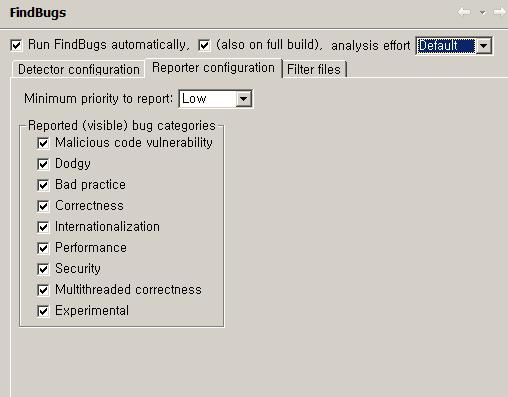
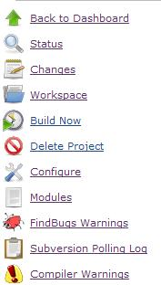

= FindBugs + Eclipse + Maven2 + Hudson
정상혁
2008-09-30
:jbake-type: post
:jbake-status: published
:jbake-tags: findbugs,maven,hudson,eclipse,static-analysis
:idprefix:

http://findbugs.sourceforge.net/[FindBugs]를 이용한 코드검사를 Maven2을 통해 실행하고, Hudson을 통해 확인하는 설정을 정리해 봅니다.

Eclipse에서 findbugs로 코드검사를 해볼 수 있는 툴은 http://findbugs.cs.umd.edu/eclipse/ 를 update site로 지정하면 설치할 수 있습니다. 설치가 잘 되었다면 소스 폴더를 선택하고 마우스 우클릭을 하면 'Find Bugs'라는 메뉴가 생긴 것이 보일 것입니다.
그 메뉴를 통해 원하는 프로젝트를 검사하고, Bug Explorer 탭을 선택하보면 아래와 같은 화면이 나옵니다.

image:img/findbugs/eclipse-findbugs.jpg[eclipse-findbugs.jpg]

Bug Explorer 탭에서는 버그를 유형별로 정리해서 보여주고, 소스탭에서는 해당하는 코드에 벌레 모양 아이콘을 찍어줍니다. 그리고 Problems 창에서는 Eclipse에서 잡아내는 다른 경고처럼 warning으로 해당 소스를 표시해 줍니다. Bug Details 탭을 누르면 버그에 대한 자세한 설명도 볼 수 있습니다.

프로젝트의 Properties 메뉴에서 FindBugs 설정란으로 가면 검사할 규칙 등을 선택할 수 있습니다.

image:img/findbugs/eclipse-findbugs-config1.jpg[eclipse-findbugs-config1.jpg]

이 설정화면에서 'Run FindBugs automatically'를 선택하면, 소스가 바뀔 때마다 자동으로 검사를 수행해 줍니다. 이 기능이 선택되어 있지 않다면, 지적된 소스를 수정해도 다시 수동으로 검사를 돌려야지 경고메시지 지워지므로, 이클립스가 아주 느리다는 느낌이 안 들정도라면 선택하는 것이 좋습니다. 이 기능을 선택해서, Eclipse의 Problems 탭에서 코드 작성 즉시 에러와 경로를 확인할 수 있게 되었다면 .project 파일에 아래와 같은 부분이 추가되어 있을 것입니다.

[source,xml]
----
<natures>

    ....

  <nature>edu.umd.cs.findbugs.plugin.eclipse.findbugsNature</nature>

</natures>
----

FindBugs 설정 화면 중 Detector Configuration 탭에서는 검사할 규칙들을 지정할 수 있고, Reporter configuration 탭에서는 보고해 줄 버그의 경고단계와 분류를 선택할 수 있습니다.

Filter files 탭에서는 별도의 XML파일로 선언된 포함하거나 제외시킬 버그와 파일에 대한 설정을 가지고 올 수 있습니다.

image:img/findbugs/eclipse-findbugs-config3.jpg[eclipse-findbugs-config3.jpg]

아래에 자세히 설명하겠지만, Maven 설정에서 참조하는 findBugsExclude.xml을 Eclipse plugin에서도 똑같이 지정해서 Maven과 Eclipse에서 같은 기준으로  검사가 수행되도록 했습니다.

Maven2의 http://mojo.codehaus.org/findbugs-maven-plugin/[findbugs-maven-plugin]은  pom.xml에 아래와 같이 설정됩니다.

[source,xml]
----
<plugin>
  <groupId>org.codehaus.mojo</groupId>
  <artifactId>findbugs-maven-plugin</artifactId>
  <version>2.4.0</version>
  <configuration>
    <findbugsXmlOutput>true</findbugsXmlOutput>
    <findbugsXmlWithMessages>true</findbugsXmlWithMessages>
    <xmlOutput>true</xmlOutput>
    <excludeFilterFile>$\{basedir}/findBugsExclude.xml</excludeFilterFile>
   </configuration>
</plugin>
----

위의 설정에 들어가는 속성들에 대해서는 http://mojo.codehaus.org/findbugs-maven-plugin/findbugs-mojo.html[findbugs-maven-plugin 설명 페이지]에서 자세한 내용을 보실 수 있습니다.

저는 제외할 검사규칙을 지정하기 위해서 excludeFilterFile속성에 findBugsExclude.xml을 지정했습니다.

findBugsExclude.xml의 내용은 아래와 같이 설정했습니다.

[source,xml]
----
....
<FindBugsFilter>
....
....
  <Match>
....
....
   <Bug code="Se,SnVI,Dm,UwF,EI,EI2" />
....
....
  </Match>
....
....
</FindBugsFilter>
....
----

제외할 것을 선언하는 파일에 이렇게 적었으니 Bug code가 "Se,SnVI,Dm"에 해당하는 버그검사는 제외한다는 의미입니다. Filter의 설정 방법에 대해서는 http://mojo.codehaus.org/findbugs-maven-plugin/findbugs-mojo.html[findbugs의 매뉴얼]을 참조하시면 됩니다.

버그 코드 중 Se,SnVI는 serialVersionUID에 관한 것이고 Dm은 String.toUpperCase 등의 메소드에서 Local설정을 권유하는 검사입니다.   (http://findbugs.sourceforge.net/bugDescriptions.html[버그 코드에 대한 설명 페이지] 참조)

이렇게 설정을 하고 `mvn findbugs:findbugs` 로 maven을 실행시키면 필요한 라이브러리들을 다운로드 받고 빌드가 실행됩니다. 실행이 성공했다면 목적지 폴더에 findbugs.xml과 findbugsXml.xml파일이 생성이 되었을 것입니다.

이것을 Hudson을 통해서 보기 위해서는 Hudson에서도 findbugs plugin을 설치해야 됩니다.

Hudson 첫 화면에서 Manage Hudson - Manage Plugins 메뉴를 찾아갑니다. Available 탭에서 findbugs를 선택하고 화면 우측하단의 'install'버튼을 누르면 Hudson이 알아서 라이브러리를 다운 받아줍니다. 설치한 plug-in이 실행되기 위해서는 Hudson을 재시작해야 합니다.

그런 다음에 findbugs를 적용하고자 하는 프로젝트에 가서 Configure메뉴를 선택하면 아래와 같이 Publish FindBugs Analysis Result라는 부분이 추가된 것을 보실 수 있을 것입니다.

image:img/findbugs/hudson-findbugs-config.jpg[hudson-findbugs-config.jpg]

이것을 선택하고 원하는 기준값이 있을 경우 입력한 뒤에 "save'버튼을 누르고 build를 해보면 됩니다. 물론 build에는 findbugs:findbugs goal이 포함되어야 하겠죠.

빌드가 성공하는 것을 보고 프로젝트의 메뉴를 보면 FindBugs Warnings라는 메뉴가 추가된 것을 확인하실 수 있습니다.

그 메뉴를 누르면 생성된 보고서가 보입니다.

image:img/findbugs/hudson-findbugs-report.jpg[hudson-findbugs-report.jpg]

warning이 존재할 경우 건수를 클릭하면 해당하는 클래스들이 나오고, 클래스를 선택하면 소스에서 warning을 발생시키는 부분까지 보여줍니다.

만약 hudson의 findbugs plugin을 실행할 때 Cannot find setter nor field in org.apache.maven.plugins.site.SiteMojo for 'xmlOutput' 와 같은 에러가 난다면 http://blog.benelog.net/2208375[Hudson plugin 수동으로 빌드&업로드]를 참조해서 최신 버전으로 플러그인을 업데이트 해보시기 바랍니다.

== 관련 자료
* http://okjsp.tistory.com/1165643579[Sun Techdays 2008 Lightning Talk 발표자료; findbugs]
* http://okjsp.tistory.com/1165643626[Hudson의 Findbugs 플러그인 이용하기]
* http://okjsp.tistory.com/1165643570[findbugs eclipse plugin 설치]
* http://www.buggymind.com/177[FindBugs: 코드의 정적 분석을 통한 버그 탐색] : 동영상 강연을 보니 구글에서도 이 도구를 사용하고 있다고 합니다.

