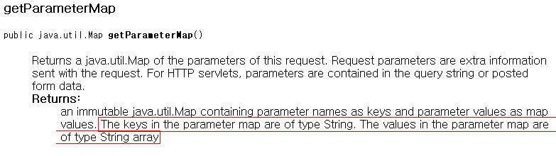
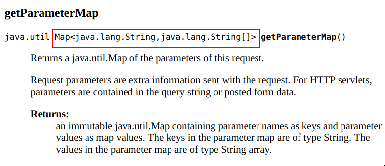

= Effective & Agile Java Generics
정상혁
2008-12-16
:jbake-type: post
:jbake-status: published
:jbake-tags: java,generics
:idprefix:

.수정이력
* 2019.04.13
** 유효하지 않은 JavaDoc 문서 링크 최신화
** 예제에서 Diamond 문법 활용
** JUnit4에 대한 일반적인 설명 링크 제거
** `ServletRequest.getParameterMap()`에 대한 최신 JavaDoc 내용 추가
** `List<ScheduledFuture<?>>`가 쓰인 예시를 Spring Integration의 소스에서 LogBack의 것으로 변경

== Generics가 들어간 테스트 코드를 통과시켜 봅시다.
아래에 있는 테스트 1~5까지의  테스트 코드들을 모두 한번에 통과시키는 ListUtils.max메서드는 어떻게 선언하고 구현해야 할까요?

Generics를 써보신 분이라면 http://benelog.springnote.com/pages/2231980/attachments/1026628?dummy=1229420647470[ListUtilsTest.java]를 다운 받으셔서 한번 풀어 보시기 바랍니다. Collections.max()를 아시는 분도 그 메소드를 참고하시지 마시고 직접 메서드를 만들어 보시면 재미있으실 겁니다.

제약조건은 다음과 같습니다.

* `@SuppressWarnings("unchecked")` 를 쓰지 않고도 Generics에 대한 warning이 없고, Casting도 한번도 하지 않아야 하고
* 컴파일 시점에서 ListUtils.max 메소드에 Comparable 인터페이스를 구현한 객체들을 쌓은 List가 넘어온다는 것을 검증할 수 있어야 한다.

[source,java]
.테스트 1 :  빈 리스트가 넘어오면 null값 반환
----
    @Test
    public void getNullIfEmptyList(){
        List<Integer> numbers = new ArrayList<>();
        Integer max = ListUtils.max(numbers);
        assertThat(max,is(nullValue()));
    }
----

[source,java]
.테스트 2 :  Integer객체의 최대값 구하기
----
    @Test
    public void getMaxInteger(){
        List<Integer> numbers = new ArrayList<>();
        numbers.add(Integer.valueOf(1))
        numbers.add(Integer.valueOf(2));
        Integer max = ListUtils.max(numbers);
        assertThat(max,is(Integer.valueOf(2)));
    }
----

[source,java]
.테스트 3 :  BigInteger객체의 최대값 구하기
----
    @Test
    public void getMaxBigInteger(){
        List<BigInteger> numbers = new ArrayList<>();
        numbers.add(BigInteger.ZERO);
        numbers.add(BigInteger.ONE);
	BigInteger max = ListUtils.max(numbers);
        assertThat(max,is(BigInteger.ONE));
    }
----

[source,java]
.테스트 4: java.sql.Date 객체의 최대값 구하기
----
    @Test
    public void getMaxDate(){
        java.sql.Date now = new java.sql.Date(new Date().getTime());
        java.sql.Date afterAWhile = new java.sql.Date(new Date().getTime()+6000);
        List<java.sql.Date> dates = new ArrayList<java.sql.Date>();
        dates.add(now);
        dates.add(afterAWhile);
        java.sql.Date max = ListUtils.max(dates);
        assertThat(max,is(afterAWhile));
    }
----

[source,java]
.테스트5 : ScheduledFuture를 구현한 객체의 최대값 구하기
----
    @Test
    public void getMaxScheduledFuture() throws InterruptedException{
        ScheduledExecutorService executor = Executors.newScheduledThreadPool(2);
        ScheduledFuture<?> after1Second = executor.schedule(getTask("first"),1,TimeUnit.SECONDS);
        ScheduledFuture<?> after2Seconds = executor.schedule(getTask("second"),2,TimeUnit.SECONDS);
        List<ScheduledFuture<?>> futures = new ArrayList<ScheduledFuture<?>>();
        futures.add(after1Second);
        futures.add(after2Seconds);
        ScheduledFuture<?> max = ListUtils.max(futures);
        long maxDelay = max.getDelay(TimeUnit.SECONDS);
        assertThat(maxDelay,is(after2Seconds.getDelay(TimeUnit.SECONDS)));
        Thread.sleep(3000);
        assertTrue(max.isDone());
    }
    private Runnable getTask(final String message) {
        Runnable task = new Runnable(){
            public void run() {
                System.out.println(message);
            }
        };
        return task;
    }
----

(https://docs.oracle.com/javase/8/docs/api/index.html?java/util/concurrent/ScheduledFuture.html]  API문서 참조)

== 풀이와 설명

테스트 1,2,3번 까지의 코드만이라면 아래와 같이 선언하셔도 됩니다.

[source,java]
.리스트 1: 간단한 max 메서드 선언
----
public static <T extends Comparable<T>> T max(List<T> list)
----

이렇게 `<T extends Comparable<T>>` 처럼 Type parameter가 그 자신이 포함된 표현으로 그 범위가 선언되는 것을 recursive type bound라고 합니다.

Integer와 BigDecimal의 클래스 선언을 보면 아래와 같습니다.

[source,java]
.리스트 2: Integer 와 BigInteger 클래스 선언부
----
public final class Integer extends Number implements Comparable<Integer>

public class BigInteger extends Number implements Comparable<BigInteger>
----

두 클래스 모두 자신의 타입이 Parameterized type으로 들어간 Comparable 인터페이스를 구현하고 있기 때문에 리스트3의 메소드 선언으로도 Integer나 BigInteger가 담긴 리스트를 받을 수 있습니다.

그러나 리스트 1의 선언으로는 테스트4,5에 있는 메서드에서 컴파일 에러가 날 것입니다. 그 이유는 다음과 같습니다.

테스트4의 https://docs.oracle.com/javase/8/docs/api/java/sql/Date.html[java.sql.Date]는 https://docs.oracle.com/javase/8/docs/api/java/util/Date.html[java.util.Date]를 상속한 클래스입니다.
그런데 `java.sql.Date` 는 따로 comparesTo 메서드를 재정의하고 있지 않고, 상위클래스인 `java.util.Date` 에 있는 메서드를 그대로 쓰고 있습니다.
`java.sql.Date` 는 `Comparable<java.sql.Date>` 한 것이 아닌 `Comparable<java.util.Date>` 를 구현한 것이라고 볼 수 있습니다.
(두 클래스의 이름이 같아서 혼동이 되실 수도 있습니다.
http://www.yes24.com/Goods/FTGoodsView.aspx?goodsNo=2600965&CategoryNumber=001001003016003014[Java Puzzler]에서는 이 두 클래스의 예를 들면서 자바 플랫폼 설계자가 이름을 지으면서 깜빡 존 듯하다고 언급하고 있습니다.)

그리고 테스트5의 `java.util.concurrent.ScheduledFuture` 인터페이스는 `Comparable<ScheduledFuture>` 를 구현한 것이 아닌, https://docs.oracle.com/javase/8/docs/api/java/util/concurrent/Delayed.html[Delayed]라는 인터페이스를 상속한 것이고, 이 Delayed는 `Comparable<Delayed>` 를 상속한 인터페이스입니다. 리스트 3의 인터페이스 선언을 보시면 쉽게 이해가 되실 것입니다.

[source,java]
.리스트 3: Delayed 인터페이스 선언부
----
public interface ScheduledFuture<V> extends Delayed, Future<V>

public interface Delayed extends Comparable<Delayed>
----

이런 경우도 모두 통과할 수 있게 `ListUtils.max()` 메서드를 선언하고 구현하면 아래와 같습니다.

[source,java]
.리스트4: ListUtils 구현
----
public class ListUtils {
    public static <T extends Comparable<? super T>> T max(List<T> list){
        T result = null;
        for(T each : list) {
            if (result==null) result = each;
            if(each.compareTo(result)>0) result = each;
        }
        return result;
    }
}
----

`public static <T extends Comparable<? super T>> T max(List<T> list)` 라는 긴 메서드 선언입니다. 이 선언 안에는 recursive type bound, wild card, upper bound, lower bound가  다 들어가 있습니다. 이 정도 메서드를 설계할 수 있어야지, Java generics를 제대로 아는 것이라고 할 수 있겠습니다.

bounded wild card를 적용하는 기준은 Effective Java 2nd Edition에 나와 있는 PECS(Producer-extends, Consumer-super)원칙을 기억하시면 도움이 됩니다. 원래 http://engdic.daum.net/dicen/contents.do?query1=ED00866730[PECS의 뜻]은 가슴 근육이라는군요.

=== `<T extends Comparable....`

Comparable인터페이스를 구현한 클래스가 그 대상이어야 max내부에서 Comparable.compareTo를 이용해서 최대값을 구할 수 있습니다. 그래서 타입 T는 T extends Comparable이 되어야 합니다. PECS원칙으로도 리턴값으로 생산되는 (Producer) 타입이 T이므로 extends를 쉽게 연상하실 수 있습니다.

=== `Comparable<? super T> 부분`
max 메서드 내부에서 타입 T는 Comparable.compareTo(T o)메서드 뒤에 파라미터로 넘어가는, 소비되는(Consumer) 대상으로 쓰이기에 PECS원칙으로 super로 연결시킬 수 있습니다. 테스트5의 코드를 예로 보면, ScheduledFuture는 ScheduledFuture의 상위 인터페이스인 Delayed가 Comparable의 Parameterized type으로 넘어가는 Comparable<Delayed>형태의 Comparable인터페이스를 상속하고 있습니다.  T를 ScheduledFuture로 봤을 때 Comparable<? super T>는 Comparable<Delayed>와 잘 맞아떨어집니다.

이 리스트4의 ListUtils.max 메서드는 http://www.yes24.com/Goods/FTGoodsView.aspx?goodsNo=2416238&CategoryNumber=002[Effective Java 2nd Edition]의 Item28에 나오는 코드를 보고서 약간 변경을 해 본 것입니다. 원래 책에 나오는 코드는 아래와 같습니다.

[source,java]
.리스트5: Effective Java 2nd Edition에 있는 max메서드
----
public static <T extends Comparable<? super T>> T max(List<? extends T> list){
  Iterator<? extends T> i = list.iterator();
  T result = i.next();
  while(i.hasNext()){
            T t = i.next();
            if (t.compareTo(result)>0) result = t;
   }
   return result;
}
----

메서드 선언이 `public static <T extends Comparable<? super T>> T max(List<? extends T> list)` 로 예제보다 더 늘어난 부분이 있습니다. 끝에 있는 `List<? extends T>` 가 추가된 것입니다. 이 부분은 PECS원칙에 따르면 List객체로부터 T를 생산(Producer)해 오기 때문에 `? extends T` 로 하는 것이 적절해 보이는 합니다. 그러나 테스트1~5의 코드에서는 `List<T>` 만으로도 컴파일러가 수행하는 형추론(type inference)에 문제가 없었기에 제가 만든 코드인 리스트4에는 추가하지는 않았습니다. 컴파일러가 수행하는 Type inference는 굉장히 복잡하고, Java Language Spec에서 16페이지나 차지한다고 합니다.

그리고 리스트5에서는 길이가 0인 List가 넘어간 값일 때는 첫번째 i.next();에서 NoSuchElementException을 내게 되어 있습니다.

https://docs.oracle.com/javase/8/docs/api/java/util/Collections.html#max-java.util.Collection-[java.util.Collections.max] 메서드에서도 같은 결과가 나오는 것으로 보아서, 유사한 구현방식이 쓰인 것으로 추측됩니다. 제가 만든 문제에서는 Collection.max와 약간 다른 부분을 만들어 보고 싶어서 길이가 0일 list가 올 때는 null을 반환하는 방식으로 바꾸어 보았습니다.

그렇다면 `java.util.Collections.max`의 메서드 시그니처는 어떻게 되어 있을까요?

[source,java]
.리스트6: java.util.Collections.max 메서드
----
static <T extends Object & Comparable<? super T>> T max(Collection<? extends T> coll)
----

일단 대상이 List보다 확장된 Collection이니 Parameter가 Collection인 것이 눈에 들어 옵니다. 그런데 T의 제약조건이 <T extends Object & Comparable<? super T>>로 선언되어 있는 것이 리스트5의 코드보다 'Object &' 부분이 더 들어가 있습니다.

이것은 java1.4와의 하위 호환성을 위한 것입니다. Java에서는 하위호환성 지원 때문에 컴파일 시에 Generics관련 정보를 모두 검사한 후에는 실제로는 Generics 정보가 전혀 없는 바이트코드를 생성하게 되어 있습니다. 그래서 리스트5처럼 메서드를 선언했을 때에는 런타임시에는 리스트 7과 같은 코드와 같은 바이트코드가 생성됩니다.

[source,java]
.리스트 7: 리스트5의 메서드 선언이 자료형 지우기가 수행된 뒤의 모습
----
static Comparable max(Collection c)
----

그러나 이전 버전에서의 max메서드의 모습은 다음과 같았습니다.

[source,java]
.리스트8: Java5 이전의 Collections.max 메서드
----
public static Object max(Collection c)
----

따라서 리스트7처럼 Comparable을 반환하게 된다면 이것은 이전버전의 메서드 Signature를 바꿔버린 것이 되므로 하위버전에서 컴파일된 코드에서 Collections.max를 호출할 때 에러를 발생시키게 됩니다. 그래서 Object &이 더 추가된 것이죠. (Agile Java의 Lesson 12 중 Additional Bounds에서 참조)

여기까지 이해하셨으면, 실무에서 어떤 Generics 관련 코드를 봐도 이제 쉬워보이실 겁니다.

== Generics의 표현력
하나의 예제로 Generics의 많은 부분을 설명하기 위해서 다소 복잡한 코드를 보여드렸습니다. 혹시나 Generics를 이제 막 적용하시고 싶으신 분들의 마음을 어둡게 한 것이 아닌가 걱정이 되기도합니다. 그러나 대부분의 Generics적용 사례는 훨씬 간단하고, 특히 Collection 선언에 genercics를 활용하는 정도는 어렵지 않습니다.

Generics는 컴파일시점에서의 에러 검출 영역을 넓혀줘서 보다 이른 시점에 버그를 잡을 수 있게 해주고, 코드I의 설명력을 높여줘서 API사용자들이 보다 쉽게 API를 쓸 수 있게 해줍니다. 컴파일타입의 에러체크 능력은 위의 예제를 통해서 설명했으니, 표현력에 대해서도 제가 겪은 사례를 이야기해 볼까 합니다.

오래　전에 저는 Java 인터페이스를 엑셀파일로 만드는 산출물 작업을 했었는데, 리턴타입이 List인 메서드들은 그 안에 어떤 객체들이 들어있는지 메서드 시그니처만으로는 표현할 수 없어서 답답했던 적이 있었습니다. 그래서 아예 List대신 배열을 쓸까도 고민하다가 List가 가진 편의성들을 버릴 수가 없어서 List를 쓰고 따로 문서에 그 안에 어떤 객체가 들어가 있는지를 적을 수 밖에 없었습니다.

https://docs.oracle.com/javaee/5/api/javax/servlet/ServletRequest.html#getParameterMap()[javax.servlet.ServletRequest.getParameterMap()]를 사용할 때는 API사용자로서 아쉬움을 느꼈었습니다. API문서를 보면 이 메서드가 반환하는 Map에는 key로 String이, value로 String배열이 들어가 있는 것으로 설명되어 있습니다.

저는 처음에 이 문서를 안 보고 key가 String, 값이 하나일 때는 그냥 String, 값이 2개 이상이면 String배열이 들어가 있지 않을까하는 추측을 바탕으로 한 코드를 짜서 몇번 에러를 냈었었습니다.
결국 API문서를 보고서 어떤 형식으로 자료가 들어가 있는지 알게 되어있습니다.
이 메소드의 리턴타입이 `Map<String,String[]>` 과 같이 선언되어 있었다면, 문서를 안 보고도, Runtime 에러를 안 겪고도 바로 올바른 자료형으로 사용이 가능했을 것입니다.
이렇듯 Generics를 잘 활용할 수 없는 API를 쓸 때에는 소비자 입장에서 불편합니다.

나중에 저는 이 메서드를 호출하는 부분을 아래와 같이 감싸는 부분을 넣었습니다.

[source,java]
.리스트9: `javax.servlet.ServletRequest.getParameterMap()` 메서드를 Generics를 이용한 코드로 감싸기
----
@SuppressWarnings("unchecked")
Map<String,String[]> requestMap = request.getParameterMap();
----

`@SuppressWarnings("unchecked")` 은 어쩔 수 없는 경우에만 써야 하고, 쓸 때도 클래스 단위, 메서드 단위가 아닌 이런 최소 라인 단위로 써야 합니다.
Effective Java 2nd Edition Item 24참조)
이 경우는 Generics지원하지 않는 외부 인터페이스를 호출하는 것이라서 불가피한 경우입니다.
형에 대해서는 API 문서에 명시된 내용라서 이렇게 @SuppressWarnings을 선언해도 문제가 없습니다.
필요에 따라서 이 requestMap을 리턴해 준다면 그것을 쓰는 코드에서는 더 이상 이 안에 무엇이 들어있는지 문서를 찾아보지 않아도 됩니다.

https://docs.oracle.com/javaee/6/api/javax/servlet/ServletRequest.html#getParameterMap()[
JavaEE6 버전의 JavaDoc]을 보니 이제는 `request.getParamersMap`의 반환형이 `Map<String,String[]>` 으로 바뀌어 있음을 확인할 수 있습니다.

== 관련자료 모음
=== Generics 관련 자료
이 포스트는 주로 아래 두 책을 보면서 얻은 정보를 통해 작성되었습니다.

* http://www.yes24.com/Goods/FTGoodsView.aspx?goodsNo=2416238&CategoryNumber=002[Effective Java 2nd Edition] : http://www.yes24.com/Goods/FTGoodsView.aspx?goodsNo=2416238&CategoryNumber=002[]Chater 4: Item23 ~ Item 29
* http://www.yes24.com/Goods/FTGoodsView.aspx?goodsNo=1534922&CategoryNumber=002001026004[Agile Java] : http://www.yes24.com/Goods/FTGoodsView.aspx?goodsNo=1534922&CategoryNumber=002001026004[]Lesson 14

Agile java처럼 테스트 코드를 먼저 보여주었고 , ListUtils.max 메서드는 Effective Java의 내용을 주로 참조해서 작성했습니다. Effective Java에서는 ScheduledFuture의 경우에 대해서 언급만 되어 있고 예제코드가 없는 것이 아쉬워서 테스트5의 코드를 작성했고, 비슷한 사례의 보다 친숙한 클래스를 찾다가  Agile java에서 java.sql.Date 클래스가 예제에 많이 쓰인 것을 보고 테스트4를 추가했습니다.

http://www.yes24.com/Goods/FTGoodsView.aspx?goodsNo=2416238&CategoryNumber=002[Effective Java 2nd Edition] 에 포함된 내용 중 Java5 관련 내용은 Joshua Bloch이 했던 발표에 잘 요약되어 있습니다.

* http://developers.sun.com/learning/javaoneonline/2006/coreplatform/TS-1512.pdf[Effective Java Reloaded, JavaOne Conference 2006]
* http://javapolis.libsyn.com/index.php?post_id=380974[Effective Java Reloaded - 2008]

그외 Generics에 관한 자료들의 링크는 아래와 같습니다.

* http://java.sun.com/j2se/1.5/pdf/generics-tutorial.pdf[Genercis tutorial]
* http://mkseo.pe.kr/blog/?p=1691[Summary on some java generics presentations/postings]
* http://www.ibm.com/developerworks/kr/library/j-jtp04298.html[자바 이론과 실습: 제네릭스 해부, Part 1]
** http://whiteship.me/1932[Generic 팩토리 메소드]
* http://www.ibm.com/developerworks/kr/library/j-jtp07018.html[자바 이론과 실습: 제네릭스 해부, Part 2]
* http://gafter.blogspot.com/2006/12/super-type-tokens.html[Super Type Tokens]
* http://www.ibm.com/developerworks/java/library/j-jtp01255.html[Generics gotchas]
* http://whiteship.tistory.com/1614[Generic 메타데이터 활용하기]

=== Concurrent 관련자료
Effective Java에서 언급한 ScheduledFuture를 이용한 예제코드를 만들다 보니 Concurrent관련 API들이 몇개 포함되었습니다. 그 API들에 관심이 있으신 분은 아래 자료를 참조하시면 됩니다.

* http://www.yes24.com/Goods/FTGoodsView.aspx?goodsNo=3015162&CategoryNumber=001001003016003014[자바 병렬프로그래밍 :] 6장 작업실행
* 관련 API 문서
** http://java.sun.com/j2se/1.5.0/docs/api/java/util/concurrent/Executors.html[java.util.concurrent.Executors]
** http://java.sun.com/j2se/1.5.0/docs/api/java/util/concurrent/ScheduledExecutorService.html[java.util.concurrent.ScheduledExecutorService]
** http://java.sun.com/j2se/1.5.0/docs/api/java/util/concurrent/ScheduledThreadPoolExecutor.html[java.util.concurrent.ScheduledThreadPoolExecutor]

`List<ScheduledFuture<?>>` 의 코드가 실전에서 쓰인 것이 없을까해서 찾아보니 로깅　프레임워크인　Logback의　소스 코드에서 그런 코드가 발견되었습니다.

* https://github.com/qos-ch/logback/blob/master/logback-core/src/main/java/ch/qos/logback/core/ContextBase.java#L52［ContextBase.java］
