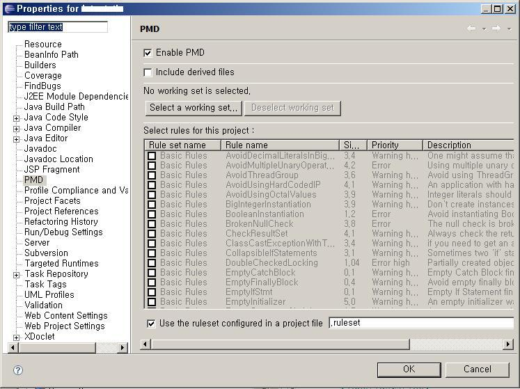
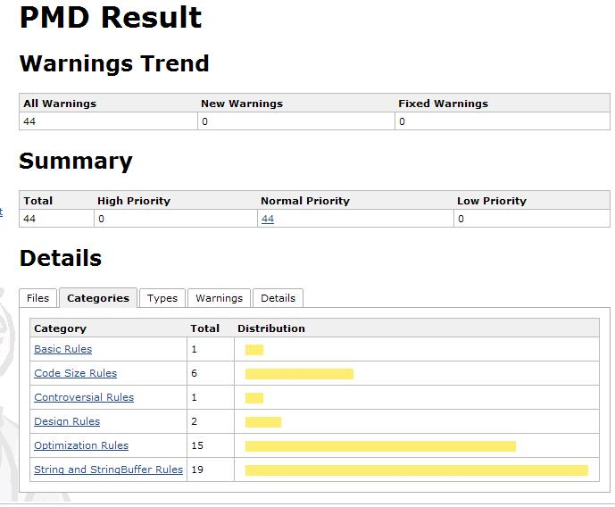

= PMD + Eclipse + Maven2 + Hudson
정상혁
2008-12-19
:jbake-type: post
:jbake-status: published
:jbake-tags: PMD,Maven,Hudson,Eclipse,정적분석
:jabke-rootpath: /
:rootpath: /
:content.rootpath: /
:idprefix:

코드 검사도구인 http://pmd.sourceforge.net/[PMD] 를 Eclipse plugin을 설정하고, Maven을 통해서도 같은 규칙으로 코드를 검사한 보고서를 생성하고, Hudson을 통해서 확인하는 과정을 정리해 봤습니다.

Eclipse에서는 update site를 http://pmd.sf.net/eclipse 로 지정해서 플러인을 설치합니다.

Eclipse 메뉴의 Window- Preferences를 가면 Rule설정 파일을 export, import할 수 있는 기능이 있습니다.

image:img/pmd/eclipse-pmd-rule.jpg[eclipse-pmd-rule.jpg]

Project의 Properties에도 PMD관련 설정이 있습니다. 외부에서 만든 Rule파일을 바로 참조해도 되고, 여기서 설정된 것을파일로 생성할 수도 있습니다. 이미 있는 프로젝트에서 Rule를 설정할 때는 Project의 Properties에서 Rule들을고른 후에 생기는 warning이나 error를 보고 warning이 안 뜨게 소스를 고거나 Rule을 제외한 후, 최종결정Rule들로 Ruleset 정의 파일을 생성하는 것이 편리할 것입니다. 저는 처음에 모든 Rule을 다 선택한 다음에warning들을 없애가면서 Rule들을 하나하나 검토해 나갔었습니다.

위의 화면에서 Enable PMD를 선택하면 .project파일에 아래와 같은 부분이 추가될 것입니다.

[source,xml]
----
<natures>
      ....
   <nature>net.sourceforge.pmd.eclipse.plugin.pmdNature</nature>
</natures>
----

이제 해당 프로젝트는 Eclipse의 Problems View에서 PMD에서 보고하는 error, warning까지 모두 다 뜨게됩니다. 개발을 하면서 Rule 준수에 대한 빠른 피드백을 얻기 위해 되도록 이 기능을 사용하는 것이 좋습니다. 대신 이미Project에 warning이 많으면 새로운 warning들이 잘 눈에 띄지 않게 되므로, Project를 warning없이깨끗히 정리한 다음에 사용할 것을 권장해 드립니다.

모든 Rule을 다 적용하면 아마 굉장히 많은 warning과 때로는 에러까지도 나올 것입니다. 그런 것들을 다 검토해서 포함시킬지를 결정해야 합니다. http://pmd.sourceforge.net/rule-guidelines.html를 참조하셔서, 프로젝트 상황에 맞게 적용해야겠죠. 그중 몇가지 Rule에 대해서만 언급을 하고 넘어가겠습니다.

* http://pmd.sourceforge.net/rules/basic.html[Basic Rules]-EmptryInitializer:  PMD 5.0에서 추가된 룰로 Maven의 PMD plugin버전 2.4에서는 PMD 버전 4.2.2를 참조하기 때문에 이Rule은 지원되지 않습니다. 따라서 PMD의 Eclipse plugin에서 이를 지원한다고 할지라도 Maven plugin과같이 쓰기 위해서는 이 Rule을 반드시 제외해야 합니다.
* http://pmd.sourceforge.net/rules/optimizations.html[Optimization Rules]-LocalVariableCouldBeFinal과 Controversial Rules-AvoidFinalLocalVariable : 서로 상반되는 Rule로 한쪽 Rule을피하면 다른 쪽에 걸려드는 Rule입니다. 그래서 warning을 안보려면 둘 중에 하나는 꼭 제외해야 합니다. 그런데,final을 Local variable에 일일히 선언하는 것도 번거로운 일이고, 메소드 내의 inner class에서 참조해야되어서 꼭 final이 되어야하는 local variable도 있으므로, 둘 다 제외하는 것도 좋습니다
* http://pmd.sourceforge.net/rules/controversial.html[Controversial Rules]-OnlyOneReturnRule :  메서드에서 return문이 여러 개일 경우 경고를 주는데, 메서드 중간의 return문은 복잡한 조건문의 구조를 단순하게 하는데 도움이 경우가 많고, http://www.yes24.com/Goods/FTGoodsView.aspx?goodsNo=2824034&CategoryNumber=001001003016001006[켄트벡의 구현패턴] 7장 중 '보호절'을 보면 이를 권장하고 있습니다.
* http://pmd.sourceforge.net/rules/design.html[Design Rules]-UnnecessaryLocalBeforeReturn: return 전에 따로 local 변수로 반환할 값을 선언할 때 주는 경고인데, 기능적으로는 별 의미 없는 코드이나,return 문장에는 @SupressWarning 의 Annotation을 추가할 수 없기 때문에,  Annotation 적용범위를 최소화하기 위해 그런 선언이 필요한 때도 있습니다. (Java Language Spec 9.7, EffectiveJava 2nd Edition Item 24 참조)

검토해보니 가장 부담없이 적용가능한 RuleSet이 괄호에 대한 규칙을 정의하는 Braces Rules이고, Controversial Rules가 이름 그래도 가장 제외할 것이 많은 Rule Set입니다.

이런 과정을 거쳐서 선별된 Rule 정의 파일이 만들어지면 그것을 Maven의 PMD plugin에서도 참조할 수 있게 설정합니다. 저는 Rule설정 파일이름을 .ruleset으로 하고 pom.xml에 추가했습니다.

[source,xml]
----
  <reporting>
    <plugins>
      <plugin>
        <groupId>org.apache.maven.plugins</groupId>
        <artifactId>maven-pmd-plugin</artifactId>
        <version>2.4</version>
        <configuration>
          <rulesets>
            <ruleset>$\{basedir}/.ruleset</ruleset>
          </rulesets>
          <sourceEncoding>utf-8</sourceEncoding>
          <targetJdk>1.6</targetJdk>
          <minimumTokens>10</minimumTokens>
        </configuration>
      </plugin>
  </reporting>
----

그리고는 mvn site 혹은 mvn pmd:pmd pmd:cpd 처럼 PMD plugin의 goal을 포함시킨 빌드를 한번 실행시켜 봅니다.

문제가 없이 돌아갔으면 hudson에도 PMD플러그인을 설정합니다.. PMD 플러그인의 goal이 포함된 빌드를 돌리고 나면PMD warning라는 링크가 해당 프로젝트에 생기고, 거기서 아래와 같은 보고서를 확인할 수 있습니다.

== 관련자료

* http://www.ibm.com/developerworks/kr/library/j-pmd/[PMD로 버그 잡기]
* http://pmd.sourceforge.net/rule-guidelines.html[PMD Rule guideline]
* http://moai.tistory.com/541[PMD로 코드리뷰 자동으로 수행하기]
* http://blog.empas.com/seeiris/14381547[PMD 이클립스 플러그인 사용법]
* http://ecogeo.tistory.com/70[Hudson : 리포트/차트 보기]
