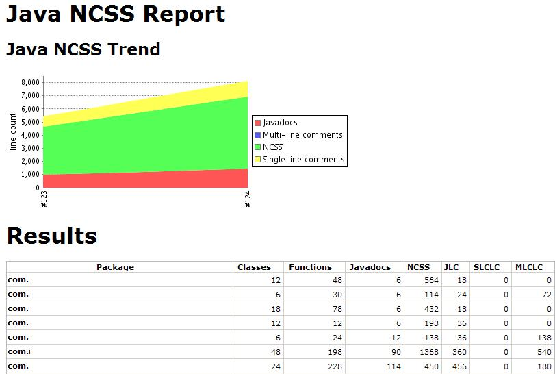
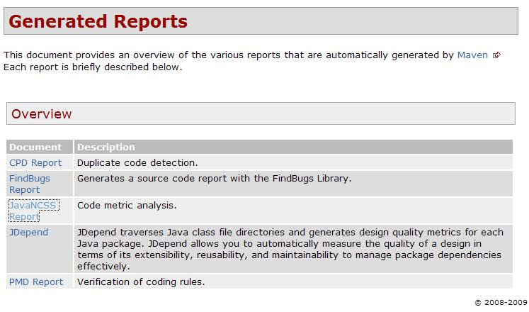

= JavaNCSS + Maven2 + Hudson
정상혁
2009-01-16
:jbake-type: post
:jbake-status: published
:jbake-tags: hudson,maven,정적분석
:idprefix:

JavaNCSS를 Maven2을 통해 실행하고, Hudson을 통해 리포트를 확인하는 과정을 정리했습니다. http://www.kclee.de/clemens/java/javancss/[JavaNCSS]는 주석이 아닌 라인수(Non Commenting Source Statements,NCSS)와 순환복잡도 수 (Cyclomatic Comlexity Number, CCN) 등을 측정해 주는 도구입니다.

JavanNCSS에 관한 eclipse 플러그인도 찾을 수는 있었지만(http://sourceforge.net/projects/jncss4eclipse/ ) 가장 최신버전이 2002년에 올라온 것이라서 적용하지 않기로 했습니다.

그리고, JavaNCSS에 대한 Maven의 플러그인도  http://mojo.codehaus.org/javancss-maven-plugin/[javancss-maven-plugin]과 http://maven-plugins.sourceforge.net/maven-javancss-plugin/[maven-javancss-plugin]의 2가지가 존재했는데, http://mojo.codehaus.org/javancss-maven-plugin/[javancss-maven-plugin] 쪽이 보다 문서화가 잘 되어 있어서 그 쪽을 선택했습니다.

`pom.xml` 에 아래 선언을 추가합니다.

[source,xml]
----
<reporting>

...

   <plugin>

     <groupId>org.codehaus.mojo</groupId>
     <artifactId>javancss-maven-plugin</artifactId>
     <version>2.0-beta-2</version>
      <configuration>
      <forceEncoding>utf-8</forceEncoding>
       </configuration>
    </plugin>
  </plugins>
</reporting>
----

그리고는 `mvn javancss:report javancss:check` 로 플러그인을 실행시켜 봅니다. 각각의 골에 대한 설명은 아래 페이지에서 보시면 됩니다.

* http://mojo.codehaus.org/javancss-maven-plugin/report-mojo.html[javancss:report] : 리포트 생성
* http://mojo.codehaus.org/javancss-maven-plugin/check-mojo.html[javancss:check] : CCN이나 NCSS 값이 너무 크면 빌드를 실패시킴

제외하거나 추가할 파일을 지정하려면 아래의 configuration 태그 아래에 includes, excludes 태그로 지정하면 됩니다.

[source,xml]
----
<configuration>

.....
  <includes>
    <include>**/*foo.java</include>
  </includes>
  <excludes>
    <exclude>**/bar.java</exclude>
  <exclude>**/foobar.java</exclude>
  </excludes>
</configuration>
----

CCN이나 NCSS값의 한계 허용치는 아래와 같이 지정합니다.

[source,xml]
----
<configuration>
....
  <failOnViolation>true</failOnViolation>
  <ccnLimit>12</ccnLimit>
  <ncssLimit>90</ncssLimit>
</configuration>
----

한가지 주의할 점은, 2.0-beta-2 버전을 실행할 경우, 메서드 내부에 annotation선언이 있다면 아래와 같은 에러메시지를 받게 됩니다.

[source]
----
Encountered "@ SuppressWarnings ( \"unused\" ) int notUsedVariable =" at line xxx, column yyy.
----

이 것은   http://mojo.codehaus.org/javancss-maven-plugin/[javancss-maven-plugin]  버전 2.0-beta-2가 이 의존하고 있는 JavaNCSS 버전 29.49 에서 가지고 있는 버그입니다. (http://jira.codehaus.org/browse/MJNCSS-16 참조) JavaNCSS 버전 29.50에서는 해결된 문제이고, 이 플러그인의 최신 버전인 http://mojo.codehaus.org/javancss-maven-plugin/[javancss-maven-plugin] 2.0-beta-3버전에서는 이런 문제가 발생하지 않는다고 합니다. 그런데, codehause의 Maven Repository를 뒤져보니 (http://repository.codehaus.org/org/codehaus/mojo/javancss-maven-plugin/) 아직 2.0-beta-3버전은 올라와 있지 않습니다. snapshop 버전을 찾아서 쓸 수도 있겠지만, 그것보다는plugin 설정에서 dependency설정을 덥어쓰는 편이 더 간편하게 느껴졌습니다. `pom.xml` 의 build절에 아래와같이 추가하면 됩니다.

[source,xml]
----
<build>

   <plugin>
     <groupId>org.codehaus.mojo</groupId>
        <artifactId>javancss-maven-plugin</artifactId>
        <version>2.0-beta-2</version>
        <dependencies>
          <dependency>
            <groupId>javancss</groupId>
              <artifactId>javancss</artifactId>
              <version>29.50</version>
             </dependency>
         </dependencies>
     </plugin>
     </plugins>
  </build>
----

생성된 리포트를 보기 위해서, Hudson에서는 프로젝트에서 Configure 설정에서 Publish Java NCSS report를 선택을 합니다.

image:img/javancss/hudson-javancss-config.jpg[hudson-javancss-config.jpg]

그리고는 http://mojo.codehaus.org/javancss-maven-plugin/report-mojo.html[javancss:report]  Goal이 포함된 빌드를 실행시켰다면 프로젝트 홈 화면에서 Java NCSS Report라는 링크가 생기게 됩니다.

image:img/javancss/hudson-javancss-menu.jpg[hudson-javancss-menu.jpg]

클릭을 하면 생성된 리포트를 볼 수가 있죠. (패키지명은 제가 지웠습니다.)

Maven에서 mvn site명령으로 site 절(phrase)까지 들어갔다면 리포트를 모은 페이지를 따로 생성해 주기도합니다. Hudson의 프로젝트 메인화면에서 Maven-generated site 링크를 통해서 보실 수 있습니다.Hudson에서 생성해주는 페이지가 더 이쁘기는하지만, JavaNCSS의 보고서는 Maven-generated site가 더많은 정보를 제공합니다. 예를 들면 가장 주석을 제외한 라인수(NCSS)가 많은 30위까지의 클래스들, 메소드들 같은 순위등같은 것들을 확인할 수 있습니다.

