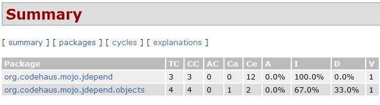

= JDepend + Eclipse + Maven2
정상혁
2009-01-19
:jbake-type: post
:jbake-status: published
:jbake-tags: maven,eclipse,static-analysis
:idprefix:

http://clarkware.com/software/JDepend.html[JDepend]는 Java패키지간의 의존성에 대한 수치들을 알려 주는 도구입니다.

JDepend의 Eclipse의 Plugin은 http://andrei.gmxhome.de/eclipse/를 Update site에 추가하면 설치할 수 있습니다. 다음의 링크들에서 보다 자세한 내용을 참조할 수 있습니다. 분석을 하고자 하는 소스폴더 위에서 우클릭을 한 후 'Run JDepend Analysis' 메뉴를 선택하면 의존성 분석 결과가 나옵니다.

image:img/jdepend/eclipse-jdepend.jpg[eclipse-jdepend.jpg]

이를 Maven을 통해서 생성하는 http://mojo.codehaus.org/jdepend-maven-plugin/[jdepend-maven-plugin] 은 pom.xml에 아래와 같이 추가할 수 있습니다.

[source,xml]
----
<reporting>

.....

<plugin>
  <groupId>org.codehaus.mojo</groupId>
  <artifactId>jdepend-maven-plugin</artifactId>
  <version>2.0-beta-2</version>
</plugin>

</reporting>
----

`mvn jdepend:generate` 또는 `mvn site` 명령을 통해서 보고서가 생성됩니다. mvn site로 실행했다면 Hudson의 프로젝트 홈에서 Maven Generated Site 메뉴를 통해서도 확인할 수 있습니다.
http://mojo.codehaus.org/jdepend-maven-plugin/examples/jdepend-report.html[샘플페이지] 에 생성된 보고서의 형식이 나와있습니다.

http://clarkware.com/software/JDepend.html[JDepend 첫페이지]나 생성된 보고서 안에서도 위의 요약 테이블에  수치들에 대한 설명이 잘 나와있습니다. 간단히 요약해서 정리하면,

* TC (Total Classes) : 전체 클래스 수. CC + AC
* CC (Concrete Classes) : Inteface나 추상클래스가 아닌 구상 클래스 수
* AC (Abstract Classes) : Interface나 Abstract Class로 선언된 클래스 수
* Ca ([#intelliTxt]#Afferent Couplings#) : 이 패키지를 의존하고 있는 다른 패키지의 수. 이 패키지의 책임감을 나타내는 지표
* Ce ([#intelliTxt]#Efferent Couplings#) : 이 패키지가 의존하고 있는 클래스가 있는 다른 패키지의 수. 이 패키지의 독립성을 나타내는 지표.
* A ([#intelliTxt]#Abstractness#) : 총 클래스 갯수 중 인터페이스나 추상클래스의 비율. 1이라면 해당 패키지는 추상클래스나 인터페이스 밖에 없는 것.
* I ([#intelliTxt]#Instability#) :   총 결합도 중 이 패키지의 외부의존성의 비율 (Ce / (Ce + Ca)). 변화에 대한 내성을 나타내는 지표. I=0이라면 완전하게 안정적인 것.
* D [#intelliTxt]#(Distance from Main Sequence#) :  이상적인 균형의 상태인  A + I = 1 의 함수에서 수직으로 떨어진 거리. (아래 그래프 참조)

image:http://www.onjava.com/onjava/2004/01/21/graphics/figure3.gif[onjava/2004/01/21/graphics/figure3.gif,title="onjava/2004/01/21/graphics/figure3.gif"]

이미지 출저 : http://www.onjava.com/pub/a/onjava/2004/01/21/jdepend.html[Managing Your Dependencies with JDepend]

가장 중요한 것은 패키지 간의 순환참조를 보여주는 Cycles 부분입니다.

image:img/jdepend/jdepend-cycles.jpg[jdepend-cycles.jpg]

순환참조 관계의 패키지들은 부분적으로 배포될 수도 없고, 한 패키지를 변경할 때 그 영향력을 파악하기도 힘들게 만듭니다. 순환 참조에 대한 자세한 내용은 아래의 링크를 참조하시기 바랍니다.

* http://toby.epril.com/?p=263[Code Organization & Cyclic Dependency Problem]
* http://blog.kirkk.com/index.php?itemid=30[Cyclic Dependencies]
* http://www.onjava.com/pub/a/onjava/2004/01/21/jdepend.html[Managing Your Dependencies with JDepend]
* http://whiteship.tistory.com/1767[Code Organization Guidelines for Large Code Bases - 유겐 휄러]

== 관련자료
* http://younghoe.info/50[JDepend에서 지원하는 설계 품질 측정치(design quality metrics)]
* http://www.powerjava.net/blog/soulcarta/entry/Eclipse-Plugin-JDepend%EB%A5%BC-%EC%9D%B4%EC%9A%A9%ED%95%9C-%EC%9D%98%EC%A1%B4%EC%84%B1-%EA%B2%80%EC%82%AC[[Eclipse Plugin] JDepend를 이용한 의존성 검사 개발관련]
* http://whiteship.tistory.com/967[Eclipse에서 JDepend 사용하기]

