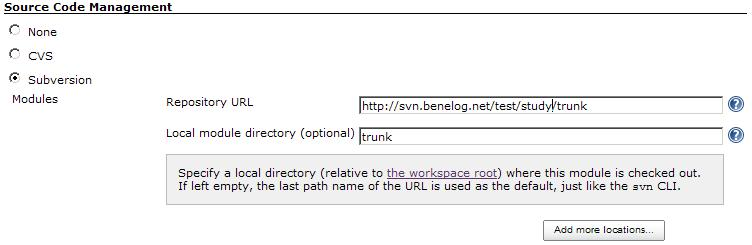
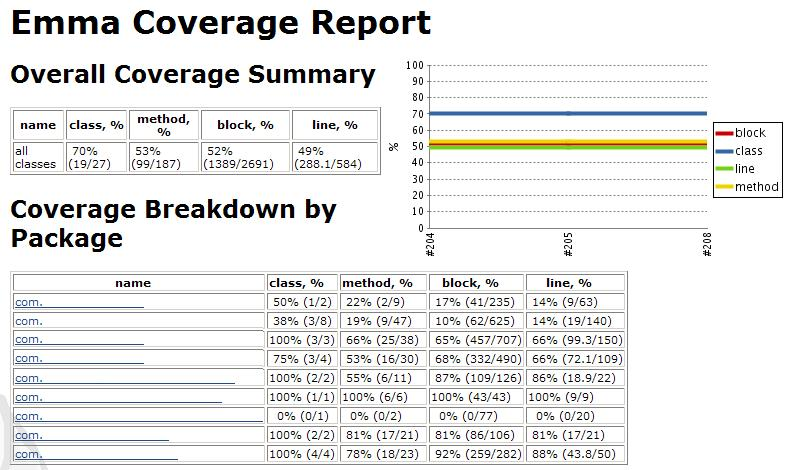

= EMMA + Eclipse + Maven2 + Hudson
정상혁
2009-01-23
:jbake-type: post
:jbake-status: published
:jbake-tags: EMMA,Eclipse,Maven,Hudson
:idprefix:

http://emma.sourceforge.net/[EMMA]는 테스트코드가 검증해 주는 코드영역에 대해서 보고해 주는 도구입니다. 전체 코드 중 몇 %가 테스트 코드를 거쳐가고 있는지 쉽게 수치를 낼 수 있습니다.

EMMA의  Eclipse plugin인 EclEmma는 http://update.eclemma.org/를 plugin의 update site로 지정하면 설치할 수 있습니다.  설치 후 프로젝트에서 우클릭-Coverage As - JUnit Test 메뉴를 선택하면 전체 Junit Test를 실행하고, Test Coverage에 대한 보고서를 생성해 줍니다.

image:img/emma/eclipse-emma-menu.jpg[eclipse-emma-menu.jpg]

EMMA의 Maven2 plugin인 http://mojo.codehaus.org/emma-maven-plugin/[Emma Maven Plugin Maven]을  pom.xml파일의 reporting 선언에 아래와 같은 설정을 추가합니다.

[source,xml]
----
<reporting>
  <plugins>
   ...
    <plugin>
      <groupId>org.codehaus.mojo</groupId>
      <artifactId>emma-maven-plugin</artifactId>
      </plugin>
    </plugins>
</reporting>
----

http://hudson.gotdns.com/wiki/display/HUDSON/Emma+Plugin%20[Hudson의 위키에 있는 Emma plugin 설명페이지]나 http://mojo.codehaus.org/emma-maven-plugin/usage.html[Maven의 emma-plugin 설명페이지]를 보면 build절에도 plugin 설정을 추가하라고 되어있는데, 그렇게 하지 않아도 잘  실행이 되었습니다.
오히려 그렇게 추가를 하니, mvn test site처럼 test와 site phrase가 같이 돌아갈 때 아래와 같은 에러가 발생했습니다.

[source]
----
java.lang.IllegalStateException: class [......] appears to be instrumented already
----

Emma plugin 설정을 reporting 부분에 넣으면 테스트가 실행되므로 일부러 test phrase를 넣어줄 필요는 없습니다. 즉 이 때는 mvn site만 돌려주시면 테스트 결과와 Coverage Report를 모두 얻을 수 있습니다.
Emma plugin이 있을 때 'mvn test site'로 실행시켜서 테스트가 두번 돌면 Hudson에서 보고하는 테스트 개수도 2번씩 중복 집계가 되므로 더 혼동만 줍니다.

http://mojo.codehaus.org/emma-maven-plugin/usage.html[Maven의 emma-plugin 설명페이지]에 따르면,  maven-surefire-plugin 설정에서 별도의 JVM으로 테스트를 실행시키위해 forkMode를 always로 설정하는 것은 중요하다고 합니다.
EMMA가 JVM의 종료 때도 기록을 하기 때문에 그렇다는군요. 다음과 같이 설정합니다.

[source,xml]
----
<plugin>
        <groupId>org.apache.maven.plugins</groupId>
        <artifactId>maven-surefire-plugin</artifactId>
        <inherited>true</inherited>
        <configuration>
          <forkMode>always</forkMode>
          <reportFormat>xml</reportFormat>
        </configuration>
</plugin>
----

이렇게 Maven을 통해 생성한 리포트를  Huson으로 보기 위해서는 *Manage Hudson>Manage Plugins* 메뉴에서 Hudson Emma plugin을 설치하고 Hudson을 재시작합니다.

설치가 잘 되었다면, 프로젝트의 Configure 메뉴에서 EMMA의 보고서에 대해서 설정할 수 있는 항목이 생깁니다.

image:img/emma/hudson-emma-config.jpg[hudson-emma-config.jpg]

여기에서 Emma XML report 항목에 workspace를 기준으로 한 상대적인 경로로 coverage.xml의 위치를 지정해줍니다.
http://hudson.gotdns.com/wiki/display/HUDSON/Emma+Plugin%20[Hudson의 위키에 있는 Emma plugin 설명페이지]에 보면 이 항목이 target/site/emma/coverage.xml으로 되어 있어서 혼동이 오기 쉬운데, trunk와 같은 Local module directory를 반드시 포함시켜줘야 합니다.
보통 SVN을 쓸 때 프로젝트 설정에서 별도로 지정을 하지 않으면 trunk같은 SVN의 path의 마지막 디렉토리가 Local module directory로 지정됩니다.

Emma 보고서 설정란에서 the work space root라는 링크를 눌러도 금방 확인 할 수 있습니다.

위와 같이 설정된 프로젝트를 build하면 빌드의 맨 끝에 Recording Emma reports trunk/target/site/emma/coverage.xml 와 같은 메시지가 Console out 화면에서 뜰 것입니다.  그렇게 생성된 보고서는 "프로젝트명>빌드번호>Coverage Report" 메뉴에서 보실 수 있습니다.

image:img/emma/hudson-emma-menu.jpg[hudson-emma-menu.jpg]

만약 Hudson에서 Emma를 실행한 빌드번호의 메뉴에서 'Coverage Report'라는 메뉴가 보이지 않는다면 http://blog.benelog.net/2208375[Hudson plugin 수동으로 빌드&업로드]를 참조해서 최신 버전으로 플러그인을 업데이트 해보시기 바랍니다.

