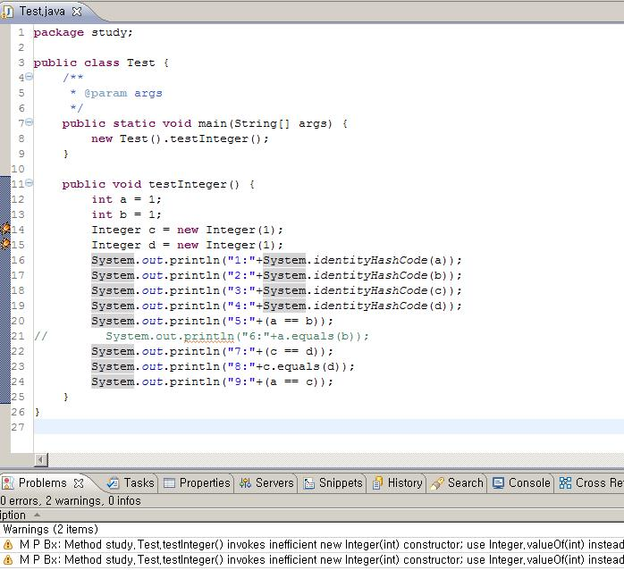

= Java의 auto boxing과 unbox은 어떻게 컴파일될까?
정상혁
2009-02-10
:jbake-type: post
:jbake-status: published
:jbake-tags: Java,autoboxing
:jabke-rootpath: /
:rootpath: /
:content.rootpath: /
:idprefix:

아래 코드는 [프리미티브 타입과 Wrapper 클래스, 자동 Boxing, 자동 UnBoxing]이라는 글에 나오는 것을 입력해 본 것입니다. int와 java.lang.Integer객체를 "=="와 "equals()"메소드로 비교하고 있습니다.

위의 코드에서 생성한 .class파일을 역컴파일해보면 아래와 같은 코드가 나옵니다. autoboxing과 unboxing이 어떤 방식으로 이루어 지는지 잘 확인할 수 있습니다. java.lang.Integer가 int로 바뀔 때는 intValue() 메소드, int가 java.lang.Integer로 바뀔 때는 Integer.valueOf()메소드를 사용하고 있습니다. JDK 1.4이하 버전과의 하위호환성을 위해서 이런 방식을 쓰는 것이겠죠.

[source,java]
----
int a = 1;
int b = 1;
Integer c = new Integer(1);
Integer d = new Integer(1);
System.out.println((new StringBuilder("1:")).append(System.identityHashCode(Integer.valueOf(a))).toString());
System.out.println((new StringBuilder("2:")).append(System.identityHashCode(Integer.valueOf(b))).toString());
System.out.println((new StringBuilder("3:")).append(System.identityHashCode(c)).toString());
System.out.println((new StringBuilder("4:")).append(System.identityHashCode(d)).toString());
System.out.println((new StringBuilder("5:")).append(a == b).toString());
System.out.println((new StringBuilder("7:")).append(c == d).toString());
System.out.println((new StringBuilder("8:")).append(c.equals(d)).toString());
System.out.println((new StringBuilder("9:")).append(a == c.intValue()).toString());
----

`new Integer()` 로 생성자를 호출하면 매로 새로 객체를 생성하는데, Integer.valueOf()메소드를 사용하면 캐쉬된 값을 사용할 수 있습니다. 이 메소드의 소스를 보면 -128부터 127까지의 static영역에 캐쉬로 쌓아두고 있습니다.

[source,java]
----
 static {
  cache = new Integer[256];
  for (int i = 0; i < cache.length; i++)
  cache[i] = new Integer(i - 128);
}

public static Integer valueOf(int i) {
  if (i >= -128 && i <= 127)
  return IntegerCache.cache[i + 128];
  else
  return new Integer(i);
}
---

처음에 나왔던 저의 Eclipse 캡쳐화면을 보면 findbugs 플러그인에서 new Integer()사용 코드에 대한 경고를 보여주고 있습니다. 자세한 설명을 보니, `Integer.valueOf()` 를 사용할 경우 약 3.5배 정도 실행속도가 빠르다고 하네요.

----
M P Bx] Method invokes inefficient Number constructor; use static valueOf instead [DM_NUMBER_CTOR]

Using new Integer(int) is guaranteed to always result in a new object whereas Integer.valueOf(int) allows caching of values to be done by the compiler, class library, or JVM. Using of cached values avoids object allocation and the code will be faster.

Values between -128 and 127 are guaranteed to have corresponding cached instances and using valueOf is approximately 3.5 times faster than using constructor. For values outside the constant range the performance of both styles is the same.

Unless the class must be compatible with JVMs predating Java 1.5, use either autoboxing or the valueOf() method when creating instances of Long, Integer, Short, Character, and Byte.
----

이런 원리들을 잘 염두해 둬서, auto boxing과 unboxing이 사용될 때 필요없는 객체가 생성되지 않는지 유의해야 합니다.

다음 코드는 Effective Java 2nd Edition의 Item 5 - '불필요한 객체를 생성하지 마라'에 나오는 예제입니다.

[source,java]
----
Long sum = 0L;
for(long i=0;i< Integer.MAX_VALUE;i++){
   sum += i;
}
System.out.println(sum);
----

  이 코드를 컴파일한 후 다시 역컴파일 해보면 다음과 같이 나옵니다.

[source,java]
----
Long sum = Long.valueOf(0L);
for(long i = 0L; i < 0x7fffffffL; i++)  sum = Long.valueOf(sum.longValue() + i);

System.out.println(sum);
----

java.lang.Double.valueOf(double) 메서드는 매번 새로운 객체를 생성하게 되어 있습니다.

[source,java]
----
public static Double valueOf(double d) {
  return new Double(d);
}
----

이렇듯 불필요한 객체생성을 막기 위해 되도록 primitive type을 선호해야 합니다. auto boxing은 Collection이나 Map에 들어가는 요소로 변수가 쓰일 때, generics가 적용한 코드를 작성할 때 등이 적절한 사용의 예입니다. (Effective Java 2nd Edition, Item 49 참조)

