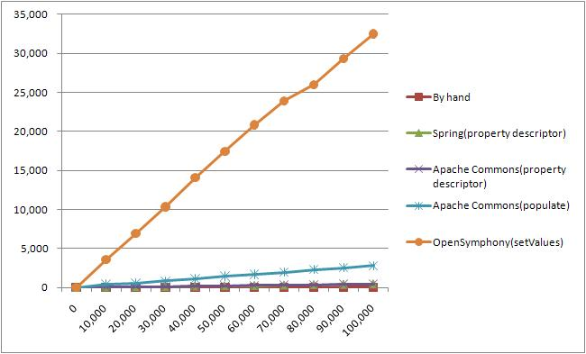

= BeanUtils 성능비교 - Apache commons, Opensymphony, Spring
정상혁
2010-06-17
:jbake-type: post
:jbake-status: published
:jbake-tags: beanutils,성능,java
:idprefix:

.수정이력

* 2019.04.14
** 테스트한 코드를 https://github.com/benelog/beanutils-test 로 올림
* 2010.06.21
** http://colus.egloos.com/[EP]님의 지적으로 Apache commons Beanutils에서도 http://commons.apache.org/beanutils/api/org/apache/commons/beanutils/PropertyUtils.html#getPropertyDescriptor(java.lang.Object,%20java.lang.String)[PropertyUtils.getPropertyDescriptor]를 사용한 방식으로 비교해봤습니다.
** http://www.tuning-java.com/[이상민님]의 지적으로 직접 Bean의 setter를 호출하는 방식의 자료도 추가
** BeanUtils.populate의 경우 다양한 type을 가진 property 변환을 하는 등의  실제로 많은 기능을 수행함을 설명 추가를 했습니다.

.덧붙임
2019년 2월 시점에 다시 이글을 보니, JMH로 테스트하는 것이 좋았을것 같다는 생각이 듭니다.

== 조사 내용
getter, setter가 있는 Java Bean들의 property들을 복사할 때 apache commons  beanutils(http://commons.apache.org/beanutils/ ) 가 많이 쓰이고 있습니다.

그리고 Spring이나 Opensympony 쪽에도 간단한 BeanUtils가 따로 있습니다.

* Spring BeanUtils : http://static.springsource.org/spring/docs/3.0.x/javadoc-api/org/springframework/beans/BeanUtils.html
* Opensymphony BeanUtils  : http://www.opensymphony.com/oscore/api/com/opensymphony/util/BeanUtils.html

이러한 BeanUtils들은 reflection을 내부적으로 쓰고 있으니 성능이 안 좋을 것이라는 우려를 할 수 있습니다. 어느 정도 성능 손해는 개발 편의성을 위해서 희생할 수 있는 경우도 많습니다. 그런데, 유사한 용도로 Bean복사를 하더라도 Apache commons BeanUtils쪽이 성능이 더 안 좋다는 소문은 있고 아래 자료에 의하면 100k byte object를 다룰 때는 Spring의 beanUtils에 비하면 거의 5~6배정도의 성능차이가 나는 것으로 알려져있습니다.

http://www.christianschenk.org/blog/java-bean-mapper-performance-tests/

이는 commons BeanUtils가 단순히 bean을 복사하는 것보다는 많은 기능을 가진 상위수준의 라이브러리 이기 때문에 당연한 결과라고 보여집니다.
Spring이나 Opensymphony의 BeanUtils는 단순히 Bean간의 데이터 복사, 속성정보를 얻어오는 정도인데, apache commons의 BeanUtils는 DynaBean 등 보다 넓은 개념들을 확장해서 제공하고 있습니다.
그리고 BeanUtils.populate는 복사하려는 type이 정확하게 일치하지 않을 경우에도 복사를 해주는 등, 더 확장된 기능을 제공하고 있습니다.
(첨부한 소스의 BeanConverterTypeConversionTest 파일을 보면 Map에 String으로 들어간 속성이 Bean에는 Integer, BigDecimal로 선언되어 있을 때, BeanUtils.populate는 제대로 복사를 해주는 것을 보여줍니다.)

그렇다면 type이 일치하는 단순한 Bean간의 복사등에는 굳이 apache commons beanutils까지 사용할 필요가 없은 경우도 많을 것입니다.

아래에서는 `List<Map>` -> `List<Bean>` 로 변환을 시켜주는 기능을 각각의 library로 구현해서 성능비교를 해보았습니다. 소스들은 Eclipse project형태로 첨부파일에 들어가 있습니다.

비교군은 아래와 같습니다.

* By Hand : 직접 map.get과 bean의 setter를 이용해서 복사
* Spring(property descriptor)  : Spring의 BeanUtils.getPropertyDescriptors를 사용. Spring의 BeanUtils에는 직접적으로 Map에서 Bean으로 복사해주는 메소드가 없어서 이 방식을 이용했습니다.
* Apache Commons(property descriptor) : 2번과 같은 방식을 사용하고, 라이브러리만 Apache commons BeanUtils의 PropertyUtils.getPropertyDescriptor를 사용
* Apache Commons(populate) : Apache comons BeanUtils의 BeanUtils.populate 메소드를 사용
* OpenSymphony(setValues) : Opensymphony의 BeanUtils.setValues를 사용

== 실행 시간 비교 결과
1만번부터 10만번까지 변환갯수를 늘여주면서(X축), 밀리세컨트 단위로 간단히 수행시간(Y축)을 측정했습니다.

Opensymphony 쪽이 너무 많이 차이가 나서 제외하고 나머지 4개만 다시 그려봤습니다.

image:img/beanutils/graph-2.jpg[image]

[cols=">,>,>,>",options="header"]
|===
|size|By hand a|Spring (property descriptor)|Apache Commons (property descriptor)

|0  |0 |0 |0
|10,000|15|78|63
|20,000|32|93|125
|30,000|15|141|141
|40,000|32|188|187
|50,000|15|218|250
|60,000|15|250|297
|70,000|32|297|359
|80,000|32|359|360
|90,000|46|406|438
|100,000|63|454|484
|===

== 결론
19개의 속성을 가진 Bean을 대상으로 했을 때, Map->Bean 변환의 10만건의 경우 순위는 아래와 같았습니다.

By Hand > Spring(property descriptor) = Apache Commons(property descriptor) > Apache Commons(populate) > OpenSymphony(setValues)

직접 손으로 한 것이 Sprng BeanUtils나 Commons의 PropertyUtils로 propery descriptor를 통해 호출한 것보다 7배 이상 빨랐습니다.

그리고 PropertyDescriptor를 활용한 방식들이 그 다음 순위로, 비슷한 실행속도가 나왔습니다. Spring BeanUtils쪽에서는 Bean객체의 정보를 http://static.springsource.org/spring/docs/2.5.x/api/org/springframework/beans/CachedIntrospectionResults.html[CachedIntrospectionResults]라는 클래스에 저장을 해 두고 있습니다. 그리고 Apache commons의 PropertyUtils에서도 유사하게 PropertyUtilsBean안에 descriptorsCache라는 속성으로 Bean정보를 Cache하고 있습니다. 그래서 실행속도가 거의 비슷하게 나온듯 합니다.

Apache commons BeanUtils.populate는 2,3위 순위의 Property descriptor를 활용한 것들보다  6배 정도 실행시간이 더 걸리는 것으로 나왔습니다.

BeanUtils.populate가 더 느린 이유는 두가지로 분석이 됩니다.

* 위에서 말한 것처럼 좀 더 확장된 type변환을 지원하기 떄문입니다.
* PropertyDescriptor의 배열을 순회하는 방식이 아닌, Map의 keySet을 순회하는 방식을 쓰고 있는데, 아무래도 배열의 순회보다는 성능에는 불리할 것 같습니다.

[source,java]
----
Iterator names = properties.keySet().iterator();
while (names.hasNext()) {
    // Identify the property name and value(s) to be assigned
    String name = (String) names.next();
    if (name == null) {
        continue;
    }
    Object value = properties.get(name);
    // Perform the assignment for this property
    setProperty(bean, name, value);
}
----

Opensymphony쪽은 70배이상 더 느린데, 제가 구현한 방식이 문제가 있는 건지도 모르겠습니다.

아뭏든 위의 결과를 봐서는 되도록 성능이 민감한 곳에는 직접 setter를 호출해서 복사를 하고, BeanUtils.populate의 다양한 기능이 필요하지 않다면 Spring의 BeanUtils나 Apache commons PropertyUtils를 통해 캐쉬된 PropertyDescriptor를 정보를 통해 Bean에 접근하는 것이 성능에는 유리하다는 것을 알 수 있습니다.

== 소스
https://github.com/benelog/beanutils-test

[source,java]
.Apache commons BeanUtils의 BeanUtils.populate 활용
----
public <T extends Map<String,Object>, C> List<C> convertMapToBean(List<T> list,
  Class<C> clazz) {
    List<C> beanList = new ArrayList<C>();

    for (T item : list) {
        C bean = null;
        try {
            bean = clazz.newInstance();
            BeanUtils.populate(bean, item);
        } catch (InstantiationException e) {
            new IllegalArgumentException("Cannot initiate class",e);
        } catch (IllegalAccessException e) {
            new IllegalStateException("Cannot access the property",e);
        } catch (InvocationTargetException e) {
            new IllegalArgumentException(e);
        }
        beanList.add(bean);
    }
    return beanList;
}
----

[source,java]
.Apache commons BeanUtils : PropertyUtils.getPropertyDescriptors활용
----
public <T extends Map<String, Object>, C> List<C> convertMapToBean(
    List<T> list, Class<C> clazz) {
    List<C> beanList = new ArrayList<C>();

    for (T source : list) {
        C bean = null;

        try {
            bean = clazz.newInstance();

            PropertyDescriptor[] targetPds = PropertyUtils.getPropertyDescriptors(clazz);

            for (PropertyDescriptor desc : targetPds) {
                Object value = source.get(desc.getName());
                if (value != null) {
                    Method writeMethod = desc.getWriteMethod();
                    if (writeMethod != null) {
                        writeMethod.invoke(bean, new Object[] { value });
                    }
                }
            }
        } catch (InstantiationException e) {
            new IllegalArgumentException("Cannot initiate class",e);
        } catch (IllegalAccessException e) {
            new IllegalStateException("Cannot access the property",e);
        } catch (InvocationTargetException e) {
            new IllegalArgumentException(e);
        }
        beanList.add(bean);
    }
    return beanList;
}
----

[source,java]
.OpenSymphony BeanUtils : setValues 활용
----
public <T extends Map<String, Object>, C> List<C> convertMapToBean(List<T> list, Class<C> targetClass) {
    List<C> beanList = new ArrayList<C>();

    for (Map<String, Object> map : list) {
        C bean = null;
        try {
            bean = targetClass.newInstance();
            BeanUtils.setValues(bean, map, null);
        } catch (InstantiationException e) {
            new IllegalArgumentException("Cannot initiate class", e);
        } catch (IllegalAccessException e) {
            new IllegalStateException("Cannot access the property", e);
        }
        beanList.add(bean);
    }
    return beanList;
}
----

[source,java]
.Spring BeanUtils : getPropertyDescriptors 활용
----
public <T extends Map<String, Object>, C> List<C> convertMapToBean(
    List<T> list, Class<C> clazz) {
    List<C> beanList = new ArrayList<C>();
    for (Map<String, Object> source : list) {
        C bean = toBean(source, clazz);
    beanList.add(bean);

    }
    return beanList;
}

private <C> C toBean(Map<String, Object> source, Class<C> targetClass) {
    C bean = null;
    try {
        bean = targetClass.newInstance();
        PropertyDescriptor[] targetPds = BeanUtils.getPropertyDescriptors(targetClass);

        for (PropertyDescriptor desc : targetPds) {
            Object value = source.get(desc.getName());
            if (value != null) {
                Method writeMethod = desc.getWriteMethod();
                if (writeMethod != null) {
                    writeMethod.invoke(bean, new Object[] { value });
                }
            }
        }
    } catch (InstantiationException e) {
        new IllegalArgumentException("Cannot initiate class",e);
    } catch (IllegalAccessException e) {
        new IllegalStateException("Cannot access the property",e);
    } catch (InvocationTargetException e) {
        new IllegalArgumentException(e);
    }
    return bean;
}
----

=== 성능측정 코드
[source,java]
----
@Test
public void testApacheCommonsBeanUtils() {
    BeanConverter converter = new ApacheCommonsBeanUtilsBeanConverter();
    executeIncrementally(converter);
}

@Test
public void testApacheCommonsPropertyUtils() {
    BeanConverter converter = new ApacheCommonsPropertyUtilsBeanConverter();
    executeIncrementally(converter);
}

@Test
public void testOpenSymphony() {
    BeanConverter converter = new OpenSymphonyBeanConverter();
    executeIncrementally(converter);
}

@Test
public void testSpring() {
    BeanConverter converter = new SpringBeanConverter();
    executeIncrementally(converter);
}

@Test
public void testByHand() {
    BeanConverter converter = new UserConverter();
    executeIncrementally(converter);
}

private void excuecteBeanConverter(BeanConverter converter, int iterations) {
    List<Map<String, Object>> testList = createMapListForTest(iterations);
    long start = System.currentTimeMillis();
    List<User> beanList = converter.convertMapToBean(testList, User.class);
    long end = System.currentTimeMillis();
    System.out.printf("%s,%d times, %d milliseconds \r\n", converter.getClass().getSimpleName(), iterations, (end - start));
}

private void executeIncrementally(BeanConverter converter) {
    for (int i = 0; i <= 100000; i += 10000) {
        excuecteBeanConverter(converter, i);
    }
}

private List<Map<String, Object>> createMapListForTest(int iterations) {
    List<Map<String, Object>> list = new ArrayList<Map<String, Object>>();

    Map<String, Object> user = new HashMap<String, Object>();
    user.put("id", 1);
    user.put("age", 1);
    user.put("name", "내이름");
    user.put("name1", "내이름");
    user.put("name2", "내이름");
    user.put("name3", "내이름");
    user.put("name4", "내이름");
    user.put("name5", "내이름");
    user.put("name6", "내이름");
    user.put("name7", "내이름");
    user.put("name8", "내이름");
    user.put("name9", "내이름");
    user.put("name10", "내이름");
    user.put("income", new BigDecimal("1000100100"));
    user.put("address", "오늘 아침 내가 행복한 이유는 이런거지 오늘아침 내가 서러운 이유는 그런거야 ");
    user.put("introduce", "오늘 아침 내가 행복한 이유는 이런거지 오늘아침 내가 서러운 이유는 그런거야 ");
    user.put("married", true);
    user.put("nickName", "뻐꾸기");

    for (int i = 0; i < iterations; i++) {
        list.add(user);
    }
    return list;
}
----
