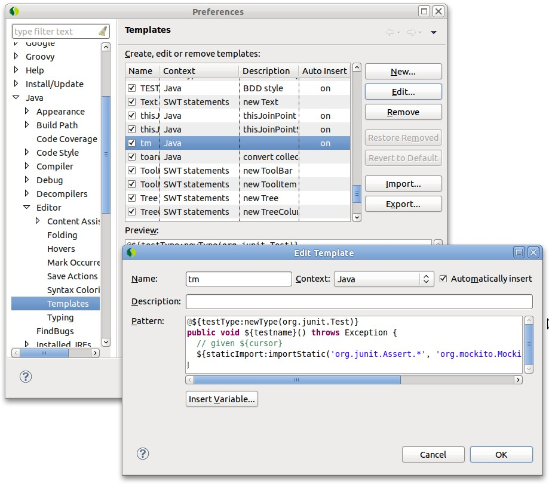
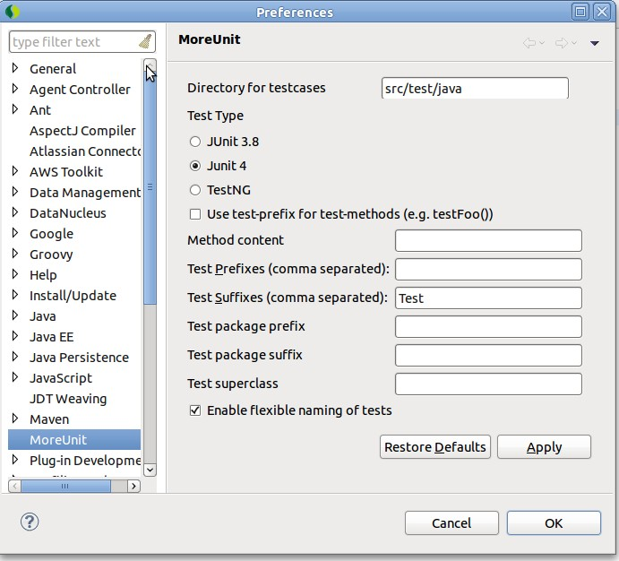

= Eclipse에서 테스트 코드 작성을 편하게 하는 설정
정상혁
2010-10-01
:jbake-type: post
:jbake-status: published
:jbake-tags: eclipse,test
:idprefix:

== Static Import 설정
Organize import (Ctrl + Shift + O) 해도 static import의 *가 풀리지 않도록 하는 설정.
Junit4 이후의 assert나, mock library, matcher 등을 사용할 때 편리하다.

* `Windows-Preference-Orgnize import` 의 `Number of static imports...` 를 1로

image:img/eclipse-test/organize-imports.jpg[organize-imports.jpg]

== Test 메소드와 Import에 대한 Template 설정
`Window-Preference-Java-Editors-Template` 에 자주 쓰는 템플릿을 추가한다.

각각의 항목의 의미는 다음과 같다

* name : 축약해서 사용할 문자
* context : 해당 템플릿을 사용하는 에디터 종류. 여기서는 Java코드를 입력하므로 'Java'로 선택한다.
* pattern :  템플릿 내용

즉, Java에디터에서 'name' 으로 정한 문자열을 치고 Ctrl + Space를 누르면 'pattern'의 내용이 자동입력 된다.

=== Test 메소드 추가

테스트 메소드를 추가할 때 필요한 library import로 메소드 선언을 한꺼번에 해주는 템플릿이다.이름을 spec으로 지정해서 쓰고 있다.

[source,java]
----
@${testType:newType(org.junit.Test)}

public void ${specDescription}() {
  // given ${cursor}

  // when
  // then
  ${staticImport:importStatic('org.junit.Assert.*', 'org.mockito.BDDMockito.*', 'org.hamcrest.CoreMatchers.*')}
}
----

=== Test 라이브러리 import

위의 메소드 추가 template에서 해주는 일 중 import를 하는 부분만 수행해준다.
ti라는 이름으로 지정해서 쓰고 있다.
(http://wiki.kwonnam.pe.kr/java/junit/staticimports 에서 참조했습니다.)

[source,java]
----
${is1:importStatic('org.hamcrest.CoreMatchers.*')}${is2:importStatic('org.junit.Assert.*')}${is5:importStatic('org.mockito.Mockito.*')}
----

=== Spring test 지원 Annotation 추가
Junit4에서 Spring의 Application context를 올리는 테스트를 할 때 필요한 Annotation과 import 선언을 추가해주는 Template이다. 'springtest'라는 이름으로 지정해서 쓰고 있다.

[source,java]
----
${:import('org.junit.runner.RunWith','org.springframework.test.context.ContextConfiguration','org.springframework.test.context.junit4.SpringJUnit4ClassRunner')}
@RunWith(SpringJUnit4ClassRunner.class)
@ContextConfiguration(locations = { "/applicationContext.xml"})
----

=== Mockito 관련 템플릿 추가
JUnit에서 Mocito의 annotation을 편하게 쓸 수 있게 해주는 선언이다. 'mockrun'이라는 이름으로 지정해서 쓰고 있다.

[source,java]
----
${:import('org.mockito.runners.MockitoJUnitRunner')}
@RunWith(MockitoJUnitRunner.class)
----

==== 참고자료
* http://www.rapaul.com/2009/08/09/bddmockito-eclipse/
* http://toby.epril.com/?p=1126
* http://wiki.kwonnam.pe.kr/java/junit/staticimports
* http://help.eclipse.org/helios/index.jsp?topic=/org.eclipse.jdt.doc.user/concepts/concept-template-variables.htm

== Favorite 설정
자주 쓰는 static import 등록할 수 있음. 여기에 등록하면 미리 해당 라이브러리를 static import하지 않아도 Conentnt assist(Ctrl + Space)에서 에서 나오게 됨

* `Windows-Preference-......- Favorites`

image:img/eclipse-test/favorites.jpg[favorites.jpg]

Favorites에 등록을 추천하는 클래스
* `org.junit.Assert.*`
* `org.hamcrest.CoreMatchers.*`
* `org.mockito.Mockito.*`
* `org.mockito.BDDMockito.*`
* `org.mockto.Matchers.*`

== 자동생성되는 메소드에 UnsupportedOperationException 던지기 설정
자동생성 되어서 아직 구현되지 않은 메소드를 test fail로 인식하게 함 ( http://toby.epril.com/?p=706 참고)

* Preference – Java – Code Style – Code Templates 안에 Code/Method Body에 아래 코드추가
[source,java]
----
throws new UnsupportedOperationException();
----

image:img/eclipse-test/unsupported-operation-exception.jpg[unsupported-operation-exception.jpg]

== 테스트 코드 짤 때 자주 쓰는 단축키

=== 코드 생성

* `Ctrl+ 1` : Quick fix
* `Ctrl + Shift + O` : import 절에 없는 클래스를 추가하거나 정리
* `Ctrl + Shirt + M` : import 추가. 클래스 import를 static import로 전환할 수 있음.

=== 테스트 실행
* `Alt + Shift + X, T` : JUnit으로 실행
* `Ctrl + F11` : Run (JUnit 실행 가능)

=== 코드 사이를 이동

* `Ctrl + J` : 테스트 코드와 실제 코드 사이를 이동 (moreUnit이 설치되어 있을 때)
* `Ctrl + Q` : 가장 마지막에 편집한 코드가 있는 곳으로 돌아가기
* `Ctrl + T` : 인터페이스에서 구현 클래스 찾을 때
* `Ctrl + Shift + 위아래 방향키` : method 단위로 커서 이동(method 하나만 test 실행할 때 사용 하기 좋음

=== 리팩토링

* `Alt + Shift + R` : 리팩토링 이름 바꾸기
* `Alt + Shift + V` : 리팩토링 – 이동
* `Alt + Shift + M` : 리팩토링 – 메소드 추출
* `Alt + Shift + I` : 리팩토링 - 메서드 인라이닝 (추출의 반대)
* `Alt + Shift+ L` : 리팩토링 local 변수 추출

== More Unit
테스트 코드와 실제코드 사이를 왔다갔다 할 수 있게 하는 Eclipse plugin. TDD의 리듬 유지에 도움이 됨

* update site : http://moreunit.sourceforge.net/update-site/

Maven을 쓰고 있다면 설치후 Window-Preference-More Unit에서 아래 설정을 추가하는 것이 좋다.

* Directory for testcases : `src/test/java`
* Test Suffixes : `Test`

== Eclemma
Eclipse 내에서 Code Coverage 측정. http://blog.benelog.net/2212119 참조

* update site : http://update.eclemma.org/

STS를 쓴다면  Dashboard-Extensions에서 선택해서 설치해도 됨

