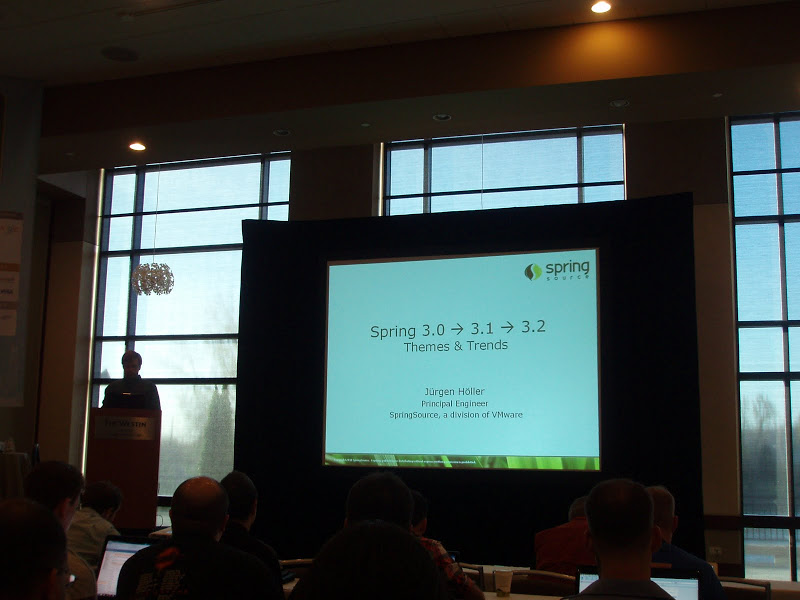

= SpringOne2GX 2010 (2) Spring 3.0 -> 3.1 -> 3.2 Themes & Trends
정상혁
2010-10-23
:jbake-type: post
:jbake-status: published
:jbake-tags: Spring,Spring-One,행사후기
:idprefix:

스프링 프레임웍의 핵심 개발자 유겐할러는 "Spring 3.0 -> 3.1 -> 3.2 Themes & Trends"라는 제목으로 두번째 날 첫시간에  발표를 했습니다. 로드존슨은 http://www.yes24.com/24/goods/3691866[어느 인터뷰]에서 지금까지 만났던 가장 뛰어난 개발자는 생각할 것도 없이 유겐할러라고 말한 적이 있었고, 그렇게 전적인 신임을 받고 있어서 인지 유겐할러는 스프링 core 모듈의 대부분의 코드를 만들었다고 합니다. 그래서 유겐할러는 스프링 커뮤니티에서 로드존슨에 버금가는 유명인인데, 예상대로 이 날 발표 장소에는 사람들이 꽉 차게 몰려왔습니다.

발표에 들어가기 전에, 스프링 3.0 버전을 쓰는 사람과, 그중 실제 3.0에 들어간 기능을 쓰는 사람들은 손을 들어봐라고 유겐할러가 이야기했는데, 절반 정도의 사람들이 손을 들었던 것 같습니다. 컨퍼런스에 와서 그 발표를 들은 사람을 대상으로 한 질문이라서 당연한 것일수도 있지만 3.0버전의 기능이 커뮤니티에서는 호응이 괜찮다는 느낌이 들었습니다.

유겐할러는 자신이 맡은 책임 중 핵심적인 것은 클라우드, 분산 캐쉬와 같은 최신의 경향(modern day trends)에 맞추어 스프링 Core에 어떤 것이 들어갈지를 결정하는 것이라고 했습니다. 뒤에서 설명된 3.1의 캐쉬 Abstraction, 3.2의 fork-join pool 지원 등이 그런 트렌드을 쫓아가기위한 대표적인 예였습니다.

3.1과 3.2는 3.0의 자연스러운 다음버전이라고 합니다. 큰 구조변화보다는 기능이 추가되는 성격의 버전이라는 의미라고 생각되었습니다.

== 릴리즈 일정
발표 중간 중간에 이야기한 향후 스프링버전의 릴리즈 일정은 아래와 같습니다.

* 3.0.5 : 2010년 10월에, 곧. 3.05 이후로 바로 3.1은 위한 마일스톤 버전으로 넘어간다고 했습니다.
* 3.1 M1: 2010년 11월 말
* 3.1 M2: 2011년 1월 초?
* 3.1 RC1 : 2011년 2월말?
* 3.1 GA  : 2011년 3월말?
* 3.2 :  2011년 말 경

뒤로 갈수록 물음표(?)가 들어가 있고, 지금까지 일정을 정확히 지킨 적이 없었던 것으로 보아 실제로 저 일정에 나올 가능성은 적다고 예상됩니다. Spring 3.0도 2008년에 이야기할 때는 2009년 초에 나올 것이라고 말한 적이 있는데, 실제로 3.0.GA 버전이 릴리즈된 것은 2009년 12월이였습니다. (http://toby.epril.com/?p=459[스프링 이슈트래커로 본 Spring 3.0의 전망], https://jira.springframework.org/browse/SPR#selectedTab=com.atlassian.jira.plugin.system.project%3Aversions-panel[Spring Jira의 실제 release 날짜] 참조)

일정관리를 엄격하게 안 하나 하는 생각도 들었는데, 공개 API의 모음인 프레임웍이라는 특성 때문에 일정보다는 완성도를 중요시 할 수 밖에 없을 것도 같았습니다. 두번째 날의 밤에 'Birds of a feather session'라고, 컨퍼런스의 트랙별로 발표자나 핵심개발자들과 이야기를 할 수 있는 자리를 마련해줬는데, 거기서 내부적으로 어떤 개발방법론을 쓰는지에 대한 질문이 나왔었습니다. 거기에서 스크럼 같은 일반적인 애자일 프랙티스를 따르기는 하는데, 프레임웍은 배포 한 후에 수정을 하는 것이 어렵기 떄문에 원래의 스크럼 방식과는 잘 맞지 않는 부분도 있다는 말이 답변 중에 나왔었습니다.

== A review : 3.0
3.0에 추가된 기능들을 되돌아 봤는데, 이미 널리 알려진 기능들이라서 자세히 옮기지는 않겠습니다.

* Annotated component model.(JSR 330, JSR 303, JavaConfig등)
* Rest Support
* Portlet 2.0 지원
* 스케쥴과 태스크 실행 개선
* Java EE6 지원

(자세히 아시고 싶으신 분들은 http://static.springsource.org/spring/docs/3.0.x/spring-framework-reference/html/new-in-3.html 를 참조하시기 바랍니다.)

이중 JavaEE6에 대한 내용은 세번째 날 역시 유겐할러가 발표한 'Spring and JavaEE 6'라는 세션에서 자세하게 설명 되었습니다.

== A preview : 3.1
3.1에 추가되는 주요 테마들은 다음과 같습니다.

*  Environment profiles for bean
*  Java-based applicaion configuration
*  Cache abstraction
*  Conversation Managment
*  Servlet 3.0, JSF 2.0, Groovy

=== Environment profiles for bean
이 기능은 bean 설정들을 환경별로 묶는 것을 지원합니다. 즉, 개발환경, 테스트환경, 운영환경에 맞는 bean 선언들을 그룹화해서 지정할 수 있게 하는 것이죠.
Bean 선언이나 Annotation선언에 Profile을 이름을 지정하는 방식이 될 것이라고 합니다.

XML선언에는 다음과 같이 profile속성이 추가됩니다.

[source,xml]
----
<beans .... profile="dev">

  <bean>...</bean>

  <bean>...</bean>

</beans>
----

Annotation으로는 @Profile 을 지정하게 됩니다.

[source,java]
----
@Service

@Profile("dev")

class UserService\{

.....

}
----

그리고 Inject 가능한 API 형식으로 환경에 대한 추상화도 지원할 것이라고 합니다.

보통 database의 URL 같은 속성들은 별도의 property 파일로 배서 관리하는 placeholders라는 기능을 쓰는데, 이 기능도 실제 환경에 의존적으로 placeholder를 나름대로 지정할 수 있는 기능이 나온다고 합니다.

=== Java-based applicaion configuration
이미 3.0에 JavaConfig 기능이 포함되어서 @Configuration, @Bean 등의 Annotation이 추가되었는데, 어떤 기능들이 더 추가되는 것일지 궁금했었습니다. 3.1에 들어가는 Java-based configuration은 tx나, aop 같은 custom name-space와 같은 선언들이 Java파일로도 가능하게 하는 것이였습니다. Spring Batch나 Security, Integration에서도 이러한 custom name-space들을 많이 쓰는데, 그런 설정들이 xml로 bean 선언을 할 때는 설정을 간편하게 하지만, JavaConfig로 옮기기에는 불편해서 아쉬웠던 점이 있습니다. Spring Batch에서 ItemReader, ItemWriter 선언을 JavaConfig로 옮겨보니 훨씬 코드가 짧아지고 Compile time의 validation 범위도 넓어져서 만족했었는데, Job과 Step의 선언은 custom namespace로 하는 것이 더 간편해서, XML에 남겨두었었습니다. 그리고 유사하게

 http://www.amazon.com/Enterprise-Integration-Patterns-Designing-Deploying/dp/0321200683/ref=sr_1_1?ie=UTF8&qid=1287800130&sr=8-1[Enterpise Interation Patterns]를 구현한 Apache Camel는 Java로 된 DSL을 지원하는데 반해서 Spring Integration은 간결한 선정을 하려면 Xml의 Custom name space를 사용해야 되어서 아쉬웠던 적이 있었습니다.(http://java.dzone.com/articles/spring-integration-and-apache 참조)

3.1에서 그렇게 javaConfig로도 추상화정도를 높인 선언을 할 수 있는 기능이 추가된다면, 스프링포트 폴리오의 다른  프로젝트에서도 많은 개선이 이루어질 것이라고 기대됩니다.

=== Cache Abstraction
현재도 스프링에 org.springframework.cache라는 패키지는 존재합니다. 그런데 아직까지는 EhCache에 대한 지원클래스만 있습니다. 3.1에서는 이 패키지를 채워넣을 것이고, 분산캐쉬를 기술과 연결되는 구현체도 포함될 것이라고 합니다. 기본적으로 EhCache, GemFire, Coherence를 지원한다고 밝혔습니다. 물론 인터페이스에 맞춰서 직접 구현하는 것도 가능하고, ConcurrentHashMap을 이용한 간단한 기본 구현체도 제공합니다.

발표가 끝난 뒤에 저와 같이 간 일행인 김훈민 대리가 직접 유겐할러에게 찾아가서 Memcached에 대한 지원 계획을 물어봤는데, out-of-box로 바로 쓸 수 있는 Adaptor는 아직까지는 계획에 없다고 했습니다. 여러 가지 라이센스 문제 등에 부딪힐 수 있어서 협의가 필요한데, 원한다면 이슈 등록을 하고 투표를 하라고 이야기했습니다.  개인적으로 Simple Spring Memecached( http://code.google.com/p/simple-spring-memcached/) 프로젝트와 유사한 Memcached 지원이 Spring Core에 들어갔으면 했는데, 다소 아쉬운 부분이였습니다.

 많은 곳에서 이미 Annotation과 AOP를 활용해서 Cache를 활용해서 이미 예상을 했었는데, Spring 3.1에는 아래와 같이 Cache 지원을 위한 `@Cacheable`, `@CacheEvict` 라는 Annotation이 추가됩니다.

[source,java]
----
@Cacheable
public Owner loadOwner(int id) \{

....

}

@Cacheable(condition="name.length<10")
public Owner loadOwner(String name)\{

....

}

@CacheEvict
public void deleteOwner(int id)\{

....

}
----

Annotation이 붙은 메소드의 signature와 파라미터로 캐쉬에 넣을 key로 인식하게 됩니다. 유겐할러는 이런 방식의 처리가 Cache의 전형적인 사용의 80% 유형정도를 차지할 것이라고 말했습니다. Cache Abstraction은 Cache의 모든 기능을 통합해서 같은 API로 묶는 것이라기보다는, 주요 쓰임새를 더 짧은 코드로 편하게 쓸 수 있게 하는데 초점이 맞춰진 것으로 보입니다. 정교한 캐쉬처리나 각각의 캐쉬 특성에 맞는 API사용 등은 직접 특정 Cache의 API를 당연히 사용해야겠죠.
그리고 transaction처리에 쓰는 PlatformTransactionManager와 비슷하게 CachedManager라는 SPI가 들어가고, tx namespace처럼 cache에 대한 namespace도 추가된다고 합니다. <cache:annotation-driven />과 같은 선언은 기존에 스프링을 쓰던 사람에게는 익숙하게 보입니다.

이미 EhCache를 Spring에서 활요할 때 쓰는 @Cacheable annotation이 있는데, 이 모델이 좀 더 확장될 것으로 보입니다. 아래 자료에 현재에도 사용가능한 방식이 나와 있습니다.

* http://code.google.com/p/ehcache-spring-annotations/wiki/UsingCacheable[]http://code.google.com/p/ehcache-spring-annotations/wiki/UsingCacheable
* http://whiteship.tistory.com/1256

=== Converstion management
Conversation session에 대한 추상화 계층을 추가될 예정이라고 합니다. 기본적으로 HttpSession을 포함하여 더욱 유연한 생존주기와 저장소를 제공한다고 했습니다.

보통 웹어플리케이션에서 여러 페이지간의 상태를 공유해야하는 Conversation 범위가 생길 수가 있는데, 보통 Session을 쓰는 것이 일반적이지만, 같은 윈도우에 있는 다른 탭이라도 같은 Session의 id가 먹는 상황이 있고, 수동적으로 이런 경계를 관리해야 할 때가 있습니다. 새로운 기능은 이런 것들을 위임할 수 있는 공통적인 기반을 제공한다고 합니다.

이 기능은 Spring Webflow의 3.0에도 바탕이 될 것이고 MVC나 JSF에도 공통적으로 쓰일 수 있다고 했습니다.

그리고 웹어플리케이션 뿐만이 아니라 메시징 환경에서 메시지 헤더 안에 conversation id를 포함시키는 쓰임새에도 적용가능하도록  Conversation을 위한 인터페이스는 범용적인 목적의 API가 될 것이라고 합니다.

=== Support for Servlet 3.0
Tomcat 7, GlassFish 3 등에서 Servlet 3.0 스펙을 지원하는 Container에 대한 지원이 포함됩니다.

web.xml에 명시적으로 프레임웍에 대한 Listener 선언을 하지 않고도  자동으로 deployment되는 옵션을 지원하고, 표준적인 파일업로드에 대한 지원이 된다고 합니다. 스프링의 MultipartResolver interface도 그 안에 포함될 것 같습니다.

=== Enchance Groovy Support
`<lang:groovy>` 로 xml 파일안에 Groovy를 쓸 수 있는 지원이 강화됩니다.

* base script classes
* custom bidings
* 스프링 빈들을 이름으로 암묵적으로 접근
* Velocity나 Freemarker 대신 쓰일 수 있는 Groovy 바탕의 Template 파일. Email 템플릿 같은 것에 사용할 수 있다고 하네요

=== `c:namespace`
XML로 Bean 선언을 할 때 p namespace과 같은 역할을 하는 c namespace가 추가됩니다. p가 <property name.. > 에 대한 짧은 표현였다면, c는 <constructor-arg>를 간결하게 표현할 수 있게 줍니다.

아래와 코드와 같이 거의 p namespace와 사용법이 똑같아 보입니다.

[source,xml]
----
<bean class="..." c:age="10/>

<bean class="..." c:family-ref="myFamily/>
----

== A sneak preview : 3.2
3.2에는 JDK 7을 바탕으로 추가될 수 있는 기능들을 계획하고 있었습니다. JDK 7은 2011년 7월에 release 예정이라서 3.2에 대한 Release도 당연히 그 뒤가 되겠습니다.

그리고 당연히 java 5, 6 user를 위한 기능도 있을 것이고, 그런 기능들은 Spring 3.1이 GA로 간 다음에 사용자들의 요청에 따라서 결정될 것이라고 합니다.

=== Java SE 7 Support
Spring 3.2의 초점은 JRE 7 을 가장 잘 쓰는 사용법이라고 했습니다. JDBC 4.1에 대한 지원과 Java concurrent 패지지에서 개선되는 fork-join 프레임웍에 대한 지원계획이 있었습니다.

=== 멀티코어의 Concurrent 프로그래밍에 초점
동시 요청보다 Core수가 더 많은 시나리오에 초점을 맞추어서 API제공을 계획하고 있다고 합니다. 예를 들면 Spring Batch에서 큰 Xml파일을 처리할 때와 같이, 처리 요청은 하나이기 때문에 요청 건별로 병렬처리르 하기가 힘들지만 자원소모가 커서 병렬처리를 했을 때의 이득이 큰 경우를 염두에 둔 것이였습니다. 그런 곳에 사용할 수 있는 특화된 ForkJoinPool이 Application context안에 들어갈 것이라고 했습니다.

