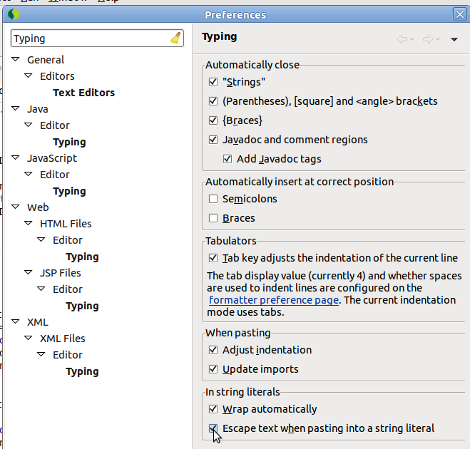
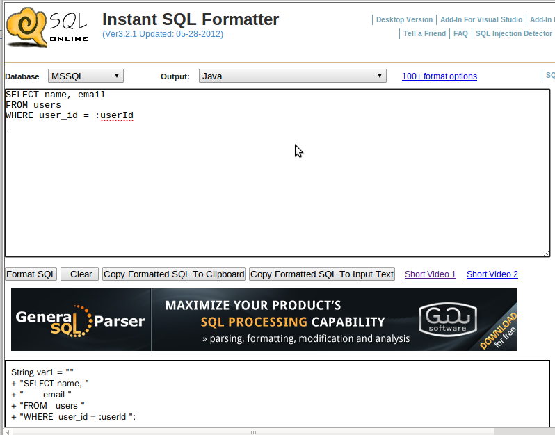
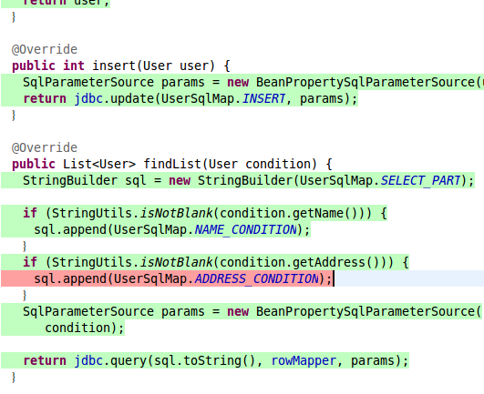

= Java에서 XML없이 SQL개발하기
정상혁
2010-11-08
:jbake-type: post
:jbake-status: published
:jbake-tags: java,sql,xml,mybatis,spring-jdbc
:idprefix:

.변경 이력

* 2015/01/21 :  Eclipse에서 Groovy를 쓰기위한  plugin과 Maven 선언 부분을 현행화
* 2013/01/25 : http://www.dpriver.com/pp/sqlformat.htm 의 캡쳐화면 추가 등
* 2012/11/06 :  Eclipse에서 Groovy를 쓰기위한  plugin과 Maven 선언 부분을 더 편한 방식으로 수정

요약하면, Java의 여러 프레임웍은  XML안에 SQL을 넣는 방식을 지원하는데, 줄바꿈이 있는 문자열을 편하게 쓰게 해주는 따옴표 세 개문법 (""")만 Java에 추가된다면 XML을 사용하는 목적을 충족시키면서도 XML로 인한 여러 단점들을 겪지 않아도 된다는 것입니다. 따옴표 세개는 Java에서 추가될 예정이지만, Groovy등에서는 이미 지원합니다. 지금이라도 SQL관리에만 Groovy를 쓰면 쿼리편집이 조금 더 편리해질만도 합니다.

== XML로 SQL을 관리할 수 있는 Java framework
많은 Java 프레임웍들이 SQL구문들을 XML파일 안에서 코딩하게 되어 있습니다.
가장 대표적인 것이 iBatis입니다. 아래와 같이 SQL 구문, 파라미터를 운반하는 클래스,  쿼리의 결과가 담길 클래스를 XML안에 선언합니다.

[source,xml]
----
    <select id="findByIsbn13" parameterClass="string" resultClass="book">
    SELECT  title,    author,     isbn13,     isbn10,     pages, content, imageUrl
    FROM book
    WHERE isbn13 = #isbn13#
    </select>
    <select id="findByTitle" parameterClass="string" resultClass="book">
    SELECT  title,    author,     isbn13,     isbn10,     pages, content, imageUrl
    FROM book
    WHERE title = #title#
    </select>
----

그리고 Hibernate와 JPA에서도 "named query"라는 개념으로, SQL을 따로 XML파일로도 뺄 수 있습니다. 아래는 Hibernate에서 SQL을 XML 파일안에 설정한 예입니다.

[source,xml]
----
<sql-query name="findBookByIsbn13">
    <return alias="book" class="tdd.edu.domain.Book"/>
   SELECT  title,    author,     isbn13,     isbn10,     pages, content,  imageUrl
   FROM book
    WHERE isbn13 = :isbn13
 </sql-query>
----

Navie SQL과 Hibernate가 쓰는 HQL을 모두 .xml파일 안에 선언하는 것이 가능합니다. JPA를 사용해도 마찬가지로 JPA-QL, Native SQL을 Java에서 String으로 선언할 수도 있지만, XML 파일 안에 넣어도 됩니다.

Spring JDBC에서는 Jdbctemplate.execute 등의 메소드에서 SQL내용을 직접 문자열로 넘기게 되어있지만, Applicaton context 안에 쿼리를 저장해두고, 이를 사용하는 쪽에서 `java.util.Properties` 같은 객체를 Dependency Injection 받아서 사용하면 iBatis처럼 XML로 쿼리가 관리됩니다.

[source,xml]
----
<util:properties id="bookSqls">
    <prop key="findByIsbn13">
   SELECT  title,    author,     isbn13,     isbn10,     pages, content,  imageUrl
   FROM book
    WHERE isbn13 = :isbn13
    </prop>
</util:properties>
----

그런데, Spring-jdbc나 Hibernate, JPA에서는 XML에 SQL을 저장하는 방식이 선택일 뿐이지만, iBatis 2.x에서는 반드시 XML안에 쿼리를 넣어야합니다.  myBatis라고 이제 이름이 갈라진 iBatis 3.x에서는 Annotation으로 쿼리를 지정할 수 있어서, .java파일 안에 문자열로 SQL에 넣어도 되기는 합니다.

[source,xml]
----
final String PERSIST_INFO =
“INSERT INTO simple_information(info_id, info_content) VALUES (#\{infoId}, #\{infoContent})”;

@Insert(PERSIST_INFO)
public int persistInformation(SimpleInformationEntity simpleInfo) throws Exception;
----

(예제는 http://java.dzone.com/articles/mybatis-formerly-called-ibatis[]http://java.dzone.com/articles/mybatis-formerly-called-ibatis 에서)

그런데, 이런식으로 쿼리까지 Annotation으로 지정하는 것에 대해서는 의견이 분분할 것 같고, 개인적인 생각으로는 Spring jdbc나 Hibernate처럼 필요하면 직접 메소드 시그니처에 직접 SQL을 문자열로 넘기는 방식이 훨씬 더 자연스럽다고 보여집니다.

== 문제점은?
iBatis에서는 파라미터에 따라서 SQL이 다르게 구성되는 다이나믹 쿼리를 아래와 같이 선언합니다.

[source,xml]
----
<isEqual property="writerSelected" compareValue="false">
  <isNotNull property="writerList">
    <iterate prepend=" AND writer in" property="writerList"
       open="(" close=")" conjunction=",">#writerList[]#
    </iterate>
  </isNotNull>
</isEqual>
----

if, for문 처럼 조건,반복문들이 XML로 표현되어 있습니다. 이는 절차적 프로그래밍을 SQL로 하게 되어서 아래와 같은 단점이 있습니다.

* 조건, 반복문에 해당하는 태그 문법을 별도로 배워야함
* 괄호"\{}"대신 열고 닫는 태그가 단락을 구분하기 때문에, 같은 조건,만복문을 코딩해도 Java 같은 범용언어에서보다 긴 코드가 나오게됨
* Compile time의 validation범위가 더 줄어들게 됨.  getter, setter로 참조하게 될 속성명에 오타가 있어도 직접 실행해봐야지 오타를 알 수 있음.
* Java파일 밖이므로, Emma와 같은 Coverage 확인 툴로 실제 해당 절이 실행되었는지 확인할 수도 없음.

== 왜 SQL이 XML에 들어가게 되었을까?
직접 JDBC를 쓰면 Connection 관리와 Exception처리 등이 불편합니다.
그리고 JDBC의 Prepared Statement에서는 파라미터를 "?"를 표시하기 때문에 거기에 넘어가는 변수를 위치의 순서로 파악을 해야 합니다.
":id"와 같이 named parameter를 넣을 수 있다면 훨씬 쿼리의 가독성이 높아집니다.
그래서 그러한 Jdbc의 미흡한 점들을 보완해주는 프레임웍들이 각광을 받았습니다.

그런데, Connection이나 Excpetion처리의 편의성, named parameter의 활용하고 싶다고 해서 반드시 XML로 SQL를 관리해야 하는 것은 아닙니다.
XML을 안 써도 되는 Spring의 JdbcTemplate에서도 그런 기능은 다 제공을 합니다.

SQL이 한 파일에 모여있지 않으면  DBA한테 쿼리 검수를 맡기거나, 여러 SQL을 한번에 수정할 일이 있을 때 불편해 지기도 합니다.
그러나 그런 점도 SQL 내용을 상수로 선언하는  .Java 파일을 따로 분리하면 해결할 수 잇습니다.
SQL을 보관하는 .java파일에 *SqlMap.java와 같은 명명규칙을 부여하고,  SQL 검수를 맡길 때 그 파일만 넘기면 됩니다.

또, 과거에는  .java파일 밖에 SQL이 있으면 SQL만을 수정을 했을 때는 다시 컴파일을 안 해도 된다는 장점이 강조되었습니다.
그러나, 요즘은 개발 PC에서는 Eclipse로, 서버에 배포할 때는 Ant나 Maven으로 빌드과정이 간편해졌고, 설정파일을 수정해도 파일의 복사를 위해 그런 배포과정을 똑같이 거쳐야 하므로, 컴파일이 필요없다는 것도 더이상 장점이 되지 못합니다.

XML에 SQL을 썼던 가장 핵심적인 이유는 .java파일에서는 줄 바꿈이 들어간 문자열을 편집을 하는 것이 불편했기 때문입니다.
Java 파일에서는 문자열이 한 줄이 넘어가면 아래와 같이 `+` 기호를 이용해서 이를 연결해주는 방법 밖에 없습니다.

[source,java]
----
public static final String SELECT_BY_ISBN13 =
    "SELECT name , id "
    + "FROM user "
    + "WHERE isbn13 = :isbn13 ";
----

보통 Toad와 같은 DB client 도구에서 SQL을 작성해서 프로그램에 붙여넣기도 하고, 디버깅 중에는 프로그램 내에 있는 SQL을 반대로 DB client 툴에 붙여넣어서 실행해보기도 하는데, 그 때마다 저렇게 줄바꿈마다 "+"가 있다면 쿼리 편집이 많이 번거로워집니다. 그래서 XML파일 안에 SQL이 있으면 줄바꿈이 있는 긴 문자열도 똑같이 붙여넣을 수 있기 때문에, SQL을 개발하는 작업이 훨씬 편해집니다.  이렇게 SQL이 XML안에 들어가다보니 동적쿼리를 만들기 위한 조건,반복문과 각종 파라미터 매핑 클래스등까지 다 XML에 포함되어 버렸고, 앞에서 말한 부작용들이 점점 드러나기시작했습니다.

물론 Eclipse의 설정으로 .java 파일에 붙여넣기를 할 때는 "+"를 넣는 것과 같이 줄을 바꿀 때 필요한 작업들을 자동으로 할 수도 있습니다.

 Windows-Preference-Java-Editor-Typing란의 "Escape text When pasting into a string literal"을 선택하고, 큰 따옴표 하나를 연 채 여러줄을 붙여넣으면, 알아서 줄이 바뀔 때는 " + " 기호를 넣어줍니다.

그리고 반대로 이런 여러줄의 String을 DB 접속 툴에 붙여 넣을 때도 http://squirrel-sql.sourceforge.net/[Sql-Squirrel]이나 Toad 같은 툴에서는 그런 "+"와 같은 기호를 제거해 주는 기능이 있기도 합니다.  그리고 웹으로 이런 변환을 해주는 사이트도 있습니다.  http://www.dpriver.com/pp/sqlformat.htm는  여러줄로 된 SQL문장을 Java, C#, Delphi, PHP등 다양한 언어의 문자열 선언으로 변환해줍니다.

이렇게 편집을 도와주는 설정이나 도구들을 쓰더라도  중간 변환과정에서 몇번의 키 입력과 클릭이 필요해서 아예 그런 과정이 없는 것보다는 번거롭게 느껴집니다. 그래서 문자열 전체를 중간 변환과정없이 편집할 수 있는 XML에 SQL을 선언하기 시작했다고 생각합니다.

== 대안으로 Groovy로 따옴표 3개 문법을 이용해서 SQL 관리하기
Python, Groovy, Scala, Ruby에서 이미 지원하고 있는 '따옴표  3개짜리 문자열 선언'이 Java에도 포함된다면 여러줄의 문자열을 따로 편집하는 불편함을 겪지 않아도 됩니다. 아래와 같이 중간에 줄바꿈이 있어도 전체 SQL 내용이 끊어지지 않고 들어갑니다.

[source,xml]
----
 public static final String SELECT_BY_ISBN13 =    """

  SELECT  title,    author,     isbn13,     isbn10,     pages, content,  imageUrl
   FROM book
   WHERE isbn13 = :isbn13

""";
----

이 따옴표 3개는 이미 JDK7에 포함되는 것이 제안된 상태인데, JDK에 포함될 실험적인 내용을 구현해보는 "Kijaro"라는 프로젝트에서는 https://docs.google.com/View?docid=d36kv8n_32g9zj7pdd[Enhanced String Handling for Java]라는 이름으로 이 명세를 다루고 있습니다. 그러나, 내년 중반기 쯤에 JDK7에 포함되어 발표될 예정인, java의 문법 개선내용을 주로 담고 있는 http://openjdk.java.net/projects/coin/[project coin]에서는 아직 이를 찾아볼 수 없어서, 언제 Java에 반영될지는 아직 미지수입니다.

그렇다면 Java에서 따옴표 3개를 지원해주기 전까지는 계속 XML의 불편함을 감수해야 할까요? 저는 이미 이 문법을 지원하는 Groovy를 SQL관리 용도로 사용해볼만 하다고 생각합니다.

Groovy를 사용하기 위해서는 Eclipse와 Maven에 아래 설정만 해주면 됩니다.

1.Eclipse에서 Groovy plugin 설치

Update site:

* 4.2 (Juno) : http://dist.springsource.org/release/GRECLIPSE/e4.2/
* 3.7 (Indigo) : http://dist.springsource.org/release/GRECLIPSE/e3.7/
* 3.6 (Helios) : http://dist.springsource.org/release/GRECLIPSE/e3.6/

Groovy-Eclipse Configurator for M2Eclipse도  설치가 필요한데, 2번 과정에서 pom.xml에 빨간 줄이 뜨면 Ctrl +1 을 눌러서도 설치할수 있습니다.

2.pom.xml에 Groovy를 compile할 수 있는 plugin과 runtime dependency 추가

Groovy를 Compile하는 Maven plugin은  http://docs.codehaus.org/display/GMAVEN/Home[Gmaven] 과 http://groovy.codehaus.org/Groovy-Eclipse+compiler+plugin+for+Maven[Groovy-Eclipse Compiler Plugin For Maven]이 있습니다. 후자가 Eclipse 최신버전의 me2와 더 나은 궁합을 보여줘서 컴파일을 할 때는 후자를 선택했습니다.

(1)Dependencies에 선언 추가

[source,xml]
----
<dependency>
    <groupId>org.codehaus.groovy</groupId>
    <artifactId>groovy-all</artifactId>
    <version>2.4.5</version>
</dependency>
----

(2)build-plugins 에 아래 내용 추가

[source,xml]
----
               <plugin>
                <groupId>org.apache.maven.plugins</groupId>
                <artifactId>maven-compiler-plugin</artifactId>
                <version>2.3.2</version>
                <configuration>
                    <compilerId>groovy-eclipse-compiler</compilerId>
                    <meminitial>128m</meminitial>
                    <maxmem>512m</maxmem>
                    <source>1.8</source>
                    <target>1.8</target>
                    <encoding>utf-8</encoding>
                </configuration>
                <dependencies>
                    <dependency>
                        <groupId>org.codehaus.groovy</groupId>
                        <artifactId>groovy-eclipse-compiler</artifactId>
                        <version>2.7.0-01</version>
                    </dependency>
                </dependencies>
            </plugin>

<plugin>
----

3.Groovy 사용

그리고 New-> groovy class를 선택하여서 java 파일 작성하듯이 클래스를 만듭니다.

image:img/sql-without-xml/new-groovy-class.png[new-groovy-class.png,title="new_groovy_class.png"]

Java 문법을 그대로 쓸 수 있으니 따옴표 3개를 쓸 수 있다는 점만 다르다고 생각해도 됩니다. 아래와 같이 .groovy 파일 안에 들어간 SQL이 색깔도 다르게 표시되어 비교적 가독성이 높게 표시되는 것을 확인할 수 있습니다.

image:img/sql-without-xml/groovy-sqls.png[roovy-sqls.png]

그런 다음 DAO 등 SQL을 호출하는 쪽에서는 이 상수 문자열을 바로 참조합니다. 상수 선언이 되어 있으니 아래와 같이 오타를 쳐도 미리 알려주고, Ctrl + Space를 치면 자동완성도 됩니다.

image:img/sql-without-xml/typing-error.png[typing-error.png]

Dynamic SQL의 경우에도 직접 Java안에서 if문으로 써서 적어주면 됩니다. 아래와 같이 EclEmma 같은 도구로 coverage를 측정하면, 실제 실행되지 않은 조건분기도 눈으로 보입니다.

위의 코드를 Spring-JDBC를 사용했는데, 필요하다면 Hibernate나 http://commons.apache.org/dbutils/apidocs/index.html[apache commons DBUtils]에서도 적용 가능한 방법입니다. 다만 Hibernate에서는 Criteria 같은 것을 이용하면 문자열로 길게 쓰는 쿼리가 많이 나오지는 않을 것으로 예상합니다. 그리고 myBatis(iBatis 3.0)의 Annotation으로 지정하는 쿼리 문자열에서도 똑같이 참조할  수 있습니다. static final String으로 선언된 문자열 상수만 쓰는 것이기 때문에 Groovy의 성능문제도 걱정할 필요가 없습니다.

단점과 꺼림직함도 물론 있습니다. 별도의 Eclipse plugin을 설치해야 하기 때문에, 이미 많은 수의 Plugin을 설치해서 Eclipse가 무겁다고 느껴지는 개발환경에서는 다소 부담이 될지 모른다는 점입니다. Groovy가 거의 java와 같은 문법을 지원하기는하지만, 이 문법 하나 때문에 새로운 언어를 도입하는 것이 과하다고 느끼시는 분들도 계실 것입니다. 이 문법을 위해서 Groovy의 다른 부분은 쓰지 않는데도 Runtime에 Groovy의 라이브러리를 올리는 것이 부담스러울 수도 있습니다. (따옴표 3개와 같은 Groovy만의 문법을 바이트코드로 변환하는 작업은 Compile time에 이루어지지만, Groovy로 선언한 객체는 groovy.lang.GroovyObject를 상속해야 하기 때문에, 다른 기능을 쓰지 않더라도 Runtime에서 추가 라이브러리가 필요합니다.) 그런 분들은 언제가 될지는 몰라도 Java에서 따옴표 3개를 지원하는 때까지 기다리는 것이 좋으실듯합니다.

SQL을 XML에 쓰는 것이 전혀 불편하지 않다고 느끼신다면 계속 하던대로 개발을 하면 되겠지만, 저는 위의 시도가 조금이라도 더 편한 개발환경을 만든다고 생각합니다.

