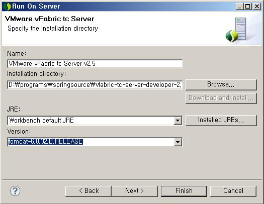
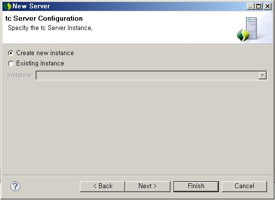
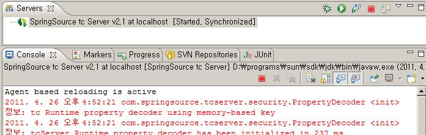
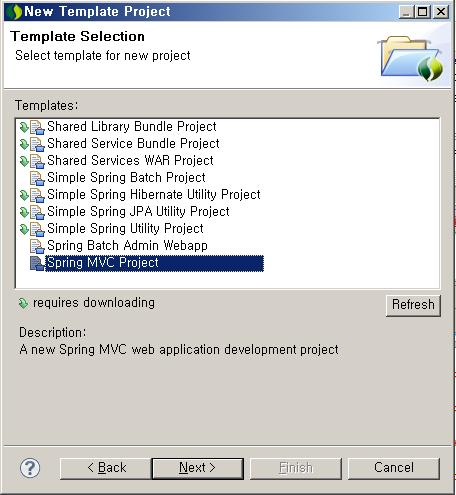
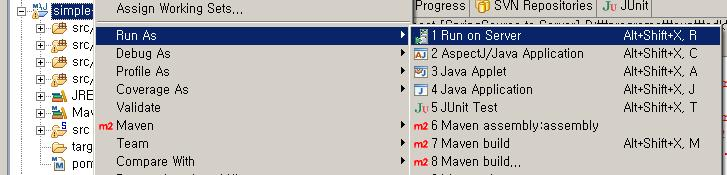
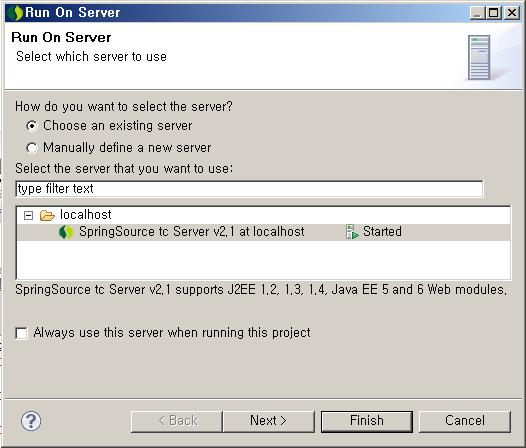

= SpringSource Tool Suite의 Java Agent based reloading 사용해 보기
정상혁
2011-05-09
:jbake-type: post
:jbake-status: published
:jbake-tags: java,reload,eclipse
:idprefix:

SpringSource Tool Suite의 Java Agent based reloading은 개발할 때  .class파일을 고치면 그 파일만 리로딩을 시켜주는 기능입니다. JRebel과도 유사한데 아직 "Experimental' 표시가 붙어있고, 생긴지가 얼마안되는 기능이라서 JRebel만큼 성숙한 기술인지는 잘 모르겠습니다. 그래도 모든 경우에 다 reloading이 되지 않더라도 한번이라도 서버내렸다 올리는 시간을 절약할 수 있으면 그만큼 이득이기 때문에 없는 것보다는 도움이 됩니다.

이런 도구들이 있으면 좋기는 하지만  WAS올리기 전에 테스트 코드로 왠만한 건 다 검증을 하고, WAS 올려서는 JSP같은 View만 고치는 개발 방식이 바람직합니다.  테스트 코드를 잘 짜고 있다면 '개발 중에 WAS 리로딩한다고 시간이 많이 들어요..' 와 같은 이야기가 별로 안 나올 것입니다. 테스트 코드 작성은 익숙해지면 시간이 별로 안 걸리는 일입니다. 그리고 테스트 코드를 만들면 로직이 있는 모듈의 가까운 위치에서 다양한 케이스를 반복해서 테스트해 볼 수 있고, 에러 추적과 디버깅이 훨씬 편해집니다. 아무리 리로딩이 잘 지원된다고 해도, 화면을 띄어서 손으로 데이터를 매번 입력하는 시간을 없애줄 수는 없고, 리로딩이 시간보다 훨씬 긴  에러 추적과 디버깅 시간을 줄여줄 수는 없습니다. 그래서 결국에는 테스트코드 작성하는 것이 개발시간을 더 빠르게 합니다.

STS를 설치할 때 SpringSource Tool Suite를 한번에 받아서 설치했다면 Tc server도 같이 설치되지만, 이미 깔려진 Eclipse 위에 update를 했다면 tc Server는 아래 URL에서 별도로 받아야 합니다.

http://s9.springsource.com/products/tc-server-developer-edition-preview

== Java agent based Reloading 설정

1. 'Servers' Tab에서 New메뉴로 새 서버를 추가한다.
image:img/sts-reload/1_new-server.jpg[1_new-server.jpg]

2. tc Server를 선택한다.
** SpringSource tc Server v2.0 혹은 v2.1 또는 v2.5를 선택한다.
** 참고로 SpringSource Tool Suite 2.6.1부터 tc server v2.5가 포함되어 있고, "VMware vFabric tc Server v2.5"라는 이름으로 "VM Ware" 분류 폴더 아래에 포함되어 있다.
** image:img/sts-reload/20_tc-server-select.jpg[20_tc-server-select.jpg]
3. 처음 설정하는 것이라면, Tc sever가 설치된 위치를 지정합니다.
** 
4. 처음 설정하는 것이라면 "Create new instance"를 선택한다.
** 
5. 같이 설치할 모듈을 지정합니다. 간단하게 'base'와 'nio'만 선택해 된다.
** image:img/sts-reload/5_new-server.jpg[5_new-server.jpg]
6. 설정된 Server의 "Overview" 탭에서 "Enable Java Agent-based reloading"을 선택한다.
** image:img/sts-reload/6_servers.jpg[6_servers.jpg]
7. 시험 삼아서 서버를 시작해 본다..
** image:img/sts-reload/7_servers-start.jpg[7_servers-start]
8. 서버가 시작되면서 "Agent based reloading is active"라는 메시지가 처음에 뜨면 제대로 설정이 된 것이다.
** 

== Java agent based reloading 테스트 해보기
테스트용 프로젝트를 생성해서 reloading이 되는지 확인하는 과정이다.

1. Ctrl +N을 누르고 "Spring Template Project"를 선택한다.
** image:img/sts-reload/9_new-spring-template.jpg[9_new-spring-template.jpg]
2."Spring MVC project"를 선택한다.
** 
3.프로젝트명과 상위 패키지이름을 적는다.
** image:img/sts-reload/11_new-spring-mvc-project.jpg[11_new-spring-mvc-project.jpg]
4. 생성된 프로젝트를 Run AS-> Run On Server로 실행한다.
** 
5. 실행할 서버는 Java Agent Based Reloading을 설정한 tc Server로 지정한다.
** 

6. 서버가 올라간 다음에 템플릿의 HomeController 클래스를 수정해보고, 메소드의 내용을 수정한 다음에  아래와 같이 전체 "Realoding..." 메시지가 보이며 applicationContext loading 없이 해당 클래스만 리로딩 되는 것을 확인한다.
image:img/sts-reload/14_modify-controller.jpg[14_modify-controller]

=== 테스트 결과
* Dynamic web project가 아니고 external web module로 추가한 경우 - 잘 됨
* Servlet만으로 된 프로젝트 - 잘됨
* Application Context 파일 수정 - 되기도 하고 안 되기도 함
* Spring MVC의 controller에 @RequestMapping이 달린 새로운 메소드를 추가한 것을 인식 - 잘 안 됨

