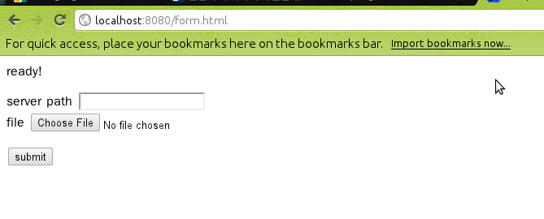

= 간단하게 서버에  파일을 올리기 + MockMultipartFile을 이용한 테스트
정상혁
2011-10-23
:jbake-type: post
:jbake-status: published
:jbake-tags: 자작도구,test,Spring-Test
:jabke-rootpath: /
:rootpath: /
:content.rootpath: /
:idprefix:

서버에 1,2개 파일만을 올려야할 때는  FTP를  따로 설치하는 일이 번거롭다고 느껴집니다. 그럴 때  간단하게 다운받아서 실행할 수 있는 웹어플리케이션을 만들어봤습니다.

jar파일 하나만 다운로드 받아서 바로 실행시키면 됩니다.

[source]
.다운로드
----
wget file.benelog.net/uploader.jar
----

[source]
.실행
----
java -jar uploader.jar (디폴트로 8080포트)
java -jar uploader.jar --httpPort=2010 (포트지정)
----

.서버를 브라우저로 접속해서 파일을 올리기
예) http://localhost:8080/

따로 Tomcat과 같은 WAS를 설치할 필요가 없도록 경량 WAS인 Winstone(http://winstone.sourceforge.net/) 과 함께 패키징했습니다.

소스코드는 github에 올려놨습니다. ( https://github.com/benelog/uploader/ )

특별한 코드는 없지만, 아래 클래스에서 http://static.springsource.org/spring/docs/2.0.x/api/org/springframework/mock/web/MockMultipartFile.html[MockMultipartFile]를 이용해서 파일업로드에 대한 테스트코드를  만들면서 나름 재미있었습니다.

* https://github.com/benelog/uploader/blob/master/src/test/java/net/benelog/uploader/UploadControllerTest.java

