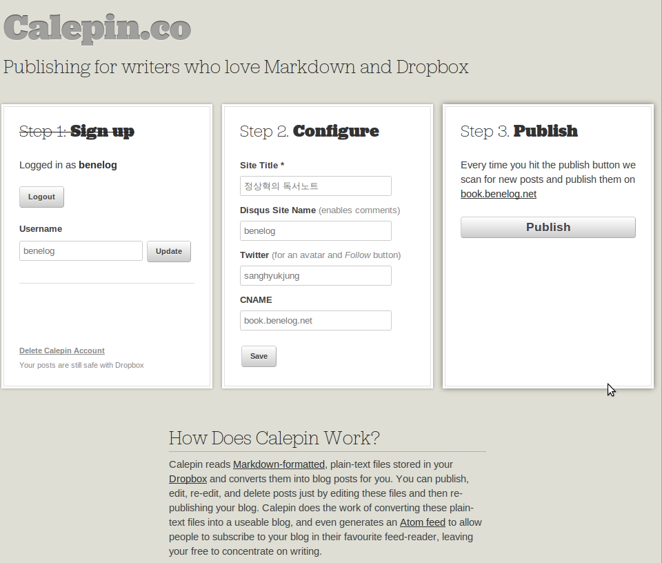

= Markdown + Dropbox
정상혁
2013-03-05
:jbake-type: post
:jbake-status: published
:jbake-tags: markdown,dropbox
:idprefix:

* 업데이트
** 2019.04.10 : 현시점에서는 Calepin 서비스도 종료되었습니다.
** 2013.03.05 : GIST에 썼던 글을 옮기어 봅니다.
*** Springnote 서비스 종료 전에 쓴 글이라서  Springnote의 마이그레이션 코드는 이제는 쓸수가 없네요)

=== 자료를 정리하는 형식과 도구에 대한 고민
회사에서 만든 자료들은 MOSS(Microsoft Office SharePoint Server)나 위키, 메일함 등이 있으니 큰 아쉬움은 없는데, 개인적인 자료들은 어떻게 정리하고 보관, 공유할지가 늘 고민이 됩니다.

저는 공개하고 싶지 않은 것들은 http://www.evernote.com[에버노트]와 http://www.dropbox.com[드롭박스]를 쓰고, 공유할 자료들은 스프링노트와 http://blog.benelog.net[이글루스 블로그]을 활용하고 있습니다.코드들은 주로 https://github.com/benelog[Github]와 https://gist.github.com/benelog[Gist]에 올립니다.

이렇게 다양한 서비스를 쓰다보니 자료를 서비스 간에 이동을 할 일이 생기면 많이 불편합니다. 예를 들면 에버노트에 있는 자료를 블로그에 올린다거나 스프링노트에 있는 글을 구글사이트로 옮길 때가 그렇습니다.그냥 한 두 페이지면 복사해서 붙여넣기를 하겠지만, 여러 페이지를 옮길 때 그렇게 하면 단순 반복 작업에 들어가는 시간이 아깝습니다.웹 브라이저나 웹 에디터의 차이 때문에 칸 맞추기 같은 사소한 편집에 시간을 많이 허비하기도 합니다.웹이나 클라언트 환경 등 다양한 환경에서 모두 편집이 간편했으면 하는 바램도 있었습니다. 우분투를 쓰는 시간이 많다보니 MS워드처럼 특정 OS가 종속적인 편집기는 별로 좋아하지 않기도 합니다. 그리고 정리한 내용을 자주 찾아보니 검색과 탐색 기능을 쓰기 쉬웠으면도 했습니다.

이번에 스프링노트가 종료될 예정이라 어떤 형식으로 자료를 정리할 것인지에 대한 고민이 더 커졌습니다.

요구사항을 정리하면

* 자료를 이동하는 비용이 적어야하고 (이식성)
* 자료의 모양 때문에 편집을 하는 시간이 되도록 없었으면 하고
* 특정 환경에 종속적이지 않은 다양한 문서 편집기를 사용할 수 있어야 하고
* 검색 기능을 간편하게 쓸 수 있어야 한다.

이런 점들을 고민하다보니 우선 정리하는 자료의 형식은 마크다운을 선택하게 되었습니다. Github와 Gist를 쓰면서 그 단순함에 만족을 했고, http://tumblr.com[텀블러], https://trello.com/[트렐로]등 지원하고 있는 서비스도 늘어가고 있어서 이식성도 높다고 생각했습니다.

그리고 원본 데이터를 파일단위로 관리하고 싶었습니다. 쓰던 서비스가 망하더라도 파일을 단순히 복사해서 다른 서비스로 옮길 수 있다면 이전 비용이 적을 것이기 때문이였습니다.

Github를 이용한 http://octopress.org/[Octopress]도 검토했으나, 버전관리까지는 필요없이 최종 파일만 관리하면 되었기 때문에 Dropbox를 썼으면 좋겠다고 생각했습니다.

사람 생각은 다 비슷한지, 이미 Dropbox + Markdown을 이용한 블로그와 위키 서비스가 나와 있었습니다.

* 블로그 서비스 : http://calepin.co, http://scriptogr.am/
* 위키 서비스 : http://wikipackit.com

=== Calepin( =Markdown + Dropbox)로 블로그 만들기
Calepin을 이용해서 http://book.benelog.net이라는 블로그를 만들어봤습니다.그동안 여러 곳에서 정리하던 읽은 책에 대한 메모를 Markdown으로 정리한 것입니다.

아래와 같이 .md 파일의 처음 시작에 날짜와 제목, URL, 태그 등의 정보를 달아주고, 파일을 [Dropbox 공유폴더]/Apps/Calepin이라는 폴더로 복사합니다.

[source]
----
Date: 2012-07-19
Title: 어제를 버려라
Slug: 어제를_버려라
Tags: IT업계
----

그리고 Calepin 사이트에 가서 'Publish'버튼을 누르면 약속된 폴더에서 파일정보를 읽어와서 블로그를 생성해 줍니다.

이 정보를 바탕으로 블로그를 만들어줍니다. 아래와 같이 굉장히 단순한 디자인인데, 저는 이 정도로 충분하다고 느꼈습니다.

image:img/my-site/book-benelog-net.png[title="book-benelog-net"]

http://scriptogr.am/[scriptogr.am]라는 서비스도 거의 비슷한 기능을 제공하는데, 블로그 테마 등 약간의 커스터마이징이 가능합니다.
http://wikipackit.com[wikipackit]도 사용법은 유사하고, 위키 페이지간의 링크 기능을 제공하지만, 현재까지는 페이지를 비공개로만 관리할 수 있습니다.
앞으로 유사한 서비스가 더 많이 나올수도 있고, 이전 비용도 크지 않으니 언제든지 좋은 서비스가 나오면 갈아탈 생각입니다.

=== 스프링노트 마이그레이션
저는 스프링노트로 관리하던 페이지들 중 일부는 http://wikipackit.com 으로 옮겼습니다. 스프링노트의 API를 이용해서 https://gist.github.com/3194442#file_springnote2markdown.py[Markdown형식으로 스프링노트 페이지를 다운로드하는 스크립트]를 작성했습니다.Python과 http://johnmacfarlane.net/pandoc/[Pandoc]을 활용했습니다.

=== Eclipse Markdown Text Editor
편집기로는 주로 Eclipse에서 http://marketplace.eclipse.org/content/markdown-text-editor[Markdown Text Editor]을 사용하고 있습니다.Eclipse가 무거운 편이지만, Platform Runtime Binary를 찾아서 최소한 도로 설치하면 50MB가 넘지 않게 비교적 가볍게 쓸 수도 있습니다. 예를 들어 Eclipse 3.8의 최소설치를 위한 파일은 아래 링크에서 찾으실 수 있습니다.

* http://download.eclipse.org/eclipse/downloads/drops/R-3.8-201206081200/

편집을 하면서 HTML렌더링을 할 수도 있고, Eclipse의 단축키를 그대로 활용할 수도 있습니다.
예를 들어 파일을 찾을 때 Ctrl + Shift + R키를 눌러서 파일명의 일부를 입력해서 바로 찾아가는 것들이죠.

image:img/eclipse/eclipse-markdown-plugin.png[]

이렇게 구축한 글쓰기와 자료정리 환경을 굉장히 만족하면서 쓰고 있습니다.
Markdown을 지원하는 서비스나 도구들은 앞으로 계속 나올 듯하고, 스스로 만들기도 쉽기 때문에 더 편하게 쓸 수있는 가능성도 크다고 봅니다.
