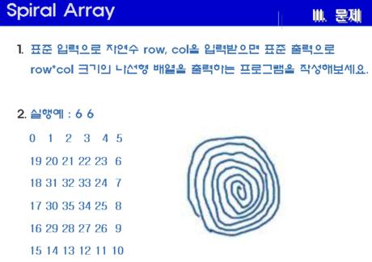

= 나선형 배열 출력 문제 Spiral Array
정상혁
2007-02-07
:jbake-type: post
:jbake-status: published
:jbake-tags: spiral-array,코딩연습
:idprefix:

2007년 회사 워크샵 갔었을 때 풀었던 문제와 답

== 문제

== 풀이

정상혁&이상미 조의 풀이 답입니다.

[source,java]
----
public class MatrixMain {
    public static void main(String[] args) {
       Matrix mp = new Matrix(5,5);
       mp.locateNumbers();
       mp.print();
    }
}

public class Matrix {

    public static final int RIGHT = 0;
    public static final int DOWN = 1;
    public static final int LEFT = 2;
    public static final int UP  = 3;

    private static final int INIT_VALUE = -1;

    private int m = 0;
    private int n = 0;
    private int[][] matrix;

    public Matrix(int m, int n){
        this.m = m;
        this.n = n;
        matrix = new int[m][n];
    }

    public void print(){
        for (int i=0;i< m ;i++){
            for (int j=0;j<n;j++) System.out.print(matrix[i][j] + "\t");
            System.out.println();
       }
    }

    public void locateNumbers() {
       init();
       int[] startPosition = new int[]{0,0};
       matrix[0][0]= 0;
       int direction = RIGHT;
       while(move(startPosition ,direction)) direction ++;
    }

    private void init() {
        for (int i=0;i< m ;i++){
            for (int j=0;j<n;j++) matrix[i][j] = INIT_VALUE;
        }
    }

    private boolean move(int[] position, int direction){
        int nowNumber = matrix[position[0]][position[1]];
        boolean moved = false;
        int[] nextPosition =getNextPosition(position,direction);
        while(isMovable(nextPosition[0],nextPosition[1])){
            moved = true;
            nowNumber++;
            position[0] = nextPosition[0];
            position[1] = nextPosition[1];
            matrix[position[0]][position[1]]= nowNumber;
            nextPosition = getNextPosition(position,direction);
        }
        return moved;
    }

    private int[] getNextPosition(int[] position,int direction){
        int x = position[0];
        int y = position[1];
        int nowDirection = direction%4;
        if (nowDirection == RIGHT) y++;
        else if (nowDirection == DOWN) x++;
        else if (nowDirection == LEFT) y--;
        else if (nowDirection == UP) x--;
        return new int[]{x,y};
    }

    private boolean isMovable(int x, int y){
        if (x>=m) return false;
        if (y>=n) return false;
        if (x<0) return false;
        if (y<0) return false;
        if (matrix[x][y]!= INIT_VALUE) return false;
        return true;
    }
}
----

=== 결과
[source]
----
0   1   2   3   4

15  16  17  18  5

14  23  24  19  6

13  22  21  20  7

12  11  10  9   8

----

이동하는 좌표를 사이즈가 2인 int배열에다 담았는데, 이걸 따로 클래스로 빼서 만들까 하다가 클래스를 더 늘리기 싫어서 그만뒀습니다.
소스에서 `position[0], position[1]` 이라고 표시된 부분이 좌표를 나타내는 부분입니다.

main메서드에서  `Matrix mp = new Matrix(5,5);`` 부분이 5*5 행렬을 만든다는 의미입니다.
사이즈를 바꿀려면 이 부분을 고치시거나, 사용자 입력에서 온 값을 연결시키면 됩니다.
