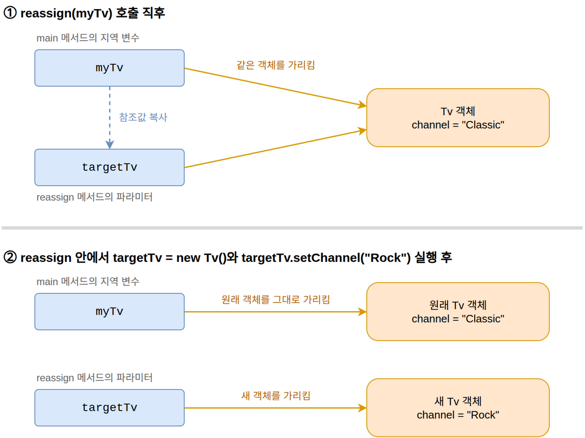
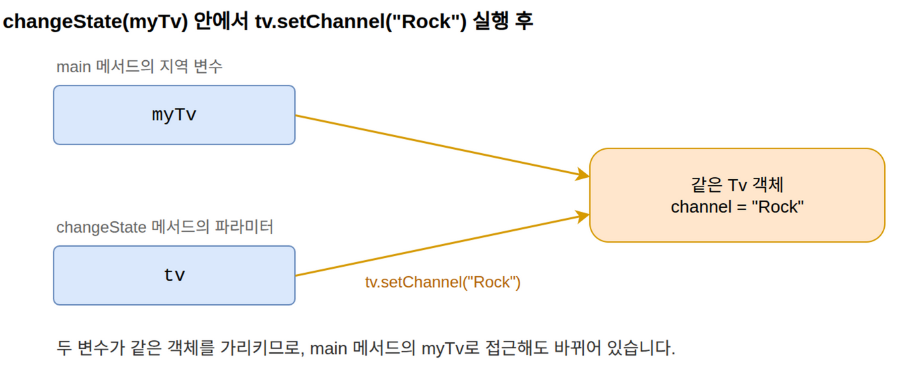
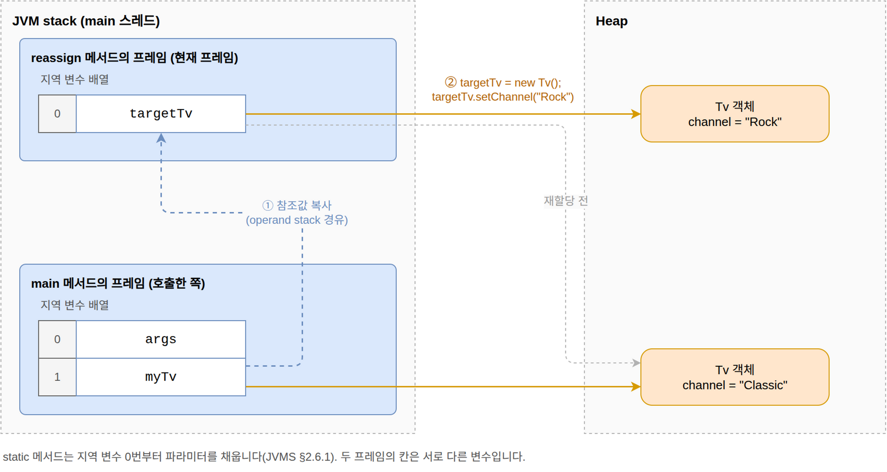

= Call by value vs Call by reference
정상혁
2026-08-23
:jbake-type: post
:jbake-status: published
:jbake-tags: java, javascript
:description: Call by value와 call by reference의 정의를 정리하고, Java, Kotlin, JavaScript, C, {cpp}, C#, Python, Go, Rust, Ada가 인자를 어떻게 전달하는지 비교합니다.
:jbake-last_updated: 2026-09-20
:jbake-og: {"image": "img/call-by-value/og-call-by-value.png"}
:toc:
:idprefix:

"Java의 메서드 호출에서 primitive type은 call by value로, 객체는 call by reference로 인자가 전달된다"는 설명을 종종 접합니다.
그러나 Java에는 call by value만 있습니다.
메서드에 객체를 전달할 때 복사되는 값이 '객체를 가리키는 참조값'일 뿐입니다.
이 글에서는 두 용어의 정의를 정리하고, Java, Kotlin, JavaScript, C, {cpp}, C#, Python, Go, Rust, Ada가 인자를 어떻게 전달하는지 비교합니다.

== Call by value와 call by reference

**Call by value**는 인자로 넘긴 값으로 파라미터라는 별도의 변수를 초기화하는 방식입니다. 대개 값을 복사하며, Rust처럼 소유권을 옮기는 언어도 있습니다. 함수 안에서 파라미터에 다른 값을 대입해도 호출한 쪽의 변수는 영향을 받지 않습니다.

**Call by reference**는 변수 자체를 전달하는 방식입니다. 파라미터는 호출한 쪽 변수의 별칭(alias)이 되므로, 함수 안에서 파라미터에 새 값을 대입하면 호출한 쪽의 변수도 함께 바뀝니다.

이 정의는 프로그래밍 언어론의 표준적인 설명을 따릅니다.

Christopher Strachey는 1967년 강의를 정리한 https://www.cs.cmu.edu/~crary/819-f09/Strachey67.pdf[Fundamental Concepts in Programming Languages] 3.4.2절에서 파라미터에 표현식의 R-value를 넘기는 방식을 call by value, L-value를 넘기는 방식을 call by reference라고 불렀습니다. L-value는 대입문의 왼쪽(Left)에 놓인 표현식이 뜻하는 저장 위치이고, R-value는 오른쪽(Right)에 놓인 표현식이 뜻하는 그 위치에 담긴 값입니다. 이 강의록은 L-value와 R-value, first-class 객체 같은 용어의 출처로 지금도 인용되는 프로그래밍 언어론의 고전입니다.

컴파일러 교과서로 널리 쓰이는 **Compilers: Principles, Techniques, and Tools** 2판 1.6.6절도 call by value는 인자를 평가하거나 복사한 값을 파라미터의 저장 위치에 넣는 방식, call by reference는 인자의 주소를 파라미터의 값으로 넘겨 파라미터의 변경이 인자의 변경으로 나타나는 방식이라고 설명합니다. 이 책은 표지 그림 때문에 Dragon Book으로 불리며 1977년의 전신 **Principles of Compiler Design**부터 대학 컴파일러 강의의 기본 교재로 쓰여 온 표준 교과서입니다.

이 글처럼 call by value와 call by reference만 비교하고, 값을 다시 대입할 수 있는 변수를 인자로 넘기고 파라미터에도 대입할 수 있다고 가정하면, 두 방식을 구분하는 실용적인 기준은 한 문장으로 요약할 수 있습니다. *함수 안에서 파라미터에 새 값을 대입했을 때 호출한 쪽의 변수가 바뀌는가?* 바뀌면 두 방식 중 call by reference이고, 바뀌지 않으면 call by value입니다. 다만 call by copy-restore나 call by name 등 다른 평가 전략까지 포함하면 이 질문만으로 모든 인자 전달 방식을 분류할 수는 없습니다. 파라미터가 가리키는 객체의 내부 상태를 바꾸는 일은 이 기준과 다른 문제입니다. 뒤에서 다루겠지만 바로 여기서 오해가 생깁니다.

=== Pass by value와 pass by reference의 의미

Call by value와 call by reference는 pass by value, pass by reference라고도 부릅니다. ``pass by ~``는 ``call by ~``와 같은 개념을 가리키는 다른 용어입니다. ``call by ~``는 1960년에 발표된 ALGOL 60 보고서부터 쓰인 형태입니다. https://www.masswerk.at/algol60/report.htm[1963년 개정 보고서]의 4.7.3절이 파라미터 전달 방식을 규정하며 4.7.3.1에 'Value assignment (call by value)', 4.7.3.2에 'Name replacement (call by name)'이라는 제목을 붙였습니다. 실무와 교재에서는 ``pass by ~``도 널리 쓰입니다. 이 글에서는 ``call by ~``로 통일했습니다.

=== Call by sharing

Java, JavaScript, Python처럼 호출자 변수 자체가 아니라 객체를 공유하는 인자 전달 동작을 **call by sharing**이라고 부르기도 합니다. Barbara Liskov를 비롯한 설계팀이 1970년대 중반에 만든 언어인 https://csg.csail.mit.edu/pubs/memos/Memo-112/memo112-1a.pdf[CLU의 설계 문서]에서 쓴 용어입니다. 뒤에서 살펴볼 Java, Kotlin, JavaScript, Python의 객체 인자 동작과 C#의 class 인스턴스 전달이 모두 여기에 해당합니다. Python 튜토리얼이 쓴 call by object reference도 같은 뜻입니다. Go의 맵이나 포인터, C의 포인터를 전달할 때도 같은 구조가 나타납니다.

Call by value라고 하면 '객체가 통째로 복사된다'는 오해를, call by reference라고 하면 '재할당도 호출한 쪽 변수에 반영된다'는 오해를 낳을 수 있습니다. Call by sharing은 이런 오해를 피하는 데 좋은 용어입니다. 뒤에서 인용할 MDN의 JavaScript 문서처럼 이 용어를 쓰는 자료도 있지만, 교재와 언어 사양에서 표준 용어로 자리 잡지는 않았습니다. 그래서 이 글에서는 call by value와 call by reference 두 가지로만 구분해서 설명을 이어 가겠습니다.

== Java

=== swap 메서드의 실행 결과

아래 코드의 출력으로 Java의 전달 방식을 확인할 수 있습니다.

[source,java]
.swap 메서드 테스트
----
public class ReferenceTest {
    public static void main(String[] args) {
        String x1 = "Hello";
        String y1 = "World";
        swap(x1, y1); // <1>
        System.out.println(x1); // Hello

        int x2 = 1;
        int y2 = 2;
        swap(x2, y2); // <2>
        System.out.println(x2); // 1
    }

    static void swap(Object x, Object y) {
        Object temp = x;
        x = y; // <3>
        y = temp;
    }

    static void swap(int x, int y) {
        int temp = x;
        x = y;
        y = temp;
    }
}
----
<1> ``x1``과 ``y1``에 담긴 참조값의 복사본이 파라미터 ``x``와 ``y``에 대입됩니다.
<2> int 값이 ``swap(int, int)`` 오버로드의 파라미터에 복사됩니다. 이 오버로드가 없으면 `Object` 파라미터에 오토박싱된 Integer 객체의 참조값이 전달되는데, 결과는 같습니다.
<3> 메서드 안에서 파라미터 ``x``와 ``y``에 서로의 값을 대입해도, 호출한 쪽의 ``x1``, ``y1``, ``x2``, ``y2``는 바뀌지 않습니다. `int` 오버로드도 마찬가지입니다.

즉, 앞에서 정리한 기준대로라면 Java는 primitive type이든 객체든 call by value로 동작합니다.

=== 파라미터 재할당이 호출자 변수에 반영되지 않는 이유

메서드 파라미터로 객체를 전달하는 경우를 더 자세히 살펴보겠습니다.

[source,java]
.메서드 안에서 파라미터 재할당
----
class Tv {
    private String channel;

    void setChannel(String channel) { this.channel = channel; }
    String getChannel() { return channel; }
}

public class ReassignTest {
    public static void main(String[] args) {
        var myTv = new Tv();
        myTv.setChannel("Classic");

        reassign(myTv); // <1>
        System.out.println(myTv.getChannel()); // Classic
    }

    static void reassign(Tv targetTv) {
        targetTv = new Tv(); // <2>
        targetTv.setChannel("Rock");
    }
}
----
<1> main 메서드의 ``myTv``에 담긴 참조값이 복사되어 reassign 메서드의 파라미터 ``targetTv``에 대입됩니다. 두 변수는 같은 객체를 가리키지만 서로 다른 변수입니다.
<2> 파라미터 ``targetTv``에 새 객체를 대입합니다. 파라미터 ``targetTv``만 새 객체를 가리키게 되고, main 메서드의 ``myTv``는 원래 객체를 그대로 가리킵니다. 그래서 출력은 ``Classic``입니다.

=== 오해의 근원인 객체 상태 변경

그런데 파라미터를 재할당하지 않고 파라미터가 가리키는 객체의 내부 상태를 바꾸면, 호출한 쪽의 변수로 접근해도 바뀐 상태가 그대로 확인됩니다.

[source,java]
.메서드 안에서 파라미터 재할당 없이 객체 상태 변경
----
public class ChangeStateTest {
    public static void main(String[] args) {
        var myTv = new Tv();
        myTv.setChannel("Classic");

        changeState(myTv); // <1>
        System.out.println(myTv.getChannel()); // <3>
    }

    static void changeState(Tv tv) {
        tv.setChannel("Rock"); // <2>
    }
}
----
<1> 앞의 예제와 같이 ``myTv``에 담긴 참조값이 복사되어 changeState 메서드의 파라미터 ``tv``에 대입됩니다. 두 변수는 같은 객체를 가리킵니다.
<2> 파라미터 ``tv``를 재할당하지 않고, 파라미터가 가리키는 객체의 채널을 ``Rock``으로 바꿉니다. main 메서드의 ``myTv``가 가리키는 바로 그 객체입니다.
<3> main 메서드의 ``myTv``로 채널을 읽으면 ``Rock``이 출력됩니다. 변수는 바뀌지 않았지만 변수가 가리키는 객체의 상태가 바뀌었기 때문입니다.

객체의 변경된 상태가 호출자의 변수로도 확인이 되니 "객체는 call by reference로 전달된다"는 설명이 그럴듯하게 들립니다.
그러나 앞에서 설명했듯이, 두 방식을 구분하는 실용적인 기준은 파라미터에 대입한 값이 호출자 변수에 반영되는가입니다.
객체 상태 변경이 호출자 변수로 접근해도 확인되는 것은 두 변수가 같은 객체를 가리키고 있기 때문일 뿐, 전달 방식은 여전히 참조값의 복사, 즉 call by value입니다.

**Head First Java**에서는 객체 참조를 TV 리모컨에 비유해서 설명합니다. 객체를 전달하면 TV(객체)가 복사되는 것이 아니라 그 TV를 조작할 수 있는 리모컨(참조값)이 복사됩니다. 복사된 리모컨으로 채널을 바꾸면(객체 상태 변경) 원래 리모컨을 가진 사람에게도 바뀐 채널이 보입니다. 복사된 리모컨이 다른 새로운 TV에 연결된 이후에는(재할당, `targetTv = new Tv()`) 이전의 TV에 영향을 미치지 못하고 원래 리모컨은 여전히 기존의 TV와 연결되어 있습니다.

=== Java의 reference와 용어의 혼란

Java의 창시자 James Gosling은 **The Java Programming Language** 책에서 이 오해를 직접 지적했습니다.

[quote, "Ken Arnold, James Gosling, David Holmes", The Java Programming Language 4판]
____
Some people will say incorrectly that objects are passed "by reference." ... The Java programming language does not pass objects by reference; it passes object references by value.

어떤 사람들은 객체가 '참조로(by reference)' 전달된다고 잘못 말한다. ... Java 프로그래밍 언어는 객체를 참조로 전달하지 않는다. 객체의 참조를 값으로 전달한다.
____

최신 공식 Java 학습 자료인 https://dev.java/learn/classes-objects/calling-methods-constructors/[Dev.java]에서도 같은 내용을 설명합니다.

[quote, Dev.java, Calling Methods and Constructors]
____
Reference data type parameters, such as objects, are also passed into methods by value. ... when the method returns, the passed-in reference still references the same object as before.

객체 같은 참조 데이터 타입 파라미터도 메서드에 값으로 전달된다. ... 메서드가 반환될 때 전달된 참조는 여전히 이전과 같은 객체를 참조한다.
____

이러한 혼란은 'reference'라는 용어에서 비롯된 것으로 보입니다. Java에서 객체를 가리키는 값을 'reference'라고 부르는데, 이 단어가 'call by reference'의 reference와 겹치면서 오해가 생겼습니다. 더 정확하게 표현하면 *Java는 객체를 가리키는 참조값을 call by value로 전달합니다.*

Java의 reference는 객체를 식별하고 접근하는 값입니다. 포인터처럼 이해할 수 있습니다.
다음의 Java 객체 접근 동작은

[source,java]
.Java 객체 접근
----
var myTv = new Tv();
myTv.setChannel("Rock");
----

{cpp} 포인터를 쓴 다음 코드와 비슷합니다.

[source,cpp]
.{cpp} 포인터
----
Tv *myTv = new Tv();
myTv->setChannel("Rock");
----

Java의 ``myTv`` 변수는 객체 자체가 아니라 객체를 가리키는 값을 담고 있습니다. ``myTv``를 다른 메서드의 인자로 넘기면 이 참조값이 복사되어 전달됩니다. 다만 위 {cpp} 코드는 객체 접근과 포인터 재할당을 설명하기 위한 비유이며, 객체의 수명 관리나 참조의 실제 표현까지 같다는 뜻은 아닙니다.

이와 관련된 JLS(Java Language Specification)의 서술을 보겠습니다. '포인터'는 JLS도 사용하는 표현입니다. https://docs.oracle.com/javase/specs/jls/se26/html/jls-4.html#jls-4.3.1[4.3.1. Objects] 절은 참조값을 객체를 가리키는 포인터로 정의합니다.

[quote, Java Language Specification, 4.3.1. Objects]
____
The reference values (often just references) are pointers to these objects, and a special null reference, which refers to no object.

참조값(흔히 그냥 참조라고 부른다)은 이 객체들을 가리키는 포인터이고, 여기에 어떤 객체도 가리키지 않는 특별한 null 참조가 있다.
____

다만 이는 언어 수준의 의미를 설명하는 표현이지, 참조값이 원시 메모리 주소와 같은 형식이라고 보장하는 문장은 아닙니다. https://docs.oracle.com/en/java/javase/26/docs/specs/jvms/jvms-2.html#jvms-2.7[JVMS(Java Virtual Machine Specification) 2.7]은 객체의 내부 구조를 특정하지 않으며, 일부 구현에서는 참조가 객체 데이터가 아니라 핸들을 가리킬 수도 있다고 설명합니다. 여기서 핸들은 참조와 객체 데이터 사이에 놓인 작은 중간 구조입니다. 참조는 핸들을 가리키고, 핸들 안의 포인터가 다시 객체 데이터와 메서드 테이블을 가리킵니다. 참조값이 객체가 놓인 메모리 주소 그 자체가 아닐 수도 있다는 뜻입니다.

이 문장은 https://web.archive.org/web/20001213164500/http://java.sun.com/docs/books/vmspec/html/Overview.doc.html[JVMS 초판(1997)]에서 "Sun의 현재 구현"을 설명하던 것입니다. 2판에서 "Sun의 일부 구현"으로, Oracle 인수 뒤의 판에서 "Oracle의 일부 구현"으로 바뀌었을 뿐 내용은 같습니다. 초판 당시 Sun의 JVM은 JDK 1.0·1.1의 Classic VM이었고, https://www.oracle.com/java/technologies/whitepaper.html[The Java HotSpot Performance Engine Architecture]의 'Handleless Objects' 절은 이 Classic VM이 간접 핸들을 썼다고 설명합니다. 현재 Oracle JDK와 OpenJDK가 공통으로 쓰는 HotSpot은 핸들 없이 객체를 직접 가리키는 포인터를 씁니다. 같은 절은 HotSpot에서 Java 코드가 핸들을 쓰지 않고 객체 참조를 직접 포인터로 구현한다고 설명합니다.

메서드 호출 시의 전달 방식은 https://docs.oracle.com/javase/specs/jls/se26/html/jls-8.html#jls-8.4.1[8.4.1. Formal Parameters] 절에 있습니다.
인자 표현식의 '값'이 새로 만들어진 파라미터 변수를 초기화한다고 설명할 뿐입니다. 앞에서 정의한 call by reference처럼 파라미터가 호출한 쪽 변수의 별칭이 된다는 서술은 없습니다.

[quote, Java Language Specification, 8.4.1. Formal Parameters]
____
When the method or constructor is invoked (§15.12), the values of the actual argument expressions initialize newly created parameter variables, each of the declared type, before execution of the body of the method or constructor.

메서드나 생성자를 호출하면(§15.12), 그 본문을 실행하기 전에 실제 인자 표현식의 값이 새로 만들어진 파라미터 변수를 초기화한다. 새로 만들어지는 파라미터 변수는 각각 선언된 타입을 따른다.
____

=== 메서드 호출마다 새로 만들어지는 프레임

JLS는 메서드 호출을 실행하는 과정도 단계별로 서술합니다. https://docs.oracle.com/javase/specs/jls/se26/html/jls-15.html#jls-15.12.4.5[15.12.4.5. Create Frame, Synchronize, Transfer Control] 절은 호출할 메서드가 정해지면 activation frame을 새로 만들고 그 안에 인자 값을 담는다고 설명합니다.
Activation frame은 메서드 호출의 파라미터, 지역 변수, 반환 주소 같은 실행 상태를 담고 호출이 끝나면 사라지는 메모리 영역입니다.

[quote, Java Language Specification, "15.12.4.5. Create Frame, Synchronize, Transfer Control"]
____
Now a new activation frame is created, containing the target reference (if any) and the argument values (if any), as well as enough space for the local variables and stack for the method to be invoked ... The effect of this is to assign the argument values to corresponding freshly created parameter variables of the method, and to make the target reference available as this, if there is a target reference.

이제 새 activation frame을 만든다. 여기에는 대상 참조(있다면)와 인자 값(있다면), 그리고 호출할 메서드의 지역 변수와 스택에 필요한 공간이 들어간다. ... 그 결과 인자 값은 메서드에 새로 만들어진 각각의 파라미터 변수에 대입되고, 대상 참조가 있다면 this로 쓸 수 있게 된다.
____

호출한 쪽의 변수가 아니라 새 프레임에 새로 만들어진 파라미터 변수에 인자의 '값'을 대입한다는 서술입니다. 8.4.1절과 같은 결론입니다. 인스턴스 메서드를 호출한 대상 객체의 참조값(target reference)도 같은 방식으로 새 프레임에 담겨 ``this``가 됩니다.

이 프레임을 가상 머신 수준에서 정의한 문서는 JVMS입니다. https://docs.oracle.com/en/java/javase/26/docs/specs/jvms/jvms-2.html#jvms-2.6[2.6. Frames] 절은 메서드를 호출할 때마다 새 프레임이 스레드의 JVM stack에 만들어지고, 프레임마다 자기만의 지역 변수 배열이 있다고 설명합니다.

[quote, Java Virtual Machine Specification, 2.6. Frames]
____
A new frame is created each time a method is invoked. ... Frames are allocated from the Java Virtual Machine stack (§2.5.2) of the thread creating the frame. Each frame has its own array of local variables (§2.6.1), ...

메서드를 호출할 때마다 새 프레임이 만들어진다. ... 프레임은 그 프레임을 만드는 스레드의 Java Virtual Machine stack(§2.5.2)에 할당된다. 각 프레임은 자기만의 지역 변수 배열(§2.6.1)을 가진다.
____

파라미터는 이 지역 변수 배열로 전달됩니다. https://docs.oracle.com/en/java/javase/26/docs/specs/jvms/jvms-2.html#jvms-2.6.1[2.6.1. Local Variables] 절의 설명입니다.

[quote, Java Virtual Machine Specification, 2.6.1. Local Variables]
____
The Java Virtual Machine uses local variables to pass parameters on method invocation. On class method invocation, any parameters are passed in consecutive local variables starting from local variable 0. On instance method invocation, local variable 0 is always used to pass a reference to the object on which the instance method is being invoked (this in the Java programming language). Any parameters are subsequently passed in consecutive local variables starting from local variable 1.

Java Virtual Machine은 메서드를 호출할 때 지역 변수로 파라미터를 전달한다. 클래스 메서드를 호출하면 파라미터는 0번 지역 변수부터 차례로 전달된다. 인스턴스 메서드를 호출하면 0번 지역 변수는 항상 그 인스턴스 메서드가 호출된 객체의 참조(Java 프로그래밍 언어의 this)를 전달하는 데 쓰인다. 파라미터는 그다음 1번 지역 변수부터 차례로 전달된다.
____

앞의 ``reassign`` 예제에서 ``myTv``의 참조값이 파라미터 ``targetTv``로 복사되는 과정을 이 구조에 대입해 따라가 보겠습니다. 그러려면 먼저 다음 개념을 알아야 합니다.

* Operand stack: 프레임마다 하나씩 있는 후입선출 스택으로, JVM 명령이 피연산자를 꺼내고 결과를 올리는 작업 공간입니다. 메서드에 넘길 인자를 준비하는 데도 쓰입니다.
* 바이트코드: javac가 Java 소스를 컴파일해 class 파일에 담는 JVM 명령어입니다. 이 예제의 호출 과정에는 두 명령이 등장합니다.
** https://docs.oracle.com/en/java/javase/26/docs/specs/jvms/jvms-6.html#jvms-6.5.aload_n[`aload_1`]: 현재 프레임의 1번 지역 변수에 담긴 참조값을 operand stack에 올립니다.
** https://docs.oracle.com/en/java/javase/26/docs/specs/jvms/jvms-6.html#jvms-6.5.invokestatic[`invokestatic`]: static 메서드를 호출합니다. 인자 값을 operand stack에서 꺼내고, 새 프레임을 만들어 그 값을 새 프레임의 0번 지역 변수부터 차례로 넣습니다.

이 개념으로 ``reassign`` 호출을 그리면 다음 그림과 같습니다. ``reassign``은 static 메서드이므로 파라미터 ``targetTv``는 ``reassign`` 프레임의 0번 지역 변수입니다. javac가 ``main`` 프레임의 1번 지역 변수에 배정한 ``myTv``에 담긴 참조값이 이 칸으로 복사됩니다. 파라미터가 0번부터 들어가는 것은 JVMS가 정하지만, 파라미터가 아닌 지역 변수를 몇 번 칸에 둘지는 컴파일러가 정합니다. 바이트코드 수준에서는 ``aload_1`` 명령이 이 참조값을 ``main`` 프레임의 operand stack에 올리고, ``invokestatic`` 명령이 그 값을 꺼내 새 프레임의 0번 지역 변수에 넣습니다. 두 칸은 서로 다른 프레임에 속한 별개의 저장 공간이므로 ``targetTv``에 새 객체를 대입해도 ``main`` 프레임의 ``myTv``는 여전히 처음의 객체를 가리킵니다.

다만 JVMS는 추상 기계를 정의할 뿐입니다. 특정 구현의 메모리 구조가 아니라 명령의 동작 규칙을 정한 모델이라는 뜻입니다. JVMS 2장의 서두는 런타임 데이터 영역의 메모리 배치를 구현자의 재량에 맡긴다고 밝힙니다. 예를 들어 JIT 컴파일러가 만든 기계어 코드는 파라미터를 CPU 레지스터에 둘 수도 있습니다. 그렇더라도 호출한 쪽의 변수와 파라미터가 별개의 변수라는 언어의 의미는 달라지지 않습니다.

== Kotlin

Kotlin도 call by reference를 지원하지 않습니다. 그런데 이 글의 판별 기준인 '파라미터에 새 값을 대입했을 때 호출한 쪽의 변수가 바뀌는가'를 Kotlin에서는 실험할 수 없습니다. https://kotlinlang.org/spec/declarations.html#function-declaration[Kotlin Language Specification]의 Function declaration 절은 각 파라미터가 함수 본문 안에서 값의 이름으로 도입되므로 파라미터는 final이고 함수 안에서 바꿀 수 없다고 규정합니다.

[quote, Kotlin Language Specification, Function declaration]
____
Each parameter p~i~: P~i~ = v~i~ introduces p~i~ as a name of value with type P~i~ available inside function body b; therefore, parameters are final and cannot be changed inside the function.

각 파라미터 p~i~: P~i~ = v~i~는 함수 본문 b 안에서 쓸 수 있는 타입 P~i~의 값 이름 p~i~를 도입한다. 따라서 파라미터는 final이고 함수 안에서 바꿀 수 없다.
____

파라미터에 새 값을 대입하는 코드는 컴파일 오류입니다.

[source,kotlin]
.Kotlin 파라미터 재할당과 객체 상태 변경
----
class Tv(var channel: String)

fun main() {
    val myTv = Tv("Classic")
    changeState(myTv)
    println(myTv.channel) // Rock
}

fun reassign(targetTv: Tv) {
    targetTv = Tv("Rock") // <1>
}

fun changeState(tv: Tv) {
    tv.channel = "Rock" // <2>
}
----
<1> 컴파일 오류가 납니다. 오류 메시지는 "'val' cannot be reassigned"입니다.
<2> 파라미터가 가리키는 객체의 속성을 바꾸므로 호출한 쪽 변수로 접근해도 바뀌어 있습니다. 컴파일 오류가 나는 ``reassign`` 함수를 지우고 실행하면 ``Rock``이 출력됩니다.

재할당이 막혀 있을 뿐 나머지는 Java와 같습니다. JVM에서 실행할 때 전달되는 것은 Java와 같은 참조값의 복사본입니다. 파라미터가 final이라는 규칙은 언어 사양이므로 Kotlin/JS나 Kotlin/Native 등 JVM이 아닌 플랫폼으로 컴파일해도 달라지지 않습니다.

== JavaScript

JavaScript도 Java와 같은 방식으로 동작합니다. 먼저 swap 예제입니다.

[source,javascript]
.JavaScript swap 함수
----
function swap(x, y) {
  const temp = x;
  x = y;
  y = temp;
}

let x1 = "Hello";
let y1 = "World";
swap(x1, y1);
console.log(x1); // Hello
----

객체를 전달할 때도 함수 내에서의 재할당과 상태 변경의 결과가 Java와 동일합니다.

[source,javascript]
.JavaScript 객체 전달 시 재할당과 상태 변경
----
const myTv = { channel: "Classic" };

reassign(myTv);
console.log(myTv.channel); // Classic

changeState(myTv);
console.log(myTv.channel); // Rock

function reassign(targetTv) {
  targetTv = { channel: "Rock" }; // <1>
}

function changeState(tv) {
  tv.channel = "Rock"; // <2>
}
----
<1> 파라미터 ``targetTv``에 새 객체를 대입해도 호출한 쪽의 ``myTv``는 바뀌지 않습니다.
<2> 파라미터가 가리키는 객체의 프로퍼티를 바꾸면 호출한 쪽의 ``myTv``로 접근해도 바뀌어 있습니다.

앞의 두 그림에서 `Tv` 객체를 객체 리터럴로 바꾸면 JavaScript의 동작을 설명하는 그림이 됩니다.

https://developer.mozilla.org/en-US/docs/Web/JavaScript/Reference/Functions#passing_arguments[MDN의 Functions 문서]도 이 동작을 같은 구조로 정리합니다. 인자는 항상 값으로 전달되며, 객체 인자는 더 정확히 말하면 공유로 전달된다는 설명입니다.

[quote, MDN Web Docs, Functions - Passing arguments]
____
Arguments are always passed by value and never passed by reference. This means that if a function reassigns a parameter, the value won't change outside the function. More precisely, object arguments are passed by sharing, which means if the object's properties are mutated, the change will impact the outside of the function.

인자는 항상 값으로 전달되며 참조로 전달되는 일은 없다. 즉 함수가 파라미터를 재할당해도 함수 밖의 값은 바뀌지 않는다. 더 정확히 말하면 객체 인자는 공유로 전달되므로, 객체의 프로퍼티를 바꾸면 그 변경이 함수 밖에 영향을 준다.
____

ECMAScript 사양도 이 동작을 호출자 변수의 별칭이 아니라 값과 별도의 파라미터 바인딩으로 기술합니다. https://tc39.es/ecma262/2026/multipage/ecmascript-language-expressions.html#sec-argument-lists-runtime-semantics-argumentlistevaluation[ArgumentListEvaluation]은 인자 표현식에서 ``GetValue``로 값을 얻어 ECMAScript 언어 값 목록을 만들고, https://tc39.es/ecma262/2026/multipage/ordinary-and-exotic-objects-behaviours.html#sec-functiondeclarationinstantiation[FunctionDeclarationInstantiation]은 그 목록으로 새 함수 실행 환경의 파라미터 바인딩을 초기화합니다.

ECMAScript 사양에서는 Java와 달리 객체에 접근하는 값을 'reference value'라고 부르지 않습니다. 사양이 프로그램에서 직접 다루는 값의 종류로 정한 여덟 가지 언어 타입(ECMAScript language type) 중 하나가 Object이고, 객체 자체가 그 타입의 값입니다. 따라서 이 글의 '참조값 복사'는 관찰되는 동작을 설명하기 위한 모델로 이해하는 편이 정확합니다.

TypeScript 핸드북도 같은 취지입니다. https://www.typescriptlang.org/docs/handbook/typescript-from-scratch.html#runtime-behavior[TypeScript 핸드북]은 원칙적으로 TypeScript는 JavaScript 코드의 런타임 동작을 바꾸지 않는다고 밝힙니다.

[quote, TypeScript Handbook, TypeScript for the New Programmer - Runtime Behavior]
____
As a principle, TypeScript never changes the runtime behavior of JavaScript code.

원칙적으로 TypeScript는 JavaScript 코드의 런타임 동작을 절대 바꾸지 않는다.
____

타입 검사가 끝나면 타입 정보를 지우고 평범한 JavaScript를 내놓으므로 인자 전달 방식도 위에서 설명한 JavaScript와 동일합니다. 뒤에서 살펴볼 C#의 `ref`, `out`에 해당하는 참조 파라미터 문법도 없습니다.

=== JavaScript: The Definitive Guide의 call by reference 서술

일부만 읽으면 JavaScript의 함수 호출을 call by reference로 오해하기 쉬운 자료도 있습니다. David Flanagan이 쓰고 오랫동안 JavaScript의 표준적인 책으로 꼽혀온 https://docstore.mik.ua/orelly/webprog/jscript/ch11_02.htm[**JavaScript: The Definitive Guide** 4판]은 'By Value Versus by Reference' 장의 요약 표에서 객체가 by reference로 복사·전달·비교된다고 정리합니다. 이 요약 표만 보면 JavaScript는 call by reference라고 설명해도 될 것처럼 보입니다.

그런데 같은 장의 동작 설명을 읽어 보면, 이 책이 말하는 by reference는 이 글의 앞부분에서 정의한 call by reference와 다른 의미입니다. '객체 값 전체가 복사되는 대신 객체를 가리키는 참조가 전달된다'는 의미로 쓴 표현이고, 파라미터를 재할당해도 호출한 쪽 변수에 반영되지 않는다는 점은 이 책도 똑같이 설명합니다.

[quote, David Flanagan, "JavaScript: The Definitive Guide 4판, 11.2 By Value Versus by Reference"]
____
A function can use the reference to modify properties of the object or elements of the array. But if the function overwrites the reference with a reference to a new object or array, that modification is not visible outside of the function. Readers familiar with the other meaning of this term may prefer to say that objects and arrays are passed by value, but the value that is passed is actually a reference rather than the object itself.

함수는 그 참조로 객체의 프로퍼티나 배열의 원소를 수정할 수 있다. 그러나 함수가 그 참조를 새 객체나 새 배열의 참조로 덮어쓰면, 그 변경은 함수 밖에서 보이지 않는다. 이 용어의 다른 뜻에 익숙한 독자라면 객체와 배열이 값으로 전달되며 다만 전달되는 값이 객체 자체가 아니라 참조라고 말하고 싶을 것이다.
____

이 설명에 이어지는 예제의 제목도 'References themselves are passed by value', 즉 참조 자체는 값으로 전달된다는 것입니다. 결국 관찰되는 동작을 설명하는 내용은 이 글과 같고, 무엇이 전달된다고 부를지에서 용어 선택만 다릅니다.

== C

C에는 참조 타입이 없으므로 call by value만 존재합니다. C11 표준 초안 https://www.open-std.org/jtc1/sc22/wg14/www/docs/n1570.pdf[N1570]의 6.5.2.2 Function calls 4항은 함수 호출을 준비할 때 인자를 평가하고 각 파라미터에 대응하는 인자의 값을 대입한다고 규정합니다.

[quote, C11 Working Draft N1570, 6.5.2.2 Function calls 4항]
____
In preparing for the call to a function, the arguments are evaluated, and each parameter is assigned the value of the corresponding argument.

함수 호출을 준비할 때 인자를 평가하고, 각 파라미터에 대응하는 인자의 값을 대입한다.
____

같은 항에 달린 각주 93은 함수가 파라미터의 값을 바꿀 수는 있지만 그 변경이 인자의 값에 영향을 줄 수는 없고, 대신 객체를 가리키는 포인터를 넘기면 함수가 그 객체의 값을 바꿀 수 있다고 설명합니다.

[source,c]
.C 포인터 파라미터로 구현한 swap
----
void swap(int* x, int* y) {
    int temp = *x;
    *x = *y; // <1>
    *y = temp;
}

int a = 1;
int b = 2;
swap(&a, &b); // <2>
----
<1> 포인터가 가리키는 변수에 값을 쓰므로 호출한 쪽의 ``a``가 바뀝니다. 그러나 ``x``에 다른 주소를 대입해도 호출한 쪽의 ``a``는 그대로입니다.
<2> ``&``는 주소를 구하는 연산자일 뿐이고, 포인터라는 값의 복사본이 파라미터 ``x``와 ``y``에 대입됩니다. 호출 뒤 ``a``는 2, ``b``는 1입니다.

앞에서 정리한 구분 기준을 적용하면 포인터 파라미터에 새 값을 대입해도 호출한 쪽 변수는 바뀌지 않으므로 call by value입니다. Java가 객체의 참조값을 전달하는 방식과 같은 구조입니다.

== {cpp}

{cpp}는 진정한 call by reference 방식인 참조 파라미터를 제공합니다.

[source,cpp]
.{cpp} 참조 파라미터로 구현한 swap
----
void swap(int& x, int& y) { // <1>
    int temp = x;
    x = y; // <2>
    y = temp;
}

int a = 1;
int b = 2;
swap(a, b); // <3>
----
<1> 파라미터를 `int&` 타입으로 선언하면 ``x``는 호출한 쪽 변수 ``a``의 별칭이 됩니다.
<2> 함수 안의 대입이 호출한 쪽 변수를 실제로 바꿉니다.
<3> C의 ``swap(&a, &b)``와 달리 호출 지점에 주소를 넘긴다는 표시가 없습니다. 호출 뒤 ``a``는 2, ``b``는 1입니다.

=== 포인터 파라미터와 참조 파라미터의 차이

{cpp}에는 C에서 물려받은 포인터 파라미터(예: int*)도 있어서 둘을 구분해야 합니다. 포인터 파라미터는 {cpp}에서도 call by value입니다. ``void swap(int* x, int* y)``처럼 포인터를 받으면 앞의 C 예제와 똑같이 포인터 값의 복사본이 파라미터에 대입됩니다. 함수 안에서 ``x``에 다른 주소를 대입해도 호출한 쪽 변수에는 반영되지 않습니다.

반면 `int&` 참조 파라미터에는 재할당할 문법 자체가 없습니다. ``x = y;``는 참조를 다른 변수에 다시 묶는 문장이 아니라, 참조가 가리키는 객체에 값을 대입하는 문장입니다. 앞에서 정리한 구분 기준을 두 경우에 적용하면 결과가 다릅니다. 포인터 파라미터(`int*`)에 대입하면 호출한 쪽 변수는 그대로지만, 참조 파라미터(`int&`)에 대입하면 호출한 쪽 변수가 바뀝니다.

=== {cpp} 표준이 기술하는 참조

{cpp} 표준도 참조를 전달되는 값이 아니라 별칭으로 기술합니다. https://timsong-cpp.github.io/cppwp/n4950/dcl.ref[[dcl.ref\]]의 주석은 참조를 "a name of an object", 즉 객체의 이름으로 생각할 수 있다고 설명합니다. 같은 절 4항은 참조가 저장 공간을 필요로 하는지는 규정하지 않는다고 명시합니다.

[quote, {cpp} Working Draft N4950, "[dcl.ref] 4항"]
____
It is unspecified whether or not a reference requires storage ([basic.stc]).

참조가 저장 공간을 필요로 하는지 여부는 규정하지 않는다([basic.stc]).
____

컴파일러가 대개 참조를 주소로 구현하더라도 표준은 참조에 저장 공간이 있는지조차 정하지 않습니다.

기계 수준에서 무엇이 복사되는지를 기준으로 삼으면 call by reference인 언어는 하나도 없게 됩니다. 두 용어는 컴파일된 결과가 아니라 언어가 정의한 의미론을 구분하는 말입니다.

다만 {cpp} 표준이 참조 파라미터를 call by reference라고 부르지는 않습니다. 표준 문서 전체를 찾아보면 'call by value', 'call by reference', 'pass by value'라는 용어는 한 번도 나오지 않고 'passed by reference'만 네 번 나오는데, 모두 규범적인 정의가 아니라 주석이나 라이브러리 절의 설명입니다. 표준은 평가 전략에 이름을 붙이는 대신 동작으로 규정합니다. https://timsong-cpp.github.io/cppwp/n4950/expr.call[[expr.call\]] 6항은 각 파라미터가 대응하는 인자로 초기화된다고만 적습니다.

[quote, {cpp} Working Draft N4950, "[expr.call] 6항"]
____
When a function is called, each parameter ([dcl.fct]) is initialized ([dcl.init], [class.copy.ctor]) with its corresponding argument.

함수가 호출되면 각 파라미터([dcl.fct])는 대응하는 인자로 초기화된다([dcl.init], [class.copy.ctor]).
____

참조 타입 파라미터가 어떻게 초기화되는지는 참조 바인딩 규칙이 따로 정합니다. Call by value와 call by reference는 특정 언어의 표준 용어가 아니라 여러 언어의 인자 전달 방식을 비교하기 위한 프로그래밍 언어론의 용어입니다.

== C#

C#도 {cpp}처럼 call by reference를 문법으로 지원합니다. https://learn.microsoft.com/en-us/dotnet/csharp/language-reference/keywords/method-parameters[C# 레퍼런스의 Method parameters 문서]는 C#이 기본적으로 인자를 값으로 전달한다고 밝히고, struct 같은 값 타입은 값의 복사본을, class 같은 참조 타입은 참조의 복사본을 메서드가 받는다고 설명합니다.

[quote, C# reference, Method parameters and modifiers]
____
By default, C# passes arguments to functions by value. This approach passes a copy of the variable to the method. For value (struct) types, the method gets a copy of the value. For reference (class) types, the method gets a copy of the reference.

기본적으로 C#은 인자를 함수에 값으로 전달한다. 이 방식은 변수의 복사본을 메서드에 넘긴다. 값 타입(struct)이면 메서드는 값의 복사본을 받고, 참조 타입(class)이면 참조의 복사본을 받는다.
____

참조 타입을 값으로 넘기면 메서드 안에서 파라미터를 재할당해도 호출한 쪽의 변수는 바뀌지 않고, 인스턴스 멤버를 바꾸면 두 변수가 같은 인스턴스를 가리키므로 호출한 쪽 변수로 접근해도 바뀌어 있다는 설명도 이어집니다. 여기까지는 Java와 같습니다.

파라미터를 참조로 전달하려면 `ref`, `out`, `in`, `ref readonly` 수정자를 붙입니다. 이 가운데 호출한 쪽 변수에 대입까지 할 수 있는 것은 `ref`와 `out`입니다. 같은 문서는 참조로 전달된 파라미터가 자기 값을 갖지 않고 다른 변수(referent)를 가리키는 참조 변수(reference variable)라고 설명합니다. 이 글의 정의대로 파라미터가 호출자 변수의 별칭이 되는 call by reference입니다.

[source,csharp]
.C# ref 파라미터로 구현한 Swap
----
void Swap(ref int x, ref int y) // <1>
{
    int temp = x;
    x = y; // <2>
    y = temp;
}

int a = 1;
int b = 2;
Swap(ref a, ref b); // <3>
----
<1> `ref` 수정자를 붙인 파라미터 ``x``는 호출한 쪽 변수 ``a``의 별칭이 됩니다.
<2> 파라미터에 대입하면 호출한 쪽 변수가 바뀝니다.
<3> {cpp}와 달리 호출 지점에도 `ref`를 써야 합니다. 호출 뒤 ``a``는 2, ``b``는 1입니다.

`ref` 파라미터는 메서드 선언과 호출 지점 양쪽에 `ref`를 명시해야 하므로, {cpp}의 참조 파라미터와 달리 호출식만 보고도 호출한 쪽 변수가 바뀔 수 있음을 알 수 있습니다. `out`은 호출한 쪽에서 초기화하지 않은 변수를 넘기고 메서드가 반드시 값을 대입해야 하는 변형이고, `in`과 `ref readonly`는 메서드가 값을 바꿀 수 없는 읽기 전용 참조입니다.

`ref`는 참조 타입 변수에도 쓸 수 있습니다. class 인스턴스를 그냥 넘기면 Java처럼 참조의 복사본이 전달되어 파라미터 재할당이 호출자 변수에 반영되지 않지만, `ref`로 넘기면 파라미터가 호출자 변수의 별칭이 되므로 재할당으로 호출자 변수가 가리키는 객체 자체를 바꿀 수 있습니다.

[source,csharp]
.C# ref 파라미터로 호출자의 참조 타입 변수 교체
----
var myTv = new Tv();
myTv.Channel = "Classic";

Replace(ref myTv); // <1>
Console.WriteLine(myTv.Channel); // Rock

void Replace(ref Tv tv)
{
    tv = new Tv(); // <2>
    tv.Channel = "Rock";
}

class Tv
{
    public string Channel { get; set; } = "";
}
----
<1> ``Replace(Tv tv)``처럼 `ref` 없이 선언하고 ``Replace(myTv)``로 호출하면 Java의 ``reassign(myTv)``와 같아서 ``Classic``이 출력됩니다. 선언에 `ref`가 있는 상태에서 호출 지점의 `ref`만 빼면 컴파일 오류입니다.
<2> `ref` 파라미터에 새 객체를 대입하면 호출한 쪽의 ``myTv``가 새 객체를 가리키게 됩니다. .NET 8로 실행하면 ``Rock``이 출력됩니다.

'참조 타입을 값으로 전달'하는 것과 '변수를 ref로 참조 전달'하는 것이 서로 다른 동작이라는 점을 C#은 문법으로 구분합니다.

== Python

Python도 Java와 동일하게 call by value만 존재합니다. 공식 튜토리얼 https://docs.python.org/3/tutorial/controlflow.html#defining-functions[4.8 Defining Functions]는 인자가 호출된 함수의 지역 심벌 테이블에 도입되므로 값이 항상 객체 참조인 call by value로 전달된다고 설명합니다.

[quote, The Python Tutorial, 4.8 Defining Functions]
____
The actual parameters (arguments) to a function call are introduced in the local symbol table of the called function when it is called; thus, arguments are passed using call by value (where the value is always an object reference, not the value of the object).

함수 호출의 실제 파라미터(인자)는 호출 시점에 호출된 함수의 지역 심벌 테이블에 도입된다. 따라서 인자는 call by value로 전달된다(이때 값은 항상 객체 참조이지, 객체의 값이 아니다).
____

이 문장에 달린 각주는 변경 가능한 객체를 넘기면 호출한 쪽에서도 변경이 보이므로 call by object reference가 더 나은 표현이라고 덧붙입니다. https://docs.python.org/3/faq/programming.html#how-do-i-write-a-function-with-output-parameters-call-by-reference[Python FAQ]는 더 직접적으로 답합니다. 인자는 대입으로 전달되고(passed by assignment), 대입은 객체에 대한 참조를 만들 뿐이므로 호출한 쪽과 호출된 쪽의 인자 이름 사이에 별칭이 없고, 따라서 call by reference도 없다는 설명입니다.

[source,python]
.Python swap 함수와 객체 전달
----
def swap(x, y):
    x, y = y, x  # <1>

a, b = 1, 2
swap(a, b)
print(a)  # 1

class Tv:
    def __init__(self, channel):
        self.channel = channel

def main():
    my_tv = Tv("Classic")
    reassign(my_tv)
    print(my_tv.channel)  # Classic
    changeState(my_tv)
    print(my_tv.channel)  # Rock

def reassign(targetTv):
    targetTv = Tv("Rock")  # <2>

def changeState(tv):
    tv.channel = "Rock"  # <3>

main()
----
<1> 지역 이름 ``x``와 ``y``를 서로 다른 객체에 다시 묶을 뿐이라 호출한 쪽의 ``a``는 1로 남습니다.
<2> 파라미터 ``targetTv``를 새 객체에 다시 묶으므로 호출한 쪽의 ``my_tv``는 그대로이고, ``Classic``이 출력됩니다.
<3> ``tv``가 가리키는 객체의 속성을 바꾸므로 호출한 쪽의 ``my_tv``로 접근해도 바뀌어 있고, ``Rock``이 출력됩니다.

Java의 `Tv` 예제, JavaScript의 ``reassign``과 `changeState` 예제와 동일한 결과입니다.

정수나 문자열을 넘기면 호출한 쪽 변수가 그대로인데 리스트나 딕셔너리를 넘기면 바뀌어 있어서, 타입에 따라 전달 규칙이 다르다고 오해하기 쉽습니다. 전달 규칙은 같습니다. 정수와 문자열은 불변 객체라 내부 상태를 바꿀 방법이 없을 뿐입니다. 파라미터에 리스트를 넘겨도 ``x = [1]``처럼 다시 할당하면 호출한 쪽은 그대로입니다.

== Go

Go도 함수 호출에서 호출자 변수 자체를 파라미터의 암묵적인 별칭으로 만들지 않습니다. https://go.dev/ref/spec#Calls[Go 사양]의 Calls 절은 함수 값과 인자를 평가한 뒤 파라미터와 결과를 포함한 함수의 변수를 위해 새 저장 공간을 할당하고, 인자를 대응하는 파라미터에 대입한다고 설명합니다. https://go.dev/doc/faq#pass_by_value[Go FAQ]는 더 직접적으로 답합니다.

[quote, Go FAQ, When are function parameters passed by value?]
____
As in all languages in the C family, everything in Go is passed by value. That is, a function always gets a copy of the thing being passed, as if there were an assignment statement assigning the value to the parameter.

C 계열의 모든 언어처럼 Go에서도 모든 것이 값으로 전달된다. 즉 함수는 넘긴 것의 복사본을 항상 받으며, 대입문으로 파라미터에 값을 대입한 것과 같다.
____

'C 계열의 모든 언어'를 글자 그대로 읽으면 맞지 않습니다. 이 글에서 살펴본 {cpp}과 C#은 C 계열이지만 참조 파라미터를 문법으로 지원합니다. 다만 두 언어도 기본 전달 방식은 값 전달이고 참조 전달은 수정자를 붙여야 하는 예외이므로, 이 문장은 'C 계열 언어의 기본은 값 전달이고 Go에는 그 기본만 있다'는 뜻으로 읽는 것이 알맞습니다. Go는 C처럼 호출자 변수를 바꾸려면 포인터를 명시적으로 넘겨야 합니다.

[source,go]
.Go 포인터 파라미터로 구현한 swap
----
func swap(x, y *int) {
    *x, *y = *y, *x // <1>
}

a, b := 1, 2
swap(&a, &b) // <2>
----
<1> 포인터가 가리키는 변수에 값을 쓰므로 호출한 쪽의 ``a``와 ``b``가 바뀝니다. 함수 안에서 ``x``에 다른 포인터를 대입해도 호출한 쪽의 ``a``는 바뀌지 않습니다.
<2> 일반 함수로 호출한 쪽의 값을 바꾸려면 C처럼 포인터를 넘깁니다. 포인터 값의 복사본이 파라미터 ``x``와 ``y``에 대입됩니다. 호출 뒤 ``a``는 2, ``b``는 1입니다.

다만 메서드 호출에서는 호출 지점에 ``&``가 없어도 됩니다. https://go.dev/ref/spec#Calls[Go 사양의 Calls 절]은 ``x``가 주소를 구할 수 있는 값이고 ``&x``의 메서드 집합에 ``m``이 있으면 ``x.m()``이 ``(&x).m()``의 축약 표기라고 규정합니다. 포인터 수신자 메서드는 이 규칙에 따라 컴파일러가 주소를 대신 구해 넘기므로, 호출식의 모양만으로 호출한 쪽 변수가 바뀌는지 판단할 수는 없습니다. 이때도 전달되는 것은 포인터 값이라는 점은 같습니다.

== Rust

Rust는 이 글에서 정의한 의미의 call by reference, 즉 파라미터가 호출자 변수의 별칭이 되는 전달 방식을 지원하지 않습니다. https://doc.rust-lang.org/rust-by-example/scope/borrow.html[Rust by Example]이 ``&T``를 넘기는 것을 'passed by reference'라고 부르기는 하지만, 함수 호출이 호출자 변수의 별칭을 만들지는 않고 ``&mut T`` 같은 참조도 하나의 값으로서 call by value로 전달됩니다. https://doc.rust-lang.org/book/ch04-01-what-is-ownership.html#ownership-and-functions[Rust Book]은 변수를 함수에 넘기면 대입과 마찬가지로 값이 이동하거나 복사된다고 설명합니다.

[quote, The Rust Programming Language, 4.1 What is Ownership? - Ownership and Functions]
____
Passing a variable to a function will move or copy, just as assignment does.

변수를 함수에 넘기면 대입과 마찬가지로 이동하거나 복사된다.
____

이 설명에서 '이동'을 이해하려면 Rust의 소유권(ownership)을 알아야 합니다. https://doc.rust-lang.org/book/ch04-01-what-is-ownership.html#ownership-rules[Rust Book의 Ownership Rules 절]은 소유권을 세 규칙으로 정리합니다. 모든 값에는 소유자(owner)인 변수가 있고, 소유자는 한 번에 하나뿐이며, 소유자가 스코프를 벗어나면 값이 해제됩니다. ``let s2 = s1;``처럼 대입하면 소유권이 ``s2``로 넘어가는데 이를 이동(move)이라 부르고, 이동한 뒤에 ``s1``을 쓰면 컴파일 오류가 납니다.

'복사'가 일어나는 타입은 ``Copy`` 트레이트가 정합니다.
https://doc.rust-lang.org/book/ch10-02-traits.html[트레이트]는 여러 타입이 공유하는 동작을 선언하는 문법으로, 다른 언어의 인터페이스에 가깝습니다. 메서드 없이 컴파일러에게 타입의 성질만 알려 주는 트레이트도 있는데, ``Copy``가 그런 트레이트입니다.

``Copy``는 값을 다른 변수에 대입해도 원래 변수를 계속 쓸 수 있는 타입에 붙는 트레이트입니다. https://doc.rust-lang.org/book/ch04-01-what-is-ownership.html#stack-only-data-copy[Rust Book의 Stack-Only Data: Copy 절]은 ``Copy``를 구현한 타입의 변수는 이동하지 않고 그대로 복사되어 다른 변수에 대입한 뒤에도 유효하다고 설명합니다. 정수, 실수, ``bool``, ``char``, 그리고 ``Copy``인 타입만 담은 튜플이 여기에 속합니다. 반면 ``String``이나 ``Vec``처럼 힙 메모리를 할당하거나 자원을 소유하는 타입은 ``Copy``가 될 수 없고, 값이 스코프를 벗어날 때 정리 작업을 하는 ``Drop``을 구현한 타입에 ``Copy``를 붙이면 컴파일 오류가 납니다. 메모리를 그대로 복제해도 안전한 타입만 ``Copy``가 되는 셈입니다. 그래서 ``let t = s;``에서 ``s``가 ``i32``이면 이후에도 ``s``를 쓸 수 있지만, ``String``이면 앞에서 본 것처럼 이동합니다.

``String``처럼 ``Copy``가 아닌 타입의 값은 소유권이 파라미터로 이동하고, ``i32``처럼 ``Copy``인 타입의 값은 복사됩니다. 다만 ``&mut T`` 타입의 변수를 ``&mut T`` 파라미터에 넘기면 컴파일러가 암묵적으로 재대여(reborrow)하므로, ``&mut T``가 ``Copy``가 아니어도 호출 뒤에 그 변수를 다시 쓸 수 있습니다.

이 글의 관점에서 이동과 복사는 모두 파라미터가 인자 값으로 초기화되는 같은 방식이고, 호출자 변수의 별칭이 생기지 않는다는 점도 같습니다. 다른 점은 호출 뒤에 호출자 변수를 계속 쓸 수 있느냐뿐입니다.

[source,rust]
.Rust 가변 참조로 구현한 swap
----
fn swap(x: &mut i32, y: &mut i32) { // <1>
    let temp = *x;
    *x = *y; // <2>
    *y = temp;
}

let mut a = 1;
let mut b = 2;
swap(&mut a, &mut b); // <3>
----
<1> 파라미터 ``x``에 전달되는 것은 `&mut i32` 타입의 값입니다.
<2> 가변 참조가 가리키는 변수에 값을 쓰므로 호출한 쪽의 ``a``가 바뀝니다.
<3> 일반 함수로 호출한 쪽의 값을 바꾸려면 이렇게 가변 참조를 넘깁니다. 호출 뒤 ``a``는 2, ``b``는 1입니다.

표준 라이브러리의 https://doc.rust-lang.org/std/mem/fn.swap.html[`std::mem::swap`] 함수도 `fn swap<T>(x: &mut T, y: &mut T)` 시그니처로 같은 방식을 씁니다. 가변 참조를 넘겨도 파라미터 자체를 재할당해서 호출자의 변수 바인딩을 바꾸는 전통적인 call by reference는 아닙니다. ``x``를 재할당하려면 파라미터를 ``mut x: &mut i32``로 선언해야 하고, 그렇게 재할당해도 호출한 쪽의 ``a``에는 아무 영향이 없습니다.

메서드 호출에서는 Go의 포인터 수신자 메서드처럼 호출 지점에 ``&mut``가 없어도 됩니다. https://doc.rust-lang.org/reference/expressions/method-call-expr.html#r-expr.method.autoref-deref[Rust Reference의 메서드 호출 규칙]에 따라 ``v.push(1)``처럼 쓰면 컴파일러가 수신자를 자동으로 대여해 ``&mut v``를 넘기며, 이때도 전달되는 것은 가변 참조 값입니다.

== Ada: call by reference와 copy-restore의 차이

정의 절에서 '파라미터에 새 값을 대입했을 때 호출한 쪽의 변수가 바뀌는가'라는 기준만으로는 모든 전달 방식을 분류할 수 없다고 했습니다. Ada가 그 예입니다. Ada는 파라미터에 `in`, `in out`, `out` 모드를 선언하고, ``in out``이나 ``out`` 파라미터에 대입한 값은 호출한 쪽 변수에 반영됩니다. 호출 지점만 보면 {cpp}의 참조 파라미터와 같습니다.

그런데 https://ada-lang.io/docs/arm/AA-6/AA-6.2/[Ada Reference Manual 6.2]는 복사로 전달할지 참조로 전달할지를 모드가 아니라 주로 타입으로 정합니다. ``Integer`` 같은 elementary type은 by-copy type이라 복사로 전달하고, tagged type 등 by-reference type은 참조로 전달하며, ``aliased``로 선언한 형식 파라미터는 타입과 관계없이 참조로 전달합니다. 어느 쪽에도 해당하지 않는 파라미터는 복사와 참조 중 어느 방식으로 전달할지 규정하지 않고 구현에 맡깁니다. 복사로 전달된 `in out`, `out` 파라미터는 https://ada-lang.io/docs/arm/AA-6/AA-6.4[6.4.1]에 따라 서브프로그램이 정상 종료할 때 그 값을 실제 인자에 되돌려 씁니다. 이것이 정의 절에서 언급한 call by copy-restore입니다. 호출한 쪽의 변수가 바뀐다는 결과는 call by reference와 같지만 실제 전달은 복사입니다.

복사 전달과 참조 전달의 차이는 프로시저 안에서 실제 인자로 넘긴 변수를 직접 읽어 보면 드러납니다. 아래 예제는 같은 변수 ``Original``을 by-copy로 받는 프로시저와 ``aliased``로 받는 프로시저에 각각 넘기고, 파라미터에 대입한 직후 ``Original``을 읽습니다.

[source,ada]
.Ada by-copy 전달과 aliased 참조 전달의 차이
----
with Ada.Text_IO; use Ada.Text_IO;

procedure Demo is
   Original : aliased Integer := 1;

   procedure By_Copy (Param : in out Integer) is
   begin
      Param := 2;
      Put_Line ("inside By_Copy: Original =" & Integer'Image (Original)); -- <1>
   end By_Copy;

   procedure By_Reference (Param : aliased in out Integer) is
   begin
      Param := 2;
      Put_Line ("inside By_Reference: Original =" & Integer'Image (Original)); -- <3>
   end By_Reference;
begin
   By_Copy (Original);
   Put_Line ("after By_Copy: Original =" & Integer'Image (Original)); -- <2>

   Original := 1;
   By_Reference (Original);
   Put_Line ("after By_Reference: Original =" & Integer'Image (Original));
end Demo;
----
<1> ``Integer``는 by-copy 타입이므로 ``Param``은 ``Original``의 복사본입니다. ``Param``에 2를 대입한 직후에도 ``Original``은 아직 1입니다.
<2> 프로시저가 정상 종료하면서 ``Param``의 값을 ``Original``에 되돌려 써서 ``Original``이 2가 됩니다.
<3> ``aliased`` 파라미터는 참조로 전달되므로 ``Param``은 ``Original``의 별칭입니다. ``Param``에 대입하는 순간 ``Original``도 2입니다.

GCC에 포함된 Ada 컴파일러인 GNAT 13.3으로 실행한 출력입니다.

[source,text]
.실행 결과
----
inside By_Copy: Original = 1
after By_Copy: Original = 2
inside By_Reference: Original = 2
after By_Reference: Original = 2
----

호출이 끝난 뒤의 값은 둘 다 2로 같지만, 프로시저 안에서 ``Original``을 읽은 결과는 다릅니다. 파라미터 모드를 문법으로 지원한다는 사실과 그 모드가 call by reference로 구현된다는 사실은 별개입니다.

== 정리

이 글에서 살펴본 언어의 인자 전달 방식을 표로 정리하면 다음과 같습니다.

[cols="1,2,3,3",options="header"]
|===
|언어|Call by reference 지원|전달 방식|파라미터를 통해 호출한 쪽 변수를 바꾸는 방법

|Java|아니오|call by value. 객체는 참조값의 복사본 전달|없음. 객체 상태 변경만 공유
|Kotlin|아니오|call by value. 파라미터가 final이라 재할당 자체가 컴파일 오류|없음. 객체 상태 변경만 공유
|JavaScript|아니오|call by value. Object 값을 별도의 파라미터 바인딩에 대입|없음. 객체 상태 변경만 공유
|C|아니오|call by value|포인터를 넘김(`swap(&a, &b)`)
|{cpp}|예. 참조 파라미터(`int&`)에 한함|기본은 call by value. 참조 파라미터만 call by reference|참조 파라미터 선언. C처럼 포인터를 넘길 수도 있음
|C#|예. `ref`, `out`, `in`, `ref readonly` 파라미터. 이 중 파라미터에 대입할 수 있는 것은 `ref`, `out`|기본은 call by value. class 인스턴스는 참조의 복사본 전달|`ref`, `out` 파라미터 선언. 호출 지점에도 `ref`, `out` 표기
|Python|아니오|call by value. 값은 항상 객체 참조|없음. 객체 상태 변경만 공유
|Go|아니오|call by value. 맵·슬라이스 값은 포인터처럼 동작|포인터를 넘김(`swap(&a, &b)`). 포인터 수신자 메서드는 ``&``를 자동으로 붙임
|Rust|아니오|call by value. 대입과 같이 타입에 따라 이동 또는 복사하며, 가변 참조 ``&mut T``도 값으로 전달|가변 참조를 넘김(`swap(&mut a, &mut b)`). 메서드 호출은 수신자를 자동으로 대여
|Ada|부분적으로. by-reference 타입이나 ``aliased``로 선언한 파라미터는 모드와 관계없이 참조로 전달. 그 밖의 타입은 명세가 정하지 않음. by-copy 타입의 `in out`, `out`은 정상 종료 시 값을 되돌려 씀(copy-restore)|타입에 따라 by-copy 또는 by-reference|`in out`, `out` 모드 선언
|===

* Java, Kotlin, JavaScript, Python은 인자 값으로 별도의 파라미터 변수 또는 바인딩을 초기화합니다. 호출자 변수 자체가 파라미터의 별칭이 되는 call by reference를 지원하지 않습니다.
** 객체를 전달하면 객체가 복제되는 것도, 호출자의 변수 자체가 전달되는 것도 아닙니다. Java에서는 객체를 가리키는 참조값이, JavaScript에서는 Object 값이 별도의 파라미터에 전달되며 호출자와 피호출자가 같은 객체를 관찰할 수 있습니다.
** 함수 안에서 파라미터를 재할당해도 호출한 쪽의 변수는 바뀌지 않습니다. 반면 파라미터가 가리키는 객체의 내부 상태를 바꾸면 호출한 쪽 변수로 접근해도 바뀌어 있습니다. 이 차이가 "객체는 call by reference"라는 오해의 근원입니다.
* C와 Go는 포인터를, Rust는 가변 참조를 넘겨서 호출한 쪽의 값을 바꿉니다. 변수의 주소나 참조를 그 자리에서 구해 넘기는 호출에서는 ``&``나 ``&mut``가 드러나지만, 이미 포인터나 참조를 담은 변수를 넘기거나 Go와 Rust의 메서드 호출처럼 컴파일러가 주소 취득과 대여를 대신하는 경우에는 호출식의 모양만으로 판단할 수 없습니다. 파라미터가 호출자 변수의 별칭이 되는 언어는 {cpp}, C#, Ada뿐이고, 그중 Ada는 타입에 따라 복사로 전달했다가 되돌려 쓰기도 합니다.
* 객체를 공유하는 이 동작을 call by sharing이라고 부르기도 합니다. 오래된 일부 자료는 객체를 공유하는 동작을 by reference라고 표현하지만, 호출자 변수의 별칭을 전달한다는 의미의 call by reference와는 구분해야 합니다.

== 참고 자료

* 용어
** Christopher Strachey, link:https://www.cs.cmu.edu/~crary/819-f09/Strachey67.pdf[**Fundamental Concepts in Programming Languages**], Higher-Order and Symbolic Computation 13권, 2000, 3.4.2 Parameter calling modes
** Alfred V. Aho, Monica S. Lam, Ravi Sethi, Jeffrey D. Ullman, link:https://www.pearson.com/en-us/subject-catalog/p/compilers-principles-techniques-and-tools/P200000003472/9780133002140[**Compilers: Principles, Techniques, and Tools**] 2판, Addison-Wesley, 2007, 1.6.6 Parameter Passing Mechanisms
** https://www.masswerk.at/algol60/report.htm[Revised Report on the Algorithmic Language Algol 60 - 4.7.3 Semantics]
** https://csg.csail.mit.edu/pubs/memos/Memo-112/memo112-1a.pdf[CLU 설계 문서 - Call by sharing]
* Java
** https://docs.oracle.com/javase/specs/jls/se26/html/jls-8.html#jls-8.4.1[Java Language Specification - 8.4.1. Formal Parameters]
** https://docs.oracle.com/javase/specs/jls/se26/html/jls-4.html#jls-4.3.1[Java Language Specification - 4.3.1. Objects]
** https://docs.oracle.com/javase/specs/jls/se26/html/jls-15.html#jls-15.12.4.5[Java Language Specification - 15.12.4.5. Create Frame, Synchronize, Transfer Control]
** https://docs.oracle.com/en/java/javase/26/docs/specs/jvms/jvms-2.html#jvms-2.6[Java Virtual Machine Specification - 2.6. Frames]
** https://docs.oracle.com/en/java/javase/26/docs/specs/jvms/jvms-2.html#jvms-2.6.1[Java Virtual Machine Specification - 2.6.1. Local Variables]
** https://docs.oracle.com/en/java/javase/26/docs/specs/jvms/jvms-2.html#jvms-2.7[Java Virtual Machine Specification - 2.7. Representation of Objects]
** https://docs.oracle.com/javase/specs/jvms/se6/html/Overview.doc.html#16066[Java Virtual Machine Specification (Java SE 6) - 3.7 Representation of Objects]
** https://web.archive.org/web/20001213164500/http://java.sun.com/docs/books/vmspec/html/Overview.doc.html[The Java Virtual Machine Specification 초판(1997) - 3.7 Representation of Objects (Wayback Machine)]
** https://www.oracle.com/java/technologies/whitepaper.html[The Java HotSpot Performance Engine Architecture - Handleless Objects]
** https://docs.oracle.com/en/java/javase/26/docs/specs/jvms/jvms-6.html#jvms-6.5.invokestatic[Java Virtual Machine Specification - 6.5. invokestatic]
** https://dev.java/learn/classes-objects/calling-methods-constructors/[Dev.java - Calling Methods and Constructors]
** Ken Arnold, James Gosling, David Holmes, link:https://www.informit.com/store/java-programming-language-9780321349804[**The Java Programming Language**] 4판, Addison-Wesley, 2006
** Kathy Sierra, Bert Bates, link:https://www.oreilly.com/library/view/head-first-java/0596009208/[**Head First Java**] 2판, O'Reilly, 2005, 3장과 4장
* Kotlin
** https://kotlinlang.org/spec/declarations.html#function-declaration[Kotlin Language Specification - Function declaration]
* JavaScript
** https://tc39.es/ecma262/2026/multipage/ecmascript-language-expressions.html#sec-argument-lists-runtime-semantics-argumentlistevaluation[ECMAScript Language Specification - ArgumentListEvaluation]
** https://tc39.es/ecma262/2026/multipage/ordinary-and-exotic-objects-behaviours.html#sec-functiondeclarationinstantiation[ECMAScript Language Specification - FunctionDeclarationInstantiation]
** https://developer.mozilla.org/en-US/docs/Web/JavaScript/Reference/Functions#passing_arguments[MDN Web Docs - Functions, Passing arguments]
** https://www.typescriptlang.org/docs/handbook/typescript-from-scratch.html#runtime-behavior[TypeScript Handbook - TypeScript for the New Programmer, Runtime Behavior]
** David Flanagan, link:https://www.oreilly.com/library/view/javascript-the-definitive/0596000480/[**JavaScript: The Definitive Guide**] 4판, O'Reilly, 2001, https://docstore.mik.ua/orelly/webprog/jscript/ch11_02.htm[11.2 By Value Versus by Reference]
* C
** https://www.open-std.org/jtc1/sc22/wg14/www/docs/n1570.pdf[C11 Working Draft N1570 - 6.5.2.2 Function calls]
* {cpp}
** https://timsong-cpp.github.io/cppwp/n4950/dcl.ref[{cpp} Working Draft N4950 - [dcl.ref\] References]
** https://timsong-cpp.github.io/cppwp/n4950/expr.call[{cpp} Working Draft N4950 - [expr.call\] Function call]
* C#
** https://learn.microsoft.com/en-us/dotnet/csharp/language-reference/keywords/method-parameters#reference-parameters[C# Reference - Reference parameters]
* Python
** https://docs.python.org/3/tutorial/controlflow.html#defining-functions[The Python Tutorial - 4.8 Defining Functions]
** https://docs.python.org/3/faq/programming.html#how-do-i-write-a-function-with-output-parameters-call-by-reference[Python Programming FAQ - How do I write a function with output parameters (call by reference)?]
* Go
** https://go.dev/ref/spec#Calls[The Go Programming Language Specification - Calls]
** https://go.dev/doc/faq#pass_by_value[Go FAQ - When are function parameters passed by value?]
* Rust
** https://doc.rust-lang.org/book/ch04-01-what-is-ownership.html#ownership-rules[The Rust Programming Language - Ownership Rules]
** https://doc.rust-lang.org/book/ch04-01-what-is-ownership.html#ownership-and-functions[The Rust Programming Language - Ownership and Functions]
** https://doc.rust-lang.org/book/ch04-01-what-is-ownership.html#stack-only-data-copy[The Rust Programming Language - Stack-Only Data: Copy]
** https://doc.rust-lang.org/book/ch10-02-traits.html[The Rust Programming Language - Traits: Defining Shared Behavior]
** https://doc.rust-lang.org/std/mem/fn.swap.html[Rust Standard Library - std::mem::swap]
** https://doc.rust-lang.org/reference/expressions/method-call-expr.html[The Rust Reference - Method-call expressions]
* Ada
** https://ada-lang.io/docs/arm/AA-6/AA-6.2/[Ada Reference Manual - 6.2 Formal Parameter Modes]
** https://ada-lang.io/docs/arm/AA-6/AA-6.4[Ada Reference Manual - 6.4 Subprogram Calls, 6.4.1 Parameter Associations]
