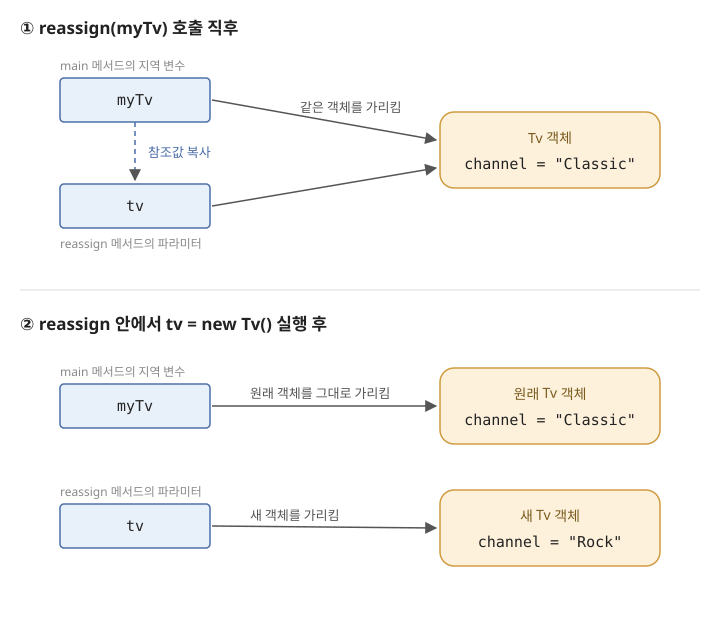
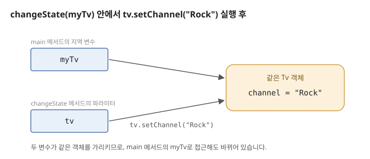

= Call by value vs Call by reference
정상혁
2026-08-23
:jbake-type: post
:jbake-status: published
:jbake-tags: java, javascript
:description: "primitive type은 call by value, 객체는 call by reference"라는 설명은 오해입니다. Java와 JavaScript는 객체를 전달할 때도 참조값의 복사본을 전달하는 call by value 방식만 씁니다. swap 예제와 그림으로 참조 재할당과 객체 상태 변경의 차이를 정리하고, 진짜 call by reference를 지원하는 언어와 비교합니다.
:toc:
:idprefix:

"primitive type은 call by value로, 객체는 call by reference로 전달된다"는 설명을 Java 개발자들 사이에서 종종 접합니다. 예전에 회사 소모임 세미나에서도 이 주제로 논의했던 적이 있습니다. 결론부터 말하면 Java에는 call by value만 있습니다. 객체를 전달할 때 복사되는 값이 '객체에 대한 참조값'일 뿐입니다. JavaScript도 같은 방식입니다. 이 글에서는 두 용어의 정의를 정리하고, Java와 JavaScript의 동작을 예제와 그림으로 설명합니다.

== 두 용어의 정의

*Call by value* (pass by value)는 인자로 넘긴 값의 복사본을 파라미터에 대입하는 방식입니다. 함수 안에서 파라미터에 다른 값을 대입해도 호출한 쪽의 변수는 영향을 받지 않습니다.

*Call by reference* (pass by reference)는 변수 자체를 전달하는 방식입니다. 파라미터는 호출한 쪽 변수의 별칭(alias)이 되므로, 함수 안에서 파라미터에 새 값을 대입하면 호출한 쪽의 변수도 함께 바뀝니다.

두 방식을 구분하는 기준은 한 문장으로 요약할 수 있습니다. *함수 안에서 파라미터에 새 값을 대입했을 때 호출한 쪽의 변수가 바뀌는가?* 바뀌면 call by reference, 바뀌지 않으면 call by value입니다. 파라미터가 가리키는 객체의 내부 상태를 바꾸는 일은 이 기준과는 다른 문제인데, 뒤에서 다루겠지만 바로 이 지점에서 오해가 생깁니다.

== Java의 인자 전달 방식

=== swap 메서드의 실행 결과

아래 코드의 출력을 예상해 보면 Java의 전달 방식을 확인할 수 있습니다.

[source,java]
----
public class ReferenceTest {
    public static void main(String[] args) {
        String x1 = "Hello";
        String y1 = "World";
        swap(x1, y1);
        System.out.println(x1);

        int x2 = 1;
        int y2 = 2;
        swap(x2, y2);
        System.out.println(x2);
    }

    static void swap(Object x, Object y) {
        Object temp = x;
        x = y;
        y = temp;
    }
}
----

출력은 `World`, ``2``가 아니라 ``Hello``와 ``1``입니다.footnote:[``swap(x2, y2)``에서는 파라미터가 `Object` 타입이라 int 값이 Integer 객체로 오토박싱되어 전달됩니다. 그래도 호출한 쪽의 변수가 바뀌지 않는다는 결과는 같습니다.] `swap` 메서드 안에서 파라미터 ``x``와 ``y``에 서로의 값을 대입해도, 호출한 쪽의 ``x1``, ``y1``, ``x2``, ``y2``는 바뀌지 않습니다. 앞에서 정리한 기준대로라면 Java는 primitive type이든 객체든 call by value로 동작합니다.

=== 파라미터 재할당이 호출자에게 보이지 않는 이유

객체를 전달하는 경우를 그림과 함께 들여다보겠습니다.

[source,java]
----
public class ReassignTest {
    public static void main(String[] args) {
        StringBuilder sb = new StringBuilder();
        sb.append("3333");

        work(sb);
        System.out.println(sb); // 3333
    }

    static void work(StringBuilder sb) {
        sb = new StringBuilder();
        sb.append("!11111");
    }
}
----

``work(sb)``를 호출하는 순간, main 메서드의 ``sb``에 담긴 참조값이 복사되어 work 메서드의 파라미터 ``sb``에 대입됩니다. 두 변수는 같은 객체를 가리키지만 서로 다른 변수입니다.

work 메서드 안에서 ``sb``에 새 객체를 대입하면 파라미터 ``sb``만 새 객체를 가리키게 되고, main 메서드의 ``sb``는 원래 객체를 그대로 가리킵니다. 그래서 출력은 ``3333``입니다.

=== 오해의 근원인 객체 상태 변경

그런데 파라미터를 재할당하지 않고 파라미터가 가리키는 객체의 내부 상태를 바꾸면, 그 변경은 호출한 쪽에서도 보입니다.

[source,java]
----
static void appendWork(StringBuilder sb) {
    sb.append("111");
}
----

main 메서드에서 ``"3333"``이 담긴 ``sb``로 ``appendWork(sb)``를 호출한 뒤 출력하면 ``3333111``이 나옵니다.

파라미터 재할당은 호출자에게 보이지 않는데 객체 상태 변경은 보이니, "객체는 call by reference로 전달된다"는 설명이 그럴듯하게 들립니다. 그러나 call by reference인지를 가르는 기준은 재할당이 보이는가입니다. 객체 상태 변경이 보이는 것은 두 변수가 같은 객체를 가리키고 있기 때문일 뿐, 전달 방식은 여전히 참조값의 복사, 즉 call by value입니다.

Head First Java에서는 객체 참조를 리모컨에 비유해서 설명합니다. 객체를 전달하면 TV(객체)가 복사되는 것이 아니라 그 TV를 조작할 수 있는 리모컨(참조값)이 복사됩니다. 복사된 리모컨으로 채널을 바꾸면(객체 상태 변경) 원래 리모컨을 가진 사람에게도 바뀐 채널이 보이지만, 복사된 리모컨을 다른 TV에 연결해도(재할당) 원래 리모컨은 여전히 처음의 TV를 조작합니다.

=== Java의 reference와 용어의 혼란

Java의 reference는 사실상 객체의 주소를 담는 포인터입니다. 아래의 Java 선언은

[source,java]
----
Dog d = new Dog();
d.setName("Fifi");
----

C++로는 이 코드에 해당합니다.

[source,cpp]
----
Dog *d = new Dog();
d->setName("Fifi");
----

Java의 ``d``는 객체 자체가 아니라 객체를 가리키는 값을 담고 있고, 메서드를 호출하면 이 값이 복사되어 전달됩니다.

'포인터'라는 표현은 비유가 아니라 스펙의 정의이기도 합니다. Java Language Specification의 https://docs.oracle.com/javase/specs/jls/se21/html/jls-4.html#jls-4.3.1[4.3.1. Objects] 절은 참조값을 객체에 대한 포인터라고 정의합니다.

____
The reference values (often just references) are pointers to these objects, and a special null reference, which refers to no object.
____

메서드 호출 시의 전달 방식은 https://docs.oracle.com/javase/specs/jls/se21/html/jls-8.html#jls-8.4.1[8.4.1. Formal Parameters] 절에 있습니다. 인자 표현식의 '값'이 새로 만들어진 파라미터 변수를 초기화한다고 설명할 뿐, 파라미터가 호출한 쪽 변수의 별칭이 된다는 언급은 없습니다.

____
When the method or constructor is invoked (§15.12), the values of the actual argument expressions initialize newly created parameter variables, each of the declared type, before execution of the body of the method or constructor.
____

Java를 만든 James Gosling도 _The Java Programming Language_ 책에서 이 오해를 직접 짚었습니다.

____
Some people will say incorrectly that objects are passed "by reference." ... The Java programming language does not pass objects by reference; it passes object references by value.
____

https://docs.oracle.com/javase/tutorial/java/javaOO/arguments.html[Oracle Java Tutorials]에서도 같은 내용을 설명합니다.

____
Reference data type parameters, such as objects, are also passed into methods by value. ... when the method returns, the passed-in reference still references the same object as before.
____

결국 혼란의 뿌리는 용어에 있습니다. Java에서 객체를 가리키는 값을 'reference'라고 부르는데, 이 단어가 'call by reference'의 reference와 겹치면서 오해가 생겼습니다. 정확한 문장은 이렇습니다. *Java는 객체에 대한 참조값을 call by value로 전달합니다.*

== JavaScript의 인자 전달 방식

JavaScript도 Java와 같은 방식으로 동작합니다. 먼저 swap 예제입니다.

[source,javascript]
----
function swap(x, y) {
  const temp = x;
  x = y;
  y = temp;
}

let x1 = "Hello";
let y1 = "World";
swap(x1, y1);
console.log(x1); // Hello
----

객체의 경우도 재할당과 상태 변경이 Java와 똑같이 갈립니다.

[source,javascript]
----
function reassign(dog) {
  dog = { name: "Rex" };
}

function rename(dog) {
  dog.name = "Rex";
}

const dog = { name: "Fifi" };

reassign(dog);
console.log(dog.name); // Fifi

rename(dog);
console.log(dog.name); // Rex
----

`reassign` 함수 안에서 파라미터 ``dog``에 새 객체를 대입해도 호출한 쪽의 ``dog``는 바뀌지 않습니다. 반면 `rename` 함수처럼 파라미터가 가리키는 객체의 프로퍼티를 바꾸면 호출한 쪽에서도 보입니다. 앞의 두 그림에서 StringBuilder 객체를 객체 리터럴로 바꾸면 JavaScript의 동작을 설명하는 그림이 됩니다.

=== JavaScript: The Definitive Guide의 call by reference 서술

JavaScript를 call by reference로 설명하는 자료도 있습니다. 오랫동안 JavaScript의 표준적인 책으로 꼽혀온 https://docstore.mik.ua/orelly/webprog/jscript/ch11_02.htm[JavaScript: The Definitive Guide의 예전 판]은 'By Value Versus by Reference' 장의 요약 표에서 객체가 by reference로 복사·전달·비교된다고 정리합니다. 이 책을 기준으로 삼는다면 JavaScript는 call by reference라고 설명해도 무난해 보입니다.

그런데 같은 장의 동작 설명을 읽어보면, 이 책이 말하는 by reference는 이 글의 앞부분에서 정의한 call by reference와는 다른 의미입니다. '객체 값 전체가 복사되는 대신 객체에 대한 참조가 전달된다'는 의미로 쓴 표현이고, 파라미터를 재할당해도 호출한 쪽에 보이지 않는다는 점은 이 책도 똑같이 설명합니다.

____
A function can use the reference to modify properties of the object or elements of the array. But if the function overwrites the reference with a reference to a new object or array, that modification is not visible outside of the function.
____

참조 자체는 값으로 전달된다("References themselves are passed by value")는 설명도 함께 나옵니다. 결국 관찰되는 동작에 대한 설명은 이 글과 같고, 무엇이 전달된다고 부를지에 대한 용어 선택이 다를 뿐입니다.

=== Call by sharing이라는 용어

이렇게 참조값을 값으로 복사해서 전달하는 방식을 *call by sharing*이라고 부르기도 합니다. Barbara Liskov가 CLU 언어를 설명하면서 쓴 용어입니다. Java, JavaScript, Python, Ruby가 모두 이 방식에 해당합니다.

Call by value라고 하면 '객체가 통째로 복사된다'는 오해를, call by reference라고 하면 '재할당도 호출한 쪽에 보인다'는 오해를 각각 부를 수 있습니다. 그래서 저는 JavaScript도 두 용어 중 하나를 고르기보다 call by sharing이라는 개념으로 설명하는 편이 더 명확하다고 생각합니다.

== Call by reference를 지원하는 언어

진짜 call by reference가 어떤 것인지는 C++의 참조 파라미터와 비교하면 분명해집니다.

[source,cpp]
----
void swap(int& x, int& y) {
    int temp = x;
    x = y;
    y = temp;
}

int a = 1;
int b = 2;
swap(a, b); // a == 2, b == 1
----

파라미터를 `int&` 타입으로 선언하면 ``x``는 호출한 쪽 변수 ``a``의 별칭이 됩니다. 함수 안의 대입이 호출한 쪽 변수를 실제로 바꿉니다. C#의 `ref`, `out` 키워드도 같은 성격의 기능입니다. Java와 JavaScript에는 이런 문법 자체가 없습니다.

== 정리

* Java와 JavaScript에는 call by value만 있습니다. Primitive type과 객체의 전달 방식이 다르지 않습니다.
* 객체를 전달하면 객체가 복사되는 것도, 변수 자체가 전달되는 것도 아닙니다. 객체를 가리키는 참조값이 복사됩니다.
* 함수 안에서 파라미터를 재할당해도 호출한 쪽의 변수는 바뀌지 않습니다. 반면 파라미터가 가리키는 객체의 내부 상태를 바꾸면 호출한 쪽에서도 보입니다. 이 차이가 "객체는 call by reference"라는 오해의 근원입니다.
* 이 방식을 call by sharing이라고 부르기도 합니다. 같은 동작을 두고 자료에 따라 call by value로도, call by reference로도 서술하므로, 용어보다는 '파라미터 재할당이 호출한 쪽에 보이는가'라는 동작을 기준으로 이해하는 것이 안전합니다.

== 참고 자료

* https://docs.oracle.com/javase/tutorial/java/javaOO/arguments.html[Oracle Java Tutorials - Passing Information to a Method or a Constructor]
* https://docs.oracle.com/javase/specs/jls/se21/html/jls-8.html#jls-8.4.1[Java Language Specification - 8.4.1. Formal Parameters]
* https://docstore.mik.ua/orelly/webprog/jscript/ch11_02.htm[JavaScript: The Definitive Guide - By Value Versus by Reference]
* http://milooy.github.io/TIL/JavaScript/call-by-sharing.html[Call by sharing (milooy TIL)]
* https://velog.io/@aiden/call-by-value-vs-call-by-reference-feat.-call-by-sharing[call by value vs call by reference (feat. call by sharing)]
* https://en.wikipedia.org/wiki/Evaluation_strategy[Evaluation strategy (Wikipedia)]
* Ken Arnold, James Gosling, David Holmes, _The Java Programming Language_
* Kathy Sierra, Bert Bates, _Head First Java_ 4장
