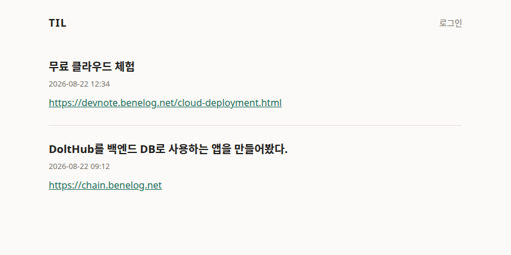
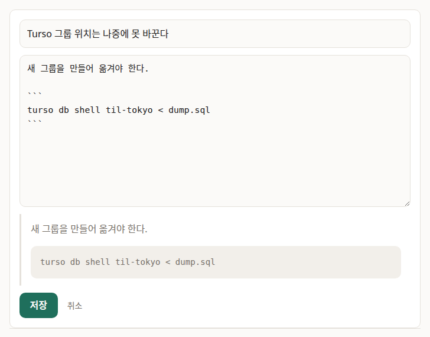

= Cloud Run과 Turso로 개인 앱 배포하기
정상혁
2026-08-22
:jbake-type: post
:jbake-status: published
:jbake-tags: go, cloud, 자작도구, htmx
:description: Go와 htmx로 만든 TIL 기록장을 애플리케이션 서버는 Google Cloud Run에, DB는 Turso로 배포한 과정입니다.
:toc:
:sectnums:
:toclevels: 1
:source-repo: https://github.com/benelog/til
:jbake-og: {"image": "img/til/til-list.png"}
:idprefix:

혼자 작성할 TIL(Today I Learned) 기록장을 만들어 link:https://til.benelog.net[til.benelog.net]에 올렸습니다.
이 과정에서 애플리케이션 서버와 DB를 어떤 인프라 위에서 실행할지를 두고 여러 기술을 검토했습니다.
무료로 운영할 수 있어야 한다는 점을 가장 중요시했습니다.
여기서 무료 운영은 상시 프로세스를 띄운다는 뜻이 아니라, 개인 앱의 실제 사용량에서 월 청구액이 0원이고 URL이 주기적으로 만료되지 않는다는 뜻입니다.
한국에서 접속할 때 충분히 빨라야 했습니다.
또한 로컬 개발 환경과 운영 환경에서 최대한 같은 코드 경로를 사용해, 배포하기 전에 로컬에서 많은 동작을 검증할 수 있어야 한다는 조건도 두었습니다.

처음에는 카드 등록까지 피하려 했지만 이 조건을 모두 만족하는 배포처는 찾지 못했습니다.
그래서 카드가 등록된 결제 계정은 연결하되 각 서비스의 무료 한도 안에서 쓰는 것으로 기준을 낮췄고, Google Cloud Run과 Turso를 조합했습니다.
도메인은 처음에 Netlify 프록시로 붙였다가, 응답 시간을 측정한 뒤 Cloud Run의 직접 커스텀 도메인 매핑으로 옮겼습니다.

애플리케이션 서버의 소스는 link:https://github.com/benelog/til[benelog/til]에 있습니다.
요금과 무료 한도, 지원 리전은 2026년 8월 22일에 확인한 값입니다. 바뀔 수 있으므로 실제로 배포할 때는 글 끝의 공식 문서를 다시 확인해야 합니다.

== Cloud Run과 Turso를 고른 이유

애플리케이션 서버는 Cloud Run에 배포합니다.
요청 기반 과금의 무료 한도는 Tier 1 단가 기준으로 월 2M 요청, 360,000 GiB-초, 180,000 vCPU-초입니다.
최소 인스턴스를 지정하지 않아 요청이 없을 때는 0개로 축소되고, 이 앱의 실제 트래픽은 무료 한도 근처에도 가지 않았습니다.
이 글을 쓸 때 확인한 월 청구액은 0원이었습니다.

무료 한도는 서비스나 프로젝트마다 새로 생기는 것이 아니라 **결제 계정에 연결된 모든 프로젝트가 합산해서** 씁니다.
또한 Cloud Run 서비스 사용량 외에도 함께 청구되는 항목이 있고, 설정에 따라 과금 방식 자체가 달라집니다.
트래픽이 작다는 이유만으로 비용이 언제나 0원이라고 보장되지는 않습니다.
어떤 조건에서 금액이 붙는지는 뒤의 "Cloud Run 요금이 0원을 넘어가는 조건" 섹션에 정리했습니다.

서울 리전(``asia-northeast3``)을 쓸 수 있다는 점도 고른 이유였습니다.
최종 운영 리전은 도쿄(``asia-northeast1``)입니다. 서울과 도쿄의 응답 시간 차이보다 도메인 연결 방식의 차이가 컸기 때문인데, 근거는 뒤의 "응답 시간을 좌우한 리전과 프록시" 섹션에 있습니다.
다만 무료 한도만 써도 **신용 카드가 등록된 결제 계정 연결이 필수**입니다.
카드 등록이 없는 배포처를 먼저 시도하고 접은 과정은 뒤의 "선택하지 않은 배포처" 섹션에 정리했습니다.

데이터 저장소는 Turso(libSQL)입니다.
Cloud Run 컨테이너의 쓰기 가능한 파일 시스템은 인스턴스와 함께 사라집니다.
로컬 SQLite 파일을 그 안에 두면 인스턴스가 종료될 때 데이터가 없어지고, 여러 인스턴스가 뜨면 서로 다른 파일을 보게 됩니다.
따라서 영속 데이터를 컨테이너 밖에 두어야 했습니다.

Turso는 SQLite와 호환되는 원격 저장소이고, 무료 한도가 SQLite 파일 하나 분량의 데이터를 다루는 개인 앱에는 충분합니다.
드라이버(`libsql-client-go`)가 순수 Go라서 Go로 만든 앱을 CGO 없이 빌드하는 구성이 그대로 유지됩니다.
앱은 환경변수에 Turso URL이 있으면 libSQL 드라이버를, 없으면 로컬 SQLite 드라이버를 고릅니다.
드라이버와 접속 문자열만 달라지고, `database/sql`로 질의하는 저장소 코드는 두 환경에서 같습니다.

도메인은 Cloud Run의 커스텀 도메인 매핑으로 직접 붙였습니다.
처음에는 서울 서비스 앞에 기존 Netlify 사이트를 프록시로 두었습니다. Cloud Run의 직접 매핑이 서울 리전을 지원하지 않기 때문입니다.
측정해 보니 이 프록시가 응답 시간의 상당 부분을 차지해서, 직접 매핑을 지원하는 도쿄로 서비스를 옮기고 프록시를 걷어냈습니다.
그 과정과 측정값은 뒤의 "응답 시간을 좌우한 리전과 프록시" 섹션에서 다룹니다.
``benelog.net``의 DNS zone은 여전히 Netlify가 관리합니다.

== 앱 구성과 배포 설정 절차

앱은 Go 표준 ``net/http``와 htmx로 만들었습니다.
웹 프레임워크는 쓰지 않았고, 화면 갱신은 htmx가 HTML 조각을 갈아 끼우는 방식입니다.
의존성이 전부 순수 Go라 CGO 없이 정적 바이너리로 빌드되고, Docker 이미지의 크기는 28MB입니다.
목록과 각 기록을 읽는 요청은 공개하고, 작성·수정·삭제 요청은 단일 비밀번호로 로그인한 세션만 허용합니다.
따라서 뒤에서 쓰는 ``--allow-unauthenticated``는 Cloud Run의 IAM 인증을 요구하지 않는다는 뜻이지, 쓰기 기능까지 인증 없이 공개한다는 뜻은 아닙니다.

배포를 위한 설정 과정은 다음 순서로 따라할 수 있습니다.
Turso와 Google Cloud 가입, link:https://docs.turso.tech/cli/installation[turso CLI]와 link:https://cloud.google.com/sdk/docs/install[gcloud CLI] 설치, 각 CLI의 로그인은 마쳤다고 전제합니다.

. Turso에서 도쿄 리전 그룹과 데이터베이스를 만들고 URL과 토큰을 확인합니다. Turso가 제공하는 리전에 서울은 없어서, 가장 가까운 도쿄를 골랐습니다.
+
[source,bash]
----
turso group create tokyo --location aws-ap-northeast-1
turso db create til --group tokyo
turso db show til --url
turso db tokens create til
----
. 사용할 GCP 프로젝트를 선택하고 결제 계정을 연결한 뒤 API 세 개를 켭니다. 결제 계정 연결은 무료 한도만 쓸 때도 필요합니다.
+
[source,bash]
----
gcloud config set project <project>
gcloud billing projects link <project> --billing-account=<ACCOUNT_ID>
gcloud services enable run.googleapis.com cloudbuild.googleapis.com artifactregistry.googleapis.com
----
. 기본 컴퓨트 서비스 계정에 빌드 권한을 부여합니다. 이 단계를 건너뛰면 첫 배포가 실패합니다.
+
[source,bash]
----
gcloud projects add-iam-policy-binding <project> \
  --member=serviceAccount:<projectNumber>-compute@developer.gserviceaccount.com \
  --role=roles/cloudbuild.builds.builder
----
. 저장소 루트에서 환경변수 파일을 만들고 배포합니다. ``--source .``가 Cloud Build로 Dockerfile을 빌드합니다.
+
[source,yaml]
./tmp/run-env.yaml
----
TURSO_DATABASE_URL: "libsql://<database-host>"
TURSO_AUTH_TOKEN: "<turso-db-token>"
TIL_PASSWORD: "<write-password>"
TZ: "Asia/Seoul"
----
+
이 파일에는 DB 쓰기 권한이 있는 토큰과 로그인 비밀번호가 평문으로 들어갑니다.
저장소 안에 만들거나 커밋하지 않고, 파일 권한을 제한한 임시 경로에 둡니다.
+
[source,bash]
----
gcloud run deploy til-tokyo --source . --region asia-northeast1 \
  --allow-unauthenticated --env-vars-file /tmp/run-env.yaml
----
. Google Search Console에서 ``benelog.net``의 소유권을 도메인 방식으로 확인합니다. Cloud Run은 검증된 도메인에만 매핑을 만들 수 있습니다.
. 서비스에 커스텀 도메인을 매핑합니다. 이 기능은 도쿄처럼 지원하는 리전에서만 쓸 수 있습니다.
+
[source,bash]
----
gcloud beta run domain-mappings create \
  --domain=til.benelog.net --service=til-tokyo \
  --region=asia-northeast1 --project=<project>
----
. 매핑이 안내한 레코드를 DNS에 넣습니다. 저는 ``benelog.net`` zone을 Netlify에서 관리하고 있어서 Netlify의 DNS 화면에서 추가했습니다.
+
[source]
----
til  CNAME  ghs.googlehosted.com.
----
+
CNAME은 같은 이름의 다른 레코드와 공존할 수 없습니다. 그 이름에 이미 다른 레코드가 있으면 먼저 지워야 합니다.
관리형 인증서는 DNS가 ``ghs.googlehosted.com.``을 가리킨 뒤에야 발급되기 시작합니다. 그 사이에 그 호스트로 접속하면 TLS 오류가 납니다.

환경변수를 파일로 넘기면 토큰 값 자체는 셸 명령 이력에 남지 않습니다.
Cloud Run 서비스 설정에는 환경변수가 저장되므로 접근 권한이 있는 사용자는 값을 볼 수 있습니다.
더 엄격하게 관리해야 하는 서비스라면 Secret Manager를 연결해야 합니다.
한 번 넣은 값은 다음 리비전에도 이어지므로, 값을 바꾸지 않는 다음 배포부터는 ``--env-vars-file``을 생략할 수 있습니다.

== Cloud Run 배포의 빌드 권한과 /healthz 문제

앞의 절차대로 하면 매끄럽게 지나가지만, 처음 배포할 때는 두 가지 문제를 만났습니다.

=== 기본 서비스 계정의 빌드 권한 부족

``gcloud run deploy --source .``의 첫 실행이 실패했습니다.

[source]
----
ERROR: (gcloud.run.deploy) PERMISSION_DENIED: Build failed because the default
service account is missing required IAM permissions.
... IAM permission denied for service account
788537242173-compute@developer.gserviceaccount.com
----

Google이 기본 컴퓨트 서비스 계정의 빌드 권한을 축소한 뒤 새 프로젝트에서 나타나는 증상입니다.
``roles/cloudbuild.builds.builder``를 한 번 부여하면 해결됩니다.
앞의 배포 설정 절차 3단계가 이것입니다.

=== Google Frontend가 가로채는 /healthz 경로

배포 후 Cloud Run이 발급한 ``run.app`` 주소에서 헬스 체크 경로를 확인하니 앱이 아니라 Google의 404 페이지가 돌아왔습니다.
앱은 정상이어서 ``/``도 기록 목록도 잘 나오는데 ``/healthz``만 그랬습니다.
경로를 바꿔 가며 확인한 결과입니다.

[cols="1,1,2", options="header"]
|===
|경로 |응답 |누가 응답했나

|`/healthz`
|404
|Google의 404 HTML. 컨테이너까지 도달하지 않습니다.

|`/healthz/`
|404
|`404 page not found`. Go의 ``ServeMux``가 응답했습니다.

|`/health`, `/readyz`
|404
|`404 page not found`. 역시 앱까지 도달합니다.

|`/entries/2`
|200
|앱이 정상 응답합니다.
|===

이 서비스에서 확인한 경로 중에는 **정확히 `/healthz` 하나만** 앞단에서 가로챘습니다.
슬래시를 붙인 ``/healthz/``는 그대로 통과하므로, 앱의 라우팅 문제가 아닙니다.

``/healthz``는 Cloud Run이 요구한 경로가 아니라, 제가 관례를 따라 앱에 정한 경로입니다.
이 관례는 Google 내부의 z-pages(``/healthz``, ``/varz``, ``/statusz``)에서 나왔습니다.
실제 애플리케이션 경로와 충돌하지 않도록 z를 붙인 이름인데, Kubernetes의 liveness probe 예제와 여러 헬스 체크 라이브러리를 거치며 업계 표준처럼 퍼졌습니다.
Cloud Run의 공식 "Known issues"에도 ``/eventlog``, ``/_ah/``로 시작하는 경로와 일부 ``z``로 끝나는 경로를 쓸 수 없다고 나옵니다.
즉, ``/healthz`` 하나만의 특수 규칙으로 일반화하기보다 Cloud Run에서는 ``z``로 끝나는 진단 경로를 피하는 편이 안전합니다.
기본 헬스 경로가 ``/healthz``인 Streamlit도 GCP에서 같은 문제를 겪고 경로를 바꾸는 옵션을 추가했습니다.

Cloud Run 자체가 이 경로를 요구하지는 않습니다.
다만 외부 모니터나 Cloud Run의 HTTP startup/liveness probe가 ``/healthz``를 호출하도록 설정돼 있다면 컨테이너가 정상이어도 계속 404로 판단합니다.
그래서 같은 핸들러를 ``/health``에도 등록했습니다.

[source,go]
.main.go
----
// Cloud Run 앞단의 Google Frontend 가 정확히 /healthz 경로를 가로채 자체 404 를
// 돌려주므로(다른 경로는 그대로 통과) 헬스 경로를 /health 로도 열어둔다.
health := func(w http.ResponseWriter, r *http.Request) {
	w.Write([]byte("ok"))
}
mux.HandleFunc("GET /healthz", health)
mux.HandleFunc("GET /health", health)
----

== Cloud Run 요금이 0원을 넘어가는 조건

이 앱은 청구액이 0원이지만, 그것은 트래픽이 적어서만이 아니라 기본 설정을 그대로 뒀기 때문이기도 합니다.
Cloud Run에서 금액이 붙기 시작하는 조건을 나눠서 정리합니다.

=== 무료 한도가 적용되는 방식

무료 한도는 프로젝트가 아니라 **결제 계정 단위로 합산**되고 매월 초기화됩니다.
요청 기반 과금(request-based billing)의 무료 한도는 CPU 180,000 vCPU-초, 메모리 360,000 GiB-초, 요청 2,000,000건입니다.

여기서 놓치기 쉬운 조건이 두 가지 있습니다.

첫째, 무료 한도는 사용량을 빼 주는 것이 아니라 **Tier 1 단가에 해당하는 금액을 할인**하는 방식입니다.
Tier 2 리전에서 같은 양을 쓰면 단가가 더 비싸므로 할인으로 덮이는 사용량이 그만큼 줄어듭니다.
서울(``asia-northeast3``)은 Tier 2, 도쿄(``asia-northeast1``)는 Tier 1입니다.
응답 시간 때문에 도쿄로 옮긴 것이지만, 결과적으로 무료 한도를 온전히 쓰는 리전이 되기도 했습니다.

둘째, 과금 시간은 **100밀리초 단위로 올림**됩니다.
요청 기반 과금에서는 요청을 처리하는 동안(billable instance time)에만 CPU와 메모리가 계산되고, 컨테이너에 도달하지 못한 요청은 과금되지 않습니다.
IAM 정책에서 거부된 요청도 마찬가지입니다.

=== 설정 하나로 과금 방식이 바뀌는 항목

[cols="1,2,2", options="header"]
|===
|설정 |기본값에서 달라지는 것 |이 앱의 선택

|최소 인스턴스
|1개 이상으로 올리면 요청이 없는 동안에도 idle 단가로 과금됩니다. 최소 인스턴스가 아닌 유휴 인스턴스는 과금되지 않습니다.
|지정하지 않았습니다. 대신 첫 요청에 콜드 스타트가 포함됩니다.

|인스턴스 기반 과금
|opt-in하면 요청 처리 여부와 무관하게 인스턴스가 살아 있는 **전체 수명** 동안, 최소 1분 단위로 과금됩니다. 무료 한도도 CPU 240,000 vCPU-초 / 메모리 450,000 GiB-초로 달라지고 요청 수 무료 한도는 없습니다.
|기본값인 요청 기반 과금을 씁니다.

|동시 실행 수
|낮추면 같은 요청 수를 처리하는 데 인스턴스가 더 많이 필요하고, 그만큼 인스턴스 시간이 늘어납니다.
|기본값을 씁니다.

|CPU·메모리 크기
|vCPU-초와 GiB-초 단가에 그대로 곱해집니다. 무료 한도에 닿는 속도도 같은 배수로 빨라집니다.
|기본값을 씁니다.
|===

=== Cloud Run 청구서 밖에서 늘어나는 항목

``gcloud run deploy --source .`` 한 줄로 배포해도 Cloud Run 외의 서비스가 함께 쓰이고, 각각 별도의 요금 체계를 가집니다.

[cols="1,2,2", options="header"]
|===
|항목 |무료 한도 |이 앱의 사용량

|Cloud Build
|결제 계정당 월 2,500 build-분(기본 풀의 ``e2-standard-2`` 기준. promotional이라 바뀔 수 있음)
|배포할 때만 실행되고 한 번에 몇 분입니다.

|Artifact Registry
|결제 계정당 0.5 GiB-월. 초과분은 GiB-시간당 $0.000136986
|``cloud-run-source-deploy`` 저장소가 18.9MB입니다. 리비전을 배포할 때마다 이미지가 쌓입니다.

|Cloud Storage
|소스 배포는 ``run-sources-<프로젝트>-<리전>`` 버킷에 소스 압축본을 보관합니다. 리전 버킷이라 아시아 리전에는 상시 무료 한도가 없습니다.
|배포마다 수십 KB 수준입니다.

|Cloud Logging
|프로젝트당 월 50 GiB. 초과분은 GiB당 $0.50
|요청 로그만 남습니다.

|외부 데이터 전송
|Cloud Run 문서 기준으로 **북미 안에서만 월 1GiB**
|도쿄에서 나가는 전송에는 무료 한도가 없습니다.
|===

이 중 Cloud Storage와 외부 데이터 전송에는 이 구성에서 쓸 수 있는 상시 무료 한도가 없습니다.
개인 앱의 사용량에서는 반올림돼 0원으로 남지만, "무료 한도 안에서 쓰고 있다"고 말할 수 있는 항목은 아닙니다.

또 하나 주의할 점은 이 무료 한도들이 대부분 **결제 계정 단위**라는 것입니다.
같은 결제 계정에 다른 프로젝트를 붙여 쓰고 있다면 그쪽 사용량이 이 앱의 무료 한도를 함께 소모합니다.
그래서 금액이 0원이더라도 예산 알림은 걸어 두는 편이 안전합니다.
현재 상태는 Google Cloud 콘솔의 **결제 → 보고서**에서 서비스별로 확인할 수 있고, **결제 → 예산 및 알림**에서 임계값을 설정합니다.

== 응답 시간을 좌우한 리전과 프록시

Cloud Run에서 배포할 리전을 서울로 골라도 데이터베이스와 프록시의 위치가 멀어지면 그 이득이 사라집니다.
두 구간을 실제 측정한 결과를 정리합니다.
아래 값은 정밀한 벤치마크의 백분위가 아니라, 한국의 같은 클라이언트에서 조건을 바꾸어 반복 호출했을 때 관찰한 범위입니다.
Cloud Run의 콜드 스타트, 인터넷 경로 변화, 연결 재사용을 모두 분리하지는 않았으므로 절대값보다 전후 차이의 방향을 보는 용도입니다.

=== 오하이오에서 도쿄로 옮긴 Turso 리전

처음에는 데이터베이스를 `aws-us-east-2`(오하이오)에 두고 있었습니다.
앱을 서울 리전에 올려도 이 상태면 요청마다 태평양을 건너게 됩니다.
이 앱은 페이지 한 장을 그릴 때 질의를 한 번 보냅니다.
그룹 위치 외의 조건을 그대로 두고 응답 시간이 크게 달라졌으므로 원격 데이터베이스까지의 왕복 경로가 주요 요인이라고 추정했습니다.
서버 내부 구간별 시간을 따로 기록하지는 않았으므로 데이터베이스가 차지한 비율까지 계산할 수는 없습니다.

그룹을 도쿄로 옮기고 같은 조건에서 다시 측정했습니다.
관찰한 범위에서는 응답 시간이 5배 이상 차이가 났습니다.
이렇듯 애플리케이션 리전과 데이터베이스의 리전을 가까운 곳으로 지정하는 이득이 큽니다.

[cols="2,1", options="header"]
|===
|Turso 그룹 위치 |한국에서 `GET /`

|`aws-us-east-2` (오하이오)
|197 ~ 220ms

|`aws-ap-northeast-1` (도쿄)
|38 ~ 45ms
|===

[NOTE]
====
Turso 그룹의 primary 위치는 나중에 바꿀 수 없어서, 다른 위치의 그룹으로 데이터를 옮겨야 합니다.
공식 문서상 무료(starter) 요금제는 그룹이 하나로 제한되고, 그룹을 둘 이상 만드는 기능은 유료 요금제 대상입니다.
따라서 기존 그룹과 새 그룹을 동시에 두는 이전 절차가 무료 계정에서 항상 가능하다고 가정해서는 안 됩니다.

제가 옮길 때는 사용량 표시가 ``groups 0/1``이었는데도 두 번째 그룹이 생성됐습니다.
이 동작은 제한 적용 지연이나 계정 상태에 따른 예외일 수 있고 재현을 보장할 수 없습니다.
데이터를 보존한 채 확실하게 옮겨야 한다면 두 그룹을 동시에 쓸 수 있는 요금제로 잠시 올리거나 Turso 지원 채널에 이전 방법을 먼저 확인하는 편이 안전합니다.
기존 데이터베이스는 새 데이터베이스의 행 수와 주요 데이터를 검증하기 전에는 삭제하지 않습니다.

옮기는 과정에서 확인된 사실을 적어 둡니다.

* ``turso db create <새 이름> --group <새 그룹> --from-db <기존 DB>``는 그룹이 다르면 ``record not found``로 실패합니다.
* ``--from-dump``는 데이터베이스만 만들어지고 덤프가 적재되지 않은 채 종료된 경우가 있었습니다. 데이터베이스가 생성됐다는 사실만 믿지 않고 ``select count(*) from entries``처럼 테이블별 행 수를 확인해야 합니다.
* 이 이전에서는 ``turso db shell <새 DB> < dump.sql``로 직접 넣는 방법이 성공했습니다. ``sqlite_sequence``와 인덱스도 함께 들어갔습니다.
* 새 데이터베이스에는 토큰을 새로 발급해야 합니다.
====

=== Netlify 프록시와 Cloud Run 직접 도메인 매핑

Cloud Run 서비스는 서울에 있지만 Cloud Run의 직접 커스텀 도메인 매핑은 ``asia-northeast3``을 지원하지 않습니다.
Google이 권장하는 대안은 외부 Application Load Balancer이고 Firebase Hosting도 선택할 수 있지만, 둘 다 별도의 구성과 비용 조건을 검토해야 합니다.
이미 benelog.net의 DNS와 TLS 인증서를 Netlify에서 관리하고 있었기 때문에, til.benelog.net도 Netlify에 두고 모든 요청을 백엔드로 넘기는 rewrite 한 줄로 붙였습니다.

[source]
.proxy/_redirects
----
/*  https://til-788537242173.asia-northeast3.run.app/:splat  200
----

상태 코드 ``200``은 리다이렉트가 아니라 rewrite라서 주소창은 til.benelog.net으로 유지됩니다.
DNS와 TLS 인증서는 Netlify가 관리하므로 백엔드를 어디로 옮겨도 이 한 줄만 고치면 됩니다.

이 프록시가 더하는 시간을 직접 확인하려고 커스텀 도메인 매핑을 지원하는 도쿄(``asia-northeast1``)에 같은 이미지와 환경변수로 ``til-tokyo`` 서비스를 만들었습니다.
Google Search Console에서 benelog.net 소유권을 확인하고 ``til-tokyo.benelog.net``의 CNAME을 ``ghs.googlehosted.com.``으로 지정했습니다.
Cloud Run 관리형 인증서는 도메인 매핑을 만든 뒤 약 57분 만에 준비됐습니다.
인증서 SAN에 ``til-tokyo.benelog.net``이 포함됐고, ``/``와 ``/health``는 모두 200으로 응답했습니다.
앞에서 설명한 ``/healthz``는 커스텀 도메인에서도 Google Frontend의 404를 반환했습니다.

2026년 8월 22일 19시 42분(KST), 아직 운영 경로가 Netlify 프록시이던 시점에 한국의 같은 머신에서 네 주소를 측정했습니다.
각 주소를 한 번 워밍업한 뒤 20회씩 호출했고, 한 주소를 몰아서 재지 않고 매 반복마다 선두 주소를 바꿨습니다.
요청마다 새 ``curl`` 프로세스를 사용했으므로 TCP와 TLS 연결도 매번 새로 맺었습니다.
모든 요청의 상태 코드는 200이었습니다.
DNS·TCP·TLS·TTFB는 요청을 시작한 시점부터 해당 단계까지 걸린 누적 시간이고, p95는 20개 중 19번째 값입니다.

[cols="2,1,1,1,1,1,2", options="header"]
|===
|경로 |DNS 중앙값 |TCP 중앙값 |TLS 중앙값 |TTFB 중앙값 |전체 중앙값 |전체 최소 / p95 / 최대

|서울 ``run.app`` 직접 호출
|1.7ms
|6.1ms
|48.6ms
|99.1ms
|99.7ms
|94.7 / 108.3 / 123.6ms

|도쿄 ``run.app`` 직접 호출
|1.8ms
|6.0ms
|47.7ms
|97.8ms
|98.8ms
|93.1 / 104.2 / 114.7ms

|``til-tokyo.benelog.net`` +
(도쿄 서비스 + 도메인 매핑, CNAME → ``ghs.googlehosted.com.``)
|1.5ms
|62.9ms
|148.4ms
|281.9ms
|284.1ms
|265.2 / 323.0 / 339.0ms

|``til.benelog.net`` +
(당시 운영 경로. 서울 서비스 + Netlify 프록시)
|1.3ms
|71.7ms
|153.9ms
|347.0ms
|347.1ms
|335.1 / 403.1 / 413.9ms
|===

서울과 도쿄 ``run.app``의 전체 중앙값 차이는 0.9ms이고 두 표본의 변동 폭보다 작습니다.
이 결과로 어느 리전이 더 빠르다고 단정할 수 없습니다.
도메인 매핑을 쓴 ``til-tokyo.benelog.net``은 같은 도쿄 서비스의 ``run.app``보다 전체 중앙값이 185.3ms 길었습니다.
Cloud Run의 커스텀 도메인 진입 경로가 더한 비용을 같은 원본 서비스끼리 비교한 값입니다.

도메인 매핑 경로는 Netlify 프록시 경로보다 63.0ms 빨랐지만 ``run.app`` 수준으로 짧아지지는 않았습니다.
Netlify 경유 주소의 TCP 완료가 서울 ``run.app``보다 약 66ms 늦고, 원본 서버의 응답을 다시 전달받는 구간까지 TTFB에 포함됩니다.
이 값만으로 Netlify 접속 지점의 물리적 위치를 확정할 수는 없습니다.

앞의 Turso 리전 실험과 이 프록시 실험은 기초 응답 시간이 서로 다릅니다.
따라서 두 실험에서 구한 차이를 직접 더해 서로 상쇄됐다고 표현할 수는 없습니다.
다만 두 실험 모두 앱과 DB를 가까이 두는 것만큼 사용자가 접속하는 프록시 경로도 중요하다는 방향은 일치합니다.

커스텀 도메인을 직접 붙일 수 없는 배포처를 쓸 때는 유용한 방법이지만, 지연이 중요하면 배포처가 해당 리전에서 제공하는 도메인 연결 방법을 먼저 확인하는 편이 낫습니다.
Cloud Run 직접 도메인 매핑은 Preview 기능이고 Google도 프로덕션 사용을 권장하지 않습니다.
운영 도메인을 옮기려면 새 매핑의 인증서가 발급되는 동안 TLS 오류가 날 수 있다는 점도 고려해야 합니다.

=== 운영 도메인 전환 절차와 중단 시간

측정 결과를 바탕으로 도쿄 Cloud Run과 직접 도메인 매핑으로 운영 경로를 옮겼습니다.
서울과 도쿄의 직접 응답은 사실상 같았지만, 직접 매핑은 Netlify 경로보다 63ms 짧았습니다.
개인 앱에서 지연을 줄이는 쪽을 우선해 Preview 제약을 감수한 선택입니다.

전환에서 가장 신경 쓴 부분은 중단 시간입니다.
관리형 인증서는 그 호스트의 DNS가 ``ghs.googlehosted.com.``을 가리킨 뒤에 발급되기 시작합니다.
같은 이름의 인증서를 미리 만들어 둘 방법이 없으므로, DNS를 바꾼 시점부터 인증서가 준비될 때까지는 그 주소로 접속한 사용자가 TLS 오류를 봅니다.
그래서 순서를 이렇게 잡았습니다.

. 도쿄 서비스와 기존 운영 주소가 모두 정상인지 먼저 확인합니다.
. Netlify DNS에서 ``til.benelog.net``과 이름이 정확히 같은 레코드의 Type/Name/Value/TTL을 기록합니다. 이 값이 롤백 원본입니다.
. **DNS를 바꾸기 전에** Cloud Run 매핑을 먼저 만듭니다.
. 기존 레코드를 지우고 곧바로 ``til`` CNAME 하나를 추가합니다.
. 매핑 상태와 HTTPS를 함께 관찰합니다.

실제로 걸린 시간은 다음과 같습니다.

[cols="1,3", options="header"]
|===
|시각 (KST) |내용

|19:57:31
|Cloud Run에 ``til.benelog.net`` → ``til-tokyo`` 매핑 생성. 이 시점에는 DNS가 아직 Netlify를 가리켜 ``CertificatePending``입니다.

|20:02:30
|Netlify DNS에서 ``til.benelog.net``의 ``NETLIFY``, ``NETLIFYv6`` 레코드 삭제

|20:06:57
|``til`` CNAME ``ghs.googlehosted.com.`` 추가. 권한 네임서버와 8.8.8.8에서 즉시 새 값이 조회됐습니다.

|20:14:45 이전
|매핑이 ``Ready=True``, ``CertificateProvisioned=True``로 전환

|20:22:59
|``https://til.benelog.net/``이 처음으로 200 응답
|===

레코드를 지운 20:02:30부터 HTTPS가 정상화된 20:22:59까지 약 20분 30초 동안 이 주소는 정상 동작하지 않았습니다.
그중 약 4분 30초는 레코드를 지운 뒤 CNAME을 추가하기 전까지 이름 자체가 응답하지 않은 구간이고, 나머지는 TLS 오류 구간입니다.
기존 레코드의 TTL이 120초였으므로 삭제 직후 잠시 옛 주소로 접속한 사용자도 있었을 수 있습니다.

인증서 자체는 CNAME을 넣은 지 8분 이내에 준비됐습니다.
앞서 테스트 호스트 ``til-tokyo.benelog.net``에서는 같은 단계에 약 57분이 걸렸으므로, 이 시간은 호스트마다 다르다고 봐야 합니다.
Google 안내상 최대 24시간이 걸릴 수 있습니다.
``CertificateProvisioned=True``가 된 뒤에도 8분 정도 TLS 오류가 이어졌습니다.
매핑 상태가 준비됐다는 것과 Google Frontend가 그 인증서를 실제로 제공하기 시작하는 것은 별개의 시점입니다.

전환 뒤 발급된 인증서는 subject가 ``CN = til.benelog.net``, issuer가 ``Google Trust Services, CN = WR3``이고 유효 기간은 2026년 8월 22일부터 11월 20일까지입니다.
SAN에는 ``til.benelog.net`` 하나만 들어 있습니다.

전환 직후 같은 방식으로 다시 측정한 값입니다.

[cols="2,1,1,1,1,1,2", options="header"]
|===
|경로 |DNS 중앙값 |TCP 중앙값 |TLS 중앙값 |TTFB 중앙값 |전체 중앙값 |전체 최소 / p95 / 최대

|도쿄 ``run.app`` 직접 호출
|1.3ms
|5.7ms
|46.7ms
|97.9ms
|98.5ms
|92.4 / 104.6 / 141.8ms

|``til.benelog.net`` +
(전환 후 운영 경로. 도쿄 서비스 + 도메인 매핑, CNAME → ``ghs.googlehosted.com.``)
|1.3ms
|54.2ms
|116.0ms
|223.2ms
|224.2ms
|210.4 / 240.8 / 255.3ms
|===

전환 전 Netlify 프록시 경로의 347.1ms와 비교하면 전체 중앙값이 122.9ms 짧아졌습니다.
다만 이 값은 전환 약 20분 뒤에 잰 것이라 앞의 측정과 시간대가 다릅니다.
같은 시점에 잰 ``run.app``이 98.5ms이므로, 커스텀 도메인 진입 경로가 더하는 비용은 여전히 125.7ms입니다.

서울 서비스 ``til``, Netlify 사이트의 ``proxy/_redirects``, 기존 DNS 레코드의 값은 지우지 않고 롤백 경로로 남겼습니다.
DNS를 원래 레코드로 되돌리면 프록시 경로가 그대로 다시 동작합니다.

== 선택하지 않은 배포처

Cloud Run으로 정하기 전에 처음 세운 조건은 "카드 등록 없이 상시 가동"이었습니다.
여기서 상시 가동은 프로세스가 항상 메모리에 떠 있다는 뜻이 아니라, 사용자가 요청하면 같은 URL로 다시 접근할 수 있다는 뜻입니다.
다만 유휴 상태에서 깨어나는 데 수십 초가 걸리면 개인 도구로도 불편하다고 판단했습니다.
그 조건으로 찾아본 후보와, 각각을 접은 이유를 정리합니다.

[cols="1,2,2", options="header"]
|===
|후보 |무료 조건 |걸린 점

|Back4app Containers
|컨테이너 1개, 256MB RAM / 0.25 CPU
|카드가 필요 없습니다. 다만 제가 확인한 배포에서는 무료 주소가 만료될 때 배포도 함께 삭제됐습니다.

|Render
|Free web service, workspace당 월 750시간
|15분 동안 요청이 없으면 컨테이너가 중지되고, 복귀에 30초에서 1분이 걸립니다.

|Hugging Face Spaces
|CPU Basic, 공개 Space 한정
|유휴 시 중지됩니다. 데이터베이스 이름과 화면이 공개됩니다.

|Northflank
|프로젝트 1개, 서비스 2개
|리소스를 생성할 때 카드 등록을 요구합니다. 무료 리전도 us-central과 europe-west뿐입니다.

|Fly.io, Railway, Koyeb, Heroku
|상시 운영 가능한 무료 컨테이너 요금제 없음
|카드 등록 여부를 더 비교하기 전에 무료 상시 운영 조건에서 제외했습니다.
|===

Northflank는 카드 요구로 먼저 제외했고, 다음으로 Back4app Containers를 골랐습니다.
카드 없이 GitHub 저장소를 연결하면 Kaniko가 Dockerfile을 빌드해 배포하고, 컨테이너가 중지되지 않아 콜드스타트도 관측되지 않았습니다.
여기까지는 조건에 맞았습니다.

=== Back4app Containers의 임시 URL 만료

배포한 지 30분이 되지 않아 til.benelog.net이 응답하지 않았습니다.
대시보드의 배포 로그에 원인이 그대로 남아 있었습니다.

[source]
.Back4app Containers의 배포 로그 (UTC)
----
2026-08-21T23:58:26Z  SYSTEM  LAUNCHING CONTAINER...
2026-08-21T23:59:19Z  SYSTEM  CHECKING HEALTH...
2026-08-21T23:59:20Z  SYSTEM  DEPLOYMENT READY
2026-08-22T00:27:12Z  SYSTEM  The Back4app custom domain has expired for free plan
2026-08-22T00:27:12Z  SYSTEM  COOLING DOWN...
2026-08-22T00:28:12Z  SYSTEM  FINISHING CONTAINER...
2026-08-22T00:28:12Z  SYSTEM  DEPLOYMENT DESTROYED
----

컨테이너가 고장난 것이 아니라 **무료 요금제의 임시 주소가 만료되면서 배포 자체가 삭제**됐습니다.
그 사이 서비스는 정상이었고, 앱 로그에 `GET /` 요청이 200으로 남아 있습니다.
대시보드에는 "URL is temporary and will be live for 60 minutes"라는 안내가 있는데, 공식 문서에는 설명이 없습니다.

만료 시점은 재현하지 못했습니다.
위 사례는 `DEPLOYMENT READY` 이후 약 28분이고, 다른 때는 65분이 지나도 같은 주소가 살아 있었습니다.
따라서 안내문의 60분을 정확한 만료 시점이나 최소 보장 시간으로 해석할 수 없었습니다.
무료 주소의 수명을 운영 계약처럼 믿을 수 없다는 점만 결론으로 삼았습니다.

진단이 어려웠던 이유는 따로 있습니다.
만료된 주소가 **한 번도 존재한 적 없는 서브도메인과 똑같은 응답**을 돌려줍니다.

[source,bash]
----
curl -sI https://til-nsh62xv6.b4a.run/healthz   # 실제로 만들었던 앱
curl -sI https://til-zzzzzzzz.b4a.run/healthz   # 존재한 적 없는 이름
# 둘 다: HTTP/2 404, "not found", x-cache: Error from cloudfront
----

컨테이너 장애 때 502나 503이 흔하지만, 플랫폼이 라우팅을 먼저 제거하면 404를 돌려줄 수도 있습니다.
이 404와 헤더만으로는 앱 장애인지 주소 회수인지 구분할 수 없었습니다.
대시보드의 배포 로그를 봐야 알 수 있습니다.

여기에 재배포하면 주소 접미사가 바뀌는 문제가 더해집니다.
실제로 되살릴 때마다 ``til-nsh62xv6``에서 ``til-xu9uffq7``로 바뀌었고, 그때마다 Netlify의 ``_redirects``를 고쳐야 했습니다.
잠깐 띄워 보여 주는 용도라면 쓸 만하지만, 주소가 항상 살아 있어야 한다는 조건에는 맞지 않았습니다.
영구 주소는 월 5달러 요금제부터입니다.

그래서 "카드 등록 없이"라는 조건을 포기하고 Cloud Run으로 옮겼습니다.
카드를 등록해야 한다는 조건이 같다면, 무료 리전이 us-central과 europe-west뿐인 Northflank보다 서울 리전에서 요청이 없을 때 0개로 축소되는 Cloud Run이 이 앱의 사용 방식에 더 잘 맞았습니다.
GitHub 연동으로 푸시할 때마다 자동 배포되던 점은 Back4app 쪽이 편했습니다.

== 이 구성의 제약

같은 방식을 검토하실 분을 위해 걸리는 점을 정리합니다.

* **Cloud Run은 무료 한도만 써도 결제 계정 연결이 필수입니다.** 카드를 등록하지 않겠다는 조건이면 이 선택지는 빠집니다. 비용을 0원으로 고정하는 장치가 아니라 사용량에 따른 과금 계정이므로, 예산 알림도 함께 설정하는 편이 안전합니다.
* **Cloud Run 서비스 사용량 외의 비용 항목이 있습니다.** 소스 배포는 Cloud Build와 Artifact Registry를 사용하고, Turso로 나가는 외부 데이터 전송도 Cloud Run 요청·CPU·메모리 한도와 별개입니다.
* **요청이 없으면 인스턴스가 0개로 줄어듭니다.** URL은 유지되지만 다음 첫 요청에는 콜드 스타트가 포함될 수 있습니다. 최소 인스턴스를 1개로 올리면 지연과 과금 조건이 모두 달라집니다.
* **자동 배포는 따로 설정해야 합니다.** ``gcloud run deploy``를 직접 실행하는 방식이라, 푸시할 때마다 배포되게 하려면 Cloud Build 트리거를 붙여야 합니다.
* **운영 도메인이 Preview 기능에 의존합니다.** Cloud Run의 직접 커스텀 도메인 매핑은 Preview이고 Google도 프로덕션 사용을 권장하지 않습니다. 서울 리전에서는 아예 지원하지 않아 서비스를 도쿄로 옮겨야 했습니다. Netlify 프록시보다는 빨랐지만 같은 서비스의 ``run.app``보다 전체 응답 중앙값이 185.3ms 깁니다.
* **도메인 연결 방식을 바꾸는 동안 서비스가 중단됩니다.** 관리형 인증서는 DNS가 ``ghs.googlehosted.com.``을 가리킨 뒤에 발급되므로, 같은 호스트 이름의 인증서를 미리 준비해 둘 수 없습니다. 실제 전환에서 관찰한 중단 시간은 앞의 "운영 도메인 전환 절차와 중단 시간"에 적었습니다.
* **프록시를 걷어내도 대안은 필요합니다.** Netlify 프록시는 이 측정에서 서울 ``run.app``보다 전체 응답 중앙값이 247.4ms 길었지만, 커스텀 도메인을 직접 붙일 수 없는 배포처에서는 여전히 쓸 만한 방법입니다.
* **Turso 무료 요금제의 그룹 위치는 나중에 바꿀 수 없고, 공식적으로 그룹 하나만 쓸 수 있습니다.** 처음 만들 때 앱이 뜰 리전에 맞추는 편이 좋습니다. 그룹은 데이터베이스들이 primary 리전과 서버를 공유하는 배치 단위라서, 무료 요금제의 데이터베이스는 모두 같은 리전 구성에 놓입니다. 스키마는 데이터베이스마다 독립이므로 용도가 다른 데이터베이스를 한 그룹에 함께 둘 수 있습니다. 무료 요금제에서는 데이터베이스 100개까지, 전체 저장 용량 5GB까지 쓸 수 있습니다. 다른 리전으로 옮길 때 두 그룹의 일시적 공존이 보장되지 않는다는 점도 고려해야 합니다.

배포처를 옮기는 동안 저장소 접근 코드와 Dockerfile은 한 줄도 바꾸지 않았습니다.
Turso가 SQLite와 호환되고 이미지가 표준 컨테이너라서 **애플리케이션 코드의 이식 비용**은 환경변수와 배포 설정을 바꾸는 정도에 그쳤습니다.
계정 생성, IAM 설정, 데이터 이전, 도메인 전환 같은 운영 작업까지 몇 줄로 끝났다는 뜻은 아닙니다.
무료 요금제의 조건이 자주 바뀌는 영역에서는 이렇게 옮기기 쉬운 구성이 선택 자체보다 중요하다고 생각합니다.

== 참고 자료

* link:https://github.com/benelog/til[benelog/til] — 이 글에서 설명한 저장소
* link:https://cloud.google.com/run/pricing[Cloud Run 요금] — 무료 한도와 리전별 단가
* link:https://cloud.google.com/run/docs/overview/what-is-cloud-run[Cloud Run 개요] — 0개로 축소되는 과금 방식과 휘발성 컨테이너 파일 시스템
* link:https://cloud.google.com/run/docs/configuring/services/build-service-account[Cloud Run: 빌드 서비스 계정] — ``PERMISSION_DENIED``가 나올 때 확인할 문서
* link:https://cloud.google.com/build/pricing[Cloud Build 요금] — 소스 빌드의 별도 무료 한도와 초과 요금
* link:https://cloud.google.com/artifact-registry/pricing[Artifact Registry 요금] — 소스 배포 이미지의 별도 저장 비용
* link:https://cloud.google.com/run/docs/mapping-custom-domains[Cloud Run: 커스텀 도메인 매핑] — 서울 리전의 직접 매핑 미지원과 대안
* link:https://cloud.google.com/run/docs/known-issues[Cloud Run: Known issues] — 예약된 URL 경로
* link:https://cloud.google.com/run/docs/mapping-custom-domains#adding_verified_domain[Cloud Run: 도메인 소유권 확인] — 매핑 전에 필요한 Search Console 검증
* link:https://cloud.google.com/vpc/network-pricing[Google Cloud 네트워킹 요금] — Cloud Run에서 나가는 외부 전송에 적용되는 단가
* link:https://docs.turso.tech/cli/group[Turso CLI: group] — 그룹 생성과 리전 지정
* link:https://docs.turso.tech/cli/group/create[Turso CLI: group create] — 여러 그룹을 만들 수 있는 요금제 제한
* link:https://turso.tech/pricing[Turso 요금] — 무료 요금제의 한도
* link:https://docs.netlify.com/routing/redirects/rewrites-proxies/[Netlify: Rewrites and proxies] — 상태 코드 200 rewrite
* link:https://cloud.google.com/blog/topics/developers-practitioners/health-checking-your-grpc-servers-gke[Health checking your gRPC servers on GKE] — Google 내부 z-pages 관례가 언급된 글
* link:https://github.com/streamlit/streamlit/issues/3028[Streamlit: Change health check endpoint name] — ``/healthz``가 GCP 예약 경로라 겪은 같은 문제
* link:https://www.back4app.com/pricing/container-as-a-service[Back4app Containers 요금] — 무료 요금제의 조건
* link:dolthub-app.html[DoltHub에 데이터를 저장하는 애플리케이션 개발] — 같은 시기에 만든 앱. 데이터를 사용자 계정에 두는 반대 방향의 선택

'''

이 포스트는 Claude Code, Codex와 정상혁이 함께 작성했습니다.
