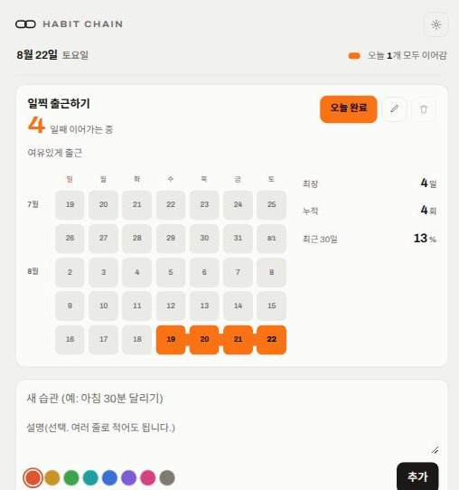
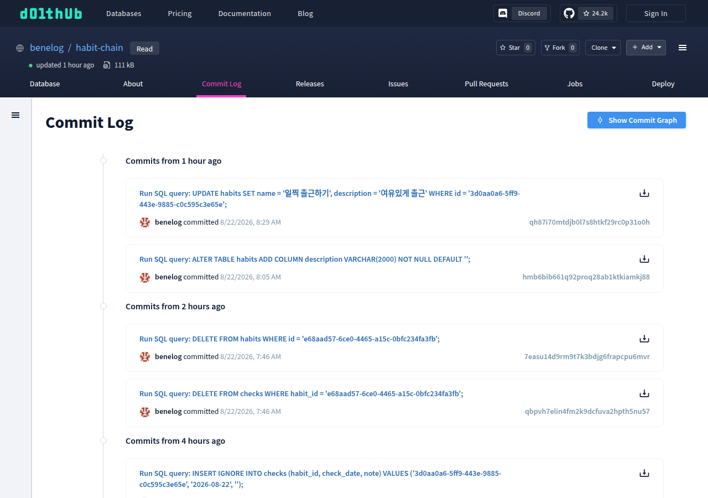
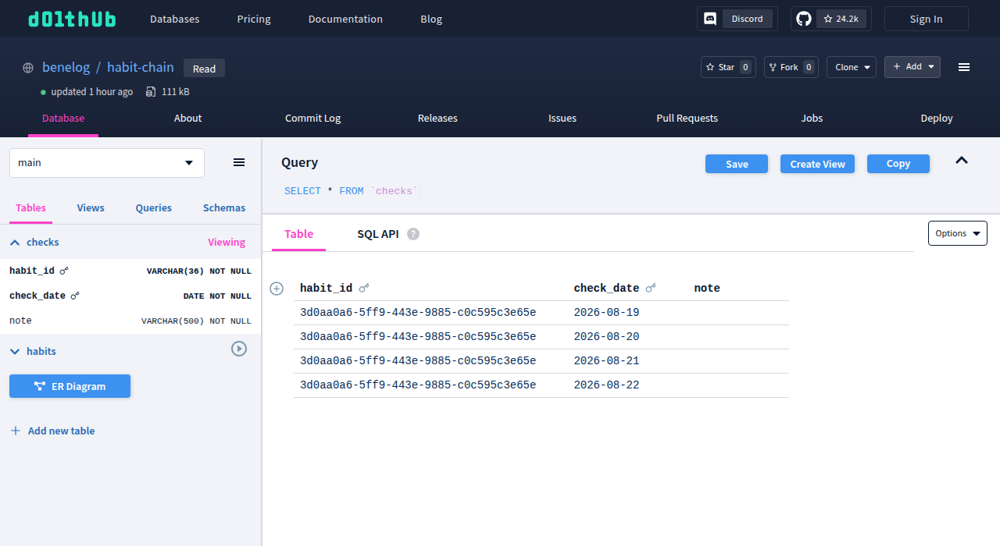
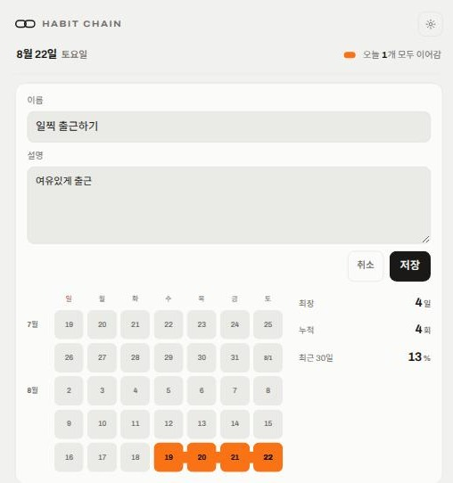
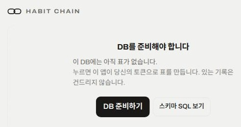

= DoltHub에 데이터를 저장하는 애플리케이션 개발
정상혁
2026-08-22
:jbake-type: post
:jbake-status: published
:jbake-tags: 자작도구, dolthub, htmx, cloudflare
:description: 습관 추적기의 데이터를 서버가 아니라 사용자의 DoltHub 저장소에 두는 구성입니다. 서버에 토큰과 기본 DB를 두지 않는 설계, htmx와 Cloudflare Pages 조합, DoltHub API로 스키마를 자동 생성한 방법과 그 과정에서 확인한 제약을 정리합니다.
:jbake-og: {"image": "img/habit-chain/habit-chain-list.jpg"}
:toc:
:sectnums:
:toclevels: 1
:source-repo: https://github.com/benelog/habit-chain
:idprefix:

"don't break the chain" 방식의 습관 추적기를 만들었습니다.
웹 페이지의 달력에서 하루 칸을 클릭하면 사슬이 이어지고, 하루를 건너뛰면 사슬이 끊어지는 단순한 기능의 앱입니다.
이런 도구는 이미 많지만, 데이터를 온전히 제가 관리할 수 있는 곳에 저장하고, 무료로 운영을 하고 싶었습니다. 그래서 사용자가 직접 DB를  생성할 수 있는 **DoltHub**를 데이터 저장소로 사용했습니다.
이 글에서는 그 구성의 선택지와 제약, 구현하면서 확인한 사실을 정리합니다.

소스는 link:https://github.com/benelog/habit-chain[benelog/habit-chain]에 있습니다.

== 습관 추적기의 화면과 연결 절차

화면은 습관마다 카드 하나입니다. 카드 안에는 최근 5주를 요일별로 늘어놓은 격자가 있고, 체크한 날끼리는 서로 이어져 하나의 사슬로 보입니다.

칸에는 날짜를 적었습니다. 사슬 모양만으로는 언제 체크했는지 셀 수 없기 때문입니다. 연결 부분은 칸 사이 여백에 그려서 숫자를 넣어도 사슬이 끊겨 보이지 않습니다.

사용자가 준비할 것은 DoltHub 계정 하나입니다. 앱을 처음 열면 다음 네 단계로 연결합니다.

. DoltHub에서 빈 데이터베이스를 하나 만듭니다. 표는 만들지 않아도 됩니다.
. DoltHub의 ``Settings → Tokens``에서 API 토큰을 발급합니다.
. 앱의 설정 화면에 데이터베이스 이름(`owner/name`)과 토큰을 넣고 저장합니다.
. 목록 자리에 나타나는 **DB 준비하기** 버튼을 누릅니다. 앱이 사용자의 토큰으로 표를 만듭니다.

4단계가 끝나면 바로 습관을 추가할 수 있습니다. 스키마 SQL을 손으로 옮겨 붙이는 단계는 없습니다.

== 데이터 저장소 후보 비교와 DoltHub 선택

데이터 저장소는 아래의 조건을 고려해서 선택했습니다.

* 제가 서버 비용과 백업 책임을 지지 않아야 함
* 사용자가 자기 데이터를 언제든 통째로 가져갈 수 있어야 함
* SQL로 데이터 조회/입력 가능

[cols="1,2,2", options="header"]
|===
|선택지 |장점 |걸린 점

|Cloudflare D1
|Worker와 같은 계정에서 바로 쓰고 지연이 짧음
|데이터가 제 계정에 쌓입니다. 사용자별로 격리하려면 인증과 테넌트 구분을 직접 만들어야 합니다.

|브라우저 localStorage
|서버가 아예 필요 없음
|기기를 바꾸면 기록이 사라집니다. 브라우저 데이터를 지워도 사라집니다.

|GitHub 저장소에 JSON 커밋
|사용자 소유이고 이력이 남음
|체크 한 번에 파일 전체를 다시 쓰게 됩니다. 조건 검색도 직접 구현해야 합니다.

|DoltHub
|사용자 소유, SQL 질의, 커밋 이력, 웹 관리 화면
|쓰기 한 번에 1.5초에서 2초가 걸립니다. 무료 요금제의 데이터베이스는 공개됩니다.
|===

DoltHub는 Git처럼 커밋과 브랜치를 갖는 SQL 데이터베이스인 Dolt의 호스팅 서비스입니다. 사용자가 자기 계정에 데이터베이스를 만들고, 앱은 사용자가 발급한 토큰으로 그 데이터베이스에 접근합니다.
체크를 한 번 할 때마다 커밋이 하나 쌓이므로, 언제 무엇을 고쳤는지가 DoltHub의 커밋 로그에 그대로 남습니다.

이력은 Git처럼 쌓이지만 조회는 SQL로 합니다. Dolt가 커밋 로그와 행 단위 변경 이력을 시스템 표로 노출하므로, 별도 명령을 배우지 않아도 익숙한 SQL로 이력을 들여다볼 수 있습니다.

[source,sql]
----
-- 커밋 이력 조회
SELECT commit_hash, committer, date, message FROM dolt_log LIMIT 3;

-- 3개 커밋 전 시점의 체크 기록 조회
SELECT * FROM checks AS OF 'HEAD~3';

-- checks 표의 행 단위 변경 이력 조회
SELECT check_date, commit_date FROM dolt_history_checks ORDER BY commit_date DESC;
----

웹 화면의 데이터 관리 기능도 풍부합니다. DoltHub에서 표를 직접 편집하고, 커밋별 diff를 확인하고, SQL 콘솔에서 질의를 실행할 수 있습니다. 데이터베이스를 fork하고 pull request로 변경을 제안하는 흐름도 Git 호스팅과 같습니다. 덕분에 앱에 관리 화면을 따로 만들지 않아도 DoltHub 웹 화면이 그 역할을 합니다.

== 토큰과 기본 DB가 없는 서버 구성

이 구성에서 서버가 하는 일은 화면을 그리고 DoltHub API를 대신 호출하는 것뿐입니다. 서버는 다음 두 가지를 갖지 않습니다.

* **토큰**: 사용자가 설정에 넣은 값이 요청마다 `X-Dolt-Token` 헤더로 옵니다. 서버에는 저장하지 않습니다.
* **기본 데이터베이스**: 설정이 비어 있는 사용자에게 보여 줄 데이터베이스가 없습니다.

처음에는 설정이 빈 사용자에게 제 데이터베이스를 읽어 보여 줬습니다. 그러면 화면에 뜬 사슬이 누구 것인지 알 수 없고, 체크를 눌러도 쓰기 권한이 없어 실패합니다. 지금은 설정이 비어 있으면 사슬 대신 연결 안내가 나옵니다.

서버에 토큰이 없으니 쓰기를 막는 공유 비밀도 필요 없습니다. 자기 토큰을 넣은 사람이 자기 데이터베이스에 쓸 뿐이고, 남의 데이터베이스에는 애초에 쓸 수 없습니다.

htmx의 ``hx-headers``는 상속되는 속성이라, ``body``에 한 번만 선언하면 모든 요청에 붙습니다.

[source,html]
.worker/src/render.ts가 만드는 shell
----
<body hx-headers='js:{"X-Local-Date": habitChain.today(), "X-Dolt-DB": habitChain.db(), "X-Dolt-Token": habitChain.token()}'>
----

`js:` 접두사를 붙이면 요청 시점마다 표현식을 평가합니다. 그래서 설정을 바꾸면 다음 요청부터 새 값이 실립니다.

== htmx 서버 렌더링과 Cloudflare Pages 배포

화면 렌더링은 전부 서버에서 합니다. 브라우저는 htmx가 HTML 조각을 갈아 끼우는 일만 합니다. 브라우저에서 DoltHub를 직접 호출하지 않으므로 CORS 설정에 기댈 일이 없고, 다른 사용자의 데이터베이스 이름도 노출되지 않습니다.

이름과 설명을 고치는 폼은 카드마다 접힌 채로 함께 내려보냅니다. 수정 버튼을 누르면 클래스 하나만 바꿔서 펼치므로 서버를 다시 부르지 않습니다. 읽기 한 번에 1초 가까이 걸리는 앱이라, 폼을 그때 받아 오면 수정 버튼과 취소 버튼이 매번 멈춥니다.

취소는 ``form.reset()``으로 처리합니다. 서버가 내려보낸 값이 곧 폼의 기본값이라서 따로 되돌릴 값을 들고 있지 않아도 됩니다. 저장에 성공하면 서버가 카드를 통째로 새로 내려주므로 펼침 상태도 함께 사라집니다.

서버 실행 환경으로 Cloudflare를 고른 이유는 Workers입니다. 관리할 서버 없이 요청 단위로 코드가 실행되고, 무료 요금제로 하루 10만 요청까지 처리할 수 있습니다. 개인용 습관 추적기의 트래픽은 그 안에 넉넉히 들어갑니다.

배포는 Cloudflare Pages의 advanced mode를 씁니다. 빌드 산출물의 `_worker.js` 하나가 모든 요청을 먼저 받고, 자기가 모르는 경로만 정적 자산으로 넘깁니다. 이 ``_worker.js``도 같은 Workers 런타임에서 실행되므로, Pages를 써도 실행 모델은 그대로입니다.

그런데도 Workers 직접 배포가 아니라 Pages를 고른 이유는 도메인입니다. 이 앱의 도메인 DNS는 Netlify에 있는데, Workers의 커스텀 도메인은 Cloudflare 존을 요구합니다. Pages는 서브도메인이면 외부 DNS에 CNAME 한 줄로 붙습니다.

=== X-Local-Date 헤더로 받는 오늘 날짜

서버에는 사용자의 시간대가 없습니다. UTC를 기준으로 삼으면 한국 사용자는 오전 9시 전에 체크한 기록이 어제 칸에 들어갑니다. 습관 추적기에서 그것은 사슬이 끊어진 것으로 보입니다.

그래서 브라우저가 로컬 날짜를 `X-Local-Date` 헤더로 보내고, 서버는 그 값을 씁니다. 헤더가 없을 때만 UTC로 계산합니다. 클라이언트가 보낸 값이므로 형식은 검사합니다.

== DoltHub API를 사용한 스키마 자동 생성

처음에는 사용자에게 스키마 SQL을 복사해 DoltHub 콘솔에 붙여 넣으라고 안내했습니다. 나중에 습관에 설명(description) 칸을 추가하면서 문제가 커졌습니다. 이미 쓰고 있던 사람은 ``ALTER TABLE``을 손으로 실행해야 했습니다.

이 과정에서 DoltHub의 DDL 실행 경로가 하나가 아니라는 것을 확인했습니다.

[cols="2,1,3", options="header"]
|===
|경로 |DDL |확인한 내용

|웹의 SQL 조회 콘솔
|거부
|``ALTER TABLE``을 보내면 ``Unsupported SQL statement``로 거부합니다.

|웹의 테이블 편집 화면
|허용
|표 목록에서 연필 아이콘을 눌러 들어가는 SQL Query 화면입니다. 임시 workspace에 반영한 뒤 커밋합니다.

|REST write 엔드포인트
|허용
|앱이 쓰기에 쓰는 ``POST /api/v1alpha1/{owner}/{db}/write/{branch}/{branch}``입니다.
|===

REST write 엔드포인트가 DDL을 받는다는 내용은 link:https://www.dolthub.com/docs/products/dolthub/api/v1alpha1/sql[공식 문서]에 없습니다. 2026년 8월에 빈 데이터베이스로 직접 확인한 동작이므로, 보장된 계약으로 보지 않고 실패 경로를 남겨 두었습니다.

그래서 스키마 준비를 이렇게 구현했습니다.

. 목록 읽기가 실패하면 그때만 ``SHOW TABLES``와 ``SHOW COLUMNS``로 데이터베이스의 상태를 확인합니다. 읽기라서 토큰이 필요 없습니다.
. 모자란 것이 있으면 목록 자리에 **DB 준비하기** 버튼을 보여 줍니다.
. 버튼을 누르면 서버가 상태를 다시 확인하고, 모자란 문장만 사용자의 토큰으로 실행합니다.

3단계에서 상태를 다시 확인하는 이유는 ``ALTER TABLE ... ADD COLUMN``이 이미 있는 칼럼에 실패하기 때문입니다. 화면이 알려 준 상태를 믿지 않고 실행 직전에 다시 보면, 버튼을 두 번 눌러도 문제가 없습니다.

[source,typescript]
.worker/src/dolt.ts
----
export function migrations(shape: Shape): string[] {
  const out: string[] = [];
  if (!shape.habits) {
    out.push(CREATE_HABITS);
  } else if (!shape.description) {
    out.push(ADD_DESCRIPTION);
  }
  if (!shape.checks) {
    out.push(CREATE_CHECKS);
  }
  return out;
}
----

=== 새 데이터베이스의 branch not found 오류

새 데이터베이스를 연결한 사용자가 ``query error: branch not found``를 만났습니다.

원인은 DDL 실패가 아니었습니다. DoltHub에서 방금 만든 데이터베이스는 커밋이 하나도 없어서 `main` 브랜치 자체가 없습니다. 목록을 읽는 첫 질의가 거기서 실패한 것이었습니다.

[source,bash]
----
curl "https://www.dolthub.com/api/v1alpha1/benelog/chain2/main?q=SHOW%20TABLES"
# {"query_execution_status":"Error","query_execution_message":"query error: branch not found"}
----

이 응답을 오류 화면에 그대로 띄우면 사용자가 할 수 있는 일이 없습니다. 지금은 이 메시지를 알아보고 준비 안내로 보냅니다. 다른 오류는 그대로 오류 화면으로 갑니다. 존재하지 않는 데이터베이스 이름까지 준비 안내로 덮으면 진짜 고장을 감추게 됩니다.

브랜치가 없는 데이터베이스에 write 엔드포인트로 ``CREATE TABLE``을 보내면 표와 함께 브랜치도 생깁니다. 이것도 문서에 없는 동작입니다.

== DoltHub 저장 구성의 제약

이 방식을 그대로 따라 하실 분을 위해 걸리는 점을 적습니다.

* **무료 요금제의 DoltHub 데이터베이스는 공개됩니다.** 데이터베이스 이름을 아는 사람은 토큰 없이 API로 기록을 읽을 수 있습니다. 공개 데이터베이스는 무료로 만들 수 있고, 개수 제한은 문서에 명시되어 있지 않습니다. 비공개로 두려면 DoltHub Pro 구독이 필요합니다. 2026년 8월 기준으로 비공개 데이터는 100MB까지 무료이고, 초과하면 월 5달러입니다. 습관 이름과 날짜가 공개되어도 괜찮은지 먼저 판단하셔야 합니다.
* **쓰기가 1.5초에서 2초 걸립니다.** write 엔드포인트가 비동기라서 작업을 걸고 완료까지 폴링합니다. 체크 버튼을 누르고 바로 반응하는 화면을 원한다면 맞지 않습니다.
* **문장 하나에 커밋 하나가 쌓입니다.** 영향받은 행이 0건이어도 커밋이 생깁니다. 체크를 자주 하면 커밋 로그가 길어집니다.
* **write 엔드포인트는 한 요청에 문장 하나만 받습니다.** 세미콜론으로 이어 보내면 ``Error parsing SQL``로 거부합니다. 습관 삭제처럼 두 표를 건드리는 작업은 요청을 나눠야 합니다.
* **``ALTER TABLE``의 ``AFTER``절을 Dolt 파서가 거부합니다.** 칼럼 위치는 지정하지 않았습니다.

== 참고 자료

* link:https://github.com/benelog/habit-chain[benelog/habit-chain] — 이 글에서 설명한 저장소
* link:https://www.dolthub.com/docs/products/dolthub/api/v1alpha1/sql[DoltHub API: SQL] — 읽기와 쓰기 엔드포인트 문서
* link:https://www.dolthub.com/docs/sql-reference/version-control/dolt-system-tables[Dolt: 버전 관리 시스템 표] — ``dolt_log``와 ``dolt_history_<표 이름>``의 스키마
* link:https://www.dolthub.com/blog/2026-04-24-announcing-dolthub-pro-for-5-dollars-per-month/[DoltHub Pro 요금 발표] — 비공개 데이터베이스의 무료 한도와 요금
* link:https://developers.cloudflare.com/pages/functions/advanced-mode/[Cloudflare Pages: Advanced mode] — ``_worker.js``하나로 모든 요청을 받는 구성
* link:https://htmx.org/attributes/hx-headers/[htmx: hx-headers] — 상속되는 속성과 ``js:``접두사

'''

이 포스트는 Claude Code와 정상혁이 함께 작성했습니다.
