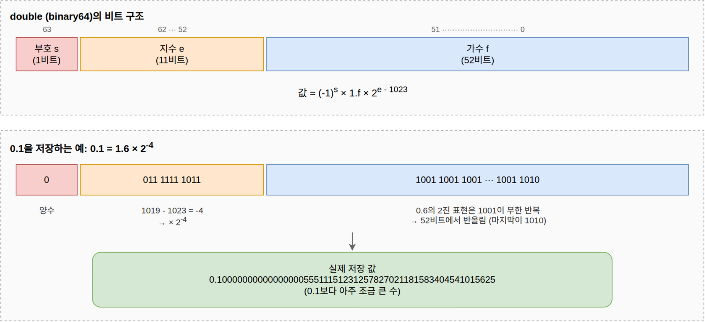

= IEEE 754 부동소수점 오차와 BigDecimal
정상혁
2026-08-15
:jbake-type: post
:jbake-status: published
:jbake-tags: java, code-review
:description: IEEE 754 표현이 0.1 같은 십진 소수를 정확히 담지 못하는 이유와 자바의 BigDecimal에 대해서 정리합니다.
:jbake-og: {"image": "img/floating-point-big-decimal/ieee754-double.png"}
:jbake-last_updated: 2026-08-29
:toc:
:sectnums:
:idprefix:

자바의 `double` 이나 `float` 자료형은 IEEE 754 부동소수점 표준에 따라 값을 2진수로 저장합니다.
이 방식으로는 십진수 0.1을 정확하게 표현할 수 없습니다.
0.1은 2진수로는 무한히 반복되는 소수가 되기 때문에, 유한한 비트 안에 담으려면 가장 가까운 값으로 반올림해야 합니다.
이 글에서는 그런 오차가 왜 생기는지, 어떤 경우에 위험한지를 실제 장애 사례와 함께 살펴보고, 자바에서의 대안을 정리합니다.

== 코드로 확인하는 부동소수점 오차
부동소수점 오차는 jshell에서 간단히 확인해볼 수 있습니다.

[source,java]
.소수 더하기 연산
----
jshell> System.out.println(0.1 + 0.2);
0.30000000000000004

jshell> System.out.println(0.1 + 0.2 == 0.3);
false

jshell> System.out.println(1.03 - 0.42);
0.6100000000000001
----

0.1을 열 번 더해도 1.0이 되지 않습니다.

[source,java]
.0.1 열번 더하기
----
jshell> double sum = 0;
jshell> for (int i = 0; i < 10; i++) { sum += 0.1; }
jshell> System.out.println(sum);
0.9999999999999999
----

`double` 리터럴 0.1에 실제로 저장된 값은 `BigDecimal` 생성자로 확인할 수 있습니다.

[source,java]
----
jshell> System.out.println(new BigDecimal(0.1));
0.1000000000000000055511151231257827021181583404541015625
----

0.1이라고 적었지만 저장된 값은 0.1보다 아주 조금 큰 다른 수입니다.
왜 이런 값이 저장되는지는 다음 절에서 `double` 의 비트 구조를 따라가며 살펴봅니다.

== double(IEEE 754 binary64)의 비트 구조와 0.1의 저장 과정

binary64는 64비트 형식을 가리키는 현행 IEEE 754 표준의 공식 명칭입니다.
1985년에 나온 첫 표준인 IEEE 754-1985에서는 같은 형식을 double이라고 불렀고, 2008년 개정판에서 binary64로 이름이 바뀌어 현행 표준인 IEEE 754-2019까지 이어집니다.
자바의 `double` 자료형은 이 binary64 형식으로 값을 저장합니다.

IEEE 754는 실수를 2진수 과학적 표기법으로 바꾼 다음 비트로 저장합니다.
십진수 과학적 표기법에서는 소수점을 옮겨 정수부를 1~9 사이 한 자리로 만들고, 옮긴 자릿수를 10의 지수로 나타냅니다.
예를 들어 0.001은 1.0 × 10^-3^ 으로 씁니다.
2진수에서도 같은 원리로 2를 곱하거나 나눠서 정수부가 한 자리가 되도록, 즉 값이 1 이상 2 미만이 되도록 만듭니다.
2진수에서 0이 아닌 한 자리 숫자는 1뿐이므로, 이렇게 정규화한 결과는 언제나 ±1.가수 × 2^지수^ 형태가 됩니다.
예를 들어 2진수 0.011(십진수 0.375)은 1.1 × 2^-2^ 으로 씁니다.

`double` (binary64)은 이렇게 정규화한 값을 64비트에 담으면서 다음 규칙을 따릅니다.

* 부호(s)는 맨 앞 1비트에 저장합니다. 0이면 양수, 1이면 음수입니다.
* 지수(e)는 실제 지수에 1023을 더한 값을 11비트에 저장합니다. 음수 지수까지 부호 없는 정수로 표현하기 위한 방식으로, 값을 읽을 때는 거꾸로 1023을 뺍니다.
* 가수(f)는 1.가수에서 소수점 아래 부분만 52비트에 저장합니다. 정규화된 수는 정수부가 항상 1이므로 그 1은 생략합니다.
* 소수점 아래가 52비트를 넘으면 가장 가까운 값으로 반올림합니다.

이 규칙대로 0.1을 저장한 결과가 아래 그림입니다.
64비트가 부호 1비트, 지수 11비트, 가수 52비트로 나뉘어 있습니다.

그림 아래쪽의 변환 과정을 따라가 보겠습니다.
0.1에 2를 거듭 곱해 보면 0.2, 0.4, 0.8을 거쳐 네 번째에 1.6이 되어 처음으로 1 이상 2 미만 구간에 들어옵니다.
2를 네 번 곱해서 1.6이 되었으니 거꾸로 0.1 = 1.6 ÷ 2^4^ = 1.6 × 2^-4^ 입니다.
따라서 부호 비트는 0, 지수부는 -4 + 1023 = 1019가 됩니다.
문제는 가수입니다.
0.6을 2진수로 바꾸면 0.1001 1001 1001…처럼 1001이 무한히 반복되어 끝나지 않습니다.
52비트 안에 담으려면 반올림할 수밖에 없고, 그 결과 0.1이 아니라 0.1보다 아주 조금 큰 수가 저장됩니다.
앞에서 `new BigDecimal(0.1)` 로 확인한 0.1000000000000000055511151231257827021181583404541015625가 바로 이 반올림된 값입니다.

모든 소수에서 오차가 생기는 것은 아닙니다.
0.5(1/2), 0.25(1/4), 0.75(3/4)처럼 분모가 2의 거듭제곱인 소수는 유한한 2진 소수가 되므로 정확하게 저장됩니다.
반면 0.1 = 1/10처럼 분모에 5가 끼어 있는 십진 소수는 2진수로는 무한히 반복되는 소수가 되어 반올림 오차를 피할 수 없습니다.
표준에 대한 더 자세한 설명은 https://ko.wikipedia.org/wiki/IEEE_754[IEEE 754 위키백과 문서]를 참고할 수 있습니다.

== 소수의 2진수 표현 오차가 위험한 경우

과학 계산처럼 근사값으로 충분한 영역에서는 이런 오차가 문제되지 않습니다.
그러나 돈 계산은 다릅니다.
금액은 마지막 한 자리까지 정확해야 하고, 오차가 누적되면 장부가 맞지 않습니다.
위 예제처럼 1.03달러에서 0.42달러를 빼는 단순한 계산도 0.6100000000000001달러가 되어, 반올림 처리 없이는 화면에 그대로 노출되거나 비교 연산이 어긋납니다.
https://dzone.com/articles/never-use-float-and-double-for-monetary-calculatio[Never Use Float and Double for Monetary Calculations]를 비롯해 많은 글이 같은 이유로 금액 계산에 부동소수점 자료형을 쓰지 말라고 권고합니다.
돈이 아니어도 마지막 자리까지 정확해야 하는 값이라면 같은 원칙이 적용됩니다.
이런 오차가 실제 장애로 이어진 국내와 해외 사례를 하나씩 살펴보겠습니다.

=== 2011년 NEIS 성적 처리 오류

부동소수점 계산 오차는 실제로 큰 장애로 이어진 적이 있습니다.
2011년 7월 차세대 교육행정정보시스템(NEIS·나이스)에서 성적 처리 오류가 발생해, 전국 2,300여개 고교에서 1만 7천여명의 학기말 성적이 바뀌었습니다.
대입 수시모집을 앞둔 시점이어서 파장이 컸습니다.

https://www.khan.co.kr/article/201107222144165[경향신문 기사]에 따르면 고교생 성적 오류는 동점자를 판별하고 석차를 매기는 과정에서 컴퓨터의 계산 오차를 보정하지 않아 발생했습니다.
https://www.yna.co.kr/view/AKR20110902079600004[연합뉴스 기사]에 실린 교육과학기술부의 점검 결과를 보면, 동점자 처리의 '오류 보정 코드'를 일부 프로그램에 적용하지 않았고, 새로 도입한 DB의 특성상 나타나는 연산 오류를 예측하지 못한 것이 원인으로 지목됐습니다.
성적처럼 소수점 계산이 들어가는 값을 다룰 때 부동소수점 오차를 고려하지 않으면, 동점 여부 판정 같은 비교 연산이 어긋날 수 있음을 보여주는 사례입니다.
이 사례에서 오류는 자바 코드가 아니라 새로 도입한 DB의 연산에서 발생했습니다.
그러나 IEEE 754는 대부분의 프로그래밍 언어와 DB가 함께 쓰는 표준이므로, 같은 오차는 어떤 환경에서든 나타날 수 있습니다.

=== 1991년 걸프전 패트리어트 미사일 요격 실패

0.1을 유한한 2진수로 표현할 수 없다는 사실은 인명 피해로 이어진 적도 있습니다.
걸프전 중이던 1991년 2월 25일, 사우디아라비아 다란(Dhahran)의 미군 기지에 이라크의 스커드 미사일이 떨어져 미군 28명이 사망하고 97명이 다쳤습니다.
기지에는 요격용 패트리어트 미사일이 배치되어 있었지만 격추 시도조차 하지 못했습니다.

'역사 속의 소프트웨어 오류'(에이콘출판, 2014) 책의 1장 "0.000000095의 오차가 앗아간 28명의 생명"에서 미국 GAO의 https://www.gao.gov/products/imtec-92-26[조사 보고서]를 바탕으로 이 사건의 원인을 설명합니다.
패트리어트 시스템은 0.1초 단위로 시간을 세어 목표물이 나타날 구간을 예측하는데, 이 계산에 24비트 고정소수점 레지스터를 사용했습니다.
0.1은 2진수로는 무한히 반복되는 소수이므로 24비트 이후는 잘려 나갔고, 계산할 때마다 약 0.000000095의 오차가 쌓였습니다.
연속 가동 20시간이면 시계가 0.0687초, 사건 당시 포대처럼 100시간이면 0.3433초 어긋납니다.
초속 2km로 날아오는 스커드 미사일에게 0.3433초는 687m에 해당합니다.
추적 레이더는 실제 미사일 위치에서 687m 벗어난 구간을 탐색했고, 미사일은 아무 방해 없이 병영에 떨어졌습니다.
이 오차를 수정한 소프트웨어는 사건 다음 날에야 다란에 도착했습니다.

이 시스템의 계산은 `double` 같은 부동소수점이 아니라 고정소수점 방식이었지만, 0.1을 유한한 비트의 2진수에 담지 못해 오차가 생긴다는 원인은 이 글에서 다룬 것과 같습니다.
다음 절에서는 자바에서 이런 오차를 피하는 대안을 살펴봅니다.

== 자바에서의 대안

=== BigDecimal

자바에서 십진 소수를 정확하게 다루는 기본 수단은 `java.math.BigDecimal` 입니다.

[source,java]
----
jshell> new BigDecimal("0.1").add(new BigDecimal("0.2"))
$1 ==> 0.3

jshell> new BigDecimal("1.03").subtract(new BigDecimal("0.42"))
$2 ==> 0.61
----

한 가지 주의할 점은 생성자에 `double` 을 넘기면 안 된다는 것입니다.
앞에서 봤듯이 `new BigDecimal(0.1)` 은 0.1이 아니라 `double` 에 저장된 근사값을 그대로 옮겨 담습니다.
문자열을 받는 생성자나 `BigDecimal.valueOf()` 를 사용해야 합니다.

=== 정수형 최소 단위 계산

금액을 원(₩)이나 센트 같은 최소 단위의 정수로 다루는 방법도 널리 쓰입니다.
우아한형제들 기술 블로그의 https://woowabros.github.io/study/2018/03/01/spock-test.html[Spock으로 테스트코드를 짜보자]에 나오는 예제가 이 방식을 보여줍니다.
반올림 처리에는 `BigDecimal` 을 쓰지만, 메서드의 입력과 리턴 타입은 `long` 입니다.

[source,java]
----
public static long calculate(long amount, float rate, RoundingMode roundingMode) {
    return BigDecimal.valueOf(amount * rate * 0.01)
            .setScale(0, roundingMode).longValue();
}
----

금액 자체는 정수로 유지하고, 소수점이 생기는 비율 계산 직후에 반올림 모드를 명시한 `BigDecimal` 로 다시 정수로 돌아오는 구조입니다.
다만 `amount * rate * 0.01` 곱셈 자체는 부동소수점 연산으로 수행되므로, 이 오차가 반올림 경계에 걸릴 수 있는 정밀도라면 곱셈까지 `BigDecimal` 로 옮기는 편이 안전합니다.

=== Java Money (JSR 354)

금액과 통화를 함께 다루는 표준 API로 https://javamoney.github.io/[Java Money]도 있습니다.
`MonetaryAmount` 인터페이스로 금액과 통화 단위를 묶어서 표현합니다.
JSR 354로 표준화됐고 https://jcp.org/en/jsr/detail?id=354[JCP 제안서]에서는 Java SE 9에 포함하는 방안도 검토했지만, 최종적으로 JDK에는 들어가지 않았습니다.
그래서 API(`javax.money`)와 참조 구현인 https://github.com/JavaMoney/jsr354-ri[Moneta]를 별도 의존성으로 추가해야 사용할 수 있습니다.

[source,groovy]
.build.gradle
----
implementation 'org.javamoney:moneta:1.4.5'
----

`Money` 구현체는 내부적으로 ``BigDecimal``로 계산하므로, 글 앞부분에서 `double` 로는 0.6100000000000001이 나왔던 1.03 - 0.42도 정확히 0.61이 됩니다.

[source,java]
----
MonetaryAmount price = Money.of(new BigDecimal("1.03"), "USD");
MonetaryAmount result = price.subtract(Money.of(new BigDecimal("0.42"), "USD"));
System.out.println(result);
// USD 0.61
----

`Money.parse()` 를 사용하면 통화와 금액을 문자열 하나로 표현할 수도 있습니다.

[source,java]
----
MonetaryAmount parsed = Money.parse("USD 1.03").subtract(Money.parse("USD 0.42"));
System.out.println(parsed);
// USD 0.61
----

통화가 다른 금액끼리 연산하면 예외가 발생하므로, 서로 다른 통화의 금액을 섞어 계산하는 실수도 타입 수준에서 막아줍니다.

[source,java]
----
price.add(Money.of(100, "KRW"));
// MonetaryException: Currency mismatch: USD/KRW
----

더 많은 사용 예제는 https://www.baeldung.com/java-money-and-currency[Baeldung의 Java Money and the Currency API]를 참고할 수 있습니다.

== BigDecimal이 언제나 정답일까

`BigDecimal` 에도 비용이 있습니다.
Chronicle Software의 Peter Lawrey는 https://blog.vanillajava.blog/2014/07/if-bigdecimal-is-answer-it-must-have.html[If BigDecimal is the answer, it must have been a strange question]에서 `BigDecimal` 의 단점을 이렇게 꼽습니다.

* 문법이 자연스럽지 않다. 연산자 대신 메서드 호출을 이어붙여야 해서 수식의 가독성이 떨어진다.
* `double` 보다 메모리를 많이 사용한다.
* 객체를 계속 생성하므로 가비지가 많이 만들어진다.
* 대부분의 연산에서 훨씬 느리다.

Lawrey의 결론은 "`double` 의 반올림을 다루는 법을 모르거나 프로젝트 표준이 `BigDecimal` 을 강제한다면 `BigDecimal` 을 쓰되, 선택할 수 있다면 `BigDecimal` 이 당연히 옳다고 가정하지는 말라"는 것입니다.
지연 시간에 민감한 금융 시스템 중에는 `BigDecimal` 없이 만들어진 시스템도 많이 돌아가고 있다는 점도 근거로 듭니다.

저는 기본적으로는 여전히 `double`, `int` 자료형보다는 ``BigDecimal``을 권장해야 한다고 생각합니다.
부동소수점 오차와 반올림을 정확히 통제할 자신이 있는 팀이라면 성능을 위해 `double` 이나 `int` 타입으로 계산을 선택할 수는 있습니다.
그러나 조직에는 항상 새로운 사람이 들어오기 때문에 모든 사람이 이 글에서 다룬 부동소수점 오차의 특성을 잘 이해하고 있다고 전제하기는 쉽지 않습니다.
따라서 팀과 프로젝트의 표준으로 `BigDecimal` 사용을 전수하는 편이 더 안전합니다.

== 참고 자료

* https://ko.wikipedia.org/wiki/IEEE_754[IEEE 754 - 위키백과]
* https://dzone.com/articles/never-use-float-and-double-for-monetary-calculatio[Never Use Float and Double for Monetary Calculations]
* https://www.geeksforgeeks.org/bigdecimal-class-java/[BigDecimal Class in Java - GeeksforGeeks]
* https://blog.vanillajava.blog/2014/07/if-bigdecimal-is-answer-it-must-have.html[If BigDecimal is the answer, it must have been a strange question - Peter Lawrey]
* https://javamoney.github.io/[Java Money]
* https://woowabros.github.io/study/2018/03/01/spock-test.html[Spock으로 테스트코드를 짜보자 - 우아한형제들 기술 블로그]
* NEIS 성적 오류
** https://www.khan.co.kr/article/201107222144165[“NEIS 성적 오류 어쩌다 발생했나” - 경향신문 (2011.07.22)]
** https://www.yna.co.kr/view/AKR20110902079600004[`나이스오류' 예견된 사고…설계서ㆍ테스트 없었다 - 연합뉴스 (2011.09.02)]
* 패트리어트 미사일 요격 실패
** 김종하, '역사 속의 소프트웨어 오류', 에이콘출판(2014), 25~35쪽
** https://www.gao.gov/products/imtec-92-26[Patriot Missile Defense: Software Problem Led to System Failure at Dhahran, Saudi Arabia - GAO (1992.02)]
