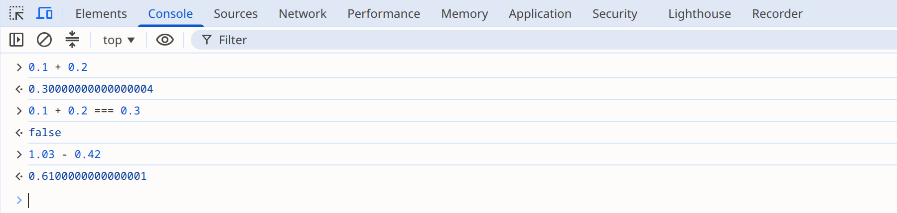

= IEEE 754 부동소수점 오차와 BigDecimal
정상혁
2026-08-15
:jbake-type: post
:jbake-status: published
:jbake-tags: java, code-review
:description: IEEE 754 표현이 0.1 같은 십진 소수를 정확히 담지 못하는 이유와, 자바에서 그 오차를 피하는 BigDecimal과 정수형 최소 단위 두 대안, 그 위에 얹는 Java Money 같은 도메인 특화 라이브러리를 정리합니다.
:jbake-og: {"image": "img/floating-point-big-decimal/ieee754-double.png"}
:jbake-last_updated: 2026-08-30
:toc:
:sectnums:
:idprefix:

자바의 ``double``이나 `float` 자료형은 IEEE 754 부동소수점 표준에 따라 값을 2진수로 저장합니다.
이 방식으로는 십진수 0.1을 정확하게 표현할 수 없습니다.
0.1은 2진수로는 무한히 반복되는 소수가 되기 때문에, 유한한 비트 안에 담으려면 가장 가까운 값으로 반올림해야 합니다.
이 글에서는 그런 오차가 왜 생기는지, 어떤 경우에 위험한지를 실제 장애 사례와 함께 살펴보고, 자바에서 쓸 수 있는 대안을 정리합니다.

== 코드로 확인하는 부동소수점 오차

부동소수점 오차는 jshell에서 간단히 확인해 볼 수 있습니다.
jshell은 JDK 9부터 JDK에 포함된 대화형 실행 도구입니다.
따로 내려받을 필요 없이 JDK를 설치했다면 `jshell` 명령으로 바로 실행할 수 있습니다.

[source,java]
.소수 더하기 연산
----
jshell> System.out.println(0.1 + 0.2);
0.30000000000000004

jshell> System.out.println(0.1 + 0.2 == 0.3);
false

jshell> System.out.println(1.03 - 0.42);
0.6100000000000001
----

0.1을 열 번 더해도 1.0이 되지 않습니다.

[source,java]
.0.1 열 번 더하기
----
jshell> double sum = 0;
jshell> for (int i = 0; i < 10; i++) { sum += 0.1; }
jshell> System.out.println(sum);
0.9999999999999999
----

`double` 리터럴 0.1에 실제로 저장된 값은 `BigDecimal` 생성자로 확인할 수 있습니다.

[source,java]
.double 리터럴 0.1의 실제 값
----
jshell> System.out.println(new BigDecimal(0.1));
0.1000000000000000055511151231257827021181583404541015625
----

jshell 명령행에서 0.1로 입력했지만 저장된 값은 0.1보다 아주 조금 큰 다른 수입니다.

이 오차는 자바만의 문제가 아닙니다.
JavaScript의 `number` 타입도 IEEE 754 binary64 형식을 쓰기 때문에, Chrome 개발자 도구 콘솔에서 같은 식을 입력하면 결과가 똑같습니다.

왜 이런 값이 저장되는지는 다음 절에서 ``double``의 비트 구조를 따라가며 살펴봅니다.

== double(IEEE 754 binary64)의 비트 구조와 0.1의 저장 과정

IEEE 754는 여러 부동소수점 형식을 정의하는 표준입니다.
그중 자바가 쓰는 두 형식은 다음과 같습니다.

[cols="1,1,2,1", options="header"]
|===
|형식 |1985년 명칭 |크기 |자바 자료형

|binary32
|single
|32비트 (부호 1 / 지수 8 / 가수 23)
|`float`

|binary64
|double
|64비트 (부호 1 / 지수 11 / 가수 52)
|`double`
|===

1985년에 나온 첫 표준인 IEEE 754-1985에서는 이 두 형식을 single, double이라고 불렀고, 2008년 개정판에서 binary32, binary64로 이름이 바뀌어 현행 표준인 IEEE 754-2019까지 이어집니다.
표준에는 이 외에도 binary16, binary128과 10진 형식인 decimal32, decimal64, decimal128이 들어 있습니다.

IEEE 754는 실수를 2진수 과학적 표기법으로 바꾼 다음 비트로 저장합니다.
십진수 과학적 표기법에서는 소수점을 옮겨 정수부를 1~9 사이 한 자리로 만들고, 옮긴 자릿수를 10의 지수로 나타냅니다.
예를 들어 0.001은 1.0 × 10^-3^으로 씁니다.
2진수에서도 같은 원리로 2를 곱하거나 나눠서 정수부가 한 자리가 되도록, 즉 값이 1 이상 2 미만이 되도록 만듭니다.
2진수에서 0이 아닌 한 자리 숫자는 1뿐이므로, 이렇게 정규화한 결과는 언제나 ±1.가수 × 2^지수^ 형태가 됩니다.
예를 들어 2진수 0.011(십진수 0.375)은 1.1 × 2^-2^으로 씁니다.

`double` (binary64)은 이렇게 정규화한 값을 64비트에 담으면서 다음 규칙을 따릅니다.

* 부호(s)는 맨 앞 1비트에 저장합니다. 0이면 양수, 1이면 음수입니다.
* 지수(e)는 실제 지수에 1023을 더한 값을 11비트에 저장합니다. 음수 지수까지 부호 없는 정수로 표현하기 위한 방식으로, 값을 읽을 때는 거꾸로 1023을 뺍니다.
* 가수(f)는 1.가수에서 소수점 아래 부분만 52비트에 저장합니다. 정규화된 수는 정수부가 항상 1이므로 그 1은 생략합니다.
* 소수점 아래가 52비트를 넘으면 가장 가까운 값으로 반올림합니다.

이 규칙대로 0.1을 저장한 결과가 아래 그림입니다.
64비트가 부호 1비트, 지수 11비트, 가수 52비트로 나뉘어 있습니다.

image::img/floating-point-big-decimal/ieee754-double.png[IEEE 754 double의 비트 구조와 0.1 저장 예,width=800]

그림 아래쪽의 변환 과정을 따라가 보겠습니다.
0.1에 2를 거듭 곱해 보면 0.2, 0.4, 0.8을 거쳐 네 번째에 1.6이 되어 처음으로 1 이상 2 미만 구간에 들어옵니다.
2를 네 번 곱해서 1.6이 되었으니 거꾸로 0.1 = 1.6 ÷ 2^4^ = 1.6 × 2^-4^입니다.
따라서 부호 비트는 0, 지수부는 -4 + 1023 = 1019가 됩니다.
문제는 가수입니다.
0.6을 2진수로 바꾸면 0.1001 1001 1001…처럼 1001이 무한히 반복되어 끝나지 않습니다.
52비트 안에 담으려면 반올림할 수밖에 없고, 그 결과 0.1이 아니라 0.1보다 아주 조금 큰 수가 저장됩니다.
앞에서 ``new BigDecimal(0.1)``로 확인한 0.1000000000000000055511151231257827021181583404541015625가 바로 이 반올림된 값입니다.

모든 소수에서 오차가 생기는 것은 아닙니다.
0.5(1/2), 0.25(1/4), 0.75(3/4)처럼 분모가 2의 거듭제곱인 소수는 유한한 2진 소수가 되므로 정확하게 저장됩니다.
반면 0.1 = 1/10처럼 분모에 5가 끼어 있는 십진 소수는 2진수로는 무한히 반복되는 소수가 되어 반올림 오차를 피할 수 없습니다.
표준을 더 자세히 알고 싶다면 https://ko.wikipedia.org/wiki/IEEE_754[IEEE 754 위키백과 문서]를 참고할 수 있습니다.

== 소수의 2진수 표현 오차가 위험한 경우

과학 실험의 데이터처럼 근삿값을 다루는 영역에서는 이런 오차가 용인되기도 합니다.
그러나 소수점 단위의 오차가 치명적인 버그를 만들 수 있는 분야도 있습니다.
이런 오차가 실제 장애로 이어진 국내와 해외 사례를 하나씩 살펴보겠습니다.

=== 2011년 NEIS 성적 처리 오류

2011년 7월 차세대 교육행정정보시스템(NEIS·나이스)에서 성적 처리 오류가 발생해, 전국 2,300여 개 고교에서 1만 7천여 명의 학기말 성적이 바뀌었습니다.
대입 수시모집을 앞둔 시점이어서 파장이 컸습니다.

https://www.khan.co.kr/article/201107222144165[경향신문 기사]에 따르면 고교생 성적 오류는 동점자를 판별하고 석차를 산출하는 과정에서 컴퓨터의 계산 오차를 보정하지 않아 발생했습니다.
https://www.yna.co.kr/view/AKR20110902079600004[연합뉴스 기사]에 실린 교육과학기술부의 점검 결과를 보면, 동점자 처리의 '오류 보정 코드'를 일부 프로그램에 적용하지 않았고, 새로 도입한 DB의 특성상 나타나는 연산 오류를 예측하지 못한 것이 원인으로 지목됐습니다.
성적처럼 소수점 계산이 들어가는 값을 다룰 때 부동소수점 오차를 고려하지 않으면, 동점 여부 판정 같은 비교 연산이 어긋날 수 있음을 보여 주는 사례입니다.
이 사례에서 오류는 새로 도입한 DB의 연산에서 발생했습니다.
IEEE 754는 대부분의 프로그래밍 언어와 DB가 함께 쓰는 표준이므로, 같은 오차는 어떤 환경에서든 나타날 수 있습니다.

=== 1991년 걸프전 패트리어트 미사일 요격 실패

0.1을 유한한 2진수로 표현할 수 없다는 문제는 인명 피해로도 이어졌습니다.
걸프전 중이던 1991년 2월 25일, 사우디아라비아 다란(Dhahran)의 미군 기지에 이라크의 스커드 미사일이 떨어져 미군 28명이 사망하고 97명이 다쳤습니다.
기지에는 요격용 패트리어트 미사일이 배치되어 있었지만 격추 시도조차 하지 못했습니다.

'역사 속의 소프트웨어 오류'(에이콘출판, 2014)의 1장 "0.000000095의 오차가 앗아간 28명의 생명"은 미국 GAO의 https://www.gao.gov/products/imtec-92-26[조사 보고서]를 바탕으로 이 사건의 원인을 설명합니다.
미사일을 방어하는 패트리어트 시스템은 0.1초 단위로 시간을 세어 목표물이 나타날 구간을 예측하는데, 이 계산에 24비트 고정소수점 레지스터를 사용했습니다.
0.1은 2진수로는 무한히 반복되는 소수이므로 24비트 이후는 잘려 나갔고, 계산할 때마다 약 0.000000095의 오차가 쌓였습니다.
연속 가동 20시간이면 시계가 0.0687초, 사건 당시 포대처럼 100시간이면 0.3433초 어긋납니다.
초속 2km로 날아오는 스커드 미사일이라면 0.3433초 동안 687m를 이동합니다.
추적 레이더는 실제 미사일 위치에서 687m 벗어난 구간을 탐색했고, 미사일은 요격되지 못하고 병영에 떨어졌습니다.

이 시스템은 `double` 같은 부동소수점이 아니라 고정소수점으로 계산했습니다.
그러나 0.1을 유한한 비트의 2진수에 담지 못해 오차가 누적되었다는 점은 이 글에서 다룬 원리와 같습니다.

== 자바에서 소수점 연산 오차를 피하는 대안

``double``형 연산에서 생기는 오차를 피하는 두 가지 방법을 소개합니다.

=== BigDecimal

자바에서 십진 소수를 정확하게 다루는 기본 수단은 ``java.math.BigDecimal``입니다.
https://dzone.com/articles/never-use-float-and-double-for-monetary-calculatio[Never Use Float and Double for Monetary Calculations]에서도 금액 계산에 부동소수점 자료형 대신 ``BigDecimal``을 쓰라고 권고합니다.

[source,java]
.BigDecimal의 더하기 빼기 연산
----
jshell> new BigDecimal("0.1").add(new BigDecimal("0.2"))
$1 ==> 0.3

jshell> new BigDecimal("1.03").subtract(new BigDecimal("0.42"))
$2 ==> 0.61
----

한 가지 주의할 점은 생성자에 ``double``을 넘기면 오차를 피하는 효과가 없어진다는 것입니다.
앞에서 봤듯이 ``new BigDecimal(0.1)``은 0.1이 아니라 ``double``에 저장된 근삿값을 그대로 옮겨 담습니다.
문자열을 받는 생성자나 ``BigDecimal.valueOf()``를 사용해야 합니다.

``BigDecimal``을 쓴다고 반올림 정책까지 저절로 정해지지는 않습니다.
1을 3으로 나누는 것처럼 십진수로 끝나지 않는 나눗셈은 자릿수와 반올림 방식을 지정하지 않으면 예외가 발생합니다.

[source,java]
----
jshell> new BigDecimal("1").divide(new BigDecimal("3"))
|  Exception java.lang.ArithmeticException: Non-terminating decimal expansion; no exact representable decimal result.

jshell> new BigDecimal("1").divide(new BigDecimal("3"), 10, RoundingMode.HALF_UP)
$1 ==> 0.3333333333
----

여기서 쓴 ``java.math.RoundingMode``는 0.5를 올릴지(`HALF_UP`), 짝수 쪽으로 붙일지(`HALF_EVEN`), 무조건 버릴지(`DOWN`) 같은 반올림 방식을 고르는 열거형입니다.
``BigDecimal``이 없애 주는 것은 2진수 표현에서 생기는 오차입니다.
소수점 이하 몇 자리까지 어떤 방식으로 반올림할지는 해당 분야의 특성에 맞게 팀이 정해서 지켜야 하는 규칙이 됩니다.

Joshua Bloch도 'Effective Java' 3판의 아이템 60 '정확한 답이 필요하다면 float와 double은 피하라'(Avoid float and double if exact answers are required)에서 같은 권고를 합니다.
이 항목은 ``BigDecimal``과 함께 int, long도 대안으로 제시하는데, 둘 중 무엇을 고를지는 뒤의 선택 기준 절에서 정리합니다.

=== 정수형 최소 단위 계산

금액을 원(₩)이나 센트 같은 최소 단위의 정수로 다루는 방법도 널리 쓰입니다.
특히 1원 이하의 가치가 적은 한국에서는 업무 규칙과 어긋나지 않는다면 실용적인 방법입니다.
같은 이유로 기존 시스템의 데이터베이스도 원화 금액을 정수 칼럼으로 잡아 둔 경우가 많습니다.
그래서 애플리케이션에서 ``BigDecimal``로 계산하더라도 저장하기 직전에 정수로 바꾸는 과정이 한 번은 들어갑니다.
우아한형제들 기술 블로그의 https://techblog.woowahan.com/2560/[Spock으로 테스트코드를 짜보자]에 나오는 예제가 이 방식을 보여 줍니다.
반올림 처리에는 ``BigDecimal``을 쓰지만, 메서드의 입력과 리턴 타입은 ``long``입니다.

[source,java]
----
public static long calculate(long amount, float rate, RoundingMode roundingMode) {
    return BigDecimal.valueOf(amount * rate * 0.01)
            .setScale(0, roundingMode).longValue();
}
----

금액 자체는 정수로 유지하고, 소수점이 생기는 비율 계산 직후에 반올림 모드를 명시한 ``BigDecimal``로 다시 정수로 돌아오는 구조입니다.

다만 ``amount * rate * 0.01``처럼 부동소수점 자료형이 섞이면 그 계산은 부동소수점 연산이 됩니다.
`long` 값이 ``float``로 변환되면서 정밀도를 잃기 때문에, 입력과 리턴 타입이 정수여도 금액이 커지면 10진수로는 예상 밖의 결과가 나옵니다.

[source,java]
.calculate 메서드의 한계
----
jshell> calculate(16_777_217L, 100f, RoundingMode.HALF_UP)
$1 ==> 16777216
----

100%를 곱했으니 16,777,217이 그대로 나와야 하는데 1원이 사라졌습니다.
``float``의 가수는 23비트여서 2^24^(16,777,216)을 넘는 정수를 빠짐없이 표현하지는 못하고, ``16_777_217L``은 ``float``로 변환되는 순간 16,777,216이 됩니다.
입력을 정수로 유지해도 중간 계산 한 곳이 부동소수점이면 오차는 그대로 들어옵니다.

인용한 예제를 고쳐서 비율까지 ``BigDecimal``로 옮기면 이 문제가 사라집니다.

[source,java]
.곱셈까지 BigDecimal로 옮긴 버전
----
public static long calculate(long amount, BigDecimal percent, RoundingMode roundingMode) {
    return BigDecimal.valueOf(amount)
            .multiply(percent)
            .movePointLeft(2)
            .setScale(0, roundingMode)
            .longValue();
}
----

이 버전에서 ``calculate(16_777_217L, new BigDecimal("100"), RoundingMode.HALF_UP)``은 16,777,217을 그대로 돌려줍니다.
정수형 최소 단위 방식을 쓰더라도 오차를 없애려면 모든 중간값을 정수나 ``BigDecimal``로 유지해야 합니다.

== BigDecimal과 정수형 최소 단위의 선택 기준
우선 계산 정밀도가 중요한 모듈에서 ``double``형은 반환형이나 메서드 파라미터 타입으로 쓰지 않는다는 규칙은 최소한도로 추구할만 합니다.
이를 어떤 타입으로 대체할지는 앞에서 말한 ``BigDecimal`` vs '정수형 최소 단위'의 선택지가 있습니다.
성능과 코드의 간결함은 ``long``이 낫습니다.
``BigDecimal``은 개발자의 실수를 예방하는 측면에서는 유리합니다.

앞에서 언급한 'Effective Java' 아이템 60도 같은 기준으로 선택을 정리해 두었습니다.
소수점 추적을 시스템에 맡기고 반올림 방식까지 고르고 싶다면, 기본 타입보다 쓰기 불편하고 느리다는 비용을 감수하고 ``BigDecimal``을 쓰라는 것이 이 항목의 결론입니다.
반대로 성능이 중요하고 소수점을 직접 추적할 수 있다면 int나 long을 쓰라는 대안도 함께 제시하는데, 앞 절에서 본 정수형 최소 단위 계산과 같은 방법입니다.
값이 십진수로 아홉 자리를 넘지 않으면 int, 열여덟 자리를 넘지 않으면 long, 그보다 크면 ``BigDecimal``을 쓰라는 자릿수 기준도 덧붙입니다.

Chronicle Software의 Peter Lawrey는 https://blog.vanillajava.blog/2014/07/if-bigdecimal-is-answer-it-must-have.html[If BigDecimal is the answer, it must have been a strange question]에서 ``BigDecimal``의 단점을 이렇게 꼽습니다.

* 문법이 자연스럽지 않다. 연산자 대신 메서드 호출을 이어 붙여야 해서 수식의 가독성이 떨어진다.
* ``double``보다 메모리를 많이 사용한다. 객체를 계속 생성하므로 가비지가 많이 만들어진다.
* 대부분의 연산에서 훨씬 느리다.

Lawrey의 결론은 "``double``의 반올림을 다루는 법을 모르거나 프로젝트 표준이 ``BigDecimal``을 강제한다면 ``BigDecimal``을 쓰되, 선택할 수 있다면 ``BigDecimal``이 당연히 옳다고 가정하지는 말라"는 것입니다.
지연 시간에 민감한 금융 시스템 중에는 `BigDecimal` 없이 만들어진 시스템도 많이 돌아가고 있다는 점도 근거로 듭니다.

정수형 최소 단위 계산은 시스템 자원을 적게 쓴다는 장점이 있습니다.
`long` 타입의 값은 객체를 만들지 않고, 연산도 CPU의 정수 연산으로 끝납니다.
대신 개발자가 정확한 연산을 더 많이 의식해야 합니다.
반올림 규칙을 정해야 한다는 점은 ``BigDecimal``도 마찬가지라 차이가 아닙니다.
차이는 그 규칙을 빠뜨렸을 때 나타납니다.
``BigDecimal``은 십진수로 끝나지 않는 나눗셈에서 반올림 방식을 빠뜨리면 앞에서 본 것처럼 예외를 던지지만, `long` 나눗셈은 소수점 이하를 경고 없이 버립니다.
최소 단위를 무엇으로 볼지를 시스템 전체가 같은 규칙으로 지켜야 한다는 부담도 ``BigDecimal``에는 없습니다.
기본 산술 연산자로 계산하다 보니, `calculate()` 예제의 ``amount * rate * 0.01``처럼 중간에 부동소수점이 섞여도 컴파일러가 막지 않습니다.

지금까지의 내용을 정리하면 다음과 같습니다.

[cols="1,1,2,2", options="header"]
.BigDecimal과 정수형 최소 단위 비교
|===
^|자료형 ^|저장 방식 ^|강점 ^|감수할 점

|`BigDecimal`
|임의 정밀도 정수와 스케일
a|
* 자릿수 제한 없이 십진수를 정확하게 표현
* 최소 단위를 따로 정하지 않아도 됨
a|
* 메모리 사용량 증가
* 연산 속도 저하
* 기본 연산자 대신 메서드 체인 호출로 연산해야 하는 번거로움

|`long`
|최소 단위로 환산한 정수
a|
* 객체 생성이 없어 메모리 사용이 적음
* CPU의 정수 연산으로 끝나 빠름
a|
* 최소 단위 규칙을 시스템 전체가 지켜야 함
* 중간 연산에 ``double``이나 ``float``가 끼어들면 오차가 생김
|===

어떤 타입을 쓸지 정하고 실제 코드에 반영하는 데 가장 중요한 것은 팀 구성원이 이해하기 쉬운 단순한 규칙으로 명시하는 것입니다.
시스템의 담당 개발자는 계속 바뀔 수 있습니다.
모든 사람이 이 글에서 다룬 오차가 생기는 원리까지 이해하고 있다고 전제하기는 어렵습니다.
규칙이 명확하고 단순하면 새로 투입된 개발자도 동일하게 따라갈 가능성이 높아집니다.
그 결과로 전체 모듈에서 소수점 이하 연산을 다루는 일관성이 지켜지고, 치명적인 오차를 만드는 코드가 들어올 가능성도 줄어듭니다.
따라서 정하려는 규칙을 간결하고 명확하게 문서로 적을 수 있는지도 판단 기준으로 삼아 봤으면 합니다.

규칙을 정하고 나면 그와 어긋나는 기존 코드까지도 고쳐야 앞으로도 일관성이 유지됩니다.
그런데 이미 잘 돌아가고 있는 데다 금액을 직접 다루는 코드는 고치기가 무섭습니다.
그래서 한번 자리 잡은 방식을 바꾸지 않는 경우도 많습니다.
그런 상황에 대비해서도 금액처럼 민감한 수치를 다루는 로직은 쉽게 테스트할 수 있는 구조로 분리해야 합니다.
테스트하기 쉬운 구조라면 소수점 오차뿐 아니라 새로 추가하는 코드의 논리 오류도 이른 시점에 감지할 수 있습니다.

== 금액과 단위를 다루는 도메인 특화 라이브러리

앞에서 본 두 방법은 수를 어떤 형태로 담을지의 선택입니다.
그 위에서 금액, 시간, 물리량처럼 단위가 붙는 값을 전용 타입으로 감싸는 도메인 특화 라이브러리도 있습니다.
이런 라이브러리도 안에서는 결국 ``BigDecimal``이나 정수형 최소 단위 중 하나로 수를 담습니다.
대표적인 예로 Java Money를 살펴봅니다.

=== Java Money (JSR 354)

https://javamoney.github.io/[Java Money]는 금액과 통화를 함께 다루는 표준 API입니다.
`MonetaryAmount` 인터페이스로 금액과 통화 단위를 묶어서 표현하며 JSR 354로 표준화됐습니다.
https://jcp.org/en/jsr/detail?id=354[JCP 제안서]에서는 Java SE 9에 포함하는 방안도 검토했지만 최종적으로 JDK에는 들어가지 않았습니다.
그래서 API(`javax.money`)와 참조 구현인 https://github.com/JavaMoney/jsr354-ri[Moneta]를 별도 의존성으로 추가해야 사용할 수 있습니다.

[source,groovy]
.build.gradle
----
implementation 'org.javamoney:moneta:1.4.5'
----

`Money` 구현체는 내부적으로 ``BigDecimal``로 계산하므로, 글 앞부분에서 ``double``로는 0.6100000000000001이 나왔던 1.03 - 0.42도 정확히 0.61이 됩니다.

[source,java]
----
MonetaryAmount price = Money.of(new BigDecimal("1.03"), "USD");
MonetaryAmount result = price.subtract(Money.of(new BigDecimal("0.42"), "USD"));
System.out.println(result);
----

통화가 다른 금액끼리 연산하면 예외가 발생합니다.
서로 다른 통화의 금액을 섞어 계산하는 실수를 API가 타입 수준에서 막아 줍니다.

[source,java]
----
price.add(Money.of(100, "KRW"));
----

Java Money는 앞의 두 방법을 대체하지 않고 그 위에 얹혀 있습니다.
`MonetaryAmount` 인터페이스에는 구현체가 둘 있고, 각각이 이 글에서 본 두 가지 수치 표현에 그대로 대응합니다.

* `Money`: 금액을 ``BigDecimal``로 저장합니다. 그만큼 앞에서 정리한 ``BigDecimal``의 비용도 그대로 집니다.
* https://github.com/JavaMoney/jsr354-ri/blob/master/moneta-core/src/main/java/org/javamoney/moneta/FastMoney.java[FastMoney]: 금액을 `long` 하나에 최소 단위로 저장합니다. 소수점 아래 5자리로 스케일이 고정된다는 제약을 받는 대신, 자바독은 ``Money``보다 10~15배 빠르다고 소개합니다.

인터페이스가 같으므로 속도가 문제가 되면 `Money` 대신 ``FastMoney``로 바꿔 끼울 수 있습니다.
도메인 타입을 도입하더라도 수치 표현의 선택은 사라지지 않고, 앞 절에서 정리한 트레이드오프가 구현체 선택으로 다시 나타납니다.

Java Money를 선택할지는 통화를 여러 개 다루는지에 달렸다고 봅니다.
통화가 하나뿐이라면 ``BigDecimal``이나 `long` 값을 그대로 쓰는 것으로도 충분하고, 여러 통화가 섞이는 시스템이라면 통화 불일치를 API가 걸러 준다는 이점이 별도 의존성을 감수할 만합니다.
더 많은 사용 예제는 https://www.baeldung.com/java-money-and-currency[Baeldung의 Java Money and the Currency API]를 참고할 수 있습니다.

=== 그 밖의 도메인 특화 라이브러리

수치 표현을 도메인 타입으로 감싸는 라이브러리는 Java Money 외에도 있습니다.

* https://www.joda.org/joda-money/[Joda-Money]: Java Money 이전부터 쓰인 금액 라이브러리입니다. `Money` 클래스는 금액을 ``BigDecimal``로 저장하되 스케일을 통화의 기본 소수 자릿수(달러는 2자리, 엔은 0자리)로 고정하고, `BigMoney` 클래스는 스케일을 자유롭게 둡니다.
* https://unitsofmeasurement.github.io/[Units of Measurement API (JSR 385)]: 길이나 질량 같은 물리량과 그 단위를 타입으로 표현합니다. API 패키지는 ``javax.measure``이고 참조 구현은 https://unitsofmeasurement.github.io/indriya/[Indriya]입니다. 금액에서 통화가 다르면 예외가 나는 것처럼, 단위가 맞지 않는 계산을 걸러냅니다.
* https://docs.oracle.com/en/java/javase/25/docs/api/java.base/java/time/Duration.html[java.time.Duration]: 별도 의존성이 아니라 JDK 안에 있는 예입니다. 시간의 길이를 초(`long`)와 나노초(`int`) 두 필드로 나눠 저장합니다. 소수점 있는 초를 `double` 하나로 담지 않는다는 점에서 정수형 최소 단위와 같은 기법입니다.

이 목록에 맞는 라이브러리가 없더라도, 시스템 안에서 직접 만든 타입으로 같은 역할을 할 수 있습니다.
자체 개발한 코드 안에서 수를 ``BigDecimal``이나 정수 중 무엇으로 담을지를 이 글에서 설명한 기준에 따라서 결정하고 중간 연산에서 ``float``나 ``double``이 들어가서 생기는 오류를 방어해야 합니다.

== 참고 자료

* https://ko.wikipedia.org/wiki/IEEE_754[IEEE 754 - 위키백과]
* Joshua Bloch, link:https://www.informit.com/store/effective-java-9780134685991[**Effective Java**] 3판, Addison-Wesley, 2018, Item 60
* https://dzone.com/articles/never-use-float-and-double-for-monetary-calculatio[Never Use Float and Double for Monetary Calculations]
* https://www.geeksforgeeks.org/bigdecimal-class-java/[BigDecimal Class in Java - GeeksforGeeks]
* https://blog.vanillajava.blog/2014/07/if-bigdecimal-is-answer-it-must-have.html[If BigDecimal is the answer, it must have been a strange question - Peter Lawrey]
* https://woowabros.github.io/study/2018/03/01/spock-test.html[Spock으로 테스트코드를 짜보자 - 우아한형제들 기술 블로그]

[discrete]
=== 장애 사례

* NEIS 성적 오류
** https://www.khan.co.kr/article/201107222144165[“NEIS 성적 오류 어쩌다 발생했나” - 경향신문 (2011.07.22)]
** https://www.yna.co.kr/view/AKR20110902079600004['나이스오류' 예견된 사고…설계서ㆍ테스트 없었다 - 연합뉴스 (2011.09.02)]
* 패트리어트 미사일 요격 실패
** 김종하, https://acornpub.co.kr/product/%EC%97%AD%EC%82%AC-%EC%86%8D%EC%9D%98-%EC%86%8C%ED%94%84%ED%8A%B8%EC%9B%A8%EC%96%B4-%EC%98%A4%EB%A5%98/4533/['역사 속의 소프트웨어 오류'], 에이콘출판(2014), 25~35쪽
** https://www.gao.gov/products/imtec-92-26[Patriot Missile Defense: Software Problem Led to System Failure at Dhahran, Saudi Arabia - GAO (1992.02)]

[discrete]
=== 도메인 특화 라이브러리

* https://javamoney.github.io/[Java Money]
* https://www.baeldung.com/java-money-and-currency[Java Money and the Currency API - Baeldung]
* https://www.joda.org/joda-money/[Joda-Money]
* https://unitsofmeasurement.github.io/[Units of Measurement API (JSR 385)]
