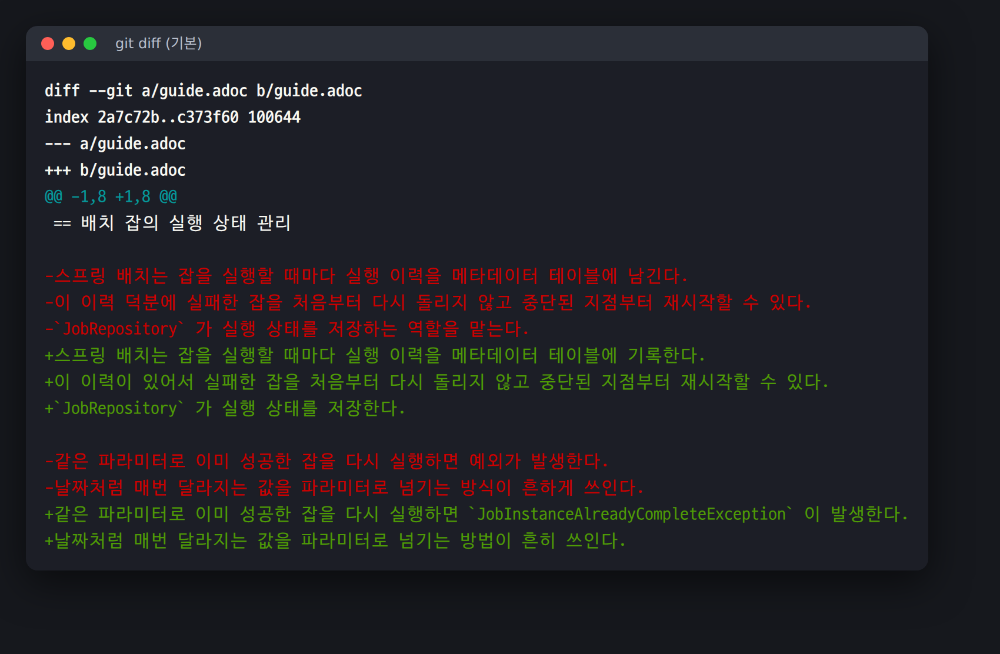
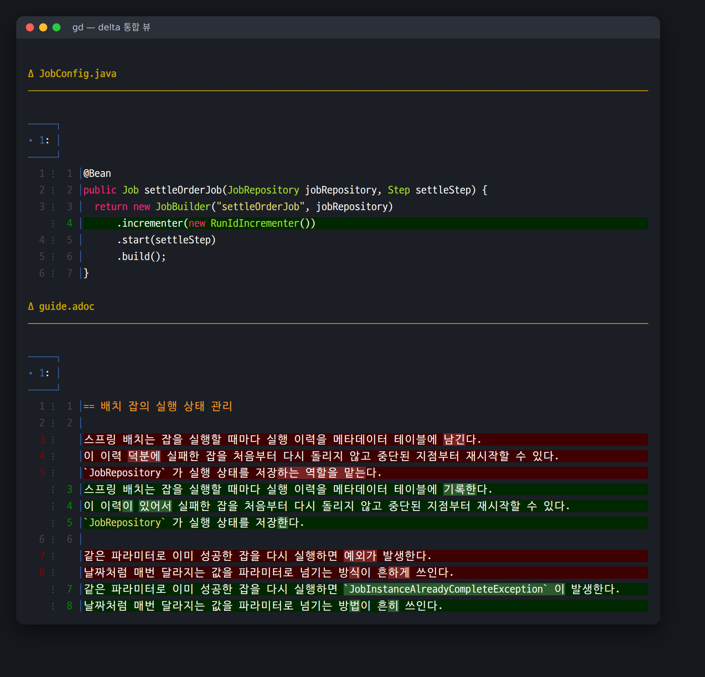
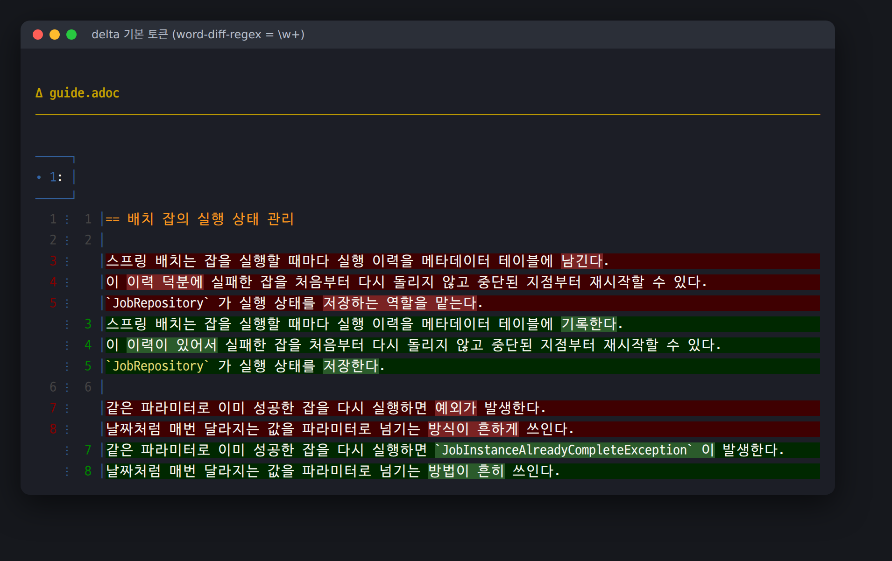
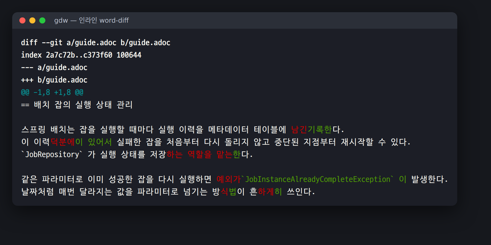
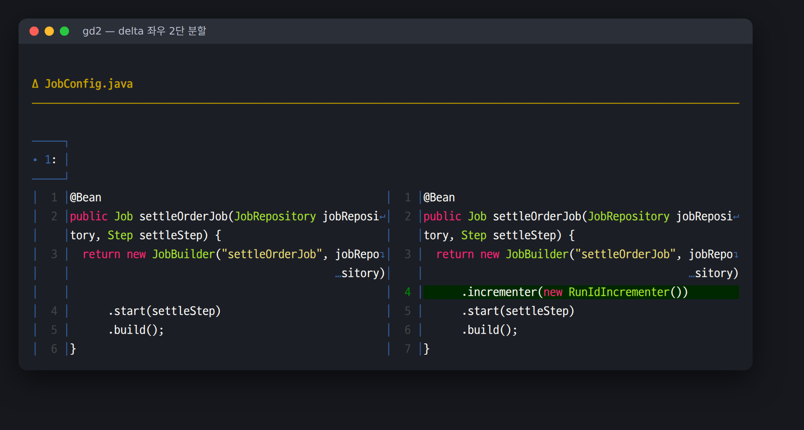

= 터미널 git diff를 GitHub처럼 보기: delta와 word-diff
정상혁
2026-07-31
:jbake-type: post
:jbake-status: published
:jbake-tags: git, linux, zsh
:description: 터미널의 git diff는 한 글자만 고쳐도 줄 전체를 빨강/초록으로 칠합니다. delta의 word-diff-regex 설정과 git 내장 word-diff를 조합해서, 한글 문서에서도 바뀐 부분만 GitHub처럼 정밀하게 강조하는 방법을 정리합니다.
:jbake-og: {"image": "img/git-diff-delta/img-01-delta.png"}
:toc:
:sectnums:
:toclevels: 1
:idprefix:

GitHub UI에서 diff를 보면 바뀐 **단어만** 진한 배경색으로 강조됩니다. 터미널의 `git diff`는 그렇지 않습니다. 한 글자만 고쳐도 줄 전체가 빨강/초록으로 칠해집니다.

한글 문서를 쓰거나 교열할 때 이 차이가 특히 크게 느껴집니다. 문장 하나에서 조사만 바꿨는데 diff에서는 삭제 줄과 추가 줄이 통째로 나오니, 눈으로 두 줄을 대조해서 어디가 달라졌는지 찾아야 합니다.

`남긴다 → 기록한다`, `덕분에 → 이 있어서`, `방식 → 방법`, `흔하게 → 흔히`. 네 군데가 바뀌었는데 위 화면만 보고는 바로 알기 어렵습니다.

이 글은 터미널에서 이 문제를 해결한 설정을 정리한 것입니다. Ubuntu 24.04 + zsh + git 2.43 + scm_breeze 환경에서 확인했습니다.

== delta 설치

https://github.com/dandavison/delta[delta]는 git의 pager를 대체하는 도구입니다. 구문 강조, 줄 번호, 그리고 **줄 안에서 바뀐 부분만 강조하는 기능**을 제공합니다.

apt에도 `git-delta`가 있지만 Ubuntu 24.04 기준 0.16.5로 낡았습니다. sudo 없이 최신 바이너리를 받는 편이 낫습니다.

[source,bash]
----
VER=0.19.2
curl -L -o /tmp/delta.tar.gz \
  https://github.com/dandavison/delta/releases/download/$VER/delta-$VER-x86_64-unknown-linux-gnu.tar.gz
tar xzf /tmp/delta.tar.gz -C /tmp
install -m755 /tmp/delta-$VER-x86_64-unknown-linux-gnu/delta ~/.local/bin/delta
delta --version
----

macOS는 `brew install git-delta`, Arch는 `pacman -S git-delta`로 받으면 됩니다.

== ~/.gitconfig 설정

[source,ini]
.~/.gitconfig
----
[core]
	pager = delta

[interactive]
	diffFilter = delta --color-only

[delta]
	navigate = true
	line-numbers = true
	hunk-header-decoration-style = blue box
	file-style = bold yellow
	file-decoration-style = yellow ul
	# 바뀐 부분만 배경색으로 강조 (GitHub UI와 같은 방식)
	minus-emph-style = normal "#7a2323"
	plus-emph-style = normal "#2b5b2b"
	# 한글은 음절, 영문·코드는 단어 단위로 토큰을 나눈다
	word-diff-regex = "[가-힣]|[A-Za-z0-9_]+|[^ \t]"
	max-line-distance = 1.0

[diff]
	colorMoved = default
	algorithm = histogram

[merge]
	conflictStyle = zdiff3
----

이제 평소처럼 `git diff`를 치면 이렇게 나옵니다.

바뀐 줄은 은은한 배경색, 그 줄에서 **실제로 달라진 부분**은 진한 배경색으로 두 단계로 구분됩니다. GitHub의 diff 화면과 같은 방식입니다.

== 한글 사용자에게 핵심은 word-diff-regex

위 설정에서 가장 중요한 줄은 `word-diff-regex`입니다. 이 줄을 빼면 아래처럼 나옵니다.

delta의 기본값은 `\w+`인데, 유니코드 단어 문자 기준이라 한글 어절 하나가 통째로 토큰이 됩니다. 그래서 `저장하는 역할을 맡는다 → 저장한다`가 어절 세 개를 통째로 칠해 버립니다. 조사 하나만 고쳐도 앞 단어까지 같이 강조되니 정밀도가 떨어집니다.

`[가-힣]`을 앞에 두면 한글은 음절 단위로 쪼개지고, `[A-Za-z0-9_]+`가 뒤에 있어서 영문 식별자와 클래스 이름은 통째로 유지됩니다. 결과적으로 "저장**하는 역할을 맡는**다 → 저장**한**다"처럼 바뀐 부분만 정확히 좁혀집니다.

[CAUTION]
====
이 정규식은 delta에서만 통합니다. delta는 Rust regex(유니코드 인식)를 쓰지만, git 내장 `--word-diff-regex`는 POSIX ERE라 멀티바이트 문자 범위를 처리하지 못합니다.

[source]
----
$ git diff --word-diff-regex='[가-힣]|[A-Za-z0-9_]+' ...
fatal: invalid regular expression: [가-힣]|[A-Za-z0-9_]+
----

git 쪽에서는 대신 `[^[:space:]]`(공백이 아닌 모든 문자)를 쓰면 됩니다. 아래 인라인 word-diff 절에서 씁니다.
====

== 인라인 word-diff: 한 줄에 겹쳐 보기

delta는 삭제 줄과 추가 줄을 위아래로 나란히 보여줍니다. 문장 교열처럼 **한 줄 안의 변화만 확인**하고 싶을 때는 git 내장 `--word-diff`가 더 편합니다. 삭제와 추가가 한 줄에 겹쳐 나오므로 문장을 두 번 읽지 않아도 됩니다.

[source,bash]
----
git diff --word-diff=color --word-diff-regex='[^[:space:]]'
----

`남긴`(빨강)`기록한`(초록)`다`처럼 바로 이어져 나옵니다. `--word-diff-regex='[^[:space:]]'`가 없으면 어절 전체가 잡히므로 이 옵션은 꼭 넣어야 합니다.

delta는 `--word-diff` 출력 형식을 이해하지 못해 색이 깨집니다. 그래서 이 명령은 pager를 `less`로 되돌려야 합니다.

== 좌우 2단 분할

넓은 화면에서 코드를 볼 때는 2단 분할이 낫습니다.

[source,bash]
----
git -c delta.side-by-side=true diff
----

기본값으로 켜지 않고 필요할 때만 켜는 편을 권합니다. 한글 문장은 한 줄이 길어서 폭이 반으로 줄면 줄바꿈이 많이 생깁니다.

== zsh + scm_breeze에 붙이기

https://github.com/scmbreeze/scm_breeze[scm_breeze]를 쓰면 `gd`(= `git diff`), `gdc`(= `git diff --cached`) 같은 단축 alias가 이미 있습니다. 이들은 `git` 함수를 거치므로 `core.pager = delta` 설정을 그대로 탑니다. **즉 `gd`는 아무것도 안 해도 바로 delta로 나옵니다.**

문제는 scm_breeze가 기본 제공하는 `gdw`(= `git diff --word-diff`)입니다. delta를 타면서 색이 깨지고, 한글 정규식도 안 붙어 있습니다. 이것만 다시 정의합니다.

`~/.zshrc`의 scm_breeze `source` 줄 **뒤에** 넣습니다.

[source,sh]
.~/.zshrc
----
# delta 는 --word-diff 출력 형식을 이해하지 못해 색이 깨지므로
# word-diff 계열만 delta 를 우회하도록 다시 정의한다.
# scm_breeze 의 git 함수를 그대로 호출하므로 gs 가 매긴 파일 번호도 쓸 수 있다.
unalias gdw 2>/dev/null
_scmb_word_diff() {
    GIT_PAGER='less -R' git diff --word-diff=color \
        --word-diff-regex='[^[:space:]]' "$@"
}
gdw()  { _scmb_word_diff "$@"; }            # 단어(한글은 음절) 단위 인라인 diff
gdwc() { _scmb_word_diff --cached "$@"; }   # 스테이징된 변경만
gdws() { _scmb_word_diff -U0 "$@"; }        # 문맥 줄 없이 바뀐 곳만
gd2()  { git -c delta.side-by-side=true diff "$@"; }   # delta 좌우 2단 분할
----

`unalias gdw`가 필요한 이유는, zsh에서 alias가 같은 이름의 함수보다 먼저 잡히기 때문입니다. `gds`를 쓰지 않고 `gd2`로 이름을 지은 것도 oh-my-zsh의 git 플러그인이 이미 `gds`를 쓰고 있어서입니다.

scm_breeze를 안 쓴다면 `~/.gitconfig`에 alias로 넣어도 됩니다.

[source,ini]
.~/.gitconfig
----
[alias]
	wd = "!git -c core.pager=less diff --word-diff=color --word-diff-regex='[^[:space:]]' "
	sd = "!git -c delta.side-by-side=true diff "
----

== 같이 켜면 좋은 설정

위 `~/.gitconfig`에 끼워 둔 나머지 항목도 짧게 설명합니다.

[cols="2,3", options="header"]
|===
|설정 |효과

|`interactive.diffFilter = delta --color-only`
|`git add -p`에서도 같은 강조가 적용됩니다

|`diff.colorMoved = default`
|내용은 그대로고 위치만 옮긴 블록을 별도 색으로 표시합니다. 절이나 함수 순서를 바꿀 때 유용합니다

|`diff.algorithm = histogram`
|문단·함수를 옮겼을 때 diff 덩어리가 더 깔끔하게 묶입니다

|`merge.conflictStyle = zdiff3`
|충돌 시 양쪽뿐 아니라 공통 조상 내용까지 보여줍니다

|`delta.navigate = true`
|pager에서 `n` / `N`으로 파일 사이를 건너뜁니다
|===

== 정리

[cols="1,2", options="header"]
|===
|명령 |하는 일

|`git diff` (`gd`)
|delta 통합 뷰. 바뀐 단어만 진한 배경색

|`gd2`
|delta 좌우 2단 분할

|`gdw`
|삭제·추가를 한 줄에 겹쳐 보는 인라인 word-diff

|`gdwc`
|스테이징된 변경만 word-diff

|`gdws`
|문맥 줄 없이 바뀐 곳만 (`-U0`)
|===

한글 문서를 다룬다면 두 가지만 기억하면 됩니다.

. delta에는 `word-diff-regex = "[가-힣]|[A-Za-z0-9_]+|[^ \t]"`
. git 내장 word-diff에는 `--word-diff-regex='[^[:space:]]'`

기본값 그대로 쓰면 한글은 어절 통째로 강조돼서 GitHub만큼 정밀해지지 않습니다.

== 참고 자료

* https://github.com/dandavison/delta[delta: A syntax-highlighting pager for git, diff, grep, and blame output]
* https://dandavison.github.io/delta/[delta 공식 매뉴얼]
* https://git-scm.com/docs/git-diff#Documentation/git-diff.txt---word-diffltmodegt[git diff --word-diff 문서]
* https://github.com/scmbreeze/scm_breeze[scm_breeze]

'''

이 포스트는 Claude Code와 정상혁이 함께 작성했습니다.
