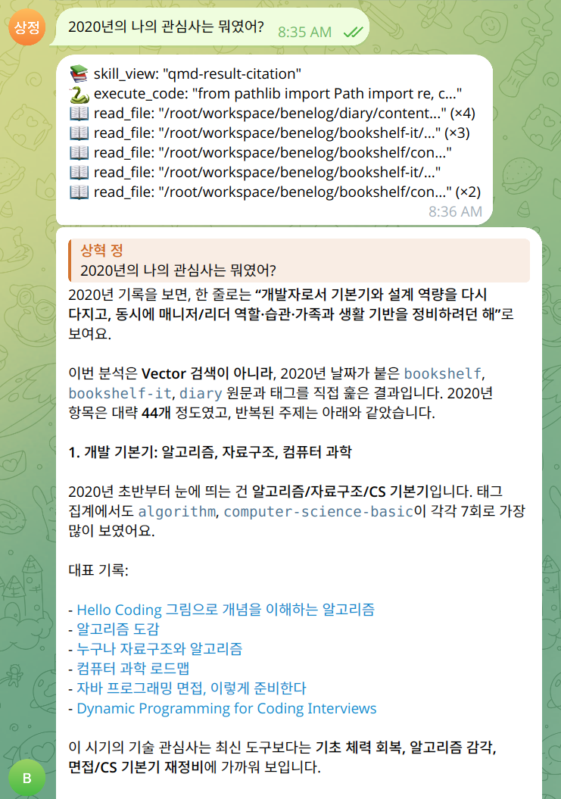

= Hermes와 Modal로 AI agent 챗봇을 0원에 운영하기
정상혁
2026-04-30
:jbake-type: post
:jbake-status: published
:jbake-tags: llm, modal, hermes, telegram
:description: Hermes 에이전트와 Modal 서버리스, Telegram webhook, LLM provider를 조합해 AI 챗봇을 무료로 운영한 기록을 정리합니다.
:jbake-og: {"image": "img/chat-bot/telegram-chat-bot.png"}
:toc:
:sectnums:
:idprefix:

제가 GitHub에 정리한 개인 기록을 근거로 답하는 텔레그램 챗봇을 **고정 비용 0원**으로 운영하고 싶었습니다.
항상 켜 둘만한 개인 PC가 있지도 않았습니다.
그래서 LLM 에이전트인 Hermes와 서버리스 플랫폼인 Modal, Telegram 웹훅 등의 여러 기술을 조합하여 챗봇을 띄웠습니다.
그 선택 과정과 핵심 코드를 이 글에서 정리했습니다.

이 구성은 **트래픽이 많지 않고**, Modal의 월별 무료 크레딧 안에서 호출과 저장소 사용량이 감당되며, QMD 임베딩 갱신을 아주 자주 돌리지 않는다는 전제에서 0원에 가깝게 운영할 수 있습니다.

== 챗봇의 기능

제가 그동안 개인적으로 기록해둔 블로그, 독서 감상문, 일기, 개발 관련 링크 모음은 Markdown이나 Asciidoc 형태로 GitHub 저장소에 쌓여 있습니다. 일종의 개인 지식 DB입니다.
해당 지식 저장소들을 한 번에 검색해서 대답을 하는 Telegram 챗봇을 만들었습니다.

아래와 같은 질문들에 재미있는 답을 해주었습니다.

* 내가 가장 재미있게 읽은 만화책은?
* 내가 가장 감명 깊게 보낸 한 해는?
* 나의 주 관심사와 어울리는 책을 추천해줘.

=== 지식 DB 소스

봇이 답할 때 참고하는 문서는 `scripts/QMD_repos.yml`에 정의했습니다.

[source,yaml]
.QMD_repos.yml
----
repos:
  - name: blog
    repo_url: git@github.com:benelog/blog.git
    branch: master
    collection_path: src/content
    pattern: "**/*.{md,adoc}"
  - name: wiki
    ...
----

`sync_qmd` 함수는 이 manifest를 기준으로 repo를 clone/pull하고, repo 내부의 `collection_path`만 QMD config에 연결합니다. 내가 평소 쓰는 노트 저장소(블로그, 위키, devnote, 책장, 일기 등)가 그대로 챗봇의 지식 베이스가 됩니다.

문서를 갱신하고 싶을 때는 텔레그램 채팅창에서 봇에게 "qmd 갱신해줘", "최신 내용 가져와" 같이 요청합니다. `sync-qmd` 스킬이 git pull과 QMD 인덱싱을 실행해줍니다. 동일한 동작은 로컬에서 다음 명령으로도 트리거할 수 있습니다.

[source,bash]
----
modal run modal_app.py::sync_qmd          # repo만 갱신
modal run modal_app.py::sync_qmd --embed  # 임베딩까지
----

이걸 cron이나 GitHub Actions로 주기 호출하면 챗봇 지식이 자동 최신화됩니다.

== 구성 요소

챗봇은 다음과 같은 구성요소로 설계했습니다.

[cols="1,1,2", options="header"]
|===
^|컴포넌트 ^|역할 ^| 설명
|Hermes |LLM 에이전트 | Telegram webhook gateway, MCP 클라이언트, 에이전트 루프를 모두 제공
|QMD | 검색 엔진 | Markdown, Asciidoc 을 임베딩으로 인덱싱하고 의미 검색을 MCP로 제공
|Modal | 실행 환경 | 컨테이너 실행, 데이터 저장 공간
|===

OpenClaw와 Hermes를 비교하는 글에서 Hermes가 클라우드에 올리기 편하다는 설명을 보고 선택했습니다.
QMD는 알고 있던 기술이라 제가 골랐습니다.
Modal은 Gemini의 추천을 받아서 선택했습니다.
Hermes의 소개글에서 클라우드 실행 환경으로는 Daytona와 Modal을 사용할 수 있다는 설명을 먼저 보고, Gemini에게 무료로 챗봇 운영을 하기에 유리한 플랫폼을 추천해달라고 요청한 결과입니다.

LLM 에이전트는 처음엔 OpenClaw를 썼는데, 위 구성으로 가려고 Hermes로 옮겼습니다. Hermes가 OpenClaw 데이터 마이그레이션을 지원해서 큰 어려움은 없었습니다.

=== LLM 엔진

LLM 엔진은 GPT 5.5로 연동했습니다.
평소 주로 쓰는 모델은 Claude 계열이지만, 해당 시점에서는 개인 구독하는 Claude 상품이 Hermes와 연동이 되지 않아서 ChatGPT 구독을 통한 GPT 5.5를 선택했습니다.

=== Modal의 운영 모델

Modal은 실제 사용자 호출을 처리하는 동안에만 컨테이너가 깨어나는 서버리스 플랫폼입니다.
대기 시간에는 비용이 발생하지 않고, 현재 Starter 플랜에서는 월 $30의 무료 크레딧이 제공되므로 트래픽이 띄엄띄엄한 Telegram 챗봇은 그 범위 안에서 0원으로 운영할 수 있을 것으로 예상합니다.
대신 서버가 깨어나는 첫 호출에는 cold start 지연이라는 트레이드오프가 있습니다. 첫 메시지는 몇 초~십수 초 늦게 답이 옵니다. 챗봇이 지연에 민감하지 않다면 받아들일 만한 단점입니다.

OpenClaw에서는 기본적으로는 long polling으로 Telegram과 연동을 합니다.
long polling을 하기 위해서는 서버가 계속 켜져 있어야 하기에 Modal을 통해 추구하는 "필요할 때만 깨어나는" 운영 모델과는 맞지 않았습니다. 그래서 Hermes로 전환하면서 Telegram의 webhook을 통해 연동하는 구조로 바꿨습니다.

== 챗봇 앱의 핵심 코드

Modal로 실행하는 파이썬 앱의 구현과 세부 설계는 Claude Code의 도움을 받았습니다. 최소 비용이라는 목적을 설명하니 구체적인 설정을 작성해주었습니다.

=== 최소 재현 절차

처음부터 같은 구성을 따라 하려면 아래 순서로 접근하는 편이 덜 헷갈립니다.

. Telegram bot token, LLM provider 인증 정보, GitHub token을 준비합니다.
. Modal의 Secret과 Volume을 생성합니다.
. `TELEGRAM_WEBHOOK_URL` 없이 먼저 `modal deploy` 해서 외부 URL을 발급받습니다.
. 발급받은 URL을 Telegram webhook과 Modal secret에 반영한 뒤 다시 `modal deploy` 합니다.
. `modal run modal_app.py::sync_qmd --embed`를 실행해서 지식 저장소를 가져오고 인덱스를 만듭니다.

이후에는 Telegram에서 메시지를 보내 챗봇을 호출하고, 문서가 바뀌면 `sync_qmd`만 다시 돌리면 됩니다.

=== 메시지가 올 때만 프로세스가 깨어나게

[source,python]
.modal_app.py
----
@app.function(
    image=image,
    secrets=[secret, github_secret],
    volumes=volume_mounts,
    timeout=60 * 60,
    max_containers=1,
    scaledown_window=60 * 10,
    env=common_env,
)
@modal.concurrent(max_inputs=50)
@modal.web_server(WEBHOOK_PORT, startup_timeout=120)
def gateway():
    ...
----

* `min_containers`를 **지정하지 않았습니다.** 24/7 고정 컨테이너가 없어 대기 시의 비용이 0이 됩니다.
* `scaledown_window=600`으로 10분 동안 요청이 없으면 자동 종료합니다.
* `max_containers=1`로 두 개 이상 컨테이너가 동시에 webhook을 받지 않게 막았습니다. Telegram bot token은 webhook을 받는 주체가 둘 이상이면 동작이 불안정합니다. 한 컨테이너 안에서의 동시 처리는 `@modal.concurrent(max_inputs=50)`로 받습니다.

=== 갱신 주기에 따른 Volume 분리

영속적으로 저장되어야할 파일은 Modal의 Volume에 저장했습니다. 이를 이용해서 Hermes 설정 파일, QMD 인덱스, 지식 DB 역할의 Git 저장소가 컨테이너 재시작과 무관하게 유지됩니다.
Volume은 아래 4개로 나눴습니다.

[source,python]
.modal_app.py
----
hermes_volume    = modal.Volume.from_name("hermes-home", ...)
workspace_volume = modal.Volume.from_name("hermes-workspace", ...)
QMD_cache_volume = modal.Volume.from_name("QMD-cache", ...)
QMD_config_volume = modal.Volume.from_name("QMD-config", ...)
----

각 Volume의 수명과 갱신 주기가 다릅니다.

* `hermes-home`: Hermes config, runtime skill, OAuth `auth.json`. 크기는 작고, 컨테이너 재시작마다 일부가 갱신됩니다.
* `hermes-workspace`: QMD가 인덱싱하는 git 저장소들. 크기가 가장 크고, `sync_qmd` 호출 때만 갱신됩니다.
* `QMD-cache`: 임베딩/리랭크 GGUF 모델과 캐시. 거의 안 바뀌지만 용량이 큽니다.
* `QMD-config`: QMD index 설정. 작고 자주 바뀌지 않습니다.

한 Volume에 다 몰아넣으면 데이터 저장, 갱신을 할 때 상관없는 큰 데이터까지 함께 끌려옵니다.
갱신 주기가 비슷한 것끼리 묶는 편이 안전하고 효율적입니다.

=== 연동 시스템을 위한 Secret 관리

GitHub, ChatGPT, Telegram 등 다른 시스템과 연동을 하기 위한 Secret도 2개로 나눴습니다.
secret의 원본 저장소와 갱신하는 프로세스를 분리하기 위해서입니다.

* ChatGPT, Telegram 인증을 위한 secret: `scripts/create_modal_secret.py`는 로컬 `~/.hermes/.env`와 `auth.json`에서 Modal secret을 만듭니다. 내부적으로 `modal secret create --force`를 써서 secret 전체를 통째로 교체합니다.
* GitHub Access token : Modal의 UI에서 직접 입력하도록 의도했습니다.

`modal_app.py`는 두 그룹의 secret을 함께 주입합니다.

[source,python]
.modal_app.py
----
secret = modal.Secret.from_name("hermes-modal-secrets")
github_secret = modal.Secret.from_name("github-secret")

@app.function(secrets=[secret, github_secret], ...)
def gateway(): ...
----

=== idempotent한 부팅 스크립트

`gateway`, `sync_qmd`, `doctor` 함수 모두 시작할 때 `scripts/prepare_runtime.py`를 호출합니다. 이 스크립트가 하는 일은 다음과 같습니다.

* `auth.json` 작성 (base64로 secret에 들어 있는 OAuth 토큰)
* Hermes `config.yaml`, `.env` 작성
* `~/.hermes/SOUL.md`, `~/.hermes/skills/`, `~/.hermes/hooks/`를 image의 `scripts/` 트리와 동기화
* (옵션) 지식 repo clone/pull과 QMD 인덱싱

핵심은 **컨테이너가 어떤 상태에서 시작하더라도 같은 결과**가 나오게 하는 것입니다. Modal Volume에 이전 실행의 부산물이 남아 있어도, image에서 새로 실어 보낸 skill이 있어도, 이 스크립트 한 번이면 정상 상태로 수렴합니다.

=== 런타임에 추가되는 skill을 git으로 관리하기

Hermes는 실행 중에 새로운 skill이 생기거나 기존 skill이 업데이트될 수 있는 Agent입니다.
agent의 주인인 제가 그 변화를 추적하고 필요하면 직접 수정할 필요성도 있다고 판단했습니다.
그래서 Modal Volume에 저장되는 skill도 변화가 있을 때 git으로 자동으로 커밋되고 푸시되도록 구성했습니다.

Hermes가 실행 중 만든 skill을 다시 git repo로 push하는 흐름은 link:https://github.com/benelog/hermes-modal/blob/main/scripts/hooks/skills-autocommit/HOOK.yaml[`scripts/hooks/skills-autocommit/HOOK.yaml`] 훅으로 걸어 두었습니다.

[source,yaml]
.HOOK.yaml
----
name: skills-autocommit
description: Push HERMES_HOME/skills changes back to the hermes-modal git repo after each agent turn.
events:
  - agent:end
----

`agent:end` 이벤트가 매 에이전트 종료마다 발생할 때 link:https://github.com/benelog/hermes-modal/blob/main/scripts/commit_skills.py[`commit_skills.py`]가 호출됩니다. 이 스크립트는 Modal Volume의 `~/.hermes/skills/` 변경분을 hermes-modal repo의 `scripts/skills/`로 복사하고 push합니다. 결과적으로 `git log`에 `Sync skills from Modal volume` 커밋이 자동으로 쌓입니다.

이 구조에는 두 가지 의미가 있습니다.

* **runtime에서 학습한 동작이 image로 흡수됩니다.** 다음 컨테이너 부팅 때 `prepare_runtime.py`가 image의 `scripts/skills/`를 그대로 Volume에 sync하므로, 결국 Volume은 image를 따라가게 됩니다.
* **에이전트가 스스로를 진화시키는 사이클**이 git에 그대로 남습니다. 어떤 skill이 언제 추가됐는지를 commit log로 확인하고, 사람이 review/revert 할 수 있습니다.

`commit_skills.py`에는 안전장치 두 개를 두었습니다.

[source,python]
.commit_skills.py
----
LOCK_FILE = Path("/tmp/hermes-modal-commit-skills.lock")
FINGERPRINT_FILE = SKILLS_DIR / ".last_committed_hash"
----

* **flock**으로 동시에 여러 호출이 들어와도 직렬화합니다.
* **SHA256 fingerprint**로 skill 트리가 안 바뀌었으면 git clone조차 하지 않고 빠르게 끝냅니다. `agent:end`는 매 에이전트 실행마다 발생하므로 변경이 없을 때의 비용을 0에 가깝게 두는 것이 중요합니다.

디버깅 등 수동으로 트리거하고 싶을 때는 `modal run modal_app.py::commit_skills`를 사용합니다.

== 배포, 운영
=== webhook URL을 위한 두 단계 배포

Modal에서 webhook 봇을 띄울 때 자주 부딪히는 닭-달걀 문제가 있습니다.

* Telegram에 webhook URL을 등록하려면 Modal URL이 필요합니다.
* 그런데 Modal URL은 deploy 후에야 알 수 있습니다.

이 문제를 해결하기 위해 `gateway` 함수가 `TELEGRAM_WEBHOOK_URL`이 비어 있으면 placeholder HTTP 서버만 띄우고 끝냅니다.

[source,python]
.modal_app.py
----
if not os.environ.get("TELEGRAM_WEBHOOK_URL", "").strip():
    print("TELEGRAM_WEBHOOK_URL is not set; starting placeholder server ...")
    subprocess.Popen(["python", "-m", "http.server", str(WEBHOOK_PORT), ...])
    return

subprocess.Popen(["bash", "-lc",
    "while true; do hermes gateway run --replace; ... done"], env=os.environ.copy())
----

흐름은 이렇습니다.

. webhook URL 없이 `modal deploy` → Modal URL 발급
. 그 URL을 secret에 넣고 다시 `modal deploy` → Hermes가 정상 webhook 모드로 전환

Hermes를 `while true; do ... done` 루프로 감싼 까닭은, 일시적인 네트워크 문제나 OAuth refresh 실패로 프로세스가 죽었을 때 곧바로 다시 띄우기 위해서입니다.

=== ChatGPT(Codex) OAuth refresh token 충돌

챗봇이 다음과 같이 에러 응답을 하는 상황이 있었습니다.

[source,text]
----
Provider authentication failed: Codex refresh token was already consumed by
another client (e.g. Codex CLI or VS Code extension). Run codex in your
terminal to generate fresh tokens, then run hermes auth to re-authenticate.
----

OAuth refresh token이 갱신되면서 Modal의 앱이 참조하는 토큰이 무효화된 것이 원인이었습니다.
당장의 복구는 ChatGPT 인증을 다시 하고 `~/.hermes/auth.json`을 새로 받아 Modal Secret을 다시 올리고 재배포하는 것입니다.
근본 해결은 provider를 OpenRouter/Anthropic/OpenAI API key 같은 단순 키 방식으로 바꾸는 것입니다.
토큰 회전이 없는 provider는 이 충돌이 아예 없습니다. 무료에 가깝게 쓰겠다는 처음 목표 때문에 OAuth provider를 일단 유지하고 있습니다.

== 핵심 팁 정리

이 프로젝트를 통해 얻은 서버리스 플랫폼에서의 AI 챗봇 운영 팁은 다음과 같습니다.

* **고정 비용을 피하려면 대기 비용을 최소화** : Modal에서는 `min_containers`를 두지 않고 `scaledown_window`만 짧게 잡는 것이 free tier 친화적입니다.
* **상태를 다시 만들 수 있게 부팅 과정을 idempotent하게** : Volume에 이전 실행 흔적이 남아도 `prepare_runtime.py` 한 번으로 원하는 상태로 수렴하게 하는 것이 운영 부담을 줄입니다.
* **갱신 주기가 다른 데이터는 Volume도 분리** : 설정, 캐시, 지식 저장소를 따로 두면 큰 데이터를 괜히 함께 흔들지 않게 됩니다.
* **에이전트의 runtime 변경이 의미가 있다면 git으로 관리** : 서버 Volume에만 남으면 데이터를 잃기 쉽고, 사람이 추적, 수정 하기가 어렵습니다.
* **Long polling 보다는 Webhook 방식으로** : 챗봇을 위한 프로세스가 항상 켜져 있을 필요가 없는 Webhook 방식이 서버리스 플랫폼과 더 잘 맞습니다.
** 초기 배포는 두 단계 : webhook URL이 deploy 이후에 생기는 구조라면 URL 확보를 위한 배포가 먼저 필요합니다.

== 참고 자료

* link:https://github.com/benelog/hermes-modal[hermes-modal] — 이 글에서 설명한 저장소
* link:https://modal.com/docs[Modal docs] — Volume, Secret, web_server, concurrent 등의 공식 문서
* link:https://github.com/NousResearch/hermes-agent[Hermes Agent] — Nous Research의 LLM 에이전트 프레임워크
* link:https://github.com/tobilu/QMD[QMD] — markdown/asciidoc 임베딩 검색 MCP
* link:https://core.telegram.org/bots/webhooks[Telegram Bot API: Webhooks] — webhook 모드 공식 문서

'''

이 포스트는 Claude Code와 정상혁이 함께 작성했습니다.
