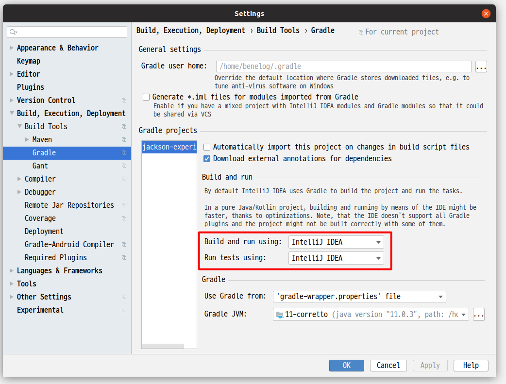
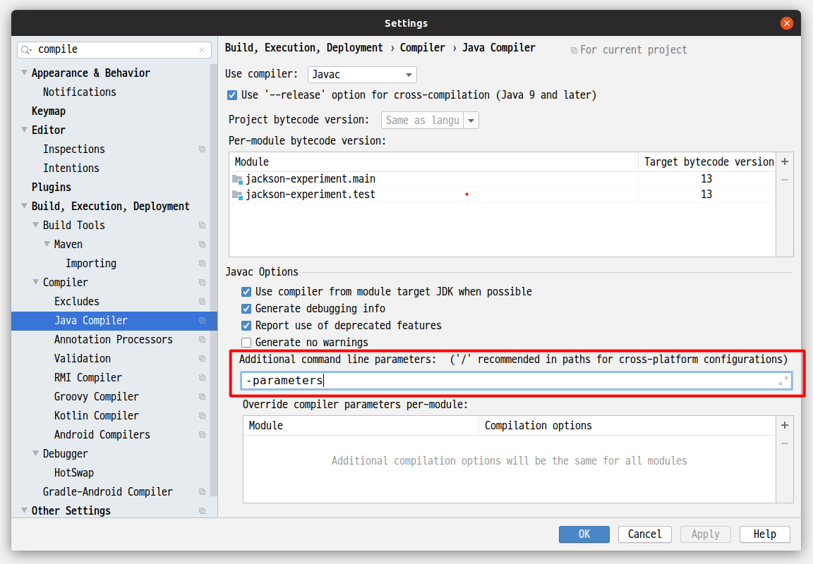
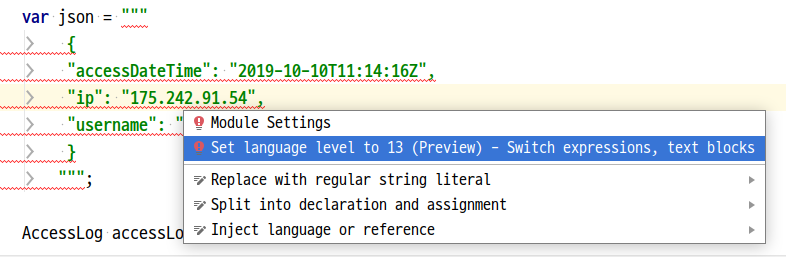

= Jackson으로 파싱한 JSON 속성값을 생성자로 전달하기
정상혁
2020-03-15
:jbake-type: post
:jbake-status: published
:jbake-tags: jackson,java
:jbake-description: Jackson으로 JSON을 파싱한 속성값을 객체의 생성자로 전달할 수 있는 여러가지 방법을 정리했습니다.
:jbake-og: {"image": "img/jackson/text-blocks.png"}
:idprefix:
:toc:
:sectnums:
:source-repo: https://github.com/benelog/jackson-expriment
:source-link-base: ${source-repo}/tree/master

== Jackson에서 `(no Creators, like default construct, exist)` 에러 메시지

[source,json]
.파싱하고자하는 JSON
----
{
    "accessDateTime": "2019-10-10T11:14:16Z",
    "ip": "175.242.91.54",
    "username": "benelog"
}
----

위와 같은 JSON을 파생해서 아래와 같이 setter가 없는 객체에 집어 넣고 싶은 경우가 있습니다.

[source,java]
.파싱한 결과를 넣을 클래스
----
public class AccessLog {
    private final Instant accessDateTime;
    private final String ip;
    private final String username;

    public AccessLog(Instant accessDateTime, String ip, String username) {
        this.accessDateTime = accessDateTime;
        this.ip = ip;
        this.username = username;
    }

    public Instant getAccessDateTime() {
        return accessDateTime;
    }

    public String getIp() {
        return ip;
    }

    public String getUsername() {
        return username;
    }
}
----

Jackson 라이브러리로 JSON을 파싱하는 테스트 코드를 아래처럼 작성했습니다.

[source,java]
.테스트 코드
----
class ConstructorPropertiesTest {
    @Test
    void parse() throws JsonProcessingException {
        var json = """
            {
            "accessDateTime": "2019-10-10T11:14:16Z",
            "ip": "175.242.91.54",
            "username": "benelog"
            }
            """;

        var objectMapper = new ObjectMapper()
            .disable(SerializationFeature.WRITE_DATES_AS_TIMESTAMPS)
            .registerModule(new JavaTimeModule());

        AccessLog accessLog = objectMapper.readValue(json, AccessLog.class);

        then(accessLog.getAccessDateTime()).isEqualTo("2019-10-10T11:14:16Z");
        then(accessLog.getIp()).isEqualTo("175.242.91.54");
        then(accessLog.getUsername()).isEqualTo("benelog");;
    }
}
----

위의 코드를 실행하면 다음의 Exception이 떨어집니다.
`(no Creators, like default construct, exist)` 이 핵심적인 메시지입니다.

[source]
----
com.fasterxml.jackson.databind.exc.InvalidDefinitionException: Cannot construct instance of `net.benelog.jackson.ConstructorPropertiesTest$AccessLog` (no Creators, like default construct, exist): cannot deserialize from Object value (no delegate- or property-based Creator)
 at [Source: (String)"{
"accessDateTime": "2019-10-10T11:14:16Z",
"ip": "175.242.91.54",
"username": "benelog"
}
"; line: 2, column: 1]

	at com.fasterxml.jackson.databind.exc.InvalidDefinitionException.from(InvalidDefinitionException.java:67)
	at com.fasterxml.jackson.databind.DeserializationContext.reportBadDefinition(DeserializationContext.java:1592)
	at com.fasterxml.jackson.databind.DeserializationContext.handleMissingInstantiator(DeserializationContext.java:1058)
	at com.fasterxml.jackson.databind.deser.BeanDeserializerBase.deserializeFromObjectUsingNonDefault(BeanDeserializerBase.java:1297)
	at com.fasterxml.jackson.databind.deser.BeanDeserializer.deserializeFromObject(BeanDeserializer.java:326)
	at com.fasterxml.jackson.databind.deser.BeanDeserializer.deserialize(BeanDeserializer.java:159)
	at com.fasterxml.jackson.databind.ObjectMapper._readMapAndClose(ObjectMapper.java:4218)
	at com.fasterxml.jackson.databind.ObjectMapper.readValue(ObjectMapper.java:3214)
	at com.fasterxml.jackson.databind.ObjectMapper.readValue(ObjectMapper.java:3182)
----

JSON을 파싱한 결과를 전달할 적절한 생성자를 찾지 못했을 때 발생하는 에러입니다.
이 문제를 해결하는 방법을 정리합니다.

== 생성자로 JSON 속성값을 전달하는 방법들

=== `@JsonCreator`

Jackson에서 제공하는 `@JsonCreator`, `@JsonProperty` 를 값을 전달할 생성자와 메서드 파라미터에 붙입니다.

[source,java]
.AccessLog의 생성자에 `@JsonCreator` 선언
----
import com.fasterxml.jackson.annotation.JsonCreator;
import com.fasterxml.jackson.annotation.JsonProperty;

public class AccessLog {

    // 멤버 변수 선언 생략

    @JsonCreator
    public AccessLog(
        @JsonProperty("accessDateTime") Instant accessDateTime,
        @JsonProperty("ip") String ip,
        @JsonProperty("username") String username) {

        this.accessDateTime = accessDateTime;
        this.ip = ip;
        this.username = username;
    }

    // getter 생략
}
----

* 장점
** JSON의 속성명과 객체의 멤버변수명이 다를 때도 자연스럽게 활용할 수 있습니다.
** 생성자가 에러 개 일때 Jackson에서 사용할 생성자를 명시적으로 지정할 수 있습니다.
* 단점
** Jackson에 의존적인 방법입니다.
*** Jar파일로 배포하는 클래스 안에서 이 방법을 사용하려면 Jackson에 대한 의존성이 추가됩니다.
*** JSON 파싱 라이브러리를 교체한다면 전체 클래스를 수정해야 합니다.

=== `@ConstructorProperties`

JDK 1.6부터 제공되었던 `@java.beans.ConstructorProperties` 은 생성자의 파라미터 이름을 지정하는 표준적인 방법입니다.
이를 활용하면 생성자의 파라미터 이름을 Reflection API를 통해서 알 수 있습니다.
Jackson은 2.7.0버전부터 `@ConstructorProperties` 를 인지합니다. ( https://github.com/fasterxml/jackson-databind/issues/905 참조)

생성자에 `@ConstructorProperties` 으로 파라미터의 이름을 지정하면, Jackson에서는 동일한 이름의 JSON솔성값을 생성자로 넘겨줍니다.

[source,java]
.AccessLog의 생성자에 `@ConstructorProperties`로 속성명 지정
----
import java.beans.ConstructorProperties;

public class AccessLog {

    // 멤버 변수 선언 생략

    @ConstructorProperties({"accessDateTime", "ip", "username"})
    public AccessLog(Instant accessDateTime, String ip, String username) {
        this.accessDateTime = accessDateTime;
        this.ip = ip;
        this.username = username;
    }

    // getter 생략
}
----

Lombok을 활용한다면 이 과정을 더 편하게 할 수 있습니다.
`lombok.config` 를 다음과 같은 선언을 하면 Lombok에서 만드는 생성자에서 `@ConstructorProperties` 를 자동으로 넣어줍니다.

[source,properties]
.lombok.config 설정
----
lombok.anyConstructor.addConstructorProperties=true
----

`@Builder`, `@AllArgsConstructor` 와 같은 애노테이션을 클래스에 붙이면 Lombok에서는 자동으로 생성자를 만들어줍니다.
이를 통해 JSON 파싱한 값을 넣을 클래스를 더 단순하게 만들 수 있습니다.

[source,java]
.Lombok을 이용한 AccessLog 클래스 선언
----
@Builder
@Getter
@ToString
public class AccessLog {
    private final Instant accessDateTime;
    private final String ip;
    private final String username;
}
----

참고로 Lombok v1.16.20 전까지는 디폴트로 `@ConstructorProperties` 을 넣어줬었다고 합니다.
이 이후 버전부터는 디폴트가 아니므로 `lombok.config` 에 명시적인 선언이 필요합니다.
( https://multifrontgarden.tistory.com/222 참조 )

`@ConstructorProperties` 를 직접 쓸 때의 장단점은 다음과 같다고 생각합니다.

* 장점
** `@JsonCreator` + `@JsonProperties` 보다는 코딩량이 조금 적습니다.
** Jackson에 의존적이지 않습니다.
*** JSON을 파싱한 값이 들어가는 클래스를 jar 파일로 배포할 때 Jackson의 의존관계가 딸려들어가지 않습니다.
*** 같은 방식을 지원하는 다른 JSON 파싱 라이브러리로 교체할 때 코드 변경이 없습니다.
* 단점
** JSON의 속성명과 생성자의 실제 파라미터 명이 다른 경우에는 사용하는 것이 부자연스럽습니다.

만약 아래와 같이 `@ConstructorProperties` 에서는 "ip_address"로 지정한 속성이 실제 파라미터이름이 `String ip` 경우라면, 코드로는 잘 동작하지만 애노테이션의 원래 의도하는 어긋난 것이 아닌가 하는 생각이 들었습니다.

[source,java]
----
    @ConstructorProperties({"accessDateTime", "ip_address", "username"})
    public AccessLog(Instant accessDateTime, String ip, String username) {
        this.accessDateTime = accessDateTime;
        this.ip = ip;
        this.username = username;
    }
----

`@ConstructorProperties` + Lombok 은 코드량이 적다는 장점이 있지만 멤버 변수의 이름이 JSON 속성명과 일치해야 한다는 단점도 있습니다.
jar 파일로 배포하는 클래스라면 Lombok에 대한 의존성이 부담스러울수도 있습니다.

=== ParameterNameModule 활용

앞의 예제들을 보면 `@JsonProperty("ip")` 와 같이 지정하는 속성의 이름과 생성자의 파라미터의 이름이 동일합니다.
`String ip` 와 같이 생성자의 파라미터의 이름을 바로 가지고 올 수 있다면 일일히 속성명을 지정하지 않을 수 있겠다는 생각이 들만합니다.

그런데 JDK 8이 나오기 전까지는 Reflection만으로는 파라미터 이름을 가지고 올 수 없었고, ASM과 같은 바이트코드 조작 라이브러리를 이용해서 디버깅을 위한 정보를 이용해야만 가능했습니다. ( https://stackoverflow.com/questions/2729580/how-to-get-the-parameter-names-of-an-objects-constructors-reflection#2729907 참조) 그래서 앞서 소개한 `@java.beans.ConstructorProperties` 와 같은 애노테이션도 활용되었습니다.

JDK8 이상에서는 컴파일을 할 때 `-parameters` 라는 옵션을 붙이면 Reflection API로 파라미터 정보를 가지고 올수 있도록 컴파일된 클래스에 정보를 덧붙여 줍니다.
Gradle을 쓰고 있다면 아래와 같이 설정할 수 있습니다.

[source]
.build.gradle 안의 컴파일 옵션에 추가
----
tasks.withType(JavaCompile).each {
    it.options.compilerArgs.add('-parameters')
}
----

IDE 안에서도 컴파일 옵션을 신경써줘야합니다.

IntelliJ에서는 `Settings` > `Build, Execution, Development` > `Build Tools` > `Gradle` 에서 `Build and Run using:` 옵션을 확인해 봅니다.

이 옵션값이 `Gradle(Default)`로 되어 있다면, `build.gradle` 의 컴파일 옵션이 그대로 쓰입니다.
만약 그 값이 `IntelliJ IDEA` 로 되어 있다면 IntelliJ 안에서의 Java 컴파일 옵션도 동일하게 맞춰 줘야합니다.

`Settings` > `Build, Execution, Development` > `Compiler` > `Java Compiler` 메뉴에서 `Addtional command line parameters` 옵션에 `-parameters` 을 적어줍니다.
옵션을 바꾼 후에는 전체 프로젝트를 리빌드합니다.
( `Build` > `Rebuild Project` )

Jackson의 ParameterNameModule 을 쓰기 위해서는 다음과 같이 의존성을 추가해야합니다.

[source,groovy]
.ParameterNameModule 의존성 추가
----
    implementation 'com.fasterxml.jackson.module:jackson-module-parameter-names:2.10.3'
----

`ObjectMapper` 선언에서는 `registerModule()` 메서드로 `ParameterNamesModule` 을 추가합니다.

[source,ObjectMapper 선언]
.ObjectMapper에 ParameterNamesModule 추가
----
    var objectMapper = new ObjectMapper()
        .disable(SerializationFeature.WRITE_DATES_AS_TIMESTAMPS)
        .registerModule(new JavaTimeModule())
        .registerModule(new ParameterNamesModule());
----

이렇게 하면 생성자에 특별한 애너테이션을 붙이지 않아도 Jackson은 JSON의 속성을 생성자에게 전달됩니다.

Spring Boot에서는 `ParameterNamesModule` 을 편하게 쓸 수 있도록 아래와 같은 기본 설정이 제공됩니다.

* Spring Boot Gradle Plugin에서 Java 컴파일의 `-parameters` 옵션이 자동 추가됩니다.
** ( https://github.com/spring-projects/spring-boot/blob/master/spring-boot-project/spring-boot-tools/spring-boot-gradle-plugin/src/main/java/org/springframework/boot/gradle/plugin/JavaPluginAction.java#L144[JavaPluginAction.java#L144] 참조 )
* `spring-boot-starter-web` 에서 이미 `jackson-module-parameter-names` 에 대한 의존성이 추가되어 있습니다.
** https://mvnrepository.com/artifact/org.springframework.boot/spring-boot-starter-web/2.2.5.RELEASE[spring-boot-starter-web] -> https://mvnrepository.com/artifact/org.springframework.boot/spring-boot-starter-json/2.2.5.RELEASE[spring-boot-starter-json] -> `jackson-module-parameter-names` 로 의존관계가 연결됩니다.
* 디폴트로 등록되는 `ObjectMapper` bean에는 `ParameterNamesModule` 이 이미 추가되어 있습니다.
** https://github.com/spring-projects/spring-boot/blob/33e414fcb2f04bec653f799228907a577ac27a10/spring-boot-project/spring-boot-autoconfigure/src/main/java/org/springframework/boot/autoconfigure/jackson/JacksonAutoConfiguration.java#L108[JacksonAutoConfiguration.java#L108] 참조
** `RestTeamplteBuilder` 로 `RestTemplate` 을 생성한다면 디폴트 등록된 ObjectMapper 을 참조하는  `MappingJackson2HttpMessageConverter` 가 `RestTemplate` 에 주입됩니다.

`ParameterNamesModule` 은 Lombok에서 자동으로 만든 생성자도 잘 인식합니다.
`lombok.config` 에 추가 설정을 하지 않아도 된다는 점이 `@ConstructorProperties` 를 쓸 때와의 차이점입니다.

이 방식의 장단점은

* 장점
** 코드가 짧습니다.
** Jackson에 대한 의존성이 없습니다.
* 단점
** 생성자의 파라미터명과 JSON 속성의 이름이 반드시 일치해야 합니다.
*** 생성자의 파라미터 이름이 JSON파싱에 쓰인다는것을 의식하지 않는다면, 파라미터 명을 잘 모르고 고쳐서 JSON 파싱이 안되게 하는 부작용이 쓰일수 있습니다.
** 컴파일 옵션을 의식하지 않으면 특정 개발자의 IDE에서는 의도대로 동작하지 않을수 있습니다.
** 생성자가 여러 개 일때는 `@JsonCreator` 와 같은 다른 방식과 병행해서 써야 합니다.

== 예제 소스 저장소

예제는 {source-repo} 에 올려두었습니다.

* `@JsonCreator` 활용 : link:{source-link-base}/src/test/java/net/benelog/jackson/JsonCreatorTest.java[JsonCreatorTest.java]
* `@ConstructorProperties` 활용 : link:{source-link-base}/src/test/java/net/benelog/jackson/ConstructorPropertiesTest.java[ConstructorPropertiesTest.java]
** + Lombok : link:{source-link-base}/src/test/java/net/benelog/jackson/LombokTest.java[LombokTest.java], link:lombok.config[lombok.config]
* `ParameterNameModule` 활용 : link:{source-link-base}/src/test/java/net/benelog/jackson/ParameterNameModuleTest.java[ParameterNameModuleTest.java], link:{source-link-base}/build.gradle#L28[build.gradle]

Text blocks 문법을 활용하려고 JDK 13을 쓴 예제입니다.
InteliJ 안에서 경고가 뜬다면 'Set Language level to 13(Preview)' 를 선택해줍니다.

