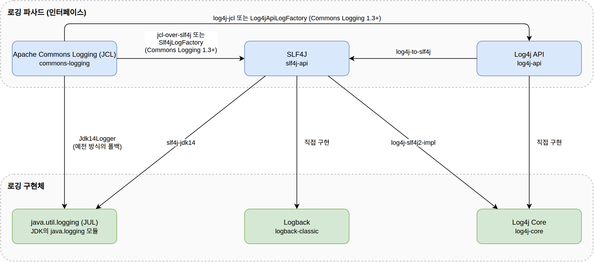
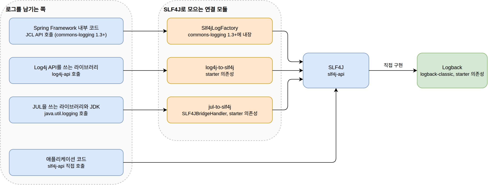
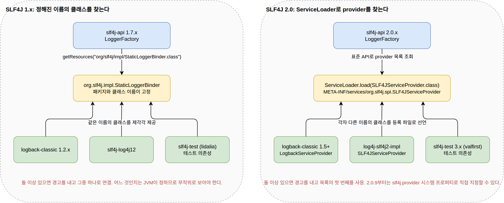

= Java 로깅 라이브러리 생태계
정상혁
2026-09-15
:jbake-type: post
:jbake-status: draft
:jbake-tags: java, logging, spring
:description: JCL, SLF4J 같은 로깅 파사드와 Log4j, Logback 같은 구현체의 역할을 구분하고, 2026년 9월 기준 각 라이브러리의 상태와 선택 기준을 정리합니다. JCL의 LogFactory 탐색, SLF4J 1.x의 StaticLoggerBinder, SLF4J 2.0의 ServiceLoader, Commons Logging 1.3과 spring-jcl 제거까지 구현체를 찾는 방식의 변천도 살펴봅니다.
:jbake-og: {"image": "img/java-logging-ecosystem/facade-and-implementation.png"}
:idprefix:
:toc:
:toclevels: 3

"저희는 Log4j 대신 SLF4J를 써요."라는 말을 가끔 듣습니다.
이 문장은 범주가 다른 두 라이브러리를 같은 자리에 놓고 있습니다.
SLF4J는 로거를 선택할 수 있게 하는 파사드이고, Log4j는 로그를 실제로 기록하는 구현체입니다.
두 라이브러리는 대체 관계가 아니라 함께 쓰는 관계입니다.

이 글은 Java 로깅 라이브러리를 파사드와 구현체로 나누어 역할을 정리하고, 2026년 9월 기준으로 각 라이브러리의 상태와 선택 기준을 살펴봅니다.
이어서 파사드가 구현체를 찾는 방식이 어떻게 바뀌어 왔는지를 JCL, SLF4J 1.x, SLF4J 2.0, Commons Logging 1.3의 순서로 따라갑니다.

== 파사드와 구현체의 역할 구분

로깅 파사드(facade)는 애플리케이션 코드가 호출하는 인터페이스만 제공합니다.
어떤 구현체가 로그를 기록할지는 실행 시점의 클래스패스에 따라 정해집니다.
대표적인 파사드는 두 가지입니다.

* https://commons.apache.org/proper/commons-logging/[Apache Commons Logging]: 예전 이름이 Jakarta Commons Logging이어서 약자로 JCL이라고 부릅니다.
* https://www.slf4j.org/[SLF4J]: Simple Logging Facade for Java의 약자입니다.

구현체는 로그를 어디에 어떤 형식으로 기록할지 결정하고 실제로 기록합니다.
JCL이나 SLF4J가 정의한 인터페이스에 맞춘 어댑터 클래스가 구현체 안에 들어 있거나, 별도 모듈로 제공됩니다.

* https://logging.apache.org/log4j/2.x/[Log4j 2]: ``log4j-core``가 구현체입니다.
* https://logback.qos.ch/[Logback]: SLF4J의 창시자가 만든 구현체로, SLF4J 인터페이스를 직접 구현합니다.
* java.util.logging(이하 JUL): JDK에 포함된 구현체입니다.
* https://reload4j.qos.ch/[reload4j]: 2015년에 지원이 끝난 Log4j 1.x의 보안 패치 포크입니다.

경계가 겹치는 경우도 두 가지 있습니다.
Log4j 2는 API 모듈(``log4j-api``)과 구현 모듈(``log4j-core``)을 분리했으므로 ``log4j-api``는 파사드로도 쓰입니다.
``log4j-to-slf4j`` 모듈을 추가하면 Log4j API 호출을 SLF4J로 보낼 수 있습니다.
JDK 9의 https://openjdk.org/jeps/264[JEP 264]로 추가된 ``System.Logger``와 ``System.LoggerFinder``도 파사드입니다.
``System.getLogger(name)``으로 로거를 얻고, 구현체는 ``ServiceLoader``로 찾은 ``LoggerFinder``가 정합니다.
``LoggerFinder``가 없으면 JUL로 보내고, ``java.logging`` 모듈조차 없으면 INFO 이상만 ``System.err``에 찍는 단순 로거를 씁니다.
SLF4J의 ``slf4j-jdk-platform-logging``과 Log4j 2의 ``log4j-jpl``이 이 ``LoggerFinder``를 구현하므로, 애플리케이션 코드가 ``System.Logger``를 써도 SLF4J나 Log4j API로 보낼 수 있습니다.
다만 JEP 264는 JDK 내부의 로그를 애플리케이션이 고른 프레임워크로 보내는 것이 목적이며, 범용 로깅 인터페이스를 정의하는 것은 목표가 아니라고 밝혔습니다.
그래서 API가 작습니다.
파라미터 치환은 ``MessageFormat`` 방식의 ``{0}``이고, MDC나 marker에 해당하는 기능이 없습니다.
JDK 외의 의존성을 두고 싶지 않은 라이브러리에는 선택지가 되지만, 애플리케이션 코드에서 SLF4J 대신 쓸 이유는 적다고 생각합니다.

== 조합과 연결 모듈

파사드와 구현체는 역할이 다르므로 아래 4가지 조합이 모두 가능합니다.
아래 그림은 파사드에서 구현체로 호출이 전달되는 경로와 그 사이의 연결 모듈을 정리한 것입니다.

[cols="1,2,3", options="header"]
|===
|파사드 |구현체 |연결 모듈

|JCL
|Log4j 2
|Commons Logging 1.3 이상은 ``log4j-api``를 스스로 찾습니다. Log4j 2 쪽의 ``log4j-jcl``로도 연결됩니다.

|JCL
|Logback
|``jcl-over-slf4j``로 JCL 호출을 SLF4J로 보냅니다. Commons Logging 1.3 이상은 SLF4J를 스스로 찾습니다.

|SLF4J
|Log4j 2
|``log4j-slf4j2-impl`` (SLF4J 1.7에서는 ``log4j-slf4j-impl``)

|SLF4J
|Logback
|``logback-classic``이 SLF4J 인터페이스를 직접 구현하므로 별도 모듈이 없습니다.
|===

JUL은 SLF4J의 ``slf4j-jdk14`` 또는 Log4j 2의 ``log4j-to-jul``로 연결합니다.

=== 파사드에서 다른 파사드로 넘기는 연결 모듈

라이브러리마다 쓰는 파사드가 다르므로, 한 애플리케이션 안에서 여러 파사드의 호출을 하나로 모아야 할 때가 많습니다.
아래 표는 파사드에서 다른 파사드로 호출을 넘기는 연결 모듈을 정리한 것입니다.
JUL은 구현체이면서 API이기도 하므로 출발점으로도 넣었습니다.

[cols="2,2,3,4", options="header"]
|===
|출발 파사드 |도착 파사드 |연결 모듈 |방식과 비고

|JCL
|SLF4J
|``jcl-over-slf4j``
|``org.apache.commons.logging`` 패키지를 다시 구현한 jar로 ``commons-logging.jar``를 대체합니다.

|JCL
|SLF4J
|Commons Logging 1.3 이상 내장 ``Slf4jLogFactory``
|``slf4j-api``가 클래스패스에 있으면 ``LogFactory``가 스스로 고릅니다. 별도 모듈이 없습니다.

|JCL
|Log4j API
|``log4j-jcl``
|Commons Logging 1.2 이하용입니다.

|JCL
|Log4j API
|Commons Logging 1.3 이상 내장 ``Log4jApiLogFactory``
|``log4j-api``가 있으면 SLF4J보다 먼저 선택합니다. 단, ``log4j-to-slf4j``가 함께 있으면 SLF4J로 바로 갑니다.

|SLF4J
|Log4j API
|``log4j-slf4j2-impl``
|SLF4J 2.0용 provider입니다. SLF4J 1.7에서는 ``log4j-slf4j-impl``을 씁니다.

|SLF4J
|JCL
|``slf4j-jcl``
|SLF4J 호출을 JCL로 보냅니다. 요즘은 쓸 이유가 거의 없습니다.

|Log4j API
|SLF4J
|``log4j-to-slf4j``
|Spring Boot 기본 스타터에 포함됩니다.

|Log4j API
|JUL
|``log4j-to-jul``
|Log4j API 호출을 JUL로 보냅니다.

|Log4j 1.x API
|SLF4J
|``log4j-over-slf4j``
|Log4j 1.x의 ``Logger``, ``Category`` 같은 클래스를 같은 이름으로 다시 구현합니다. appender나 ``PropertyConfigurator``를 직접 참조하는 코드는 깨집니다.

|Log4j 1.x API
|Log4j API
|``log4j-1.2-api``
|Log4j 2가 제공하는 1.x 호환 API입니다.

|JUL
|SLF4J
|``jul-to-slf4j``
|JUL 클래스를 대체할 수 없으므로 ``SLF4JBridgeHandler``로 로그 레코드를 받아 넘깁니다. 비용이 큽니다.

|JUL
|Log4j API
|``log4j-jul``
|시스템 프로퍼티로 JUL의 ``LogManager``를 Log4j 2의 것으로 바꿉니다.

|System.Logger
|SLF4J
|``slf4j-jdk-platform-logging``
|``LoggerFinder`` 구현입니다. SLF4J 2.0.0-alpha5부터 제공합니다.

|System.Logger
|Log4j API
|``log4j-jpl``
|``LoggerFinder`` 구현입니다.
|===

연결 모듈을 고를 때는 순환을 피해야 합니다.
SLF4J 문서는 아래 조합이 무한 위임을 일으킨다고 경고합니다.

* ``jcl-over-slf4j`` + ``slf4j-jcl``
* ``log4j-over-slf4j`` + ``slf4j-reload4j``
* ``jul-to-slf4j`` + ``slf4j-jdk14``

같은 이유로 ``log4j-to-slf4j``와 ``log4j-slf4j2-impl``, ``log4j-to-jul``과 ``log4j-jul``도 함께 쓰면 안 됩니다.
표에서 양방향 모듈이 있는 쌍은 모두 이 조건에 해당합니다.

``jul-to-slf4j``는 비용이 큽니다.
SLF4J 문서에 따르면 레벨 때문에 무시되는 로그 문장도 60배 정도 느려지고, 실제로 기록되는 문장도 20% 정도 느려집니다.
Logback을 쓴다면 ``LevelChangePropagator``로 JUL 로거의 레벨을 동기화해 이 비용을 없앨 수 있습니다.

== 2026년 9월 기준 각 라이브러리의 상태

[cols="2,2,2,3", options="header"]
|===
|라이브러리 |최신 버전 |릴리스 날짜 |비고

|SLF4J
|2.0.19
|2026-09-04
|2.0.0은 2022-08-20에 나왔습니다. Java 8 이상. 2.1.0은 2024년 초의 alpha1에 머물러 있습니다.

|Logback
|1.6.3
|2026-08-14
|1.5.x 이후 SLF4J 2.0.x가 필요합니다. 1.6.x는 JDK 11 이상. 1.5.x는 1.6.x로 바로 교체할 수 있는 이전 계열입니다.

|Log4j 2
|2.26.1
|2026-06-29
|2.25.x 계열도 같은 수정을 담은 2.25.5(2026-07-01)가 나왔습니다.

|Log4j 3
|3.0.0-beta3
|2024-11
|Java 17 이상. Log4j API는 3.0.0이 따로 나오지 않고 2.x API를 그대로 씁니다.

|Apache Commons Logging
|1.4.0
|2026-06-11
|1.3.0(2023-11-26)에서 Log4j API와 SLF4J를 직접 지원하기 시작했습니다.

|Log4j 1
|1.2.17
|2012
|2015-08-05에 지원 종료. 이후 CVE가 여럿 공개되었고 수정되지 않습니다.
|===

Log4j 2에서 2021년 12월에 공개된 https://logging.apache.org/security.html[CVE-2021-44228](Log4Shell)은 ``log4j-core``의 JNDI lookup 문제였습니다.
``log4j-api``만 쓰는 경우는 영향이 없었습니다.
파사드와 구현체를 나누어 두면 이런 사고 때 영향 범위를 가늠하기도 쉽습니다.

== 파사드 선택: SLF4J와 JCL

새로 시작하는 프로젝트의 애플리케이션 코드에서는 SLF4J를 쓰는 것이 일반적입니다.
저도 아래 두 가지 이유로 SLF4J를 선호합니다.

첫째, 파라미터 치환 문법이 편리합니다.
``logger.debug("user={} order={}", userId, orderId)``처럼 쓰면 DEBUG 레벨이 꺼져 있을 때 문자열 결합 비용이 들지 않습니다.
JCL의 ``Log`` 인터페이스에는 이 기능이 없어서 ``if (log.isDebugEnabled())``로 감싸야 합니다.
SLF4J 2.0에서는 ``logger.atDebug().setMessage("msg {}").addArgument(value).log()`` 같은 fluent API도 추가되었습니다.

둘째, SLF4J 2.0부터는 구현체를 찾는 방식이 Java 표준 방식인 ``ServiceLoader``입니다.
JCL도 1.3.0부터 개선되었지만, 이 변천은 뒤에서 따로 다룹니다.

JCL은 Spring Framework처럼 오래된 라이브러리의 내부 로깅에 남아 있습니다.
Spring Boot 문서는 내부 로깅에 Commons Logging을 쓰되 구현체는 열어 둔다고 설명합니다.
Spring Boot 4.1.1의 ``spring-boot-starter-logging``은 아래 세 의존성으로 구성됩니다.

[source,groovy]
.starter/spring-boot-starter-logging/build.gradle
----
dependencies {
	api("ch.qos.logback:logback-classic")
	api("org.apache.logging.log4j:log4j-to-slf4j")
	api("org.slf4j:jul-to-slf4j")
}
----

Logback을 구현체로 두고, Log4j API와 JUL로 들어오는 호출을 SLF4J로 모읍니다.
Spring 내부의 JCL 호출은 Commons Logging 1.3 이상이 SLF4J를 찾아 연결합니다.
결과적으로 Spring Boot에서 아무 설정도 하지 않으면 SLF4J와 Logback 조합이 됩니다.

Log4j 2로 바꾸려면 이 스타터를 제외하고 ``spring-boot-starter-log4j2``를 추가합니다.

== 구현체 선택: Logback과 Log4j 2

Log4j 1.x의 개발이 느리던 시기에 Logback이 대안으로 자리를 잡았습니다.
그 뒤 Log4j 2.x가 Logback의 장점을 흡수하며 계속 발전했습니다.
저는 현재 두 구현체 중 어느 한쪽이 확실히 우세하다고 보지 않습니다.
Spring Boot의 기본값이라는 이유로 Logback을 고르는 프로젝트가 많고, 그 선택도 합리적입니다.

=== 성능 비교 자료의 한계

Log4j 2는 LMAX Disruptor를 쓰는 비동기 로거(async logger)와 garbage-free 모드를 앞세워 성능을 강조합니다.
Logback은 ``BlockingQueue``와 작업 스레드로 동작하는 ``AsyncAppender``를 제공합니다.
기본 큐 크기는 256이고, 큐의 남은 용량이 20% 아래로 내려가면 TRACE, DEBUG, INFO 이벤트를 버립니다.

두 구현체를 비교한 수치는 대부분 오래되었습니다.
Log4j 2의 성능 페이지도 지금은 Logback과 비교한 수치를 싣지 않고, 비동기 로거의 장단점과 최적화 지침만 설명합니다.
그 페이지는 비동기 로거의 단점도 함께 적었습니다.
로그 발생 속도가 appender의 처리 속도를 계속 넘으면 결국 appender 속도가 병목이 되고, 로깅 중 예외를 애플리케이션에 알리기 어려우며, vCPU가 하나뿐인 환경에서는 스레드가 늘어난 만큼 오히려 느려질 수 있습니다.
성능이 선택 기준이라면 실제 로그 패턴과 appender 구성으로 직접 측정하는 편이 낫습니다.

=== PatternLayout의 위치 정보 옵션

어느 구현체를 쓰든 ``PatternLayout``에서 호출 위치를 찍는 옵션은 비용이 큽니다.

* ``%C``: 클래스명
* ``%F``: 파일명
* ``%L``: 줄 번호
* ``%M``: 메서드명

이 정보를 얻으려면 로그를 남길 때마다 스택을 캡처해서 호출한 프레임을 찾아야 합니다.
Logback 문서는 네 옵션마다 "not particularly fast. Thus, its use should be avoided unless execution speed is not an issue"라고 적었습니다.
Log4j 2 문서도 "This is an expensive operation and should be avoided in performance-sensitive setups"라고 경고합니다.
비동기 로거에서는 이 비용이 더 두드러집니다.
위치 정보를 캡처할지를 비동기 경계를 넘기 전에 결정해야 하므로, Log4j 2의 비동기 로거는 ``includeLocation``이 기본으로 꺼져 있고 Logback의 ``AsyncAppender``도 ``includeCallerData``가 기본으로 꺼져 있습니다.
운영 환경에서는 로거 이름(``%c`` 또는 ``%logger``)으로 위치를 짐작하는 정도로 두는 편이 좋습니다.
로거 이름은 로거를 만들 때 정해지므로 추가 비용이 없습니다.

== 파사드가 구현체를 찾는 방식의 변천

파사드는 실행 시점에 구현체를 찾아야 합니다.
이 부분은 오랫동안 Java의 인터페이스와 구현체 관계처럼 단순하지 않았습니다.
JCL, SLF4J 1.x, SLF4J 2.0, 그리고 최근의 Commons Logging 1.3 순서로 어떻게 바뀌었는지 살펴봅니다.

=== JCL의 LogFactory 탐색

JCL의 ``LogFactory``는 아래 순서로 구현체를 찾습니다.

. 시스템 프로퍼티 ``org.apache.commons.logging.LogFactory``
. 클래스패스의 ``commons-logging.properties`` 파일
. 자동 탐지

자동 탐지는 스레드 컨텍스트 클래스로더(TCCL)를 기준으로 클래스를 찾고, 찾은 ``LogFactory``를 클래스로더별로 캐시합니다.
애플리케이션 서버처럼 클래스로더가 여러 겹인 환경에서는 이 방식이 자주 문제를 일으켰습니다.
JCL의 기술 문서는 컨텍스트 클래스로더가 설정되지 않았거나, 컨테이너가 로깅 클래스를 정의한 클래스로더와 부모도 자식도 아닌 클래스로더를 컨텍스트로 지정하면 탐지가 실패한다고 설명합니다.
클래스로더 언로드 시 ``LogFactory.release()``를 호출하지 않으면 메모리 누수가 생기는 문제도 문서에 적혀 있습니다.

더 큰 제약은 확장 방식입니다.
JCL 1.2까지 자동 탐지 대상은 Log4j 1.x와 JUL 같은 정해진 구현체뿐이었습니다.
다른 구현체를 쓰려면 ``Log`` 인터페이스를 구현한 클래스를 만들고 설정 파일이나 시스템 프로퍼티로 지정해야 했습니다.
설정 없이 연결하고 클래스로더 탐색도 피하려면 ``org.apache.commons.logging`` 패키지의 클래스를 같은 이름으로 다시 구현해 ``commons-logging.jar``를 통째로 대체하는 방법뿐이었습니다.
SLF4J의 ``jcl-over-slf4j``가 그렇게 만들어졌고, Spring Framework 5.0부터 6.2까지 있던 ``spring-jcl`` 모듈도 같은 방법을 썼습니다.
``spring-jcl``의 ``LogAdapter``는 Log4j 2 API, SLF4J, JUL 순서로 클래스 존재 여부를 확인해 어댑터를 골랐습니다.

[source,java]
.spring-jcl 6.2.0의 LogAdapter.java (발췌)
----
private static final boolean log4jSpiPresent = isPresent("org.apache.logging.log4j.spi.ExtendedLogger");
private static final boolean log4jSlf4jProviderPresent = isPresent("org.apache.logging.slf4j.SLF4JProvider");
private static final boolean slf4jSpiPresent = isPresent("org.slf4j.spi.LocationAwareLogger");
private static final boolean slf4jApiPresent = isPresent("org.slf4j.Logger");

static {
	if (log4jSpiPresent) {
		if (log4jSlf4jProviderPresent && slf4jSpiPresent) {
			// log4j-to-slf4j bridge -> we'll rather go with the SLF4J SPI;
			createLog = Slf4jAdapter::createLocationAwareLog;
		}
		else {
			createLog = Log4jAdapter::createLog;
		}
	}
	else if (slf4jSpiPresent) {
		createLog = Slf4jAdapter::createLocationAwareLog;
	}
	else if (slf4jApiPresent) {
		createLog = Slf4jAdapter::createLog;
	}
	else {
		createLog = JavaUtilAdapter::createLog;
	}
}
----

``log4j-to-slf4j``가 있으면 Log4j API를 거치지 않고 SLF4J로 바로 가는 분기가 눈에 띕니다.
Log4j API를 거쳐 SLF4J로 가면 위치 정보가 한 단계 더 어긋나기 때문입니다.

=== SLF4J 1.x의 StaticLoggerBinder

SLF4J 1.7까지는 ``org.slf4j.impl.StaticLoggerBinder``라는 정해진 이름의 클래스를 클래스패스에서 찾아 구현체와 연결했습니다.
Logback, ``slf4j-log4j12``, ``slf4j-jdk14`` 같은 구현체마다 같은 패키지, 같은 이름의 클래스를 제각각 제공했습니다.
SLF4J 1.7.36의 ``LoggerFactory``는 클래스로더의 ``getResources("org/slf4j/impl/StaticLoggerBinder.class")``로 이 클래스가 몇 군데 있는지 확인하고, 둘 이상이면 경고를 출력합니다.
경고를 내더라도 그중 하나로 연결은 되는데, SLF4J 문서는 어느 것이 선택될지는 JVM이 정하며 실질적으로 무작위로 보아야 한다고 적었습니다.

이 방식은 두 가지 면에서 불편합니다.
서로 다른 구현이 같은 이름의 클래스로 제공되므로 스택 트레이스나 IDE에서 혼란스럽습니다.
그리고 두 구현체가 클래스패스에 함께 있을 여지를 처음부터 없애 버립니다.

로깅 구현체를 두 개씩 쓰지는 않으니 괜찮다고 할 수도 있습니다.
그러나 테스트 의존성이 문제가 됩니다.
로그 출력을 검증하는 https://github.com/Mahoney/slf4j-test[lidalia의 slf4j-test]는 ``StaticLoggerBinder``를 제공하는 SLF4J 구현체입니다.
이 라이브러리를 테스트 의존성에 추가하는 순간 Logback과 충돌합니다.
Spring Boot의 테스트라면 ``LogbackLoggingSystem``이 ``LoggerFactory.getILoggerFactory()``가 Logback의 ``LoggerContext``가 아니라는 이유로 예외를 던져서 ``ApplicationContext``가 올라가지도 않습니다.
Spring Boot 4.1.1에서도 이 검사는 아래와 같이 남아 있습니다.

[source,java]
.LogbackLoggingSystem.java (발췌)
----
Assert.state(factory instanceof LoggerContext,
		() -> String.format(
				"LoggerFactory is not a Logback LoggerContext but Logback is on "
						+ "the classpath. Either remove Logback or the competing "
						+ "implementation (%s loaded from %s). ...",
				factory.getClass(), getLocation(factory)));
----

https://github.com/portingle/slf4jtesting[portingle/slf4jtesting]은 이런 폐해를 아는 사람이 만든 라이브러리입니다.
정적 바인딩을 쓰지 않고 ``ILoggerFactory`` 인스턴스를 생성자로 주입받아 테스트마다 로거를 따로 구성합니다.
README는 static과 singleton이 테스트 가능한 코드를 방해한다고 밝힙니다.

저는 애플리케이션 단의 로깅이라면 Java의 인터페이스와 구현체 관계 그대로 써도 충분하다고 생각합니다.
예를 들어 아래처럼 팩토리를 직접 만들고, DI 컨테이너에 등록하거나 정적 접근이 필요하면 프로젝트 안에 작은 유틸리티를 두는 방식입니다.
``LogbackLoggerFactory``는 설명을 위해 지어낸 클래스 이름입니다.

[source,java]
----
ILoggerFactory factory = new LogbackLoggerFactory("logback.xml");
----

이 방식은 클래스패스 탐색이 없으므로 어떤 구현체가 쓰이는지 코드에 드러납니다.
다만 라이브러리는 사용자가 어떤 구현체를 쓸지 모르므로 파사드와 탐색이 필요합니다.
SLF4J의 정적 접근은 그 요구에서 나온 설계이고, 문제는 탐색 방식이 Java 표준을 쓰지 않았다는 점입니다.

=== SLF4J 2.0의 ServiceLoader

``ServiceLoader``는 JDK 6부터 있던 표준 API입니다.
SLF4J는 1.8.0-beta0(2017-10-20)에서 ``org.slf4j.impl`` 패키지를 없애고 ``ServiceLoader``로 구현체를 찾는 방식을 시도했습니다.
이 계열은 2.0.0-alpha0(2019-06-13)으로 이름을 바꾸어 fluent API를 더했고, 2.0.0 정식 버전은 2022-08-20에 나왔습니다.
구현체는 ``SLF4JServiceProvider`` 인터페이스를 구현하고 ``META-INF/services``에 등록합니다.
SLF4J는 이를 "binding" 대신 "provider"라고 부릅니다.

SLF4J 2.0.19의 ``LoggerFactory``는 ``ServiceLoader.load(SLF4JServiceProvider.class)``로 provider 목록을 얻습니다.
provider가 둘 이상이면 각각을 "Found provider"로 출력한 뒤 목록의 첫 번째를 씁니다.
2.0.9부터는 시스템 프로퍼티 ``slf4j.provider``로 provider 클래스를 지정해 탐색을 건너뛸 수도 있습니다.
1.7용 ``StaticLoggerBinder``가 클래스패스에 있으면 목록으로 출력만 하고 무시합니다.
provider가 하나도 없으면 "No SLF4J providers were found" 경고를 내고 아무것도 기록하지 않는 NOP 구현으로 동작합니다.
두 방식의 차이를 그림으로 비교하면 아래와 같습니다.

테스트 라이브러리도 이 방식에 맞춰 갱신되었습니다.
lidalia의 slf4j-test는 SLF4J 1.7까지만 지원하고 멈췄고, 포크인 https://github.com/valfirst/slf4j-test[valfirst/slf4j-test]가 ``SLF4JServiceProvider``를 구현해 SLF4J 2.0.x를 지원합니다.
다만 provider가 여러 개일 때 첫 번째를 쓰는 동작과 Spring Boot의 ``LoggerContext`` 검사는 그대로이므로, 테스트에서 구현체를 바꿔치기하려면 여전히 Logback을 그 실행 구성에서 제외해야 합니다.
``ServiceLoader``로 바뀌었다고 해서 구현체 두 개가 공존할 수 있게 된 것은 아닙니다.
바뀐 것은 정해진 이름의 클래스 대신 표준 등록 파일로 구현체를 선언하게 되었다는 점입니다.

=== Commons Logging 1.3의 변화와 spring-jcl의 퇴장

JCL 쪽에도 변화가 있었습니다.
Apache Commons Logging 1.3.0(2023-11-26)은 Log4j API와 SLF4J를 직접 찾는 ``Log4jApiLogFactory``와 ``Slf4jLogFactory``를 추가했습니다.
이 변경은 Log4j 메인테이너인 Piotr P. Karwasz가 기여했습니다.
1.4.0의 ``LogFactory``는 아래 순서로 팩토리를 고릅니다.

. ``log4j-to-slf4j``의 ``SLF4JProvider`` 클래스가 있으면 ``Slf4jLogFactory``
. ``log4j-api``가 있으면 ``Log4jApiLogFactory``
. ``slf4j-api``가 있으면 ``Slf4jLogFactory``
. 그 외에는 예전 방식대로 동작하는 ``LogFactoryImpl``

``log4j-to-slf4j``가 있을 때 SLF4J로 바로 가는 첫 번째 분기는 ``spring-jcl``의 ``LogAdapter``와 같은 발상입니다.
Spring Framework 7.0은 이 변화에 맞춰 ``spring-jcl`` 모듈을 없애고 Commons Logging 1.3.0을 의존성으로 되돌렸습니다.
릴리스 노트는 ``spring-jcl``이 전이 의존성이었고 로깅 API 호출은 바뀌지 않으므로 대부분의 애플리케이션에는 영향이 없다고 설명합니다.
2017년에 Spring이 직접 만들었던 대체 모듈의 역할을 8년 뒤에는 JCL 본체가 맡게 되었습니다.

== 정리

* SLF4J와 JCL은 파사드, Log4j 2 Core와 Logback은 구현체입니다. "Log4j 대신 SLF4J"는 성립하지 않는 비교입니다.
* 애플리케이션 코드는 SLF4J를 쓰고, 구현체는 Logback이나 Log4j 2 Core 중 하나만 클래스패스에 둡니다. 다른 파사드로 들어오는 호출은 ``jcl-over-slf4j``, ``log4j-to-slf4j``, ``jul-to-slf4j``로 모읍니다. Spring Boot의 기본 스타터가 이 구성입니다.
* 두 구현체의 성능 비교 수치는 오래되었습니다. 성능이 기준이라면 실제 구성으로 직접 측정합니다.
* ``%C``, ``%F``, ``%L``, ``%M`` 같은 위치 정보 옵션은 운영 환경의 패턴에서 뺍니다.
* 구현체 탐색은 JCL의 클래스로더 탐색, SLF4J 1.x의 정해진 클래스 이름을 거쳐 SLF4J 2.0과 Commons Logging 1.3에서 표준에 가까운 방식으로 바뀌었습니다. 너무 오래 걸렸지만, 늦은 개선이라도 안 하는 것보다는 낫다고 생각합니다.

== 참고 자료

* SLF4J
** https://www.slf4j.org/manual.html[SLF4J user manual]: provider 목록, fluent API, ``slf4j.provider`` 시스템 프로퍼티
** https://www.slf4j.org/faq.html#changesInVersion200[SLF4J FAQ: What has changed in SLF4J version 2.0.0?]
** https://www.slf4j.org/codes.html[SLF4J warning or error messages and their meanings]: multiple_bindings, noProviders, ignoredBindings
** https://www.slf4j.org/legacy.html[Bridging legacy APIs]: jcl-over-slf4j, log4j-over-slf4j, jul-to-slf4j와 순환 의존 경고
** https://www.slf4j.org/news.html[SLF4J News]: 1.8.0-beta0, 2.0.0-alpha0, 2.0.0, 2.0.19의 릴리스 기록
** https://github.com/qos-ch/slf4j/blob/v_1.7.36/slf4j-api/src/main/java/org/slf4j/LoggerFactory.java[SLF4J 1.7.36 LoggerFactory.java]: ``StaticLoggerBinder`` 탐색
** https://github.com/qos-ch/slf4j/blob/master/slf4j-api/src/main/java/org/slf4j/LoggerFactory.java[SLF4J 2.0.x LoggerFactory.java]: ``ServiceLoader`` 탐색과 다중 provider 처리
* Logback
** https://logback.qos.ch/news.html[Logback News]: 1.6.x 릴리스 기록과 SLF4J, JDK 요구 버전
** https://logback.qos.ch/manual/layouts.html[Logback Layouts]: ``PatternLayout``의 위치 정보 옵션 경고
** https://logback.qos.ch/manual/appenders-async-sift.html[Logback AsyncAppender]
* Log4j
** https://logging.apache.org/log4j/2.x/manual/installation.html[Log4j 2 Installation]: API와 Core의 분리, 연결 모듈
** https://logging.apache.org/log4j/2.x/manual/layouts.html[Log4j 2 Layouts]: 위치 정보 비용
** https://logging.apache.org/log4j/2.x/manual/performance.html[Log4j 2 Performance]
** https://logging.apache.org/log4j/2.x/manual/async.html[Log4j 2 Asynchronous Loggers]
** https://logging.apache.org/log4j/2.x/release-notes.html[Log4j 2 Release Notes]
** https://logging.apache.org/log4j/3.x/release-notes.html[Log4j 3 Release Notes]
** https://logging.apache.org/log4j/1.x/[Log4j 1.x End of Life]
** https://logging.apache.org/security.html[Apache Logging Security]: CVE-2021-44228
* Apache Commons Logging
** https://commons.apache.org/proper/commons-logging/guide.html[Commons Logging User Guide]: 설정과 자동 탐지 순서
** https://commons.apache.org/proper/commons-logging/tech.html[Commons Logging Tech Guide]: 클래스로더 문제
** https://commons.apache.org/proper/commons-logging/changes.html[Commons Logging Changes]: 1.3.0의 Log4j API, SLF4J 지원 추가
** https://github.com/apache/commons-logging/blob/master/src/main/java/org/apache/commons/logging/LogFactory.java[Commons Logging LogFactory.java]: ``newStandardFactory()``의 선택 순서
* Spring
** https://docs.spring.io/spring-boot/reference/features/logging.html[Spring Boot Reference: Logging]
** https://github.com/spring-projects/spring-boot/blob/v4.1.1/starter/spring-boot-starter-logging/build.gradle[spring-boot-starter-logging build.gradle]
** https://github.com/spring-projects/spring-boot/blob/v4.1.1/core/spring-boot/src/main/java/org/springframework/boot/logging/logback/LogbackLoggingSystem.java[LogbackLoggingSystem.java]
** https://github.com/spring-projects/spring-framework/blob/v6.2.0/spring-jcl/src/main/java/org/apache/commons/logging/LogAdapter.java[spring-jcl 6.2.0 LogAdapter.java]
** https://github.com/spring-projects/spring-framework/wiki/Spring-Framework-7.0-Release-Notes[Spring Framework 7.0 Release Notes]: ``spring-jcl`` 제거
* JDK
** https://openjdk.org/jeps/264[JEP 264: Platform Logging API and Service]
** https://docs.oracle.com/en/java/javase/25/docs/api/java.base/java/lang/System.LoggerFinder.html[System.LoggerFinder Javadoc (JDK 25)]: ``ServiceLoader`` 탐색과 기본 동작
* 테스트용 SLF4J 구현체
** https://github.com/Mahoney/slf4j-test[lidalia slf4j-test]: SLF4J 1.7까지
** https://github.com/valfirst/slf4j-test[valfirst/slf4j-test]: SLF4J 2.0.x 지원 포크
** https://github.com/portingle/slf4jtesting[portingle/slf4jtesting]: ``ILoggerFactory`` 주입 방식
