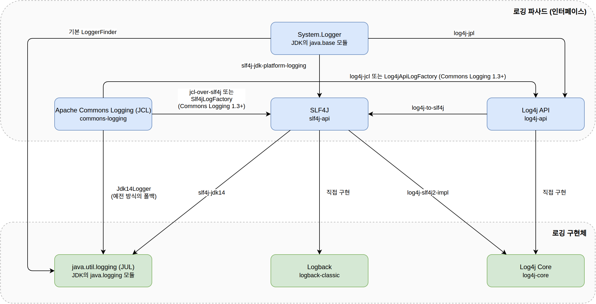
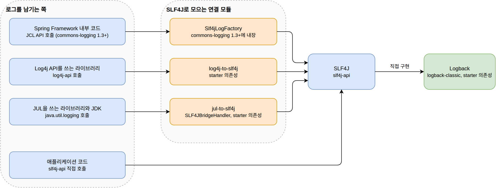
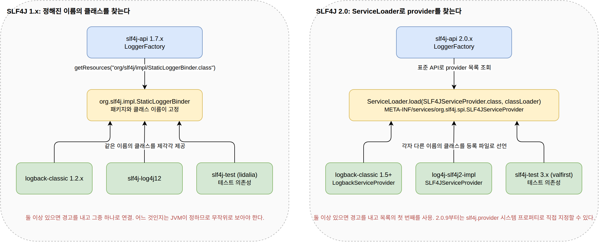

= Java 로깅 라이브러리 생태계
정상혁
2026-09-15
:jbake-type: post
:jbake-status: draft
:jbake-tags: java, logging, spring
:description: JCL, SLF4J 같은 로깅 파사드와 Log4j, Logback 같은 구현체의 역할을 구분하고, 각 라이브러리의 선택 기준을 정리합니다. JCL의 LogFactory 탐색, SLF4J 1.x의 StaticLoggerBinder, SLF4J 2.0의 ServiceLoader, Commons Logging 1.3과 spring-jcl 제거까지 구현체를 찾는 방식의 변천도 살펴봅니다.
:jbake-og: {"image": "img/java-logging-ecosystem/facade-and-implementation.png"}
:idprefix:
:toc:
:toclevels: 3

Java 로깅 라이브러리는 종류가 많고 서로 얽혀 있어서, 라이브러리 간의 관계를 제대로 이해하지 못하고 쓰는 경우가 많습니다.
많이 쓰이는 라이브러리만 해도 SLF4J, Apache Commons Logging, Logback, Log4j 등 여러 가지이고, 실무 프로젝트는 대부분 SLF4J와 Logback처럼 적어도 2개를 조합해서 쓰기 때문입니다.

이 글은 Java 로깅 라이브러리를 파사드와 구현체로 나누어 역할을 설명하고, 라이브러리의 선택 기준을 정리합니다.
이어서 파사드가 구현체를 찾는 방식이 어떻게 바뀌어 왔는지를 JCL, SLF4J 1.x, SLF4J 2.0, Commons Logging 1.3의 순서로 분석해 봅니다.
Spring Framework가 5.0에서 ``spring-jcl`` 모듈을 만들었다가 7.0에서 없앤 과정도 함께 다룹니다.

== 파사드와 구현체의 역할

로깅 파사드(facade)는 애플리케이션 코드가 호출하는 인터페이스만 제공하고, 실제 기록은 구현체에 맡깁니다.
대표적인 파사드는 두 가지입니다.

* https://commons.apache.org/proper/commons-logging/[Apache Commons Logging]: 예전 이름이 Jakarta Commons Logging이어서 약자로 JCL이라고 부릅니다.
* https://www.slf4j.org/[SLF4J]: Simple Logging Facade for Java의 약자입니다.

구현체는 로그를 어디에 어떤 형식으로 기록할지 결정하고 실제로 기록합니다.
JCL이나 SLF4J가 정의한 인터페이스에 맞춘 어댑터 클래스는 Logback처럼 구현체 안에 들어 있기도 하고, ``log4j-slf4j2-impl``처럼 별도 모듈로 제공되기도 합니다.

* https://logging.apache.org/log4j/2.x/[Log4j 2]: ``log4j-core``가 구현체입니다.
* https://logback.qos.ch/[Logback]: SLF4J의 창시자가 만든 구현체로, SLF4J 인터페이스를 직접 구현합니다.
* java.util.logging(이하 JUL): JDK에 포함된 구현체입니다.

파사드와 구현체의 경계가 겹치는 경우도 두 가지 있습니다.

첫째, Log4j 2는 API 모듈(``log4j-api``)과 구현 모듈(``log4j-core``)을 분리했으므로 ``log4j-api``는 파사드로도 쓰입니다.
예를 들어 ``log4j-core`` 대신 ``log4j-to-slf4j`` 모듈을 추가하면 Log4j API 호출을 SLF4J로 보낼 수 있습니다.

둘째, JDK 9의 https://openjdk.org/jeps/264[JEP 264]로 추가된 ``System.Logger``와 ``System.LoggerFinder``도 파사드입니다.
``System.getLogger(name)``으로 로거를 얻고, 구현체는 ``ServiceLoader``로 찾은 ``LoggerFinder``가 정합니다.
``LoggerFinder``가 없으면 JUL로 보내고, ``java.logging`` 모듈조차 없으면 INFO 이상만 ``System.err``에 찍는 단순 로거를 씁니다.
SLF4J의 ``slf4j-jdk-platform-logging``과 Log4j 2의 ``log4j-jpl``이 이 ``LoggerFinder``를 구현하므로, 애플리케이션 코드가 ``System.Logger``를 써도 SLF4J나 Log4j API로 보낼 수 있습니다.
다만 JEP 264는 JDK 내부의 로그를 애플리케이션이 고른 프레임워크로 보내는 것이 목적이며, 범용 로깅 인터페이스를 정의하는 것은 목표가 아니라고 밝혔습니다.
그래서 API가 제공하는 기능이 적습니다.
파라미터 치환은 ``MessageFormat`` 방식의 ``{0}``이고, MDC나 marker에 해당하는 기능이 없습니다.
JDK 외의 의존성을 두고 싶지 않은 라이브러리에는 선택지가 되지만, 애플리케이션 코드에서 SLF4J 대신 쓸 이유는 적다고 생각합니다.

== 조합과 연결 모듈

파사드와 구현체가 분리되어 있으므로 JCL과 SLF4J 중 어느 파사드든 Log4j 2와 Logback 중 어느 구현체와도 조합할 수 있습니다.
아래 그림은 파사드에서 구현체로 호출이 전달되는 경로와 그 사이의 연결 모듈을 정리한 것입니다.

두 파사드와 두 구현체를 조합한 4가지 경우의 연결 모듈은 아래와 같습니다.

[cols="1,2,3", options="header"]
|===
|파사드 |구현체 |연결 모듈

|JCL
|Log4j 2
|Commons Logging 1.3 이상은 ``log4j-api``를 스스로 찾습니다. Log4j 2 쪽의 ``log4j-jcl``로도 연결됩니다.

|JCL
|Logback
|``jcl-over-slf4j``로 JCL 호출을 SLF4J로 보냅니다. Commons Logging 1.3 이상은 SLF4J를 스스로 찾습니다.

|SLF4J
|Log4j 2
|``log4j-slf4j2-impl`` (SLF4J 1.7에서는 ``log4j-slf4j-impl``)

|SLF4J
|Logback
|``logback-classic``이 SLF4J 인터페이스를 직접 구현하므로 별도 모듈이 없습니다.
|===

JUL은 SLF4J의 ``slf4j-jdk14`` 또는 Log4j 2의 ``log4j-to-jul``로 연결합니다.

=== 파사드에서 다른 파사드로 넘기는 연결 모듈

라이브러리마다 쓰는 파사드가 다르므로, 한 애플리케이션 안에서 여러 파사드의 호출을 하나로 모아야 할 때가 많습니다.
아래 표는 파사드에서 다른 파사드로 호출을 넘기는 연결 모듈을 정리한 것입니다.
JUL은 구현체이면서 API이기도 하므로 출발점으로도 넣었습니다.

[cols="2,2,3,4", options="header"]
|===
|출발 파사드 |도착 파사드 |연결 모듈 |방식과 비고

|JCL
|SLF4J
|``jcl-over-slf4j``
|``org.apache.commons.logging`` 패키지를 다시 구현한 jar로 ``commons-logging.jar``를 대체합니다.

|JCL
|SLF4J
|Commons Logging 1.3 이상 내장 ``Slf4jLogFactory``
|``slf4j-api``가 클래스패스에 있으면 ``LogFactory``가 스스로 고릅니다. 별도 모듈이 없습니다.

|JCL
|Log4j API
|``log4j-jcl``
|Commons Logging 1.2 이하용입니다.

|JCL
|Log4j API
|Commons Logging 1.3 이상 내장 ``Log4jApiLogFactory``
|``log4j-api``가 있으면 SLF4J보다 먼저 선택합니다. 단, ``log4j-to-slf4j``가 함께 있으면 SLF4J로 바로 갑니다.

|SLF4J
|Log4j API
|``log4j-slf4j2-impl``
|SLF4J 2.0용 provider입니다. SLF4J 1.7에서는 ``log4j-slf4j-impl``을 씁니다.

|SLF4J
|JCL
|``slf4j-jcl``
|SLF4J 호출을 JCL로 보냅니다. SLF4J 1.8.0-alpha0에서 제거되어 1.7 계열까지만 제공됩니다.

|Log4j API
|SLF4J
|``log4j-to-slf4j``
|Spring Boot 기본 스타터에 포함됩니다.

|Log4j API
|JUL
|``log4j-to-jul``
|Log4j API 호출을 JUL로 보냅니다.

|Log4j 1.x API
|SLF4J
|``log4j-over-slf4j``
|Log4j 1.x의 ``Logger``, ``Category`` 같은 클래스를 같은 이름으로 다시 구현합니다. appender나 filter처럼 이 모듈에 없는 클래스를 참조하는 코드는 깨지고, ``PropertyConfigurator`` 호출은 아무 일도 하지 않습니다.

|Log4j 1.x API
|Log4j API
|``log4j-1.2-api``
|Log4j 2가 제공하는 1.x 호환 API입니다.

|JUL
|SLF4J
|``jul-to-slf4j``
|JUL 클래스를 대체할 수 없으므로 ``SLF4JBridgeHandler``로 로그 레코드를 받아 넘깁니다. 비용이 큽니다.

|JUL
|Log4j API
|``log4j-jul``
|시스템 프로퍼티로 JUL의 ``LogManager``를 Log4j 2의 것으로 바꿉니다.

|System.Logger
|SLF4J
|``slf4j-jdk-platform-logging``
|``LoggerFinder`` 구현입니다. SLF4J 2.0.0-alpha4에서 추가되었고, ``META-INF/services`` 등록 파일의 오류는 2.0.0-alpha5에서 고쳐졌습니다.

|System.Logger
|Log4j API
|``log4j-jpl``
|``LoggerFinder`` 구현입니다.
|===

연결 모듈을 고를 때는 순환을 피해야 합니다.
A에서 B로 보내는 모듈과 B에서 A로 보내는 모듈을 함께 넣으면 호출이 두 파사드 사이를 끝없이 오갑니다.
SLF4J 문서는 아래 조합이 이런 무한 위임을 일으킨다고 경고합니다.

* ``jcl-over-slf4j`` + ``slf4j-jcl``
* ``log4j-over-slf4j`` + ``slf4j-reload4j``
* ``jul-to-slf4j`` + ``slf4j-jdk14``: ``SLF4JBridgeHandler``를 설치했을 때

같은 이유로 ``log4j-to-slf4j``와 ``log4j-slf4j2-impl``, ``log4j-to-jul``과 ``log4j-jul``도 함께 쓰면 안 됩니다.
표에서 양방향 모듈이 있는 쌍은 모두 이 조건에 해당합니다.

``jul-to-slf4j``는 비용이 큽니다.
JUL은 SLF4J 쪽의 레벨 설정을 모르므로 로그 레코드를 일단 만들어서 넘깁니다.
SLF4J 문서에 따르면 이렇게 넘어왔다가 레벨이 꺼져 있어 기록되지 않는 로그 호출도 60배 정도 느려지고, 실제로 기록되는 호출도 20% 정도 느려집니다.
Logback을 쓴다면 ``LevelChangePropagator``가 Logback의 레벨 설정을 JUL 로거에 전파하므로, 꺼진 레벨의 로그 호출에 드는 비용을 없앨 수 있습니다.

== 2026년 9월 기준 각 라이브러리의 상태

[cols="2,2,2,3", options="header"]
|===
|라이브러리 |최신 버전 |릴리스 날짜 |비고

|SLF4J
|2.0.20
|2026-09-22
|2.0.0은 2022-08-20에 나왔습니다. Java 8 이상. 2.1.0은 2024년 초의 alpha1에 머물러 있습니다.

|Logback
|1.6.4
|2026-09-24
|1.3.x부터 SLF4J 2.0.x가 필요합니다. 1.6.x는 JDK 11 이상. 1.5.x를 쓰던 프로젝트는 1.6.x로 바로 교체할 수 있는데, 설정 파일에 Janino 조건문을 쓴 경우는 예외여서 설정 파일을 고쳐야 합니다.

|Log4j 2
|2.26.1
|2026-06-29
|2.25.x 계열로는 2.26.1과 같은 수정을 담은 2.25.5(2026-07-01)가 나왔습니다.

|Log4j 3
|3.0.0-beta3
|2024-11
|Java 17 이상. Log4j API는 3.0.0이 따로 나오지 않고 2.x API를 그대로 씁니다.

|Apache Commons Logging
|1.4.0
|2026-06-11
|1.3.0(2023-11-26)에서 Log4j API와 SLF4J를 직접 지원하기 시작했습니다.

|Log4j 1
|1.2.17
|2012
|2015-08-05에 지원 종료. 이후 CVE가 여럿 공개되었고 수정되지 않습니다.
|===

Log4j 2에서 2021년 12월에 공개된 https://logging.apache.org/security.html[CVE-2021-44228](Log4Shell)은 ``log4j-core``의 JNDI lookup 문제였습니다.
``log4j-api``만 쓰는 경우는 영향이 없었습니다.
파사드와 구현체를 나누어 두면 이런 사고가 났을 때 의존성 목록에 ``log4j-core``가 있는지만 확인해도 영향을 받는지 가늠할 수 있습니다.

== 파사드 선택: SLF4J와 JCL

새로 시작하는 프로젝트의 애플리케이션 코드에서는 SLF4J를 쓰는 것이 일반적입니다.
저도 아래 두 가지 이유로 SLF4J를 선호합니다.

첫째, 파라미터 치환 문법이 편리합니다.
``logger.debug("user={} order={}", userId, orderId)``처럼 쓰면 DEBUG 레벨이 꺼져 있을 때 문자열 결합 비용이 들지 않습니다.
JCL의 ``Log`` 인터페이스에는 이 기능이 없어서 ``if (log.isDebugEnabled())``로 감싸야 합니다.
SLF4J 2.0에서는 ``logger.atDebug().setMessage("msg {}").addArgument(value).log()`` 같은 fluent API도 추가되었습니다.

둘째, SLF4J 2.0부터는 Java 표준 API인 ``ServiceLoader``로 구현체를 찾습니다.
JCL도 1.3.0부터 탐색 방식이 나아졌는데, 두 파사드의 탐색 방식이 바뀐 과정은 뒤에서 따로 다룹니다.

JCL은 Spring Framework처럼 오래된 라이브러리의 내부 로깅에 남아 있습니다.
Spring Boot 문서는 내부 로깅에 Commons Logging을 쓰되 구현체는 정해 두지 않는다고 설명합니다.
Spring Boot 4.1.1의 ``spring-boot-starter-logging``은 아래 세 의존성으로 구성됩니다.

[source,groovy]
.starter/spring-boot-starter-logging/build.gradle
----
dependencies {
	api("ch.qos.logback:logback-classic")
	api("org.apache.logging.log4j:log4j-to-slf4j")
	api("org.slf4j:jul-to-slf4j")
}
----

Logback을 구현체로 두고, Log4j API와 JUL로 들어오는 호출을 SLF4J로 모읍니다.
Spring 내부의 JCL 호출은 Commons Logging 1.3 이상이 SLF4J를 찾아 연결합니다.
결과적으로 Spring Boot에서 아무 설정도 하지 않으면 SLF4J와 Logback 조합이 됩니다.

Log4j 2로 바꾸려면 이 스타터를 제외하고 ``spring-boot-starter-log4j2``를 추가합니다.

== 구현체 선택: Logback과 Log4j 2

Log4j 1.x의 개발이 느리던 시기에 Logback이 대안으로 자리를 잡았습니다.
그 뒤 Log4j 2.x가 Logback의 장점을 받아들이며 계속 발전했습니다.
저는 현재 두 구현체 중 어느 한쪽이 확실히 우세하다고 보지 않습니다.
Spring Boot의 기본값이라는 이유로 Logback을 고르는 프로젝트가 많고, 그 선택도 합리적입니다.

=== 성능 비교 자료의 한계

Log4j 2는 LMAX Disruptor를 쓰는 비동기 로거(async logger)와 garbage-free 모드를 앞세워 성능을 강조합니다.
Logback은 ``BlockingQueue``와 작업 스레드로 동작하는 ``AsyncAppender``를 제공합니다.
기본 큐 크기는 256이고, 큐의 남은 용량이 20% 아래로 내려가면 TRACE, DEBUG, INFO 이벤트를 버립니다.

두 구현체를 비교한 수치는 대부분 오래되었습니다.
Log4j 2의 성능 페이지도 지금은 Logback과 비교한 수치를 싣지 않고, 비동기 로거의 장단점과 최적화 지침만 설명합니다.
그 페이지는 비동기 로거의 단점으로 아래 세 가지도 함께 듭니다.

* 로그 발생 속도가 appender의 처리 속도를 계속 넘으면 결국 appender 속도가 병목이 됩니다.
* 로깅 중 발생한 예외를 애플리케이션에 알리기 어렵습니다.
* vCPU가 하나뿐인 환경에서는 스레드가 늘어난 만큼 오히려 느려질 수 있습니다.

성능이 선택 기준이라면 실제 로그 패턴과 appender 구성으로 직접 측정하는 편이 낫습니다.

=== PatternLayout의 위치 정보 옵션

어느 구현체를 쓰든 ``PatternLayout``에서 호출 위치를 찍는 옵션은 비용이 큽니다.

* ``%C``: 클래스명
* ``%F``: 파일명
* ``%L``: 줄 번호
* ``%M``: 메서드명

이 정보를 얻으려면 로그를 남길 때마다 스택을 캡처해서 호출한 프레임을 찾아야 합니다.
Logback 문서는 네 옵션마다 "not particularly fast. Thus, its use should be avoided unless execution speed is not an issue"라며 사용을 피하라고 권합니다.
Log4j 2 문서도 "This is an expensive operation and should be avoided in performance-sensitive setups"라고 경고합니다.
비동기 로거에서는 이 비용이 더 두드러집니다.
로그 이벤트가 작업 스레드로 넘어간 뒤에는 호출한 스레드의 스택을 볼 수 없으므로, 위치 정보는 이벤트를 넘기기 전에 호출한 스레드에서 미리 캡처해야 합니다.
그래서 Log4j 2의 비동기 로거는 ``includeLocation``이 기본으로 꺼져 있고 Logback의 ``AsyncAppender``도 ``includeCallerData``가 기본으로 꺼져 있습니다.
운영 환경에서는 로거 이름(``%c`` 또는 ``%logger``)으로 위치를 짐작하는 정도로 두는 편이 좋습니다.
로거 이름은 로거를 만들 때 정해지므로 추가 비용이 없습니다.

== 파사드가 구현체를 찾는 방식의 변천

파사드는 실행 시점에 구현체를 찾아야 합니다.
구현 클래스를 ``new``로 만들어 인터페이스 타입 변수에 대입하는 일반적인 Java 코드와 달리, 파사드는 클래스패스를 탐색해 구현체를 골라야 합니다.
이 탐색 방식은 오랫동안 표준이 없었습니다.
JCL, SLF4J 1.x, SLF4J 2.0, 그리고 최근의 Commons Logging 1.3 순서로 어떻게 바뀌었는지 살펴봅니다.
마지막으로 Spring Framework의 ``spring-jcl`` 모듈이 이 변화 속에서 생겼다가 없어진 과정을 정리합니다.

=== JCL의 LogFactory 탐색

JCL의 ``LogFactory``는 아래 순서로 구현체를 찾습니다.

. 시스템 프로퍼티 ``org.apache.commons.logging.LogFactory``
. 클래스패스의 ``META-INF/services/org.apache.commons.logging.LogFactory`` 파일
. 클래스패스의 ``commons-logging.properties`` 파일
. 기본 구현인 ``LogFactoryImpl``의 자동 탐지

자동 탐지는 스레드 컨텍스트 클래스로더(TCCL)를 기준으로 클래스를 찾고, 찾은 ``LogFactory``를 클래스로더별로 캐시합니다.
애플리케이션 서버처럼 클래스로더 여러 개가 부모와 자식 관계로 이어진 환경에서는 이 방식이 자주 문제를 일으켰습니다.
JCL의 기술 문서는 컨텍스트 클래스로더를 쓰는 코드가 어려움을 겪는 경우를 두 가지로 설명합니다.
컨텍스트 클래스로더가 설정되지 않은 경우와, 컨테이너가 로깅 클래스를 정의한 클래스로더의 부모도 자식도 아닌 클래스로더를 컨텍스트로 지정한 경우입니다.
클래스로더를 언로드할 때 ``LogFactory.release()``를 호출하지 않으면 메모리 누수가 생길 수 있다는 점은 JCL의 사용자 가이드가 다룹니다.

더 큰 제약은 확장 방식입니다.
JCL 1.2까지 자동 탐지 대상은 Log4j 1.x와 JUL 같은 정해진 구현체뿐이었습니다.
다른 구현체를 쓰려면 ``Log`` 인터페이스를 구현한 클래스를 설정 파일이나 시스템 프로퍼티로 지정하거나, ``LogFactory``를 구현한 클래스를 ``META-INF/services``에 등록해야 했습니다.
Log4j 2의 ``log4j-jcl``이 뒤의 방법을 썼습니다.
클래스로더 탐색까지 피하려면 ``org.apache.commons.logging`` 패키지의 클래스를 같은 이름으로 다시 구현해 ``commons-logging.jar``를 통째로 대체해야 했습니다.
SLF4J의 ``jcl-over-slf4j``가 그렇게 만들어졌고, Spring Framework 5.0부터 6.2까지 있던 ``spring-jcl`` 모듈도 같은 방법을 썼습니다.
``spring-jcl``은 <<spring-jcl,뒤에서>> 따로 다룹니다.

=== SLF4J 1.x의 StaticLoggerBinder

SLF4J 1.7까지는 ``org.slf4j.impl.StaticLoggerBinder``라는 정해진 이름의 클래스를 클래스패스에서 찾아 구현체와 연결했습니다.
Logback, ``slf4j-log4j12``, ``slf4j-jdk14`` 같은 구현체마다 같은 패키지, 같은 이름의 클래스를 제각각 제공했습니다.
SLF4J 1.7.36의 ``LoggerFactory``는 클래스로더의 ``getResources("org/slf4j/impl/StaticLoggerBinder.class")``로 이 클래스가 몇 군데 있는지 확인하고, 둘 이상이면 경고를 출력합니다.
경고를 내더라도 그중 하나로 연결은 되는데, SLF4J 문서는 어느 것이 선택될지는 JVM이 정하며 실질적으로 무작위로 보아야 한다고 설명합니다.

이 방식은 두 가지 면에서 불편합니다.
첫째, 서로 다른 구현이 같은 이름의 클래스로 제공되므로 스택 트레이스나 IDE에서 ``StaticLoggerBinder``를 보고 어느 jar의 클래스인지 바로 알 수 없습니다.
둘째, 두 구현체가 클래스패스에 함께 있으면 어느 쪽이 선택될지 정할 방법이 없습니다.

로깅 구현체를 두 개씩 쓰지는 않으니 괜찮다고 할 수도 있습니다.
그러나 테스트 의존성이 문제가 됩니다.
로그 출력을 검증하는 https://github.com/Mahoney/slf4j-test[lidalia의 slf4j-test]는 ``StaticLoggerBinder``를 제공하는 SLF4J 구현체입니다.
이 라이브러리를 테스트 의존성에 추가하면 Logback과 함께 클래스패스에 놓여 둘 중 하나가 선택됩니다.
Spring Boot의 테스트에서 이 라이브러리가 선택되면 ``LoggerFactory.getILoggerFactory()``가 돌려주는 객체는 Logback의 ``LoggerContext``가 아닙니다.
``LogbackLoggingSystem``은 이때 예외를 던지므로 ``ApplicationContext``가 올라가지 않습니다.
Spring Boot 4.1.1에서도 이 검사는 아래와 같이 남아 있습니다.

[source,java]
.LogbackLoggingSystem.java (발췌)
----
Assert.state(factory instanceof LoggerContext,
		() -> String.format(
				"LoggerFactory is not a Logback LoggerContext but Logback is on "
						+ "the classpath. Either remove Logback or the competing "
						+ "implementation (%s loaded from %s). ...",
				factory.getClass(), getLocation(factory)));
----

https://github.com/portingle/slf4jtesting[portingle/slf4jtesting]은 이 문제를 피하도록 설계된 라이브러리입니다.
정적 바인딩을 쓰지 않고 ``ILoggerFactory`` 인스턴스를 생성자로 주입받아 테스트마다 로거를 따로 구성합니다.
README는 static과 singleton이 테스트 가능한 코드를 방해한다고 밝힙니다.

저는 애플리케이션 단의 로깅이라면 Java의 인터페이스와 구현체 관계 그대로 써도 충분하다고 생각합니다.
예를 들어 아래처럼 팩토리를 직접 만들고, DI 컨테이너에 등록하거나 정적 접근이 필요하면 프로젝트 안에 작은 유틸리티를 두는 방식입니다.
``LogbackLoggerFactory``는 설명을 위해 지어낸 클래스 이름입니다.

[source,java]
----
ILoggerFactory factory = new LogbackLoggerFactory("logback.xml");
----

이 방식은 클래스패스 탐색이 없으므로 어떤 구현체가 쓰이는지 코드에 드러납니다.
다만 Spring Framework 같은 라이브러리는 그 라이브러리를 쓰는 애플리케이션이 어떤 구현체를 고를지 모르므로 파사드와 탐색이 필요합니다.
SLF4J의 정적 접근은 그 요구에서 나온 설계이고, 문제는 탐색 방식이 Java 표준을 쓰지 않았다는 점입니다.

=== SLF4J 2.0의 ServiceLoader

==== ServiceLoader의 동작 방식

``java.util.ServiceLoader``는 JDK 6부터 있던 표준 API로, 인터페이스의 구현 클래스를 실행 시점에 찾아서 인스턴스를 만듭니다.
호출하는 코드는 인터페이스만 알면 되고, 어떤 구현 클래스를 쓸지는 ``ServiceLoader``가 jar 안의 텍스트 파일에서 읽습니다.
provider를 클래스패스에 둘 때의 구성 요소는 세 가지입니다.

* 서비스(service): 호출하는 쪽과 구현하는 쪽이 함께 쓰는 인터페이스나 추상 클래스입니다.
* provider: 서비스를 구현한 클래스입니다. ``ServiceLoader``가 인스턴스를 만들 수 있도록 파라미터 없는 public 생성자가 있어야 합니다.
* 등록 파일: provider가 든 jar의 ``META-INF/services/`` 디렉터리에 두는 텍스트 파일입니다. 파일 이름은 서비스의 패키지를 포함한 전체 이름이고, 파일 안에는 provider 클래스의 전체 이름을 한 줄에 하나씩 나열합니다.

간단한 예제로 확인해 보겠습니다.
먼저 서비스 역할을 할 ``LogWriter`` 인터페이스를 정의합니다.

[source,java]
.example/api/LogWriter.java
----
package example.api;

public interface LogWriter {
	void write(String message);
}
----

provider는 이 인터페이스를 구현한 평범한 클래스입니다.

[source,java]
.example/console/ConsoleLogWriter.java
----
package example.console;

import example.api.LogWriter;

public class ConsoleLogWriter implements LogWriter {
	@Override
	public void write(String message) {
		System.out.println("[console] " + message);
	}
}
----

등록 파일의 이름은 서비스인 ``LogWriter``의 전체 이름이고, 내용은 provider인 ``ConsoleLogWriter``의 전체 이름 한 줄입니다.

[source]
.META-INF/services/example.api.LogWriter
----
example.console.ConsoleLogWriter
----

호출하는 쪽은 ``ServiceLoader.load()``에 서비스 타입을 넘기고, 돌려받은 ``ServiceLoader``를 순회합니다.

[source,java]
.example/app/Main.java
----
package example.app;

import java.util.ServiceLoader;

import example.api.LogWriter;

public class Main {
	public static void main(String[] args) {
		ServiceLoader<LogWriter> loader = ServiceLoader.load(LogWriter.class);
		for (LogWriter writer : loader) {
			System.out.println(writer.getClass().getName());
			writer.write("hello");
		}
	}
}
----

세 부분을 따로 컴파일해서 모두 클래스패스에 넣고 실행한 결과는 아래와 같습니다.

[source]
----
example.console.ConsoleLogWriter
[console] hello
----

``Main``에는 ``ConsoleLogWriter``를 참조하는 코드가 없습니다.
provider와 등록 파일을 클래스패스에서 빼고 실행하면 순회할 대상이 없으므로 아무것도 출력하지 않고 끝납니다.
구현체를 바꾸려면 코드를 고치지 않고 클래스패스의 jar만 바꾸면 됩니다.

동작에서 알아 둘 점은 아래와 같습니다.

* ``ServiceLoader.load()``를 호출한 시점에는 provider를 찾지 않습니다. 순회하면서 다음 항목을 요청할 때 등록 파일을 읽고 그 클래스를 로딩해 인스턴스를 만듭니다.
* provider가 여러 개이면 모두 순회 대상이 됩니다. 그중 무엇을 쓸지는 호출하는 코드가 정합니다.
* 클래스패스에서는 클래스로더가 등록 파일을 찾은 순서대로 provider가 나옵니다. 따라서 클래스패스에 놓인 jar의 순서가 바뀌면 순회 순서도 바뀔 수 있습니다.

==== SLF4J의 provider 등록과 탐색

SLF4J는 2017년 4월의 1.8.0 알파 버전부터 ``ServiceLoader``로 구현체를 찾기 시작했고, 1.8.0-beta0(2017-10-20)에서 ``org.slf4j.impl`` 패키지를 없앴습니다.
이 계열은 2.0.0-alpha0(2019-06-13)으로 이름을 바꾸어 fluent API를 더했고, 2.0.0 정식 버전은 2022-08-20에 나왔습니다.
구현체는 ``SLF4JServiceProvider`` 인터페이스를 구현하고 ``META-INF/services``에 등록합니다.
SLF4J는 이를 "binding" 대신 "provider"라고 부릅니다.

앞의 예제에 대응시키면 ``SLF4JServiceProvider``가 서비스이고, Logback의 ``LogbackServiceProvider``가 provider입니다.
``logback-classic`` 1.5.38의 jar에는 아래 등록 파일이 들어 있습니다.

[source]
.META-INF/services/org.slf4j.spi.SLF4JServiceProvider
----
ch.qos.logback.classic.spi.LogbackServiceProvider
----

두 jar는 모듈로도 같은 관계를 선언합니다.
``slf4j-api``의 ``module-info``에는 ``uses org.slf4j.spi.SLF4JServiceProvider``가, ``logback-classic``의 ``module-info``에는 같은 서비스의 ``provides ... with`` 선언이 있습니다.
SLF4J 1.x에서는 구현체마다 ``StaticLoggerBinder``라는 같은 이름의 클래스를 만들어야 했지만, 이제는 ``LogbackServiceProvider``처럼 구현체마다 고유한 이름의 클래스를 둡니다.

SLF4J 2.0.19의 ``LoggerFactory``는 ``ServiceLoader.load()``에 ``SLF4JServiceProvider.class``와 ``LoggerFactory``를 로딩한 클래스로더를 넘겨 provider 목록을 얻습니다.
2.0.3까지는 스레드 컨텍스트 클래스로더를 썼는데, 의도한 동작이 아니었다며 2.0.4에서 바꾸었습니다.
provider가 둘 이상이면 각각을 "Found provider"로 출력한 뒤 목록의 첫 번째를 씁니다.
2.0.9부터는 시스템 프로퍼티 ``slf4j.provider``로 provider 클래스를 지정해 탐색을 건너뛸 수도 있습니다.
provider가 하나도 없으면 "No SLF4J providers were found" 경고를 내고 아무것도 기록하지 않는 NOP 구현으로 동작합니다.
이때 1.7용 ``StaticLoggerBinder``가 클래스패스에 있으면 그 위치를 출력만 하고 무시합니다.
두 방식의 차이를 그림으로 비교하면 아래와 같습니다.

테스트 라이브러리도 이 방식에 맞춰 갱신되었습니다.
lidalia의 slf4j-test는 SLF4J 1.7까지만 지원하고 멈췄고, 포크인 https://github.com/valfirst/slf4j-test[valfirst/slf4j-test]가 ``SLF4JServiceProvider``를 구현해 SLF4J 2.0.x를 지원합니다.
다만 provider가 여러 개일 때 첫 번째를 쓰는 동작과 Spring Boot의 ``LoggerContext`` 검사는 그대로이므로, 테스트에서 구현체를 바꿔치기하려면 여전히 Logback을 그 실행 구성에서 제외해야 합니다.
``ServiceLoader``로 바뀌었다고 해서 구현체 두 개를 함께 쓸 수 있게 된 것은 아닙니다.
바뀐 것은 구현체를 선언하는 방법입니다.
정해진 이름의 클래스 대신 표준 등록 파일을 씁니다.

=== Commons Logging 1.3의 Log4j API, SLF4J 지원

JCL 쪽에도 변화가 있었습니다.
Apache Commons Logging 1.3.0(2023-11-26)은 Log4j API와 SLF4J를 직접 찾는 ``Log4jApiLogFactory``와 ``Slf4jLogFactory``를 추가했습니다.
이 변경은 Log4j 메인테이너인 Piotr P. Karwasz가 기여했습니다.
``META-INF/services``에 등록된 ``LogFactory``를 찾는 단계도 1.3.0부터는 ``ServiceLoader``를 씁니다.
시스템 프로퍼티, ``META-INF/services``, ``commons-logging.properties`` 중 어디에도 팩토리가 지정되지 않았으면 1.4.0의 ``LogFactory``는 아래 순서로 팩토리를 고릅니다.

. ``log4j-to-slf4j``의 ``SLF4JProvider`` 클래스가 있으면 ``Slf4jLogFactory``
. ``log4j-api``가 있으면 ``Log4jApiLogFactory``
. ``slf4j-api``가 있으면 ``Slf4jLogFactory``
. 그 외에는 예전 방식대로 동작하는 ``LogFactoryImpl``

Karwasz는 이 순서가 ``spring-jcl``과 같은 알고리즘이라고 밝혔습니다.

[[spring-jcl]]
=== spring-jcl 모듈의 도입과 제거

Spring Framework는 내부 로깅에 JCL의 ``Log`` 인터페이스를 씁니다.
이 인터페이스를 제공하는 jar는 세 번 바뀌었습니다.
4.3까지는 ``commons-logging``이었고, 5.0부터 6.2까지는 Spring이 직접 만든 ``spring-jcl``이었으며, 7.0에서 다시 ``commons-logging``이 되었습니다.
버전별 변화를 표로 먼저 정리하고, 모듈을 만든 이유와 없앤 이유를 차례로 설명합니다.

[cols="2,2,3,6", options="header"]
|===
|Spring Framework |릴리스 날짜 |JCL API를 제공하는 jar |구현체 탐색 방식과 변화

|4.3까지
|4.3.0은 2016-06-10
|``commons-logging``
|JCL 본래의 ``LogFactory`` 탐색을 씁니다. SLF4J로 보내려면 ``commons-logging``을 제외하고 ``jcl-over-slf4j``를 추가해야 했습니다.

|5.0
|2017-09-28
|``spring-jcl``
|``LogFactory``가 Log4j 2 API, SLF4J, JUL 순서로 클래스가 있는지 확인합니다. 제외 설정과 연결 모듈이 필요 없어졌습니다.

|5.1
|2018-09-21
|``spring-jcl``
|탐색 로직을 ``LogAdapter``로 옮겼습니다. 진짜 ``commons-logging``이 먼저 로딩되어도 ``spring-jcl``로 연결되도록 ``LogFactoryService``를 ``META-INF/services``에 등록했습니다.

|5.1.4
|2019-01-09
|``spring-jcl``
|``log4j-to-slf4j``가 있으면 Log4j API를 거치지 않고 SLF4J로 바로 가는 분기를 추가했습니다.

|6.0 ~ 6.2
|6.0.0은 2022-11-16, 6.2.0은 2024-11-14
|``spring-jcl``
|탐색 순서는 5.1.4와 같습니다.

|7.0
|2025-11-13
|``commons-logging`` 1.3.5
|``spring-jcl``을 없앴습니다. 같은 순서의 탐색을 Commons Logging 1.3 이상의 ``LogFactory``가 맡습니다.
|===

==== 4.3까지의 commons-logging 의존과 수동 제외 설정

Spring Framework 4.3의 레퍼런스에 따르면 Spring 모듈 중 ``spring-core``만 ``commons-logging``에 명시적으로 의존했고, 나머지 모듈은 ``spring-core``를 거쳐 JCL을 썼습니다.
레퍼런스는 ``commons-logging``만 있으면 다른 jar 없이도 JUL로 로그가 출력된다는 점을 장점으로 들었습니다.
그러면서도 JCL의 실행 시점 탐색 알고리즘이 문제가 될 수 있다고 지적하고, 탐색을 피하는 방법을 "Avoiding Commons Logging"이라는 절에서 안내했습니다.
Spring의 로그를 SLF4J로 보내려면 아래처럼 ``spring-core``에서 ``commons-logging``을 제외하고 ``jcl-over-slf4j``를 추가해야 했습니다.

[source,xml]
.pom.xml
----
<dependency>
    <groupId>org.springframework</groupId>
    <artifactId>spring-core</artifactId>
    <version>4.3.30.RELEASE</version>
    <exclusions>
        <exclusion>
            <groupId>commons-logging</groupId>
            <artifactId>commons-logging</artifactId>
        </exclusion>
    </exclusions>
</dependency>
<dependency>
    <groupId>org.slf4j</groupId>
    <artifactId>jcl-over-slf4j</artifactId>
    <version>1.7.36</version>
</dependency>
----

제외 설정은 ``spring-core`` 한 곳으로 끝나지 않았습니다.
``commons-logging``에 의존하는 라이브러리가 하나라도 더 있으면 그 의존성에도 같은 설정을 넣어야 했습니다.
빠뜨리면 ``org.apache.commons.logging`` 패키지의 클래스를 담은 jar 두 개가 클래스패스에 함께 놓이고, 어느 쪽 클래스가 로딩되는지는 클래스패스 순서에 따라 달라집니다.
Spring Boot 1.5는 이 작업을 대신 해 주었습니다.
``spring-boot-starter``가 ``spring-core``에서 ``commons-logging``을 제외했고, ``spring-boot-starter-logging``이 ``jcl-over-slf4j``를 포함했습니다.
``spring-boot-dependencies``도 ``commons-beanutils`` 같은 라이브러리에 ``commons-logging`` 제외 설정을 달아 두었습니다.

이런 불편 때문에 Spring의 내부 로깅을 SLF4J로 바꾸자는 요청이 오래전부터 있었습니다.
2008년 11월의 https://github.com/spring-projects/spring-framework/issues/10000[#10000]과 2009년 12월의 https://github.com/spring-projects/spring-framework/issues/11273[#11273]이 그 예입니다.
두 이슈는 2016년 7월에 닫히면서 아래에서 설명할 #19081로 논의가 합쳐졌습니다.

==== 5.0에서 spring-jcl을 만든 이유

Juergen Hoeller는 2016년 7월에 https://github.com/spring-projects/spring-framework/issues/19081[#19081]을 열어 로깅 API 구성을 다시 검토했습니다.
이 이슈에서 그는 다른 API로 옮기지 않는 이유를 세 가지로 들었습니다.

* SLF4J로 옮기는 것은 2017년 시점에서 그만한 가치가 없고, API만 보면 Log4j 2가 더 낫습니다.
* Log4j 2 API로 옮기는 것도 SLF4J를 쓰는 사람이 많아서 적절하지 않습니다.
* 어느 쪽으로 옮기든 하위 호환성이 깨집니다. Spring의 클래스는 ``protected`` 로거 필드를 하위 클래스에 노출하고, 이미 컴파일된 확장 라이브러리의 바이너리에는 이 필드의 타입인 JCL의 ``Log``를 가리키는 참조가 들어 있습니다.

그래서 JCL API는 그대로 두고 구현체를 찾는 부분만 Spring이 직접 만드는 방법을 골랐습니다.

[quote, Juergen Hoeller, "Revisit Commons Logging vs java.util.logging vs SLF4J vs Log4j 2 (SPR-14512)"]
____
Alternatively, we could ship a variant of the Commons Logging API in our own `spring-core.jar`, controlling the target binding through our own adaptive setup logic: This is essentially what the JCL-over-SLF4J adapter does, and it seems to work fine there. As long as we're able to bind to `java.util.logging`, SLF4J and Log4J 2 without too much hassle (ideally through autodetection in the classpath), it might be a sweet compromise for the backwards compatibility issue.

다른 방법으로, Commons Logging API의 변형을 우리 ``spring-core.jar``에 넣어 배포하고 어느 구현체로 연결할지는 우리가 만든 로직으로 정할 수도 있다. JCL-over-SLF4J 어댑터가 하는 일이 바로 이것이고 거기서는 잘 동작하는 것으로 보인다. `java.util.logging`, SLF4J, Log4J 2에 큰 어려움 없이 연결할 수 있다면(클래스패스에서 자동으로 감지하면 가장 좋다) 하위 호환성 문제를 푸는 좋은 절충안이 될 수 있다.
____

이 방법은 5.0.0에서 ``spring-jcl``이라는 별도 모듈로 구현되었습니다.
``spring-jcl``은 ``org.apache.commons.logging`` 패키지의 ``Log``와 ``LogFactory``를 같은 이름으로 다시 구현했고, ``spring-core``는 ``commons-logging`` 대신 ``spring-jcl``에 의존했습니다.
5.0.0의 ``LogFactory`` Javadoc은 JCL 본래의 탐색을 지원하지 않는다고 밝힙니다.
시스템 프로퍼티와 ``commons-logging.properties``를 읽지 않고, 스레드 컨텍스트 클래스로더도 쓰지 않습니다.
``LogFactory``를 로딩한 클래스로더에서 아래 순서로 클래스가 있는지만 확인합니다.

. Log4j 2 API의 ``org.apache.logging.log4j.spi.ExtendedLogger``
. SLF4J의 ``org.slf4j.spi.LocationAwareLogger``
. SLF4J의 ``org.slf4j.Logger``
. 모두 없으면 JUL

Javadoc은 이 모듈이 ``log4j-jcl``과 ``jcl-over-slf4j``를 대체하므로 두 연결 모듈도, ``commons-logging`` 제외 설정도 필요 없다고 설명합니다.
Log4j 2나 Logback을 클래스패스에 넣기만 하면 Spring의 로그가 그 구현체로 나옵니다.
Spring Boot도 2.0.0에서 ``spring-boot-starter-logging``의 ``jcl-over-slf4j``를 뺐습니다.

==== 5.1과 5.1.4의 보완

``spring-jcl``은 ``commons-logging``을 대체하는 jar이므로 두 jar가 함께 있는 상황은 고려하지 않았습니다.
그런데 실제로는 다른 라이브러리의 전이 의존성으로 ``commons-logging``이 클래스패스에 들어오거나, WebSphere의 parent-first 클래스로더처럼 서버에 들어 있는 ``commons-logging``이 먼저 로딩되는 경우가 있었습니다.
이때는 진짜 ``LogFactory``가 쓰이므로 ``spring-jcl``의 탐색이 동작하지 않고, Spring의 로그가 JCL의 기본값인 JUL로 나갑니다.
``jcl-over-slf4j``와 ``log4j-jcl``은 ``META-INF/services/org.apache.commons.logging.LogFactory`` 파일을 제공해서 이 상황에서도 진짜 ``LogFactory``가 자신을 찾도록 했습니다.
5.1은 같은 파일에 ``LogFactoryService``를 등록해 ``spring-jcl``도 그렇게 동작하게 했습니다(https://github.com/spring-projects/spring-framework/issues/20457[#20457], https://github.com/spring-projects/spring-framework/issues/21127[#21127]).
탐색 로직은 ``LogFactory``와 ``LogFactoryService``가 함께 쓰도록 ``LogAdapter``로 옮겼습니다.

5.1.4는 탐색 순서에 분기를 하나 더했습니다.
Spring Boot 2.0 이후의 기본 스타터에는 ``log4j-to-slf4j``가 들어 있고, 이 모듈이 ``log4j-api``를 끌어옵니다.
``spring-jcl``은 Log4j 2 API를 가장 먼저 확인하므로, Spring Boot의 기본 구성에서 Spring의 로그는 JCL, Log4j API, SLF4J, Logback의 순서로 전달되었습니다.
Andy Wilkinson이 https://github.com/spring-projects/spring-framework/issues/22118[#22118]에서 이 경로가 비효율적이라고 지적했고, 5.1.4부터는 ``log4j-to-slf4j``의 ``SLF4JProvider`` 클래스가 있으면 SLF4J로 바로 갑니다.
이 분기는 6.2.0까지 그대로 남았습니다.

[source,java]
.spring-jcl 6.2.0의 LogAdapter.java (발췌)
----
private static final boolean log4jSpiPresent = isPresent("org.apache.logging.log4j.spi.ExtendedLogger");
private static final boolean log4jSlf4jProviderPresent = isPresent("org.apache.logging.slf4j.SLF4JProvider");
private static final boolean slf4jSpiPresent = isPresent("org.slf4j.spi.LocationAwareLogger");
private static final boolean slf4jApiPresent = isPresent("org.slf4j.Logger");

static {
	if (log4jSpiPresent) {
		if (log4jSlf4jProviderPresent && slf4jSpiPresent) {
			// log4j-to-slf4j bridge -> we'll rather go with the SLF4J SPI;
			createLog = Slf4jAdapter::createLocationAwareLog;
		}
		else {
			createLog = Log4jAdapter::createLog;
		}
	}
	else if (slf4jSpiPresent) {
		createLog = Slf4jAdapter::createLocationAwareLog;
	}
	else if (slf4jApiPresent) {
		createLog = Slf4jAdapter::createLog;
	}
	else {
		createLog = JavaUtilAdapter::createLog;
	}
}
----

==== 7.0에서 spring-jcl을 없앤 이유

Commons Logging 1.3.0이 나온 뒤인 2024년 3월에 Apache Commons의 Gary Gregory가 https://github.com/spring-projects/spring-framework/issues/32459[#32459]를 열어 ``spring-jcl``을 ``commons-logging``으로 바꾸자고 제안했습니다.
이 이슈에서 나온 이유는 아래 세 가지입니다.

첫째, 기능이 겹칩니다.
Commons Logging 1.3.0의 ``LogFactory``가 ``spring-jcl``과 같은 순서로 Log4j API와 SLF4J를 찾으므로 Spring이 같은 코드를 따로 유지할 이유가 없어졌습니다.
Juergen Hoeller는 Spring이 Commons Logging의 포크를 유지하겠다고 고집하지는 않는다고 답했습니다.
추가 의존성 없이 Log4j 2와 SLF4J를 지원하고, Log4j 2나 Logback을 클래스패스에 넣기만 하면 설정 없이 동작해야 한다는 것이 그가 내건 조건이었습니다.

둘째, 같은 패키지를 담은 jar가 두 개 있어서 충돌합니다.
``spring-jcl``과 ``commons-logging``은 둘 다 ``org.apache.commons.logging`` 패키지를 담고 있습니다.
Java 모듈 시스템(JPMS)은 한 패키지를 두 모듈에서 읽는 것을 허용하지 않으므로, 두 jar가 모듈 경로에 함께 있으면 오류가 납니다.
2018년의 https://github.com/spring-projects/spring-framework/issues/21146[#21146]에 아래 오류가 보고되었습니다.

[source]
----
Error:java: module maven.artifact reads package org.apache.commons.logging from both commons.logging and spring.jcl
----

Hoeller는 그 이슈에서 이것이 의도한 설계라고 답했습니다.
``spring-jcl``은 ``jcl-over-slf4j``처럼 ``commons-logging``을 대체하는 jar이므로 모듈 경로에는 둘 중 하나만 두어야 한다는 것입니다.
#32459에서도 ``jcl-over-slf4j``나 ``log4j-jcl``을 쓸 때보다 상황이 나쁘지는 않다고 답했습니다.
클래스패스에서는 5.1의 ``LogFactoryService`` 덕분에 어느 쪽 ``LogFactory``가 로딩되어도 ``spring-jcl``의 탐색으로 연결됩니다.
그러나 모듈 경로에서는 Apache HttpClient 4.5처럼 ``commons-logging``에 의존하는 라이브러리를 함께 쓰면 여전히 제외 설정이 필요했습니다.
Spring이 진짜 ``commons-logging``에 의존하면 이 문제가 없어집니다.

셋째, JCL API를 유지해야 하는 이유는 5.0 때와 같습니다.
Karwasz는 7.0이 호환성을 깨는 변경을 넣을 수 있는 버전이므로 Log4j API로 옮기자고 제안했습니다.
Hoeller는 ``protected Log logger`` 필드와 직접 호출 때문에 Spring 포트폴리오와 서드파티 확장이 JCL API에 바이너리 수준으로 의존한다는 점을 들어 거절했습니다.
6에서 7로 올리는 작업을 5에서 6으로 올릴 때보다 쉽게 만드는 것이 목표라는 점도 이유였습니다.
API는 바꾸지 않고 그 API를 제공하는 jar만 바꾸는 방법이 이 조건에 맞았습니다.

변경은 2024년 12월에 커밋되어 7.0.0-M1(2025-01-23)에 들어갔고, 7.0.0은 2025-11-13에 나왔습니다.
7.0의 릴리스 노트는 ``spring-jcl``이 전이 의존성이었고 로깅 API 호출은 바뀌지 않으므로 대부분의 애플리케이션에는 영향이 없다고 설명합니다.
다만 예전 습관대로 빌드 전체에서 ``commons-logging``을 제외해 둔 프로젝트는 7.0으로 올릴 때 그 설정을 확인해야 합니다.
``jcl-over-slf4j`` 같은 대체 jar 없이 ``commons-logging``만 제외하면 ``spring-core``가 쓰는 ``org.apache.commons.logging.Log`` 클래스가 클래스패스에 없게 됩니다.

구현이 바뀌면서 생긴 회귀도 하나 있습니다.
``spring-jcl``의 SLF4J 어댑터는 메시지 객체를 문자열로 바꾸기 전에 로그 레벨을 확인했는데, Commons Logging의 SLF4J 어댑터는 레벨과 무관하게 ``String.valueOf(message)``를 호출합니다.
그래서 ``LogAccessor.debug(CharSequence)``에 ``LogMessage.format(...)``을 넘기는 코드는 DEBUG 레벨이 꺼져 있어도 메시지를 만들게 되었습니다.
이 문제는 2026년 9월에 https://github.com/spring-projects/spring-framework/issues/37266[#37266]으로 보고되었고, ``LogAccessor``에 레벨 확인을 넣는 수정이 보고된 날 커밋되어 7.0.10에 들어갈 예정입니다.

2017년에 Spring이 직접 만들었던 대체 모듈의 역할을 8년 뒤에는 JCL 본체가 맡게 되었습니다.

== 정리

* SLF4J와 JCL은 파사드, Log4j 2 Core와 Logback은 구현체입니다. SLF4J와 비교할 대상은 Log4j API이고, Log4j Core는 Logback과 비교해야 합니다.
* 애플리케이션 코드는 SLF4J를 쓰고, 구현체는 Logback이나 Log4j 2 Core 중 하나만 클래스패스에 둡니다. Logback을 쓴다면 다른 파사드로 들어오는 호출은 ``log4j-to-slf4j``, ``jul-to-slf4j``로 모으고, JCL 호출은 Commons Logging 1.3 이상이 SLF4J로 연결합니다. Spring Boot의 기본 스타터가 이 구성입니다.
* 두 구현체의 성능 비교 수치는 오래되었습니다. 성능이 기준이라면 실제 구성으로 직접 측정합니다.
* ``%C``, ``%F``, ``%L``, ``%M`` 같은 위치 정보 옵션은 운영 환경의 패턴에서 뺍니다.
* 구현체 탐색은 JCL의 클래스로더 탐색, SLF4J 1.x의 정해진 클래스 이름을 거쳐 SLF4J 2.0과 Commons Logging 1.3에서 표준에 가까운 방식으로 바뀌었습니다. 너무 오래 걸렸지만, 늦은 개선이라도 안 하는 것보다는 낫다고 생각합니다.

== 참고 자료

* SLF4J
** https://www.slf4j.org/manual.html[SLF4J user manual]: provider 목록, fluent API, ``slf4j.provider`` 시스템 프로퍼티
** https://www.slf4j.org/faq.html#changesInVersion200[SLF4J FAQ: What has changed in SLF4J version 2.0.0?]
** https://www.slf4j.org/codes.html[SLF4J warning or error messages and their meanings]: multiple_bindings, noProviders, ignoredBindings
** https://www.slf4j.org/legacy.html[Bridging legacy APIs]: jcl-over-slf4j, log4j-over-slf4j, jul-to-slf4j와 순환 의존 경고
** https://www.slf4j.org/news.html[SLF4J News]: 1.8.0-beta0, 2.0.0-alpha0, 2.0.0, 2.0.20의 릴리스 기록
** https://github.com/qos-ch/slf4j/blob/v_1.7.36/slf4j-api/src/main/java/org/slf4j/LoggerFactory.java[SLF4J 1.7.36 LoggerFactory.java]: ``StaticLoggerBinder`` 탐색
** https://github.com/qos-ch/slf4j/blob/master/slf4j-api/src/main/java/org/slf4j/LoggerFactory.java[SLF4J 2.0.x LoggerFactory.java]: ``ServiceLoader`` 탐색과 다중 provider 처리
* Logback
** https://logback.qos.ch/news.html[Logback News]: 1.6.x 릴리스 기록과 SLF4J, JDK 요구 버전
** https://logback.qos.ch/manual/layouts.html[Logback Layouts]: ``PatternLayout``의 위치 정보 옵션 경고
** https://logback.qos.ch/manual/appenders-async-sift.html[Logback AsyncAppender]
* Log4j
** https://logging.apache.org/log4j/2.x/manual/installation.html[Log4j 2 Installation]: API와 Core의 분리, 연결 모듈
** https://logging.apache.org/log4j/2.x/manual/layouts.html[Log4j 2 Layouts]: 위치 정보 비용
** https://logging.apache.org/log4j/2.x/manual/performance.html[Log4j 2 Performance]
** https://logging.apache.org/log4j/2.x/manual/async.html[Log4j 2 Asynchronous Loggers]
** https://logging.apache.org/log4j/2.x/release-notes.html[Log4j 2 Release Notes]
** https://logging.apache.org/log4j/3.x/release-notes.html[Log4j 3 Release Notes]
** https://logging.apache.org/log4j/1.x/[Log4j 1.x End of Life]
** https://logging.apache.org/security.html[Apache Logging Security]: CVE-2021-44228
* Apache Commons Logging
** https://commons.apache.org/proper/commons-logging/guide.html[Commons Logging User Guide]: 설정과 자동 탐지 순서, ``LogFactory.release()``와 메모리 누수
** https://commons.apache.org/proper/commons-logging/tech.html[Commons Logging Tech Guide]: 클래스로더 문제
** https://commons.apache.org/proper/commons-logging/changes.html[Commons Logging Changes]: 1.3.0의 Log4j API, SLF4J 지원 추가
** https://github.com/apache/commons-logging/blob/master/src/main/java/org/apache/commons/logging/LogFactory.java[Commons Logging LogFactory.java]: ``newStandardFactory()``의 선택 순서
* Spring
** https://docs.spring.io/spring-boot/reference/features/logging.html[Spring Boot Reference: Logging]
** https://github.com/spring-projects/spring-boot/blob/v4.1.1/starter/spring-boot-starter-logging/build.gradle[spring-boot-starter-logging build.gradle]
** https://github.com/spring-projects/spring-boot/blob/v4.1.1/core/spring-boot/src/main/java/org/springframework/boot/logging/logback/LogbackLoggingSystem.java[LogbackLoggingSystem.java]
** https://docs.spring.io/spring-framework/docs/4.3.x/spring-framework-reference/html/overview.html[Spring Framework 4.3 Reference: Overview]: Logging 절의 ``commons-logging`` 의존과 제외 설정
** https://docs.spring.io/spring-framework/reference/6.2/core/spring-jcl.html[Spring Framework 6.2 Reference: Logging]: ``spring-jcl``의 탐색 순서
** https://github.com/spring-projects/spring-framework/blob/v5.0.0.RELEASE/spring-jcl/src/main/java/org/apache/commons/logging/LogFactory.java[spring-jcl 5.0.0 LogFactory.java]
** https://github.com/spring-projects/spring-framework/blob/v6.2.0/spring-jcl/src/main/java/org/apache/commons/logging/LogAdapter.java[spring-jcl 6.2.0 LogAdapter.java]
** https://github.com/spring-projects/spring-framework/issues/19081[spring-framework #19081]: ``spring-jcl`` 도입 논의
** https://github.com/spring-projects/spring-framework/issues/22118[spring-framework #22118]: ``log4j-to-slf4j`` 분기 추가
** https://github.com/spring-projects/spring-framework/issues/32459[spring-framework #32459]: ``spring-jcl``을 Commons Logging 1.3으로 교체
** https://github.com/spring-projects/spring-framework/issues/37266[spring-framework #37266]: ``LogAccessor``의 메시지 생성 회귀
** https://github.com/spring-projects/spring-framework/wiki/Spring-Framework-7.0-Release-Notes[Spring Framework 7.0 Release Notes]: ``spring-jcl`` 제거
* JDK
** https://openjdk.org/jeps/264[JEP 264: Platform Logging API and Service]
** https://docs.oracle.com/en/java/javase/25/docs/api/java.base/java/util/ServiceLoader.html[ServiceLoader Javadoc (JDK 25)]: 등록 파일 형식, 지연 로딩, provider 순서, 모듈 선언
** https://docs.oracle.com/en/java/javase/25/docs/api/java.base/java/lang/System.LoggerFinder.html[System.LoggerFinder Javadoc (JDK 25)]: ``ServiceLoader`` 탐색과 기본 동작
* 테스트용 SLF4J 구현체
** https://github.com/Mahoney/slf4j-test[lidalia slf4j-test]: SLF4J 1.7까지
** https://github.com/valfirst/slf4j-test[valfirst/slf4j-test]: SLF4J 2.0.x 지원 포크
** https://github.com/portingle/slf4jtesting[portingle/slf4jtesting]: ``ILoggerFactory`` 주입 방식
