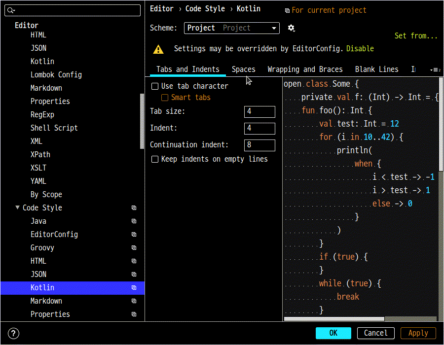
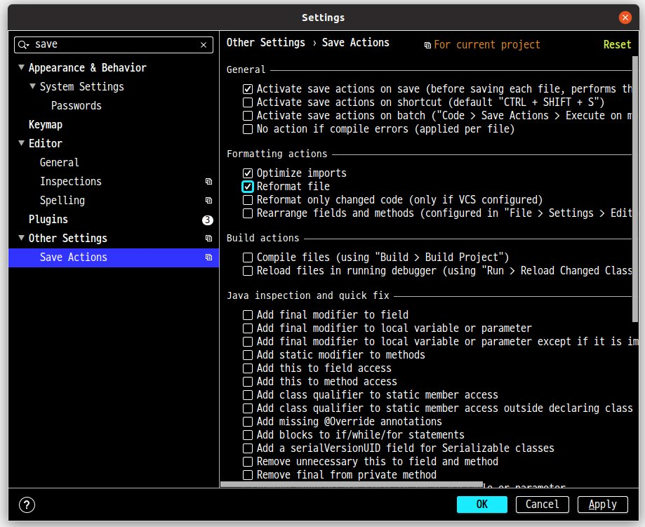
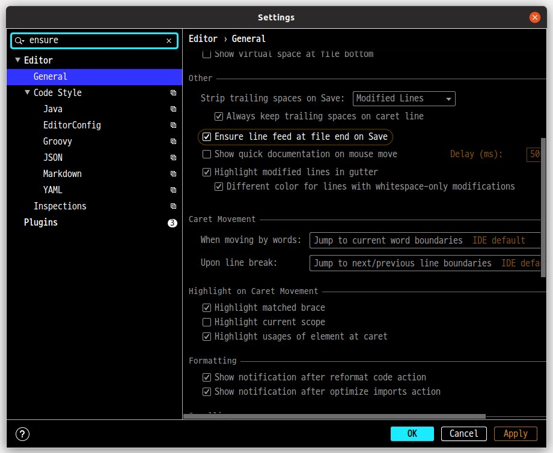
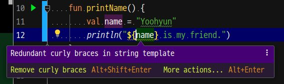

= ktlint로 Kotlin 공식 코딩 컨벤션 맞추기
정상혁
2019-11-12
:jbake-type: post
:jbake-status: published
:jbake-tags: kotlin,ktlint,coding-convention
:jbake-description: Kotlin 언어에는 공식 코딩 컨벤션이 정의되어 있습니다. 이를 준수할수 있도록 Gradle 빌드에서 ktlint로 코드 스타일을 검사하고, IntelliJ의 포멧터, Git의 pre-commit hook과 연동하는 방법을 안내합니다.
:jbake-og: {"image": "img/kotlin-code-style/ktlint-logo.jpg"}
:idprefix:
:toc:
:sectnums:

Kotlin 언어의 공식 사이트에서는 코딩 컨벤션 가이드를 제공합니다.

* https://kotlinlang.org/docs/reference/coding-conventions.html

https://ktlint.github.io/[ktlint]는 Kotlin의 공식 가이드의 규칙을 포함하여 코드 스타일을 검사하고, 맞춰주는 도구입니다.
이 글에는 ktlint를 Gradle, IntelliJ, Git과 연동하여 사용하는 방법을 정리했습니다.

== Gradle 빌드 설정
https://ktlint.github.io/[ktlint]는 jar 파일로 제공되고, https://jcenter.bintray.com/ 에도 배포되어 있습니다.
따라서 별도의 Gradle plugin이 없어도 Gradle에서 task를 정의해서도 쓸 수 있습니다.
그런데 ktlint의 공식 사이트에서는 Gradle plugin을 더 권장한다고 나와 있습니다.
이 글에서는 ktlin를 래핑만 Gradle plugin 중 Github에서 별 갯수가 가장 높은 https://github.com/jlleitschuh/ktlint-gradle[jlleitschuh/ktlint-gradle]를 사용했습니다.

=== `.editorconfig` 설정
ktlint는 `.editorconfig` 파일에 선언된 규칙을 포함하여 코드 스타일을 검사합니다.
`.editorconfig` 는 다양한 에디터와 IDE에서 공통적으로 지원하는 코드 스타일에 대한 설정 파일입니다.
자세한 스펙은 https://editorconfig.org/ 에서 파악할 수 있습니다.

아래와 같이 `.editorconfig`  설정을 추가하면 Kotlin 코딩컨벤션과 함께 쓰기에 무난합니다.

[source]
..editorconfig 예시
----
root = true

[*]
charset = utf-8
end_of_line = lf
indent_size = 4
indent_style = space
insert_final_newline = true
max_line_length = 120
tab_width = 4
----

ktlint는 `.editorconfig` 파일이 없어도 디폴트 규칙으로 실행할 수 있습니다.
그렇지만 아래와 같은 이유로 명시적으로 이 파일을 선언하는 것을 권장합니다.

* 의도하지 않게 상위 디렉토리의 `.editorconfig` 가 참조되는 경우를 막아줍니다.
** `.editorconfig` 파일의 규약에 따르면, 이 파일을 지원하는 도구들은 `root = true` 라는 선언이 된 `.editorconfig` 파일을 찾기 전까지는 모든 상위 디렉토리를 탐색합니다. footnote:[https://editorconfig.org/ 에서 'When opening a file, EditorConfig plugins look for a file named .editorconfig in the directory of the opened file and in every parent directory.' ]
** ktlint에서도 이 규약을 준수합니다. 따라서 특정 컴퓨터에만 소스를 복제한 디렉토리의 상위 디렉토리에 `.editorconfig` 가 있다면 그 장비에서는 스타일 체크 결과가 다르게 나오게 됩니다.
* ktlint가 버전이 올라가면서 규칙의 디폴트 값이 변경될 경우를 대비합니다.
** 예를 들면 ktlint 0.34.0 버전부터 `insert_final_newline = true` 가 디폴트 값이 되었습니다.  footnote:[0.34.0 릴리즈 노트 참고 : https://github.com/pinterest/ktlint/blob/master/CHANGELOG.md#0340---2019-07-15]
* 다양한 IDE와 Editor등의 도구에서 이 설정을 참조합니다.
** IntelliJ, VSCode, GitHub등에서 뷰어,포멧터의 설정으로 자동 반영됩니다.
* 코드 포멧에 대한 문서와 역할도 할 수 있습니다.
** 위의 예시와 같이 `.editorconfig` 에 선언되는 속성의 이름은 이해하기 쉽습니다. 이 파일만 봐도 파일 포멧에 대한 일부 규칙을 파악할 수 있습니다.
* https://kotlinlang.org/docs/reference/coding-conventions.html[Kotlin 공식 코딩 컨벤션]에 명시되지 않은 규칙까지 일치시킬 수 있습니다.
** `max_line_length` , `insert_final_newline` 과 같은 규칙을 Kotlin 공식 코딩 컨벤션에는 명시되어 있지는 않습니다. 그러나 같은 소스를 고치면서 협업하는 개발자들이 이를 통일하지 않을 경우 불필요한 Diff 가 발생하여 코드 변경분을 파악할 때 불편해집니다.

=== `build.gradle` 설정
https://github.com/jlleitschuh/ktlint-gradle[jlleitschuh/ktlint-gradle]는 아래와 같이 설정합니다.

[source,groovy]
.Gradle Groovy설정 (build.gradle)
----
buildscript {
    repositories {
        maven {
            url 'https://plugins.gradle.org/m2/'
        }
    }
    dependencies {
        classpath 'org.jlleitschuh.gradle:ktlint-gradle:9.1.0'
    }
}

plugins {
    id 'org.jlleitschuh.gradle.ktlint' version '9.1.0'
}
----

[source,kotlin]
.Gradle Kotlin설정 (build.gradle.kts)
----
buildscript {
    repositories {
        maven(url = "https://plugins.gradle.org/m2/")
    }
    dependencies {
        classpath("org.jlleitschuh.gradle:ktlint-gradle:9.1.0")
    }
}
plugins {
    id("org.jlleitschuh.gradle.ktlint") version "9.1.0"
}
----

[CAUTION]
====
https://github.com/jlleitschuh/ktlint-gradle[jlleitschuh/ktlint-gradle]는 Gradle 버전 5.4.1이상에서만 사용할 수 있습니다. 그 이하버전에서는 아래와 같은 에러가 나옵니다.

[source]
----
* What went wrong:
Could not determine the dependencies of task ':ktlintCheck'.
> Could not create task ':ktlintTestSourceSetCheck'.
   > Could not create task of type 'KtlintCheckTask'.
      > Could not generate a decorated class for class org.jlleitschuh.gradle.ktlint.KtlintCheckTask.
         > org/gradle/work/InputChanges

----

이럴 경우에는 Gradle 버전을 업그레이드해야합니다.
다양한 Gradle 버전을 설치하는데에는 https://sdkman.io/[SDKMAN] 을 권장합니다.
Gradle Wrapper를 업그레이드하는 방법은 https://java.ihoney.pe.kr/476 을 참조합니다.

Gradle 버전을 업그레이드하기가 어려울 경우 https://ktlint.github.io/ 에 안내된 다른 Gradle Plugin이나 Plugin없이 사용하는 방법을 참고하시기 바랍니다.
====

`gradle.properites` 파일에도 공식 코딩 컨벤션을 사용한다는 정책을 아래와 같이 명시합니다.

[source,properties]
.gradle.properites 설정
----
kotlin.code.style=official
----

IntellJ에서 프로젝트를 import할때 위의 설정을 참조할 수 있습니다.

플러그인 설정이 완료되면 ktlint를 실행하는 Gradle 태스크는  `./gradlew tasks | grep ktlint` 명령으로 확인할 수 있습니다.

=== 스타일 검사 수행
`./gradlew ktlintCheck` 태스크는 스타일 검사를 수행합니다.
이 태스크는 `./gradlew build` 를 실행했을 때 연결되는 전체 프로젝트 빌드 싸이클에 포함됩니다. 따라서 디폴트 설정으로는  ktlint에서 가이드하는 코드 스타일을 지키지 않으면 빌드가 실패합니다.

=== 스타일 일괄 변환
`./gradlew ktlintFormat` 태스크로는 스타일에 맞지 않는 코드를 바꿔줍니다. 전체 프로젝트의 소스 코드를 한꺼번에 고칠 때 사용할 수 있습니다.

그런데, 이 기능을 사용하다가 의도하지 않게 파일이 삭제되는 경우도 있었습니다.
그래서 이 태스크는 조심해서 사용해야합니다.
이 글에서 설명한 IntelliJ로 포멧을 일괄변환하는 방법도 참고해서 병행해서 사용하는 편이 좋습니다.

=== Git hook으로 설정
앞에서 설명한 `ktlintCheck` , `ktlintFormat` 태스크를 Git의 Hook으로 등록하여 commit을 하면 자동으로 실행되게 할 수 있습니다.

* `./gradlew addKtlintCheckGitPreCommitHook` : ktlintCheck 태스크를 pre-commit hook으로 등록
* `./gradlew addKtlintFormatGitPreCommitHook` : ktlintFormat 태스크를 pre-commit hook으로 등록ktlintCheck 태스크로 검사하도록 설정합니다.

앞에서 설명한 것처럼 `ktlintFormat` 태스크는 의도하지 않게 파일을 바꿀 위험이 있기 때문에 `addKtlintCheckGitPreCommitHook` 를 더 권장합니다.

등록된 pre-commit hook은 `rm .git/hooks/pre-commit` 명령으로 등삭제할 수 있습니다.

== IntelliJ 설정
IntelliJ의 코드 포멧터는 https://kotlinlang.org/docs/reference/coding-conventions.html[Kotlin 공식 코딩 컨벤션]이 나오기 전부터 쓰이던 디폴트 설정이 있었습니다. IntelliJ에서는 Kotlin 1.3에서는 신규로 생성되는 프로젝트에서, Kotlin 1.4에서는 모든 프로젝트에서 공식 컨벤션에 맞춘 포멧터가 디폴트로 설정될 것이라고 합니다. footnote:[https://kotlinlang.org/docs/reference/code-style-migration-guide.html 에서 설명된 계획입니다.] 오랫동안 유지보수할 Kotlin 코드라면 공식 컨벤션에 맞춰서 IntelliJ에서도 포멧터를 설정되었는지 신경을 써야 합니다.

=== 포멧터 설정
다음에 안내한 A, B 2가지 방법 중의 하나를 선택하셔서  공식 코딩컨벤션에 맞게 IntelliJ의 포멧터 설정을 맞출수 있습니다.

==== A. `predefined ` 을 이용한 설정
1. IntelliJ 메뉴에서 `Settings` > `Editor` > `Code Style` > `Kotlin` 으로 이동합니다.
2. `Scheme` 항목을 Project로 지정합니다.
** 여러 프로젝트에서 다른 설정을 쓸 경우를 대비해 가급적 글로벌 설정을 바꾸지 않기 위함입니다.
3. `Set from...` -> `Predefined Style` -> `Kotlin Style Guide` 를 선택합니다.

==== B. Gradle plugin을 이용한 설정
앞서 설정한 https://github.com/jlleitschuh/ktlint-gradle[jlleitschuh/ktlint-gradle]를 이용하여 `./gradlew ktlintApplyToIdea` 태스크를 실행합니다.
이 태스크는 IntelliJ 설정파일의 코드 스타일 부분을 덮어써서 ktlint의 규칙과 가급적 맞는 포멧터가 설정합니다.

포멧터가 설정되면 파일을 편집할 때 `Code` > `Reformat Code` 메뉴를 선택하거나 단축키 `Ctrl + Shift + L` 단축키로 포멧터를 적용할 수 있습니다.

=== 기존 코드 일괄 변환
1. IntelliJ의 프로젝트 탐색기에서 프로젝트의 최상위 디렉토리를 우클릭합니다.
2. Reformat Code 를 실행합니다.
** 우클릭을 하여 나오는 메뉴에서 `Reformat Code` 를 선택하거나
** `Ctrl + Shift + L` 단축키를 누릅니다.

=== 파일을 저장할 때마다 포멧터 적용하기
https://plugins.jetbrains.com/plugin/7642-save-actions[Save Actions Plugin]를 사용하면 파일을 저장할 때 자동으로 포멧터를 실행할 수 있습니다.

1. `File` > `Settings` ( `Ctrl + Alt + S` ) > `Plugins` 메뉴로 이동합니다.
2.  `Marketplace` 탭에서 'Save Actions' 로 검색합니다.
3. `Save Actions' plugin의 상세 설명 화면에서  `[Install]` 버튼을 누릅니다.
4. IntelliJ를 재시작합니다.
5. `File` > `Settings` >  `Other Settions` > `Save Actions` 메뉴로 이동합니다.
6. 아래 항목 혹은 그외의 원하는 정책을 체크합니다.
** `Activate save actions on save`
** `Optimize imoprts`
** `Refomat file` (전체 프로젝트의 스타일이 통일된 경우)
** `Refomat only changed code` (프로젝트의 스타일이 통일되어 있지 않아서 스타일이 맞지 않는 코드를 함께 고치면 변경 부분을 알아보기가 더 어려운 경우)

=== 포멧터가 바꿔주지 않는 규칙 신경쓰기
IntelliJ의 포멧터는 ktlint에서 검사하는 규칙을 다 자동을 맞추어주지는 못합니다.
즉 `Reformat Code` ( `Ctrl + Alt + L` ) 을 실행하는 것만으로는 ktlint 검사를 통과한다는 보장은 없습니다.
다음에서 설명하는 IntelliJ의 기능을 잘 활용하면 보다 빠른 시점에서 ktlint의 규칙을 준수하는데 도움이 됩니다.

==== 파일의 마지막에 자동으로 개행문자 추가
POSIX 명세에 따라서, 텍스트 파일의 마지막에 개행문자(LF)를 추가하는 것이 권장됩니다. footnote:[https://blog.coderifleman.com/2015/04/04/text-files-end-with-a-newline/ 참조]

그런데, IntelliJ의 `Reformat Code` 기능으로는 마지막 개행문자 추가가 되지 않습니다.
`File` > `Settings` > `Editor` > `General` 메뉴에서 `Ensure line feed at file end on Save` 를 선택하면, 파일이 저장될 때 자동으로 마지막에 개행문자를 추가해줍니다.

이 설정은 `.editorconfig` 의 선언에 따라 자동으로 활성화될 수도 있습니다.
그렇지만 의도대로 동작하지 않는다면 한번 확인해볼만합니다.

==== IntelliJ 경고에 따라 고치기
Kotlin 공식 코딩 컨벤션에는 공백 등 단순한 파일 형식 외에도 문법적인 요소에 대한 것도 있습니다.

예를 들면 String Template를 쓸 때는 꼭 필요한 경우가 아니면 중괄호를 넣지 말라는 규칙이 있습니다.
( https://kotlinlang.org/docs/reference/coding-conventions.html#string-templates )

* (O): `println("$name is my friend.")`
* (X): `println("${name} is my friend.")`

이 규칙을 어긴 코드는 'Reformat Code' 로는 바로 바뀌지 않습니다.
IntelliJ에서 이런 코드에 경고를 보내고 `Alt + Shift + Enter` 단축키로 코드로 바꾸는 기능을 제공합니다.

이처럼 IntelliJ에서는 언어 문법을 활용할때도 Kotlin 공식 코딩 컨벤션에서 권장하는 스타일대로 쓰도록 유도하고 있습니다.
이런 경고들을 무시하지 않고 반영한다면 ktlint의 검사에서도 통과할 가능성이 높아집니다.
