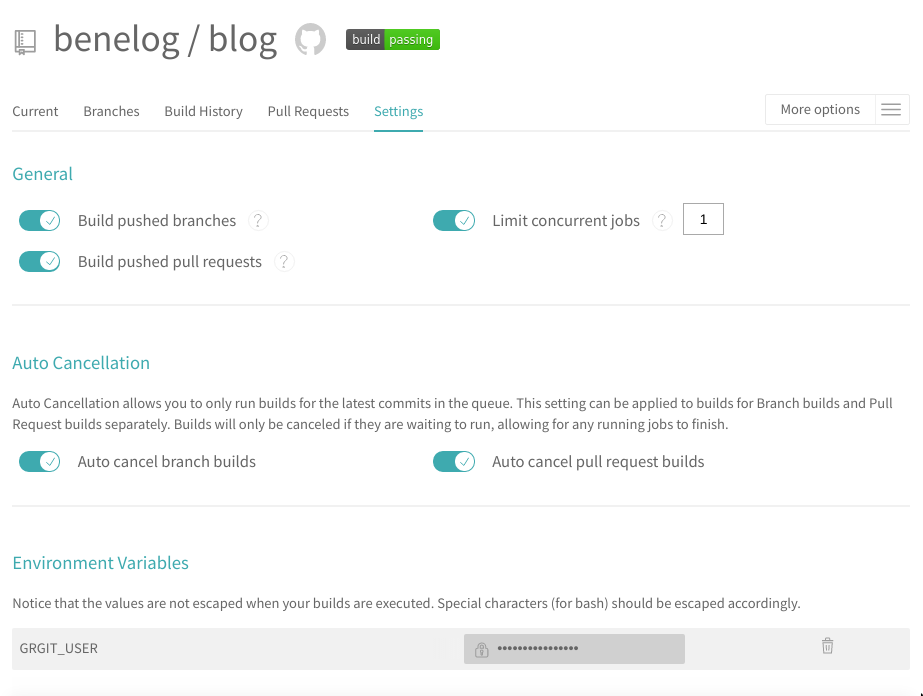
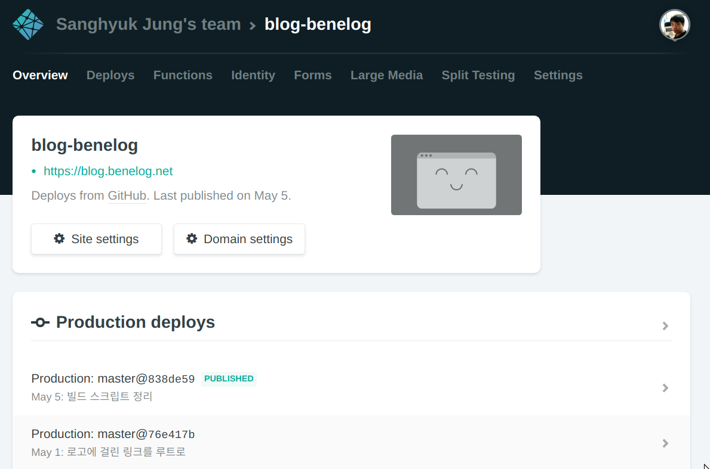

= 정적 사이트로 블로그 마이그레이션
정상혁
2019-05-06
:jbake-type: post
:jbake-status: published
:jbake-tags: static-site
:jbake-description: 이 블로그를 마이그레이션 했던 과정에서 얻은 경험을 정리했습니다. Github와 AsiiDoc, JBake, Gradle, Netflify 등의 기술을 이용했습니다.
:jbake-og: {"image": "img/blog-migration/netflify.png"}
:idprefix:
:toc:
:sectnums:

== 블로그를 이전한 동기
저는 이 블로그를 http://www.egloos.com[Egloos]에서 커스텀 URL(blog.benelog.net)을 설정하여 쓰고 있었습니다.
Egloos는 무난한 블로깅 플랫폼입니다. 그러나 개발과 관련된 글을 쓰면서 코드를 편집하기에는 저한테는 Egloos에서 제공하는 에디터가 잘 맞지가 않았습니다.
점점 글을 안 쓰게 되었고, 이 블로그는 갱신되지 않는 옛날 글만 가득하게 되었습니다.
공유할 글이 생길 때는 https://gist.github.com/ 를 이용하기도 했습니다.

이전처럼 가끔씩이라도 블로그에 글을 올리려면 블로그 플랫폼을 바꿔야겠다는 생각이 들었습니다.

== 요구사항
블로그 플랫폼을 선택하는데 염두에 둔 조건은 아래와 같았습니다.

* 기존의 포스트의 주소가 동일하게 유지되어야 한다.
** 외부에서 걸린 링크가 깨어지지 않아야한다.
* 기존 블로그에 달린 댓글을 그대로 옮겨올 수 있어야 한다.
* 다른 서비스/도구로 다시 옮겨가기가 쉬워야한다.
* AsciiDoc으로 포스트를 작성할 수 있어야한다.

== 선택한 기술
앞의 요구사항을 충족시키는 다음과 같은 서비스/도구들을 선택했습니다.

- 정적 사이트 생성기 : https://jbake.org/[JBake]
- 컨텐츠 저장소 : GitHub
- 빌드/배포 : https://www.netlify.com/[Netlify]
- 댓글 : https://help.disqus.com/[Disqus]
- 방문자 통계 집계 : https://analytics.google.com/analytics/web/[Google Analytics]

새로운 블로그는 정적 사이트 생성기(Static Site Generator)로 Git 저장소에 있는 AsciiDoc 형식의 컨텐츠를 HTML 파일로 만들어서 배포하는 구조입니다.
덕분에 Egloos로부터의 마이그레이션 작업이 더 수월했고 더 좋은 서비스가 있을 때 쉽게 이전을 할 수 있습니다.

컨텐츠 저장소는 GitHub외에도 Gitlab, Bitbucket 등의 대안이 있고, 컨텐츠 빌드 배포 플랫폼도 다양합니다.
필요하다면 더 좋은 기능이 있는 서비스를 유료로 사용할 수도 있습니다.
컨텐츠 편집기도 여러가지를 사용할 수 있습니다.

사용할 기술을 선택하면서 했던 고민들은 아래에 정리했습니다.

=== 정적 사이트 생성기
정적 사이트 생성기로 JBake를 선택한 이유는 다음과 같습니다.

* 필수요구사항이였던 AsciiDoc 지원
* JVM 기반
** 일할 때도 쓰는 환경이라서 문제를 만났을 때 해결하는 시간이 짧고, 직접 고쳐서 쓸 수 있는 가능성도 높습니다.
** Gradle 빌드 구성 등 이미 알고 있는 지식과 결합시키기에도 편했습니다.
* JBake로 만들어진 템플릿인 https://github.com/manikmagar/jbake-future-imperfect-template[jbake-future-imperfect-template]의 편의성
** Disqus와 Google Analytics를 설정파일을 1줄씩을 고쳐서 간단히 적용할 수 있습니다.

비슷한 고민을 하실 분들이 참고할만한 링크들을 정리해봅니다.

* 정적 사이트 생성기가 정리된 사이트
** https://www.staticgen.com/
** https://staticsitegenerators.net/
* https://gist.github.com/briandominick/e5754cc8438dd9503d936ef65fffbb2d[AsciiDoc을 지원하는 정적 사이트 생성기]
* JVM 기반의 정적 사이트 생성기
** https://orchid.netlify.com/[Orchid]
** https://www.opoopress.com/[OpooPress]
** https://github.com/wiztools/stagen[StaGen]
** https://sysgears.com/work/grain/[Grain]
** https://nakkaya.com/static.html[nakkaya staic]

미래에 JBake를 다른 도구로 교체한다면 아래 2개의 도구를 가장 우선적으로 고려할 예정입니다.

* https://orchid.netlify.com/[Orchid]
** JVM 기반이면서 AsciiDoc 지원
** 현대적인 기술 스택인 https://jamstack.org/[JAMstack] 활용
** https://www.netlifycms.org/[Netlify CMS]와 연동됨
* https://gohugo.io/[Hugo]
** 빠른 빌드 성능
** 템플릿, 편집과 배포에 대한 생태계가 풍부함
*** https://gohugo.io/tools/frontends/ 참조
*** https://www.netlifycms.org/[Netlify CMS]와도 연동됨

=== Git 저장소, 빌드/배포
Git 저장소는 많이 쓰이는 GitHub를 무난하게 선택했습니다.
AsciiDoc으로 작성된 포스트의 원본은 https://github.com/benelog/blog/tree/master/src/content[github/benelog/blog/src/content] 에서 이력을 관리합니다.

처음에는 https://travis-ci.org/[Travis CI]와 Githb Page를 활용해서  빌드/배포를 구성하고 커스텀 도메인과 HTTPS를 적용하려고 했었습니다.
그래서 이 블로그는 https://benelog.github.io/blog 로도 접근이 가능합니다.

빌드 스크립트는 https://github.com/benelog/blog/blob/master/build.gradle[build.gradle]에서 확인이 가능합니다.
Travis CI 설정인 https://github.com/benelog/blog/blob/master/.travis.yml[.travis.yml]은 아래와 같이 단순합니다.

[source,yml]
----
language: java
script: ./gradlew gitPublishPush
----

이 작업을 실행하기 위해서는 https://github.com/settings/tokens 에서 발급받은 Personal Access Token을
Tracis CI의 저장소별 설정에서 `GRGIT_USER` 라는 환경변수로 지정을 해주어야 합니다.

최종적으로는 지원하는 기능이 더 풍부한 https://www.netlify.com/[Netflify]을 이 도메인에는 사용했습니다.

Gradle로 만든 빌드 스크립트를 지정하고 Domain을 지정하고 HTTPS를 적용하는 작업까지 편하게 할 수 있었습니다.
Netflify에는 Name 서버 기능까지 있어서 사용하던 Name 서버도 이 서비스로 이전을 했습니다.

Netflify에서는 `./gradlew bake` 로 빌드를 합니다.

image::img/blog-migration/netflify-deployment.png[netflify]

이 블로그의 JBake 설정으로는 https://blog.benelog.net/904735.html 와 같이 HTML 확장자를 붙인 주소를 씁니다.
Egloos의 이전 포스트들은 https://blog.benelog.net/904735 와 같이 HTML 확정자가 없게 되어 있습니다.
Netflify와 Github pages에서는 디폴트로 아무런 설정이 없어도 HTML 확장자가 없는 주소를 HTML 확장자가 붙은 주소와 동일하게 취급을 해주어서
URL의 하위 호환성을 쉽게 유지할 수 있었습니다.
JBake의 설정으로 HTML 확장자를 제외하는 것도 시도해보았지만, 태그 링크 같은 블로그의 다른 요소의 링크들과 함께 잘 어우러지는 것이 쉽지 않았습니다.
호스팅 서비스 단에서 연결해 해주는 방법이 더 간편하고 부작용이 없어서 최종적으로 그에 의지하도록 했습니다.
즉, 기존 주소 연결을 위해서 아무런 설정도 안 했다는 이야기입니다.

정적 페이지를 호스팅할수 있는 다른 서비스를 찾는다면 아래의 링크들을 참조하실 수 있습니다.

* https://about.gitlab.com/product/pages/[Gitlab Pages]
* https://surge.sh/[Surge]
* https://www.aerobatic.com/[Aerobatic]
* https://zeit.co/now[Now]
* https://aws.amazon.com/ko/s3/[Amazon S3]
* https://firebase.google.com/docs/hosting/[Firebase Hosting]

=== 편집기
긴 글을 편집할 때는 IntelliJ Community Edition을 사용했습니다.
평소 개발할 때의 편집방식, 단축키와 Git 저장소 연동 방식을 그대로 활용할 수 있습니다.
`Find in Path (Ctrl + Shift + F)` , `Replace in Path (Ctrl + Shift + R)` 으로 여러 파일에 걸쳐 문자열을 검색하고 치환하는 기능은 마이그리에션 된 컨텐츠를 정리할 때 많은 도움이 되었습니다.

https://plugins.jetbrains.com/plugin/7391-asciidoc[AsciiDoc plugin]을 설치하면
HTML으로 렌더링될 모습을 동시에 보면서 편집을 할 수 있고 이미지 파일을 참조할 때는 자동완성이 되기도합니다.

image::img/blog-migration/intellij-asciidoc.png[IntelliJ로 AsciiDoc 편집]

간단한 글을 쓰거나 수정할 때는 Github에서 바로 온라인으로 편집을 할 생각입니다.

참고로 정적 사이트 생성기를 기반으로 온라인 에디터를 제공하는 서비스들은 아래와 같은 것들이 있습니다.

* https://appernetic.io/[Appernetic.io] : Hugo 지원
* https://forestry.io/[Forestry] : Jekyll, Hugo, Vuepress 지원
* https://www.netlifycms.org/[Netlify CMS] : Hugo, Gatsby, Middleman 등 지원

=== 마이그리에션 프로그램
마이그리에션 프로그램의 소스와 사용법은 https://github.com/benelog/egloos-migration/ 을 참고하시기 바랍니다.
이것도 제가 알고 있는 기술들을 활용해서 Kotlin + Spring 으로 작성했습니다.

컨텐츠를 담은 파일을 생성할 때 Kotlin의 문자열 문법이 유용할 것으로 예상해서 언어는 Kotlin을 선택했습니다. 아래와 같은 코드입니다.

[source,kotlin]
----
    private fun convert(post: EgloosPost): String {
        val asciiDoc = converter.convert(post.content)
        return """= ${post.title}
${post.nick}
${post.createdAt.format(formatter)}
:jbake-type: post
:jbake-status: published
:jbake-tags: ${post.tags}
:idprefix:

$asciiDoc
"""
        // String을 inputStream으로 읽어서쓰니 trimIndent가 안 먹음.
    }
}
----

그리고 프로그램을 부분적으로 실행하고 검증해보기 위해서 Spring Batch를 썼습니다.
원래 Spring Batch는 대용량 데이터를 메모리에 다 올리지 않고 처리할 떄 적합한 프레임워크입니다.
제 블로그의 포스트는 100개 정도로 작은 데이터인데 여기에 Spring Batch를 쓰는 것은 어울리지 않을 수도 있습니다.

그런데, Spring Batch의 ItemReader, ItemProcessor, ItemWriter 구조에 맞춰서 프로그램을 만들고
이 기능 단위로 테스트를 해보면 것이 마이그레이션 프로그램을 만드는 효율적인 방법이라고 판단했습니다.
pring Batch를 쓰지 않았어도 비슷한 기능 단위로 쪼갯을 것 같았기에 이미 익숙한 프레임워크의 인터페이스를 활용했습니다.

부분적인 기능의 테스트들은 https://github.com/benelog/egloos-migration/tree/master/src/test/kotlin/net/benelog/blog/migration/etl 을 참조하실 수 있습니다.

== 마치며
오랜 숙원 사업이였던 블로그 이전을 마쳐서 뿌듯합니다.
다른 개발자들에게 도움이 될만한 글을 가끔씩이라도 써보겠습니다.
이전에 썼던 글들도 틈틈히 최신화하려고 합니다.
할 작업들은 https://github.com/benelog/blog/issues 에 기록해두고 있습니다.
