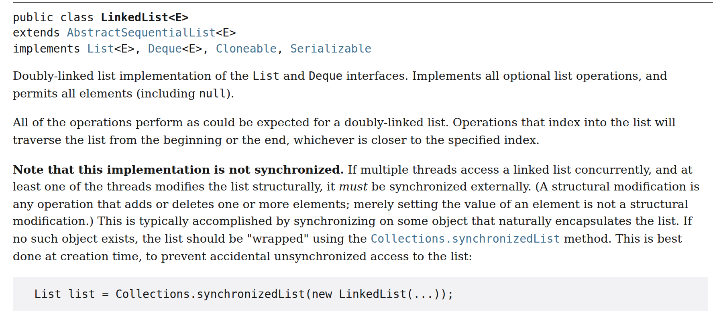
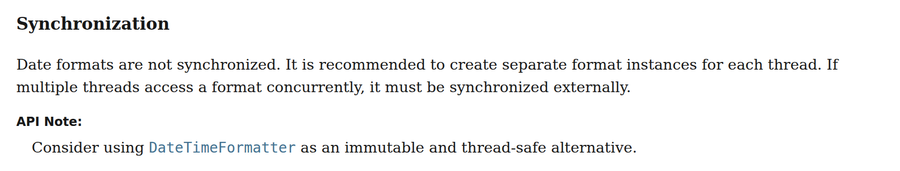
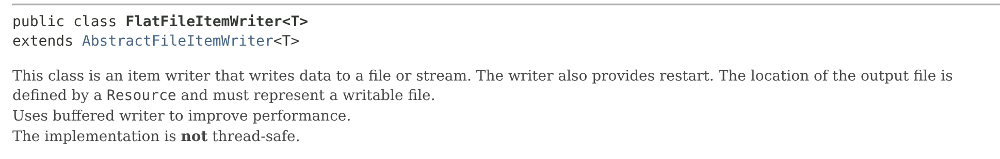
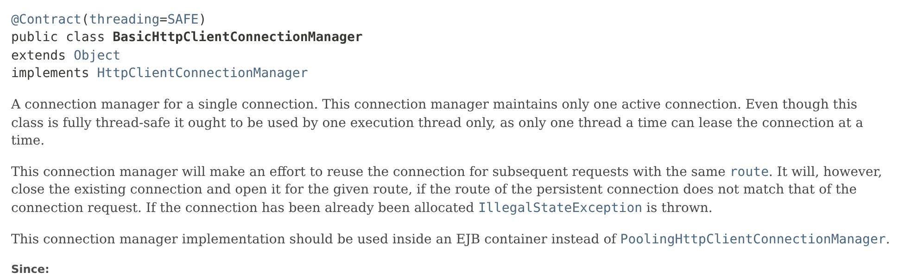

= 스레드 안전성의 문서화와 검증: Javadoc 표기, 애너테이션, 정적 분석, ArchUnit
정상혁
2012-05-30
:jbake-type: post
:jbake-status: published
:jbake-tags: java, concurrency, static-analysis, archunit, spring
:description: Javadoc은 synchronized 여부를 보여 주지 않고 스레드 안전성을 표시할 규약도 없어서, 스레드 안전성은 클래스 설명에 따로 적어야 합니다. Effective Java의 다섯 단계 분류, JDK 25와 Spring Batch, HttpClient 5 문서의 표기 사례, JCIP 계열 애너테이션과 SpotBugs·Error Prone의 검사 범위, 2026년에 고를 만한 애너테이션 라이브러리, ArchUnit으로 Spring 컨트롤러의 필드를 검사하는 방법을 정리합니다.
:jbake-last_updated: 2026-09-03
:idprefix:
:toc:
:examples-repo: https://github.com/benelog/blog/tree/master/examples
:source-repo: {examples-repo}/thread-safety-archunit
:source-link-base: {source-repo}
:static-analysis-repo: {examples-repo}/thread-safety-static-analysis

어떤 클래스를 여러 스레드가 공유해도 되는지는 그 클래스가 사용자와 맺는 계약의 일부입니다. 그런데 Javadoc에는 스레드 안전성을 명확히 표현하는 규약이 없습니다. 이 글은 스레드 안전성을 Javadoc에 어떻게 남길지와 애너테이션과 정적 분석 도구, ArchUnit 테스트로 멀티스레드에서 위험한 코드가 배포되지 않도록 방어하는 방법을 정리합니다.

== Javadoc으로 표시하는 스레드 안전성

Javadoc이 메서드의 `synchronized` 를 표시하지 않는 이유와 그와 별개로 클래스 수준의 규약이 왜 필요한지, 문서화를 한다면 어떤 분류가 적절할지, 그리고 실제 라이브러리 문서의 사례를 차례로 봅니다.

=== Javadoc이 synchronized를 표시하지 않는 이유와 남는 공백

Javadoc은 메서드 선언의 `synchronized` 키워드를 출력하지 않습니다. 동기화 여부는 구현 세부 사항이라서 API 문서에 노출할 계약이 아니라고 보기 때문입니다. Effective Java 3판의 아이템 82도 같은 근거를 들어 이 정책을 옹호합니다.

메서드 선언부의 `synchronized` 는 메서드 본문 전체를 `synchronized(this)` 블록으로 감싼 것과 같습니다. 즉 아래 코드는

[source,java]
----
synchronized void run() {
    // do something
}
----

다음 코드와 같은 일을 합니다.

[source,java]
----
void run() {
    synchronized (this) {
        // do something
    }
}
----

구현을 개선하면서 동기화 구간을 메서드의 일부로 좁힐 수도 있고, `this` 대신 별도의 lock 객체를 쓸 수도 있습니다. 이런 세부 구현은 외부 인터페이스보다 자주 바뀝니다. lock으로 보호되는 모든 구간을 메서드 선언부에 표시하기도 어렵습니다. 내부적으로 `java.util.concurrent.locks.Lock` 이나 CAS 연산으로 동기화한 클래스도 있으니, `synchronized` 키워드의 유무는 스레드 안전성을 판단하는 일관된 기준이 되지 못합니다.

따라서 메서드의 `synchronized` 를 감추는 정책은 적절하다고 생각합니다. 그런데 이 정책은 메서드 수준의 구현 세부를 감춘 것일 뿐입니다. 어떤 클래스를 여러 스레드가 공유해도 되는지는 별개의 문제이고, 그 클래스가 사용자와 맺는 계약입니다. 키워드가 신호가 되지 못하는 만큼 클래스 수준에서 안전성을 표시할 규약이 더 필요한데, Javadoc은 이를 제공하지 않습니다.

메서드 하나가 안전하다는 정보만으로는 쓸모가 제한적이기도 합니다. 스레드 안전성은 메서드가 아니라 객체의 상태를 여러 스레드가 어떻게 접근하느냐에 달린 성질이기 때문입니다. ``HashMap``은 여러 스레드가 ``get()``만 호출하면 문제가 없지만, 한 스레드가 ``put()``으로 구조를 바꾸는 동안 다른 스레드가 ``get()``을 호출하면 결과를 보장할 수 없습니다. ``get()``이 안전한지는 그 메서드만 봐서는 알 수 없고, 같은 시점에 다른 스레드가 무엇을 하는지에 달려 있습니다. 반대로 모든 메서드가 `synchronized` 인 ``Hashtable``이나 ``Collections.synchronizedMap()``으로 감싼 ``Map``도 '키가 없으면 넣는다' 같은 복합 동작은 외부에서 lock을 잡지 않으면 경쟁 조건이 생깁니다. 메서드 하나하나가 안전해도 호출을 조합하면 안전하지 않을 수 있습니다.

그러니 문서화할 대상은 메서드의 동기화 여부가 아니라 클래스가 어떤 조건에서 안전한지입니다. Javadoc에 이를 표시할 규약이 없으니 개발자가 클래스 설명에 직접 적어야 합니다. 다음 절에서 볼 Effective Java의 분류가 그 기준이 됩니다.

=== Effective Java의 스레드 안전성 다섯 단계

Effective Java 3판의 아이템 82 '스레드 안전성 수준을 문서화하라'(2판에서는 아이템 70)는 스레드 안전성을 다섯 단계로 나눠 문서화하라고 권합니다.

* 불변(immutable)
** 상태가 바뀌지 않으므로 외부 동기화가 필요 없습니다.
** 예: `String`, `Long`, `BigDecimal`, `java.time.LocalDate`
* 무조건적 스레드 안전(unconditionally thread-safe)
** 상태가 있으나 내부에서 충분히 동기화합니다.
** 예: `AtomicLong`, `ConcurrentHashMap`
* 조건부 스레드 안전(conditionally thread-safe)
** 일부 메서드는 외부 동기화가 있어야 안전합니다.
** 예: ``Collections.synchronizedList()``로 감싼 `List`. iterator로 순회하는 동안에는 `List` 객체를 lock으로 잡아야 하고, 그렇지 않으면 ``ConcurrentModificationException``이 발생할 수 있습니다.
* 스레드 안전하지 않음(not thread-safe)
** 외부에서 동기화해야 합니다.
** 예: `HashMap`, `ArrayList`
* 스레드 적대적(thread-hostile)
** 외부에서 동기화해도 멀티스레드에서 쓸 수 없습니다. 주로 동기화 없이 static 데이터를 수정하는 클래스가 여기에 해당합니다. 다행히 Java 라이브러리에는 거의 없습니다.
** 예: ``System.runFinalizersOnExit()``. 책이 든 이 예는 JDK 11에서 제거되었습니다.

책은 이 분류 중 스레드 적대적을 제외한 네 단계가 'Java Concurrency in Practice'의 애너테이션 `@Immutable`, `@ThreadSafe`, ``@NotThreadSafe``에 대체로 대응한다고 설명합니다. 이렇게 구분해서 클래스 설명 맨 앞에 적어 주면 좋겠지만, 강제하는 규약이 없다 보니 기존 문서들은 클래스 설명의 중간이나 끝에서 스레드 안전성을 언급합니다.

=== 클래스 설명문의 표기 사례

Java 표준 라이브러리와 Spring Batch가 스레드 안전성을 어디에 어떻게 적는지 세 가지 예를 보겠습니다.

==== java.util.LinkedList

https://docs.oracle.com/en/java/javase/25/docs/api/java.base/java/util/LinkedList.html[LinkedList의 JDK 25 Javadoc]은 클래스 설명의 세 번째 문단에서 굵은 글씨로 'not synchronized'라고 밝힙니다.

==== java.text.SimpleDateFormat

https://docs.oracle.com/en/java/javase/25/docs/api/java.base/java/text/SimpleDateFormat.html[SimpleDateFormat의 JDK 25 Javadoc]은 클래스 설명의 마지막 즈음에 'Synchronization'이라는 제목의 절을 두고 'Date formats are not synchronized'라고 설명합니다. JDK 25 문서는 'API Note'로 ``DateTimeFormatter``를 'immutable and thread-safe alternative'로 권합니다.

권장 대상인 `DateTimeFormatter` 나 ``LocalDate``의 문서에는 'Implementation Requirements' 항목에 'This class is immutable and thread-safe.'라고 적혀 있습니다. JDK 8에서 추가된 `java.time` 패키지의 클래스들은 Javadoc의 `@implSpec` 태그로 같은 문장을 같은 자리에 적습니다. 표준 라이브러리 안에서도 새로 만든 API일수록 스레드 안전성을 일관된 형식으로 표시하는 추세입니다.

==== org.springframework.batch.item.file.FlatFileItemWriter

Spring Batch 5.2.6의 https://docs.spring.io/spring-batch/docs/current/api/org/springframework/batch/item/file/FlatFileItemWriter.html[FlatFileItemWriter] Javadoc은 클래스 설명의 마지막 줄에 'not'만 굵게 표시해서 'The implementation is *not* thread-safe.'라고 적어 두었습니다.

이렇게 클래스마다 스레드 안전성을 표시하는 위치와 방법이 제각각입니다. 나름대로 강조하지만 API 문서를 주의 깊게 읽는 사람이 아니라면 지나치기 쉽습니다. '스레드 안전성은 클래스 설명의 제일 윗줄에 넣고, 반드시 눈에 띄게 표시한다' 같은 규칙이 있었으면 얼마나 좋을까 하는 생각까지 듭니다.

== 애너테이션으로 표시하는 스레드 안전성

설명문 대신 애너테이션으로 스레드 안전성을 표시하면 위치와 형식이 일정해집니다. 그 출발점이 JCIP 애너테이션입니다.

=== JCIP 애너테이션

https://jcip.net/annotations/doc/net/jcip/annotations/package-summary.html[JCIP 애너테이션]은 'Java Concurrency in Practice' 책의 부록 A에서 제안한, 스레드 안전성을 표시하는 애너테이션입니다. 아래 4가지를 제공합니다.

* `@ThreadSafe` : 스레드 안전한 클래스
* `@NotThreadSafe` : 스레드 안전하지 않은 클래스
* `@Immutable` : 불변 클래스. 불변이면 스레드 안전합니다.
* `@GuardedBy("lock")` : 필드나 메서드에 붙여서, 어떤 lock을 잡은 상태에서만 접근해야 하는지 표시합니다. `synchronized` 에 쓰는 내장 lock과 `java.util.concurrent.locks.Lock` 을 모두 지정할 수 있습니다.

앞의 세 애너테이션은 클래스의 계약을 사용자에게 알리고, `@GuardedBy` 는 유지보수하는 사람에게 어떤 lock을 지켜야 하는지 보여 줍니다. 그리고 넷 모두 정적 분석 도구가 읽을 수 있습니다.

책과 함께 배포된 원본 라이브러리는 Maven Central의 `net.jcip:jcip-annotations:1.0` 입니다. 그런데 이 라이브러리의 라이선스는 Creative Commons Attribution입니다. Creative Commons 재단 스스로 소프트웨어에는 권하지 않는 라이선스입니다. 그래서 Javadoc의 명세만 보고 Apache License 2.0으로 다시 구현한 https://github.com/stephenc/jcip-annotations[com.github.stephenc.jcip:jcip-annotations:1.0-1]이 나왔습니다. 두 라이브러리의 패키지 이름과 애너테이션 이름은 `net.jcip.annotations` 로 같습니다.

=== Apache HttpClient의 @Contract

https://hc.apache.org/httpcomponents-client-4.5.x/[Apache HttpClient] 4.x는 JCIP 애너테이션을 적용한 대표적인 라이브러리였습니다. `HttpGet`, `DefaultHttpClient`, `SingleClientConnManager` 클래스 선언에 아래처럼 `@NotThreadSafe`, ``@ThreadSafe``가 붙어 있었습니다.

[source,java]
.HttpClient 4.x
----
@NotThreadSafe
public class HttpGet extends HttpRequestBase {

@ThreadSafe
public class DefaultHttpClient extends AbstractHttpClient {

@ThreadSafe
public class SingleClientConnManager implements ClientConnectionManager {
----

이 애너테이션들은 원래의 `net.jcip.annotations` 대신 `org.apache.http.annotation` 패키지에 들어 있었지만, Javadoc은 JCIP 책에서 유래했다고 설명했습니다.

HttpClient 5에서는 `@ThreadSafe` 같은 개별 애너테이션 대신 `org.apache.hc.core5.annotation.Contract` 하나로 통합했습니다. `threading` 속성에 https://hc.apache.org/httpcomponents-core-5.3.x/current/httpcore5/apidocs/org/apache/hc/core5/annotation/ThreadingBehavior.html[ThreadingBehavior] enum 값을 지정합니다.

[cols="1,3", options="header"]
|===
|ThreadingBehavior |의미

|`IMMUTABLE`
|완전한 불변 객체이며 스레드 안전합니다.

|`IMMUTABLE_CONDITIONAL`
|생성자로 주입받은 의존 객체가 불변일 때 불변이고, 의존 객체가 스레드 안전할 때 스레드 안전합니다.

|`STATELESS`
|상태가 없으며 스레드 안전합니다.

|`SAFE`
|스레드 안전합니다.

|`SAFE_CONDITIONAL`
|생성자로 주입받은 의존 객체가 스레드 안전할 때만 스레드 안전합니다.

|`UNSAFE`
|스레드 안전하지 않습니다. `threading` 속성을 생략했을 때의 기본값입니다.
|===

HttpClient 5.5의 소스에서 4.x 시절의 클래스를 대체한 클래스들은 아래처럼 선언되어 있습니다.

[source,java]
.HttpClient 5.5
----
@Contract(threading = ThreadingBehavior.SAFE)
public abstract class CloseableHttpClient implements HttpClient, ModalCloseable {

@Contract(threading = ThreadingBehavior.SAFE_CONDITIONAL)
public class PoolingHttpClientConnectionManager
        implements HttpClientConnectionManager, ConnPoolControl<HttpRoute> {

@Contract(threading = ThreadingBehavior.SAFE)
public class BasicHttpClientConnectionManager implements HttpClientConnectionManager {
----

`SAFE_CONDITIONAL` 은 Effective Java의 '조건부 스레드 안전'과 이름은 비슷하지만 뜻이 다릅니다. Effective Java의 분류는 '어떤 메서드 호출 순서에 외부 동기화가 필요한가'를 말하고, HttpClient의 값은 '생성자로 받은 의존 객체가 스레드 안전한가'를 말합니다. 한편 4.x에서 ``@NotThreadSafe``가 붙어 있던 ``HttpGet``에는 5.5에서 아무 애너테이션도 없습니다.

`@Contract` 는 `@Documented` 메타 애너테이션이 붙어 있어서 Javadoc의 클래스 선언부에 함께 나타납니다. 아래는 https://hc.apache.org/httpcomponents-client-5.5.x/current/httpclient5/apidocs/org/apache/hc/client5/http/impl/io/BasicHttpClientConnectionManager.html[BasicHttpClientConnectionManager의 Javadoc]입니다.

일관된 위치에 표시되기 때문에 한눈에 스레드 안전성 여부를 인식할 수 있습니다. 클래스 설명 문단에도 'this class is fully thread-safe'라고 적혀 있지만, 선언부의 애너테이션이 먼저 눈에 들어옵니다.

=== 같은 이름으로 퍼진 애너테이션들

JCIP 애너테이션은 여러 프로젝트로 복제되었습니다. 이름이 같아도 패키지가 다르고, 뒤에서 볼 정적 분석 도구는 패키지별로 지원 여부가 다릅니다.

* `javax.annotation.concurrent` : JSR-305의 참조 구현인 `com.google.code.findbugs:jsr305` 에 같은 4가지 애너테이션이 들어 있습니다. JSR-305 자체는 정식 릴리스 없이 중단되었고, Java 9 이후로는 `javax.annotation` 패키지가 다른 모듈과 겹치는 문제도 있습니다.
* `com.google.errorprone.annotations` : Google의 Error Prone이 쓰는 `@Immutable`, `@ThreadSafe` 와 `concurrent` 하위 패키지의 `@GuardedBy` 가 있습니다.
* `androidx.annotation.GuardedBy` : Android용입니다.
* `org.apache.http.annotation` : Apache HttpComponents가 4.x에서 복제해 쓰던 `@ThreadSafe`, `@NotThreadSafe`, `@Immutable`, `@GuardedBy` 입니다. 5.x에서는 앞 절에서 본 `@Contract` 로 바뀌었습니다.

== 정적 분석 도구의 검사 범위

애너테이션은 문서화만으로도 가치가 있지만, 도구가 위반을 잡아 주면 더 유용합니다. SpotBugs, Error Prone, IntelliJ IDEA가 각각 어디까지 검사하는지 정리합니다. SpotBugs와 Error Prone 예제는 link:{static-analysis-repo}[examples/thread-safety-static-analysis]에 있습니다.

=== SpotBugs의 @Immutable 검사

link:2079841.html[FindBugs]의 후속 프로젝트인 https://spotbugs.github.io/[SpotBugs]는 FindBugs 2.0 때부터 있던 https://spotbugs.readthedocs.io/en/latest/bugDescriptions.html#jcip-fields-of-immutable-classes-should-be-final-jcip-field-isnt-final-in-immutable-class[JCIP_FIELD_ISNT_FINAL_IN_IMMUTABLE_CLASS] 버그 패턴이 그대로 남아 있습니다. `net.jcip.annotations.Immutable` 이나 ``javax.annotation.concurrent.Immutable``이 붙은 클래스에 `final` 이 아닌 필드가 있으면 경고합니다.

아래처럼 `@Immutable` 로 선언했지만 setter가 있는 클래스를 만들고

[source,java]
.link:{static-analysis-repo}/spotbugs/src/main/java/net/benelog/Memo.java[Memo.java]
----
package net.benelog;

import net.jcip.annotations.Immutable;

/**
 * {@code @Immutable}로 선언했지만 final이 아닌 필드가 있어서
 * SpotBugs가 JCIP_FIELD_ISNT_FINAL_IN_IMMUTABLE_CLASS로 보고한다.
 */
@Immutable
public class Memo {
	private String content;

	public void setContent(String content) {
		this.content = content;
	}

	public String getContent() {
		return content;
	}
}
----

Gradle에 https://github.com/spotbugs/spotbugs-gradle-plugin[SpotBugs 플러그인]을 설정한 뒤

[source,kotlin]
.link:{static-analysis-repo}/spotbugs/build.gradle.kts[spotbugs/build.gradle.kts]
----
plugins {
	java
	id("com.github.spotbugs") version "6.5.11"
}

repositories {
	mavenCentral()
}

dependencies {
	implementation("com.github.stephenc.jcip:jcip-annotations:1.0-1")
}

java {
	toolchain {
		languageVersion.set(JavaLanguageVersion.of(25))
	}
}

spotbugs {
	toolVersion.set("4.10.4")
	ignoreFailures.set(true)
}

tasks.spotbugsMain {
	val report = layout.buildDirectory.file("reports/spotbugs/main.txt")
	reports.create("text") {
		required.set(true)
		outputLocation.set(report)
	}
	doLast {
		println(report.get().asFile.readText())
	}
}
----

`./gradlew :spotbugs:spotbugsMain` 을 실행하면 다음과 같이 보고합니다.

[source]
----
M B JCIP: Memo.content should be final since net.benelog.Memo is marked as Immutable.  In Memo.java
----

그러나 SpotBugs가 JCIP 애너테이션을 보고 검사하는 항목은 이것 하나뿐입니다. 같은 프로젝트의 link:{static-analysis-repo}/spotbugs/src/main/java/net/benelog/Counter.java[Counter]처럼 `@GuardedBy("this")` 가 붙은 필드를 lock 없이 접근해도, ``@ThreadSafe``로 선언한 클래스가 ``@NotThreadSafe``인 필드를 가져도 경고하지 않습니다. JCIP 애너테이션과 SpotBugs를 같이 쓰면서 많은 기대를 하지는 말아야 합니다.

=== Error Prone의 @GuardedBy 검사

Google의 https://errorprone.info/[Error Prone]은 `javac` 에 플러그인으로 붙어서 컴파일할 때 검사합니다. https://errorprone.info/bugpattern/GuardedBy[GuardedBy 검사]는 `@GuardedBy(lock)` 이 붙은 필드나 메서드를 지정한 lock을 잡지 않고 접근하면 컴파일 오류를 냅니다. SpotBugs에는 없는 검사입니다.

다만 이 검사가 인식하는 애너테이션은 `com.google.errorprone.annotations.concurrent.GuardedBy`, `javax.annotation.concurrent.GuardedBy`, Android용 `androidx.annotation.GuardedBy` 등이고, 원본 JCIP의 `net.jcip.annotations.GuardedBy` 는 목록에 없습니다. `@Immutable` 검사도 `com.google.errorprone.annotations.Immutable` 만 검사하고 ``javax.annotation.concurrent.Immutable``은 검사하지 않는다고 문서에 명시되어 있습니다.

Gradle에서는 https://github.com/tbroyer/gradle-errorprone-plugin[net.ltgt.errorprone 플러그인]으로 Error Prone을 `javac` 에 붙입니다. 세 가지 패키지의 애너테이션을 비교하기 위해 라이브러리도 셋 다 넣었습니다.

[source,kotlin]
.link:{static-analysis-repo}/errorprone/build.gradle.kts[errorprone/build.gradle.kts]
----
plugins {
	java
	id("net.ltgt.errorprone") version "5.1.1"
}

repositories {
	mavenCentral()
}

dependencies {
	implementation("com.github.stephenc.jcip:jcip-annotations:1.0-1")
	implementation("com.google.code.findbugs:jsr305:3.0.2")
	implementation("com.google.errorprone:error_prone_annotations:2.50.0")
	errorprone("com.google.errorprone:error_prone_core:2.50.0")
}

java {
	toolchain {
		languageVersion.set(JavaLanguageVersion.of(25))
	}
}
----

실제로 확인해 보면 JSR-305의 `@GuardedBy` 를 쓴 아래 클래스는

[source,java]
.link:{static-analysis-repo}/errorprone/src/main/java/net/benelog/JsrCounter.java[JsrCounter.java]
----
package net.benelog;

import javax.annotation.concurrent.GuardedBy;
import javax.annotation.concurrent.ThreadSafe;

/**
 * JSR-305 패키지. Error Prone이 @GuardedBy 위반을 컴파일 오류로 보고한다.
 */
@ThreadSafe
public class JsrCounter {
	@GuardedBy("this")
	private int count;

	public void increment() {
		count++;
	}

	public synchronized int get() {
		return count;
	}
}
----

Error Prone 2.50.0에서 다음과 같은 컴파일 오류가 납니다.

[source]
----
JsrCounter.java:15: error: [GuardedBy] This access should be guarded by 'this', which is not currently held
		count++;
		^
    (see https://errorprone.info/bugpattern/GuardedBy)
----

같은 코드에서 import만 ``net.jcip.annotations.GuardedBy``로 바꾼 link:{static-analysis-repo}/errorprone/src/main/java/net/benelog/JcipCounter.java[JcipCounter]는 아무 오류 없이 컴파일됩니다. 반대로 Error Prone 자체 패키지의 ``@GuardedBy``를 쓴 link:{static-analysis-repo}/errorprone/src/main/java/net/benelog/ErrorProneCounter.java[ErrorProneCounter]는 JsrCounter와 같은 오류로 잡힙니다. 세 클래스는 예제 저장소의 errorprone 서브프로젝트에 있고 `./gradlew :errorprone:compileJava` 로 확인할 수 있습니다.

=== IntelliJ IDEA의 검사

IntelliJ IDEA는 'Concurrency annotation issues' 그룹에 https://www.jetbrains.com/help/inspectopedia/FieldAccessNotGuarded.html[Unguarded field access or method call] 인스펙션이 있습니다. `net.jcip.annotations`, `javax.annotation.concurrent`, `org.apache.http.annotation`, `androidx.annotation`, `com.google.errorprone.annotations.concurrent` 패키지의 ``@GuardedBy``를 모두 인식합니다. 여기에 정리한 도구 중에서는 원본 JCIP 패키지의 ``@GuardedBy``까지 검사하는 유일한 도구입니다.

=== 지금 쓸 애너테이션 고르기

원본 JCIP 라이브러리는 라이선스 때문에, JSR-305는 표준화가 중단되어서 새 프로젝트에 권하기 어렵습니다. 2026년 시점에 쓸 만한 후보를 도구 지원과 함께 정리하면 다음과 같습니다.

[cols="3,1,3,3", options="header"]
|===
|라이브러리 |라이선스 |애너테이션 |검사하는 도구

|`net.jcip:jcip-annotations:1.0` (원본)
|Creative Commons Attribution
|`@ThreadSafe`, `@NotThreadSafe`, `@Immutable`, `@GuardedBy`
|SpotBugs(`@Immutable`), IntelliJ IDEA(`@GuardedBy`)

|`com.github.stephenc.jcip:jcip-annotations:1.0-1`
|Apache 2.0
|원본과 같은 `net.jcip.annotations` 패키지의 4가지
|원본과 같음

|`com.google.code.findbugs:jsr305:3.0.2`
|Apache 2.0
|`javax.annotation.concurrent` 패키지의 같은 4가지
|SpotBugs(`@Immutable`), Error Prone(`@GuardedBy`), IntelliJ IDEA(`@GuardedBy`)

|`com.google.errorprone:error_prone_annotations:2.50.0`
|Apache 2.0
|`@ThreadSafe`, `@Immutable` 과 `concurrent` 하위 패키지의 `@GuardedBy`. `@NotThreadSafe` 는 없음
|Error Prone(`@ThreadSafe`, `@Immutable`, `@GuardedBy`), IntelliJ IDEA(`@GuardedBy`)
|===

저는 두 가지로 좁혀서 고르면 된다고 생각합니다.

* Error Prone을 쓰거나 도입할 수 있는 프로젝트라면 `error_prone_annotations` 입니다. 세 애너테이션을 모두 컴파일 시점에 검사하는 조합은 이것뿐입니다. Guava가 이 라이브러리에 의존하므로 이미 클래스패스에 있는 프로젝트도 많습니다. 다만 `@NotThreadSafe` 가 없으므로, 표시가 없는 클래스는 스레드 안전하지 않다고 읽는 관례가 팀 안에 필요합니다.
* Error Prone 없이 IDE와 SpotBugs에 기대는 프로젝트라면 Apache 라이선스로 재구현된 `com.github.stephenc.jcip:jcip-annotations` 입니다. 책과 같은 4가지 애너테이션을 그대로 쓸 수 있고, 위험한 클래스에 `@NotThreadSafe` 를 명시할 수 있습니다. 다음 절의 ArchUnit 예제도 이 라이브러리를 씁니다.

어느 쪽이든 한 프로젝트 안에서는 한 패키지로 통일해야 도구가 빠짐없이 읽습니다.

== ArchUnit으로 검증하는 컨트롤러 필드 규칙

앞의 정적 분석 도구들은 애너테이션이 붙은 클래스 자체가 선언대로 구현되었는지를 검사합니다. 그런데 실무에서 더 자주 생기는 사고는 그 반대입니다. 스레드 안전하지 않다고 표시된 클래스를, 여러 스레드가 공유하는 객체가 필드로 들고 있는 경우입니다. Spring의 `@RestController` 나 `@Service` 빈은 기본이 singleton이라서 모든 요청 스레드가 필드를 공유합니다. 이런 규칙은 프로젝트의 구조에 따라 달라지므로 범용 정적 분석 도구에는 없습니다. https://www.archunit.org/[ArchUnit]을 쓰면 이 규칙을 JUnit 테스트로 작성해서 빌드마다 검사할 수 있습니다.

=== 예제 코드

예제로 ``@NotThreadSafe``가 붙은 클래스와, 그 클래스를 필드로 가진 컨트롤러를 만들었습니다. 이 컨트롤러에는 `SimpleDateFormat` 필드도 있습니다. 전체 프로젝트는 link:{source-repo}[examples/thread-safety-archunit]에 있습니다.

[source,java]
.link:{source-link-base}/src/main/java/net/benelog/report/ReportFormatter.java[ReportFormatter.java]
----
package net.benelog.report;

import net.jcip.annotations.NotThreadSafe;

@NotThreadSafe
public class ReportFormatter {
	private final StringBuilder buffer = new StringBuilder();

	public String format(String title, String body) {
		buffer.setLength(0);
		return buffer.append(title).append('\n').append(body).toString();
	}
}
----

[source,java]
.link:{source-link-base}/src/main/java/net/benelog/web/ReportController.java[ReportController.java]
----
package net.benelog.web;

import java.text.SimpleDateFormat;
import java.util.Date;

import net.benelog.report.ReportFormatter;
import net.benelog.report.ReportService;
import org.springframework.web.bind.annotation.GetMapping;
import org.springframework.web.bind.annotation.PathVariable;
import org.springframework.web.bind.annotation.RestController;

@RestController
public class ReportController {
	private final ReportService reportService;
	private final ReportFormatter formatter = new ReportFormatter();
	private final SimpleDateFormat dateFormat = new SimpleDateFormat("yyyy-MM-dd");

	public ReportController(ReportService reportService) {
		this.reportService = reportService;
	}

	@GetMapping("/reports/{id}")
	public String report(@PathVariable long id) {
		return formatter.format(dateFormat.format(new Date()), reportService.find(id));
	}
}
----

=== 규칙과 실행 결과

ArchUnit 테스트는 규칙 두 개로 구성했습니다.

첫 번째 규칙은 ``@RestController``가 붙은 클래스의 필드 타입에 ``@NotThreadSafe``가 붙어 있으면 실패합니다. ArchUnit은 바이트코드에서 애너테이션을 읽으므로 JCIP 계열의 RUNTIME retention이든 HttpClient `@Contract` 의 CLASS retention이든 모두 검사할 수 있습니다. 분석 대상 패키지 밖에 있는 라이브러리 클래스도 기본 설정에서는 클래스패스에서 읽어 오므로, 라이브러리가 붙인 `@NotThreadSafe` 도 같은 규칙으로 검사할 수 있습니다.

두 번째 규칙은 `SimpleDateFormat` 처럼 애너테이션이 없는 JDK 클래스를 위한 것입니다. JDK 클래스에는 스레드 안전성 애너테이션이 없으므로 `Format`, `Calendar`, `StringBuilder` 를 목록으로 지정했습니다.

[source,java]
.link:{source-link-base}/src/test/java/net/benelog/ThreadSafetyArchTest.java[ThreadSafetyArchTest.java]
----
package net.benelog;

import static com.tngtech.archunit.core.domain.JavaClass.Predicates.assignableTo;
import static com.tngtech.archunit.core.domain.properties.CanBeAnnotated.Predicates.annotatedWith;
import static com.tngtech.archunit.lang.syntax.ArchRuleDefinition.fields;

import java.text.Format;
import java.util.Calendar;

import com.tngtech.archunit.base.DescribedPredicate;
import com.tngtech.archunit.core.domain.JavaClass;
import com.tngtech.archunit.junit.AnalyzeClasses;
import com.tngtech.archunit.junit.ArchTest;
import com.tngtech.archunit.lang.ArchRule;
import net.jcip.annotations.NotThreadSafe;
import org.springframework.web.bind.annotation.RestController;

@AnalyzeClasses(packages = "net.benelog")
class ThreadSafetyArchTest {

	@ArchTest
	static final ArchRule controllers_should_not_hold_not_thread_safe_types =
			fields().that().areDeclaredInClassesThat().areAnnotatedWith(RestController.class)
					.should().notHaveRawType(annotatedWith(NotThreadSafe.class))
					.because("controller는 singleton이라 모든 요청 스레드가 필드를 공유한다");

	private static final DescribedPredicate<JavaClass> KNOWN_NOT_THREAD_SAFE_JDK_TYPES =
			assignableTo(Format.class)
					.or(assignableTo(Calendar.class))
					.or(assignableTo(StringBuilder.class))
					.as("JDK의 스레드 안전하지 않은 타입(Format, Calendar, StringBuilder)");

	@ArchTest
	static final ArchRule controllers_should_not_hold_known_not_thread_safe_jdk_types =
			fields().that().areDeclaredInClassesThat().areAnnotatedWith(RestController.class)
					.should().notHaveRawType(KNOWN_NOT_THREAD_SAFE_JDK_TYPES)
					.because("JDK 클래스에는 스레드 안전성 애너테이션이 없으므로 목록으로 막는다");
}
----

ArchUnit 1.5.0, Spring Web 7.0.9, JUnit 6.1.3, JDK 25에서 `./gradlew test` 를 실행하면 두 규칙 모두 실패하고, 어떤 필드가 규칙을 어겼는지 알려 줍니다.

[source]
----
Architecture Violation [Priority: MEDIUM] - Rule 'fields that are declared in classes that are annotated with @RestController should not have raw type annotated with @NotThreadSafe, because controller는 singleton이라 모든 요청 스레드가 필드를 공유한다' was violated (1 times):
Field <net.benelog.web.ReportController.formatter> has raw type annotated with @NotThreadSafe in (ReportController.java:0)

Architecture Violation [Priority: MEDIUM] - Rule 'fields that are declared in classes that are annotated with @RestController should not have raw type JDK의 스레드 안전하지 않은 타입(Format, Calendar, StringBuilder), because JDK 클래스에는 스레드 안전성 애너테이션이 없으므로 목록으로 막는다' was violated (1 times):
Field <net.benelog.web.ReportController.dateFormat> has raw type JDK의 스레드 안전하지 않은 타입(Format, Calendar, StringBuilder) in (ReportController.java:0)
----

같은 프로젝트에서 `Clock` 과 ``DateTimeFormatter``만 필드로 가진 link:{source-link-base}/src/main/java/net/benelog/web/HealthController.java[HealthController]는 두 규칙을 통과했습니다.

이 방식에는 한계도 있습니다. ArchUnit은 필드의 선언 타입만 보므로, ``List``로 선언한 필드에 ``ArrayList``를 넣는 경우는 잡지 못합니다. 애너테이션이 없는 JDK 타입은 두 번째 규칙처럼 목록을 직접 관리해야 합니다.

== 정리

Java에서 어떤 클래스가 멀티스레드에서 의도하지 않게 쓰일 때 그 부작용은 심각하지만, 문제가 생긴 곳을 추적하기는 어렵습니다. 그렇기 때문에 스레드 안전성은 문서에 분명하게 적어야 합니다. 그러나 Javadoc 설명문에 적는 방식은 클래스마다 위치와 표현이 제각각이고, 사람이 주의 깊게 읽어야만 효과가 있습니다.

애너테이션으로 표시하면 위치와 형식이 일정해지고 도구가 읽을 수 있습니다. 어떤 라이브러리를 고를지는 그다음 문제입니다. Error Prone을 쓰는 프로젝트라면 Error Prone의 애너테이션을, 아니라면 Apache 라이선스로 재구현된 JCIP 애너테이션을 쓰면 되고, HttpClient처럼 프로젝트 고유의 애너테이션을 정의해도 됩니다. 중요한 것은 한 프로젝트 안에서 한 가지로 통일해서 빠짐없이 붙이는 것입니다.

표시했다면 빌드 시점에 검사해야 합니다. 사람의 주의에만 기대는 문서는 시간이 지나면 코드와 어긋납니다. `@Immutable` 클래스의 필드가 `final` 인지, `@GuardedBy` 필드를 lock 없이 접근하지 않는지는 SpotBugs나 Error Prone 같은 정적 분석 도구가 잡아 줍니다. 스레드 안전하지 않은 클래스를 singleton 빈이 필드로 갖지 않는지처럼 프로젝트 고유의 규칙은 ArchUnit 테스트로 작성할 수 있습니다. 어느 쪽이든 위반이 있으면 빌드가 실패하게 두어야 합니다. 그래야 코드 리뷰에서 놓친 공유 상태가 운영 환경까지 가지 않습니다.

대부분의 웹 프로젝트에서는 비즈니스 레이어를 상태가 없는 클래스로 만들어 멀티스레드에서도 안전하게 하는 방식이 권장됩니다. 그러나 때로는 스레드 안전하지 않은 클래스를 만들 때도 있습니다. 예를 들면 멀티스레드에서 공유되면 안 되는 외부 라이브러리의 클래스를 생성자로 받아서 멤버 변수에 할당해야 하는 경우입니다. 또, 배치나 데몬 서버를 만드는 프로젝트에서는 스레드 안전한 클래스와 그렇지 않은 클래스가 섞이는 때도 많습니다. 그런 클래스일수록 애너테이션으로 표시하고, 잘못 공유되는 곳이 없는지 빌드에서 검사해야 합니다.

.주요 변경이력
* 2026.09.03
** 제목과 절 구조를 Javadoc 표기, 애너테이션, 정적 분석, ArchUnit의 네 절로 재편하고, Javadoc 사례를 JDK 25와 Spring Batch 5.2.6 기준으로 갱신
** Effective Java 3판 아이템 82의 다섯 단계, JCIP 애너테이션의 라이선스와 같은 이름의 애너테이션 계보, HttpClient 5의 `@Contract` 추가
** FindBugs 절을 SpotBugs와 Error Prone의 실행 결과로 교체하고, 애너테이션 라이브러리 선택 기준과 ArchUnit 검사 절을 예제 프로젝트와 함께 추가
* 2012.05.30
** 최초 작성

== 참고 자료

* 책
** https://www.oreilly.com/library/view/effective-java-3rd/9780134686097/[Effective Java, Third Edition]: Item 82. Document thread safety
** https://jcip.net/[Java Concurrency in Practice]: Appendix A. Annotations for Concurrency
* 애너테이션 라이브러리
** https://jcip.net/annotations/doc/net/jcip/annotations/package-summary.html[JCIP annotations Javadoc]
** https://github.com/stephenc/jcip-annotations[JCIP Annotations under Apache License]
** https://errorprone.info/api/latest/com/google/errorprone/annotations/package-summary.html[Error Prone annotations Javadoc]
** https://github.com/google/guava/issues/2960[Guava issue #2960: Migrate off of jsr305]
* Javadoc 사례
** https://docs.oracle.com/en/java/javase/25/docs/api/java.base/java/util/LinkedList.html[JDK 25 LinkedList Javadoc]
** https://docs.oracle.com/en/java/javase/25/docs/api/java.base/java/text/SimpleDateFormat.html[JDK 25 SimpleDateFormat Javadoc]
** https://docs.oracle.com/en/java/javase/25/docs/api/java.base/java/time/format/DateTimeFormatter.html[JDK 25 DateTimeFormatter Javadoc]
** https://bugs.openjdk.org/browse/JDK-8198249[JDK-8198249: Remove deprecated Runtime::runFinalizersOnExit and System::runFinalizersOnExit]
** https://docs.spring.io/spring-batch/docs/current/api/org/springframework/batch/item/file/FlatFileItemWriter.html[Spring Batch FlatFileItemWriter Javadoc]
** https://hc.apache.org/httpcomponents-core-5.3.x/current/httpcore5/apidocs/org/apache/hc/core5/annotation/ThreadingBehavior.html[HttpCore 5 ThreadingBehavior Javadoc]
** https://github.com/apache/httpcomponents-client/tree/master/httpclient5/src/main/java/org/apache/hc/client5/http/impl[HttpClient 5 소스]
* 정적 분석 도구
** https://spotbugs.readthedocs.io/en/latest/bugDescriptions.html[SpotBugs Bug descriptions]
** https://errorprone.info/bugpattern/GuardedBy[Error Prone: GuardedBy]
** https://errorprone.info/bugpattern/Immutable[Error Prone: Immutable]
** https://www.jetbrains.com/help/inspectopedia/FieldAccessNotGuarded.html[IntelliJ IDEA Inspectopedia: Unguarded field access or method call]
* https://www.archunit.org/userguide/html/000_Index.html[ArchUnit User Guide]
