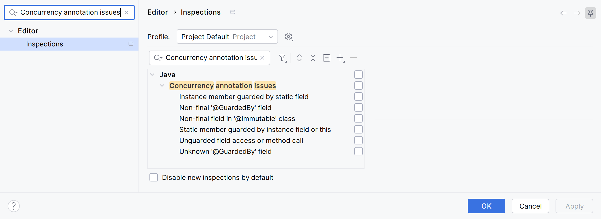

= 스레드 안전성의 문서화와 검증: Javadoc 표기, 애너테이션, 정적 분석, ArchUnit
정상혁
2012-05-30
:jbake-type: post
:jbake-status: published
:jbake-tags: java, concurrency, static-analysis, archunit, spring
:description: 스레드 안전성을 Javadoc에서 어떻게 표시하는 것이 좋을지와 멀티스레드에서 위험한 코드가 배포되지 않도록 애너테이션과 정적 분석 도구, 테스트로 방어하는 방법을 정리합니다.
:jbake-last_updated: 2026-09-05
:jbake-og: {"image": "img/thread-safety-annotations/og-intellij-inspections.png"}
:idprefix:
:toc:
:examples-repo: https://github.com/benelog/blog/tree/master/examples
:source-repo: {examples-repo}/thread-safety-archunit
:source-link-base: {source-repo}
:static-analysis-repo: {examples-repo}/thread-safety-static-analysis
:intellij-source-revision: 826413b22cfe5b5c573662f5d2442f454dbc0b23
:intellij-source-short: 826413b22cfe
:intellij-source-base: https://github.com/JetBrains/intellij-community/blob/{intellij-source-revision}
:sonar-java-source-revision: 9bf31b6e003782152b920fac0b1cfa5ba55e05a1
:sonar-java-source-short: 9bf31b6e0037
:sonar-java-source-base: https://github.com/SonarSource/sonar-java/blob/{sonar-java-source-revision}
:eclipse-jdt-source-revision: 8c40c7d2ae12c0a32ab3cca1ab31b53956c65d51
:eclipse-jdt-source-short: 8c40c7d2ae12
:eclipse-jdt-source-base: https://github.com/eclipse-jdt/eclipse.jdt.core/tree/{eclipse-jdt-source-revision}

어떤 클래스의 인스턴스를 여러 스레드가 공유해도 되는지는 개발할 때 주의 깊게 살펴야 할 정보입니다. 그런데 Javadoc에는 스레드 안전성을 명확히 표현하는 규약이 없습니다. 그래서 클래스 사용자가 제공자의 의도를 잘 인지하지 못할 위험성이 큽니다.
이 글은 스레드 안전성을 Javadoc에 남길 때 바람직한 분류 방식과 애너테이션과 정적 분석 도구, ArchUnit 테스트로 멀티스레드에서 위험한 코드가 배포되지 않도록 방어하는 방법을 정리합니다.

== Javadoc으로 표시하는 스레드 안전성

Javadoc이 메서드의 ``synchronized``를 표시하지 않는 이유와 그럼에도 클래스 수준의 규약이 왜 필요한지, 문서화를 한다면 어떤 분류가 적절할지, 그리고 실제 라이브러리 문서의 사례를 차례로 살펴봅니다.

=== Javadoc이 synchronized를 감추는 이유

클래스의 인스턴스 메서드에 `synchronized` 키워드가 붙으면 그 인스턴스 자체가 lock이 됩니다. 즉 여러 스레드가 한 인스턴스의 `synchronized` 메서드를 동시에 호출해도 한 스레드만 진입할 수 있고, 다른 스레드는 먼저 들어간 스레드가 메서드를 마칠 때까지 기다립니다. `static synchronized` 메서드는 해당 클래스의 `Class` 객체를 lock으로 사용합니다. 따라서 ``synchronized``는 스레드 안전성을 판단할 단서가 됩니다.
그래서 Javadoc에 공개되면 도움이 될 만한 정보이지만 Javadoc은 메서드 선언의 `synchronized` 키워드를 출력하지 않습니다. 동기화 여부는 구현 세부 사항이라서 API 문서에 노출할 계약이 아니라고 보기 때문입니다. Effective Java 3판의 아이템 82도 같은 근거를 들어 이 정책을 옹호합니다.

메서드 선언부의 ``synchronized``는 메서드 본문 전체를 `synchronized(this)` 블록으로 감싼 것과 같습니다. 즉 아래 코드는

[source,java]
.메서드 선언부의 synchronized
----
synchronized void run() {
    // do something
}
----

다음 코드와 같은 일을 합니다.

[source,java]
.메서드 내부 전체를 synchronized 블록으로 선언
----
void run() {
    synchronized (this) {
        // do something
    }
}
----

구현을 개선하면서 동기화 구간을 메서드의 일부로 좁힐 수도 있고, `this` 대신 별도의 lock 객체를 쓸 수도 있습니다. 이런 세부 구현은 외부 인터페이스보다 자주 바뀝니다. lock으로 보호되는 모든 구간을 메서드 선언부에 표시하기도 어렵습니다. 내부적으로 ``java.util.concurrent.locks.Lock``이나 CAS(Compare And Swap) 연산으로 동기화한 클래스도 있으니, `synchronized` 키워드의 유무는 스레드 안전성을 판단하는 유일한 기준이 되지 못합니다.

=== 클래스 수준 스레드 안전성 표기의 필요성

멀티 스레드에서 특정 메서드 하나의 호출이 부작용이 없더라도 여러 메서드 호출을 조합하면 안전하지 않을 수 있습니다.
예를 들어 ``HashMap``은 생성이 끝난 뒤 다른 스레드에 공개되고 더 이상 변경되지 않는다면 여러 스레드가 ``get()``을 호출해도 문제가 없습니다. 그러나 한 스레드가 ``put()``으로 구조를 바꾸는 동안 다른 스레드가 ``get()``을 호출하면 결과를 보장할 수 없습니다. 모든 메서드가 `synchronized` 인 ``Hashtable``이나 ``Collections.synchronizedMap()``으로 감싼 ``Map``도 '키가 없으면 넣는다' 같은 복합 동작은 외부에서 lock을 잡지 않으면 경쟁 조건이 생깁니다.

그러므로 문서화할 대상은 메서드의 동기화 여부가 아니라 클래스가 어떤 조건에서 안전한지입니다. Javadoc에 이를 표시할 규약이 없으니 개발자가 클래스 설명에 직접 적어야 합니다. 다음 절에서 볼 Effective Java의 분류가 그 기준이 됩니다.

=== Effective Java의 스레드 안전성 다섯 단계

Effective Java 3판의 아이템 82 '스레드 안전성 수준을 문서화하라'(2판에서는 아이템 70)는 스레드 안전성을 다섯 단계로 나눠 문서화하라고 권합니다.

* 불변(immutable)
** 상태가 바뀌지 않으므로 외부 동기화가 필요 없습니다.
** 예: `String`, `Long`, `BigDecimal`, `java.time.LocalDate`
* 무조건적 스레드 안전(unconditionally thread-safe)
** 상태가 있으나 내부에서 충분히 동기화합니다.
** 예: `AtomicLong`, `ConcurrentHashMap`
* 조건부 스레드 안전(conditionally thread-safe)
** 일부 메서드는 외부 동기화가 있어야 안전합니다.
** 예: ``Collections.synchronizedList()``로 감싼 `List`. iterator로 순회하는 동안에는 `List` 객체를 lock으로 잡아야 합니다. 그렇지 않으면 순회 결과가 정의되지 않으며, fail-fast iterator가 ``ConcurrentModificationException``을 던질 수도 있지만 이는 보장되지 않습니다.
* 스레드 안전하지 않음(not thread-safe)
** 외부에서 동기화해야 합니다.
** 예: `HashMap`, `ArrayList`
* 스레드 적대적(thread-hostile)
** 외부에서 동기화해도 멀티스레드에서 쓸 수 없습니다. 주로 동기화 없이 static 데이터를 수정하는 클래스가 여기에 해당합니다. 다행히 Java 라이브러리에는 거의 없습니다.
** 예: ``System.runFinalizersOnExit()``. 책이 든 이 예는 JDK 11에서 제거되었습니다.

=== 클래스 설명문의 표기 사례

Java 표준 라이브러리와 Spring Batch가 스레드 안전성을 어디에 어떻게 기술하는지 세 가지 예를 보겠습니다.

==== java.util.LinkedList

https://docs.oracle.com/en/java/javase/25/docs/api/java.base/java/util/LinkedList.html[LinkedList의 JDK 25 Javadoc]은 클래스 설명의 세 번째 문단에서 굵은 글씨로 'not synchronized'라고 밝힙니다.

image::img/thread-safety-annotations/LinkedList-doc.png[LinkedList의 JDK 25 Javadoc,width=800]

==== java.text.SimpleDateFormat

https://docs.oracle.com/en/java/javase/25/docs/api/java.base/java/text/SimpleDateFormat.html[SimpleDateFormat의 JDK 25 Javadoc]은 클래스 설명의 마지막 즈음에 'Synchronization'이라는 제목의 절을 두고 'Date formats are not synchronized'라고 설명합니다. JDK 25 문서는 'API Note'로 ``DateTimeFormatter``를 'immutable and thread-safe alternative'로 권합니다.

image::img/thread-safety-annotations/SimpleDateFormat-doc.png[SimpleDateFormat의 JDK 25 Javadoc,width=800]

권장 대상인 ``DateTimeFormatter``나 ``LocalDate``의 문서에는 'Implementation Requirements' 항목에 'This class is immutable and thread-safe.'라고 적혀 있습니다. JDK 8에서 추가된 `java.time` 패키지의 클래스들은 Javadoc의 `@implSpec` 태그로 같은 문장을 같은 자리에 적습니다. 표준 라이브러리 안에서도 새로 만든 API일수록 스레드 안전성을 일관된 형식으로 표시하는 추세입니다.

==== org.springframework.batch.item.file.FlatFileItemWriter

Spring Batch 5.2.6의 https://docs.spring.io/spring-batch/docs/current/api/org/springframework/batch/item/file/FlatFileItemWriter.html[FlatFileItemWriter] Javadoc은 클래스 설명의 마지막 줄에 'not'만 굵게 표시해서 'The implementation is *not* thread-safe.'라고 적어 두었습니다.

image::img/thread-safety-annotations/FlatFileItemWriter-doc.png[FlatFileItemWriter의 Spring Batch 5.2.6 Javadoc,width=800]

이렇게 클래스마다 스레드 안전성을 표시하는 위치와 방법이 제각각입니다. 나름대로 강조하지만 API 문서를 주의 깊게 읽는 사람이 아니라면 지나치기 쉽습니다. '스레드 안전성은 클래스 설명의 제일 윗줄에 넣고, 반드시 눈에 띄게 표시한다' 같은 규칙이 있었으면 얼마나 좋을까 하는 생각까지 듭니다.

== 애너테이션으로 표시하는 스레드 안전성

설명문 대신 애너테이션으로 스레드 안전성을 표시하면 Javadoc에서의 위치와 형식이 일정해집니다.
개발 프로젝트에서 그런 용도의 애너테이션을 직접 정의한 사례를 먼저 보고, 여러 프로젝트가 같이 쓸 수 있는 애너테이션을 이어서 봅니다.

=== Apache HttpClient의 @Contract

https://hc.apache.org/httpcomponents-client-5.5.x/[Apache HttpClient] 5는 스레드 안전성을 표시하는 애너테이션을 `org.apache.hc.core5.annotation.Contract` 하나로 정의했습니다. `threading` 속성에 https://hc.apache.org/httpcomponents-core-5.3.x/current/httpcore5/apidocs/org/apache/hc/core5/annotation/ThreadingBehavior.html[ThreadingBehavior] enum 값을 지정합니다.

[cols="1,3", options="header"]
|===
|ThreadingBehavior |의미

|`IMMUTABLE`
|완전한 불변 객체이며 스레드 안전합니다.

|`IMMUTABLE_CONDITIONAL`
|생성자로 주입받은 의존 객체가 불변일 때 불변이고, 의존 객체가 스레드 안전할 때 스레드 안전합니다.

|`STATELESS`
|상태가 없으며 스레드 안전합니다.

|`SAFE`
|스레드 안전합니다.

|`SAFE_CONDITIONAL`
|생성자로 주입받은 의존 객체가 스레드 안전할 때만 스레드 안전합니다.

|`UNSAFE`
|스레드 안전하지 않습니다. `threading` 속성을 생략했을 때의 기본값입니다.
|===

HttpClient 5.5의 소스에서 주요 클래스들은 아래처럼 선언되어 있습니다.

[source,java]
.HttpClient 5.5
----
@Contract(threading = ThreadingBehavior.SAFE)
public abstract class CloseableHttpClient implements HttpClient, ModalCloseable {

@Contract(threading = ThreadingBehavior.SAFE_CONDITIONAL)
public class PoolingHttpClientConnectionManager
        implements HttpClientConnectionManager, ConnPoolControl<HttpRoute> {

@Contract(threading = ThreadingBehavior.SAFE)
public class BasicHttpClientConnectionManager implements HttpClientConnectionManager {
----

``SAFE_CONDITIONAL``은 Effective Java의 '조건부 스레드 안전'과 이름은 비슷하지만 뜻이 다릅니다. Effective Java의 분류는 '어떤 메서드 호출 순서에 외부 동기화가 필요한가'를 말하고, HttpClient의 값은 '생성자로 받은 의존 객체가 스레드 안전한가'를 말합니다.

``@Contract``는 `@Documented` 메타 애너테이션이 붙어 있어서 Javadoc의 클래스 선언부에 함께 나타납니다. 아래는 https://hc.apache.org/httpcomponents-client-5.5.x/current/httpclient5/apidocs/org/apache/hc/client5/http/impl/io/BasicHttpClientConnectionManager.html[BasicHttpClientConnectionManager의 Javadoc]입니다.

image::img/thread-safety-annotations/BasicHttpClientConnectionManager-doc.png[BasicHttpClientConnectionManager의 HttpClient 5 Javadoc,width=800]

일관된 위치에 표시되기 때문에 한눈에 스레드 안전성 여부를 인식할 수 있습니다. 클래스 설명 문단에도 'this class is fully thread-safe'라고 적혀 있지만, 선언부의 애너테이션이 먼저 눈에 들어옵니다.

HttpClient가 처음부터 독자적인 애너테이션을 만든 것은 아닙니다. https://github.com/apache/httpcomponents-client/tree/rel/v4.5.2/httpclient/src/main/java/org/apache/http[HttpClient 4.5.2]까지는 ``HttpGet``과 위의 5.5 예제와 같은 클래스들의 선언에 아래처럼 `@NotThreadSafe`, ``@ThreadSafe``가 붙어 있었습니다.

[source,java]
.HttpClient 4.5.2
----
@NotThreadSafe
public class HttpGet extends HttpRequestBase {

@ThreadSafe
public abstract class CloseableHttpClient implements HttpClient, Closeable {

@ThreadSafe
public class PoolingHttpClientConnectionManager
    implements HttpClientConnectionManager, ConnPoolControl<HttpRoute>, Closeable {

@ThreadSafe
public class BasicHttpClientConnectionManager implements HttpClientConnectionManager, Closeable {
----

이 애너테이션들은 `org.apache.http.annotation` 패키지에 들어 있었지만, Javadoc은 'Java Concurrency in Practice' 책에서 유래했다고 설명했습니다. 그런데 뒤에서 볼 JCIP 원본 라이브러리의 https://issues.apache.org/jira/browse/HTTPCLIENT-1743[라이선스 문제] 때문에 HttpCore 4.4.5는 이 4가지 애너테이션을 제거했고, HttpClient는 4.5.3부터 ``@Contract``로 바뀌었습니다.

=== JCIP 애너테이션

HttpClient처럼 프로젝트마다 애너테이션을 정의해도 되지만, 널리 쓰이는 오픈소스의 애너테이션을 쓰면 사용자가 새로 익힐 필요가 없고 SpotBugs 같은 정적 분석 도구나 IDE의 지원을 받기도 쉽습니다. HttpClient 4.x가 가져다 쓴 JCIP 애너테이션이 그런 공통 애너테이션의 출발점입니다.

https://jcip.net/annotations/doc/net/jcip/annotations/package-summary.html[JCIP 애너테이션]은 'Java Concurrency in Practice' 책의 부록 A에서 제안한, 스레드 안전성을 표시하는 애너테이션입니다. 아래 4가지 애너테이션을 제공합니다.

* `@ThreadSafe` : 스레드 안전한 클래스
* `@NotThreadSafe` : 스레드 안전하지 않은 클래스
* `@Immutable` : 불변 클래스. 불변이면 스레드 안전합니다.
* `@GuardedBy("lock")` : 필드나 메서드에 붙여서, 어떤 lock을 잡은 상태에서만 접근해야 하는지 표시합니다. ``synchronized``에 쓰는 내장 lock과 ``java.util.concurrent.locks.Lock``을 모두 지정할 수 있습니다.

앞의 세 애너테이션은 클래스의 계약을 사용자에게 알리고, ``@GuardedBy``는 해당 클래스를 유지보수하는 사람에게 어떤 lock을 지켜야 하는지 보여 줍니다.

Effective Java의 다섯 단계를 기준으로 JCIP 애너테이션을 맞춰 보면 다음과 같습니다.
(JCIP가 2006년, Effective Java 2판이 2008년에 나왔으므로 대응 관계를 설명한 쪽은 Effective Java입니다.)

[cols="2,2,4", options="header"]
|===
|Effective Java의 다섯 단계 |JCIP 애너테이션 |차이

|불변
|`@Immutable`
|JCIP는 불변이면 스레드 안전하다고 보므로 ``@ThreadSafe``를 겹쳐 붙이지 않습니다.

|무조건적 스레드 안전
|`@ThreadSafe`
|같은 뜻입니다.

|조건부 스레드 안전
|`@ThreadSafe`
|JCIP에는 별도의 이름이 없습니다. 어떤 lock을 잡아야 하는지는 설명문에 적습니다. 두 분류가 실제로 다른 항목입니다.

|스레드 안전하지 않음
|`@NotThreadSafe`
|JCIP는 이 애너테이션을 선택 사항으로 둡니다.

|스레드 적대적
|없음
|JCIP에는 대응하는 개념이 없습니다.

|해당 없음
|`@GuardedBy("lock")`
|필드와 메서드에 붙이며 유지보수하는 사람을 위한 정보입니다. Effective Java의 다섯 단계는 클래스 단위로 사용자에게 하는 약속이므로 분류의 기준 자체가 다릅니다.
|===

정리하면 Effective Java는 사용자 관점에서 외부 동기화가 얼마나 필요한지를 다섯 단계로 나눈 분류입니다. JCIP는 안전한지 아닌지의 이분법에 불변을 특수한 경우로 추가하고, 유지보수하는 사람을 위한 정보는 ``@GuardedBy``로 따로 분리했습니다. JCIP 4.5절 'Documenting synchronization policies'는 스레드 안전성 보장은 사용자를 위해, 동기화 정책은 유지보수하는 사람을 위해 문서화하라고 권합니다.

=== JCIP와 같은 이름으로 퍼진 애너테이션들

JCIP 책과 함께 배포된 원본 라이브러리는 Maven Central의 ``net.jcip:jcip-annotations:1.0``입니다. 그런데 이 라이브러리의 라이선스는 Creative Commons Attribution입니다. Creative Commons 재단 스스로 소프트웨어에는 권하지 않는 라이선스입니다. 그래서 같은 API를 Apache License 2.0으로 다시 구현한 https://github.com/stephenc/jcip-annotations[com.github.stephenc.jcip:jcip-annotations:1.0-1]이 나왔습니다. 두 라이브러리의 패키지 이름과 애너테이션 이름은 ``net.jcip.annotations``로 같습니다.

그 외에도 JCIP 애너테이션은 여러 프로젝트로 복제되었습니다. 다음 라이브러리들은 애너테이션 이름은 같지만 패키지가 다릅니다.

* `javax.annotation.concurrent` : FindBugs가 배포한 JSR-305 애너테이션 구현인 ``com.google.code.findbugs:jsr305``에 같은 4가지 애너테이션이 들어 있습니다. https://jcp.org/en/jsr/proposalDetails?id=305[JSR-305 자체는 정식 릴리스 없이 중단되어 dormant 상태]입니다. Java 9와 10에서는 module path에 올린 이 jar의 `javax.annotation` 패키지가 JDK의 `java.xml.ws.annotation` 모듈과 겹칠 수 있었습니다. 다만 이 JDK 모듈은 https://docs.oracle.com/en/java/javase/26/migrate/removed-tools-components.html[JDK 11에서 제거]되었으므로, Java 9 이후 모든 버전에 해당하는 문제는 아닙니다.
* `com.google.errorprone.annotations` : Google의 Error Prone이 쓰는 `@Immutable`, ``@ThreadSafe``와 `concurrent` 하위 패키지의 ``@GuardedBy``가 있습니다.
* `androidx.annotation.GuardedBy` : Android용입니다.
* `org.apache.http.annotation` : 앞에서 본 대로 Apache HttpComponents가 4.5.2까지 복제해 쓰던 4가지입니다. HttpCore 4.4.5와 HttpClient 4.5.3부터 ``@Contract``로 바뀌었습니다.

=== 목적에 맞는 애너테이션 고르기

원본 JCIP 라이브러리는 라이선스 때문에, JSR-305는 표준화가 중단되어서 새 프로젝트에 권하기 어렵습니다.
다음 절에서 볼 정적 분석 도구의 검사 범위를 고려하여 둘 중 하나를 권장합니다.

* 컴파일 시점 검증이 우선이라면 ``error_prone_annotations``가 적합합니다. Error Prone과 함께 쓰면 ``@Immutable``과 ``@GuardedBy``를 컴파일 시점에 검사할 수 있습니다. Guava를 사용하는 모듈의 컴파일 클래스패스에도 들어오지만, 코드에서 직접 사용한다면 Guava의 전이 의존성에 기대지 말고 명시적으로 의존성을 선언하는 편이 안전합니다. ``@ThreadSafe``는 검사하지 않고 ``@NotThreadSafe``는 없으므로, 표시가 없는 클래스를 스레드 안전하지 않다고 간주하는 관례도 필요합니다.
* 공개 API에 ``@NotThreadSafe``를 포함한 JCIP 애너테이션 네 가지를 모두 표현하는 것이 우선이라면 ``com.github.stephenc.jcip:jcip-annotations``가 적합합니다. IntelliJ와 SpotBugs를 사용하는 프로젝트라면 기존 도구와 빌드 설정을 크게 바꾸지 않고 적용할 수 있습니다.

== 정적 분석 도구의 검사 범위

애너테이션은 문서화만으로도 가치가 있지만, 도구가 위반을 잡아 주면 더 유용합니다. SpotBugs, Error Prone, IntelliJ IDEA가 각각 어디까지 검사하는지 정리합니다. 도구의 지원 범위는 버전에 따라 바뀔 수 있으므로 이 글에서 실행하거나 문서로 확인한 기준을 먼저 밝힙니다.

[cols="2,4", options="header"]
.검증 기준
|===
|대상 |버전과 확인 방법

|Java
|JDK 25

|SpotBugs
|SpotBugs 4.10.4, Gradle 플러그인 6.5.11을 예제에서 실행

|Error Prone
|Error Prone 2.50.0, Gradle 플러그인 5.1.1을 예제에서 실행

|IntelliJ IDEA
|Inspectopedia 2026.2 문서와 link:{intellij-source-base}/java/java-backend/resources/META-INF/Inspections.xml[IntelliJ Community 소스 {intellij-source-short}]의 인스펙션 등록 정보 기준

|SonarQube
|Java 분석기 link:{sonar-java-source-base}/java-checks/src/main/java/org/sonar/java/checks/VolatileNonPrimitiveFieldCheck.java[SonarJava 소스 {sonar-java-source-short}]의 내장 규칙과 SpotBugs 외부 규칙 목록 기준

|Eclipse JDT
|https://help.eclipse.org/latest/topic/org.eclipse.jdt.doc.isv/guide/jdt_api_options.htm[JDT Core Options]와 link:{eclipse-jdt-source-base}[Eclipse JDT 소스 {eclipse-jdt-source-short}] 기준

|===

2026년 9월 시점의 JDT Core Options 전체 목록과 Eclipse JDT 소스 {eclipse-jdt-source-short}에서는 스레드 안전성 애너테이션을 다루는 컴파일러 검사를 찾지 못했습니다. Eclipse 사용자는 https://spotbugs.readthedocs.io/en/stable/eclipse.html[SpotBugs Eclipse 플러그인]으로 보완할 수 있습니다.

같은 시점에 SonarQube의 Java 분석기인 SonarJava 소스 {sonar-java-source-short}에서 내장 규칙 구현을 `ThreadSafe`, `GuardedBy`, ``javax.annotation.concurrent``로 검색했을 때 스레드 안전성 애너테이션을 참조하는 구현은 S3077뿐이었고, 애너테이션의 약속을 직접 검증하는 규칙은 찾지 못했습니다. 참조 타입 필드의 ``volatile``을 막는 link:{sonar-java-source-base}/java-checks/src/main/java/org/sonar/java/checks/VolatileNonPrimitiveFieldCheck.java[S3077 구현]은 필드 타입에 JSR-305 패키지의 ``@Immutable``이나 ``@ThreadSafe``가 붙어 있으면 예외로 넘기지만 ``@GuardedBy``는 다루지 않습니다. SonarQube는 https://docs.sonarsource.com/sonarqube-server/analyzing-source-code/importing-external-issues/external-analyzer-reports[SpotBugs 보고서를 외부 이슈로 가져올 수 있고], link:{sonar-java-source-base}/external-reports/src/main/resources/org/sonar/l10n/java/rules/spotbugs/spotbugs-rules.json[외부 규칙 목록]에는 뒤에서 볼 세 버그 패턴이 모두 들어 있습니다. 따라서 SonarQube에서 이 결과를 보려면 SpotBugs를 빌드에서 돌려 보고서를 넘겨야 합니다. SpotBugs와 Error Prone 예제는 link:{static-analysis-repo}[examples/thread-safety-static-analysis]에 있습니다.

=== SpotBugs

link:2079841.html[FindBugs]의 후속 프로젝트인 https://spotbugs.github.io/[SpotBugs]가 JCIP 애너테이션을 위해 둔 버그 패턴은 `@Immutable` 용 하나입니다. ``@GuardedBy``와 ``@ThreadSafe``는 전용 검사가 없고, 동기화가 일관되지 않은 필드를 찾는 탐지기가 판단의 근거로 읽습니다. 인식하는 패키지는 아래 3가지입니다.

* `net.jcip.annotations` (원본 JCIP)
* `javax.annotation.concurrent` (JSR-305)
* `jakarta.annotation.concurrent` (SpotBugs가 jakarta 이름공간 지원에 맞춰 미리 인식하는 패키지. Jakarta Annotations 3.0.0에는 이 패키지가 없음)

FindBugs 2.0 때부터 있던 https://spotbugs.readthedocs.io/en/latest/bugDescriptions.html#jcip-fields-of-immutable-classes-should-be-final-jcip-field-isnt-final-in-immutable-class[JCIP_FIELD_ISNT_FINAL_IN_IMMUTABLE_CLASS] 버그 패턴은 ``@Immutable``이 붙은 클래스에 ``final``이 아닌 필드가 있으면 경고합니다. 다만 SpotBugs 4.10.4의 구현은 ``transient``나 `volatile` 필드는 이 검사에서 제외합니다.

아래처럼 ``@Immutable``로 선언했지만 setter가 있는 클래스를 만들고

[source,java]
.link:{static-analysis-repo}/spotbugs/src/main/java/net/benelog/Memo.java[Memo.java]
----
package net.benelog;

import net.jcip.annotations.Immutable;

/**
 * {@code @Immutable}로 선언했지만 final이 아닌 필드가 있어서
 * SpotBugs가 JCIP_FIELD_ISNT_FINAL_IN_IMMUTABLE_CLASS로 보고한다.
 */
@Immutable
public class Memo {
	private String content;

	public void setContent(String content) {
		this.content = content;
	}

	public String getContent() {
		return content;
	}
}
----

Gradle에 https://github.com/spotbugs/spotbugs-gradle-plugin[SpotBugs 플러그인]을 설정한 뒤

[source,kotlin]
.link:{static-analysis-repo}/spotbugs/build.gradle.kts[spotbugs/build.gradle.kts]
----
plugins {
	java
	id("com.github.spotbugs") version "6.5.11"
}

repositories {
	mavenCentral()
}

dependencies {
	implementation("com.github.stephenc.jcip:jcip-annotations:1.0-1")
}

java {
	toolchain {
		languageVersion.set(JavaLanguageVersion.of(25))
	}
}

spotbugs {
	toolVersion.set("4.10.4")
	ignoreFailures.set(true)
}

tasks.spotbugsMain {
	val report = layout.buildDirectory.file("reports/spotbugs/main.txt")
	reports.create("text") {
		required.set(true)
		outputLocation.set(report)
	}
	doLast {
		println(report.get().asFile.readText())
	}
}
----

``./gradlew :spotbugs:spotbugsMain``을 실행하면 보고서에 다음 줄이 나옵니다.

[source]
----
M B JCIP: Memo.content should be final since net.benelog.Memo is marked as Immutable.  In Memo.java
----

예제는 경고가 있어도 보고서를 끝까지 출력하려고 ``ignoreFailures``를 ``true``로 두었습니다. 실제 CI에서 위반 때문에 빌드를 실패시키려면 이 설정을 ``false``로 바꾸거나 생략해야 합니다.

``@GuardedBy``는 https://spotbugs.readthedocs.io/en/latest/bugDescriptions.html#is-field-not-guarded-against-concurrent-access-is-field-not-guarded[IS_FIELD_NOT_GUARDED] 버그 패턴이 다룹니다. 그런데 이 패턴은 애너테이션을 보고 위반을 찾는 것이 아닙니다. 필드 접근 중 lock을 잡은 비율로 동기화 누락을 추정하는 https://spotbugs.readthedocs.io/en/latest/bugDescriptions.html#is-inconsistent-synchronization-is2-inconsistent-sync[IS2_INCONSISTENT_SYNC] 탐지기가 경고를 내기로 한 필드에 ``@GuardedBy("this")``가 붙어 있으면 이름만 바꿔서 보고합니다. 인식하는 값도 `"this"` 뿐입니다. 이 탐지기는 lock을 잡은 접근이 절반에 못 미치는 필드는 오탐으로 간주해 우선순위를 낮춥니다.

그래서 같은 프로젝트의 link:{static-analysis-repo}/spotbugs/src/main/java/net/benelog/Counter.java[Counter]는 `@GuardedBy("this")` 필드를 lock 없이 수정하는데도 기본 설정에서는 보고되지 않습니다. ``increment()``의 읽기와 쓰기는 lock 없이, `synchronized` 메서드 ``get()``의 읽기만 lock을 잡고 이루어져서 lock을 잡은 접근이 33%입니다. 예제 저장소에서 ``./gradlew :spotbugs:spotbugsMain -PreportLow``로 낮은 우선순위까지 보고하게 하면 그제야 나타납니다.

[source]
----
L M IS: Counter.count not guarded against concurrent access; locked 33% of time  Unsynchronized access at Counter.java:[line 16]
----

같은 위반에 `synchronized` 메서드 두 개를 더한 아래 클래스는 lock을 잡은 접근이 60%가 됩니다.

[source,java]
.link:{static-analysis-repo}/spotbugs/src/main/java/net/benelog/LockedCounter.java[LockedCounter.java]
----
package net.benelog;

import net.jcip.annotations.GuardedBy;
import net.jcip.annotations.ThreadSafe;

/**
 * Counter와 같은 위반이지만 synchronized 메서드가 더 많아서
 * lock을 잡은 접근 비율이 높다. SpotBugs가 IS_FIELD_NOT_GUARDED로 보고한다.
 */
@ThreadSafe
public class LockedCounter {
	@GuardedBy("this")
	private int count;

	public void increment() {
		count++;
	}

	public synchronized int get() {
		return count;
	}

	public synchronized void reset() {
		count = 0;
	}

	public synchronized boolean isZero() {
		return count == 0;
	}
}
----

이 클래스는 기본 설정에서도 높은 우선순위로 보고됩니다. 출력의 첫 글자는 우선순위, 둘째 글자는 분류입니다.

[source]
----
H M IS: LockedCounter.count not guarded against concurrent access; locked 60% of time  Unsynchronized access at LockedCounter.java:[line 16]
----

``@ThreadSafe``와 ``@NotThreadSafe``도 이 탐지기가 읽습니다. `@NotThreadSafe` 클래스의 필드는 검사에서 제외하고, `@ThreadSafe` 클래스의 필드는 경고 우선순위를 올리는 근거로 씁니다. 애너테이션의 약속이 지켜졌는지 검증하지는 않습니다. ``@ThreadSafe``로 선언한 클래스가 ``@NotThreadSafe``인 필드를 가져도 경고하지 않습니다.

정리하면 SpotBugs가 애너테이션만 보고 결정적으로 검사하는 것은 `@Immutable` 클래스의 `final` 규칙뿐입니다. `@GuardedBy` 위반은 lock을 잡은 접근과 잡지 않은 접근의 비율로 짐작한 결과가 같은 결론에 이를 때만 보고됩니다.

=== Error Prone

Google의 https://errorprone.info/[Error Prone]은 ``javac``에 플러그인으로 붙어서 컴파일 시점에 에러를 예방하는 규칙을 검사합니다.

==== @GuardedBy 검사

Error Prone의 https://errorprone.info/bugpattern/GuardedBy[GuardedBy 검사]는 ``@GuardedBy(lock)``이 붙은 필드나 메서드를 지정한 lock을 잡지 않고 접근하면 컴파일 오류를 냅니다. 접근 비율에 따라 보고 여부가 달라지는 SpotBugs와 달리, 위반하는 접근 하나하나를 그대로 잡습니다.

다만 이 검사가 인식하는 애너테이션은 `com.google.errorprone.annotations.concurrent.GuardedBy`, `javax.annotation.concurrent.GuardedBy`, Android용 `androidx.annotation.GuardedBy` 등이고, 원본 JCIP의 ``net.jcip.annotations.GuardedBy``는 목록에 없습니다. `@Immutable` 검사도 ``com.google.errorprone.annotations.Immutable``만 검사하고 ``javax.annotation.concurrent.Immutable``은 검사하지 않는다고 문서에 명시되어 있습니다. 다음 절에서 확인합니다.

Gradle에서는 https://github.com/tbroyer/gradle-errorprone-plugin[net.ltgt.errorprone 플러그인]으로 Error Prone을 ``javac``에 붙입니다. 세 가지 패키지의 애너테이션을 비교하기 위해 라이브러리도 셋 다 넣었습니다.

[source,kotlin]
.link:{static-analysis-repo}/errorprone/build.gradle.kts[errorprone/build.gradle.kts]
----
plugins {
	java
	id("net.ltgt.errorprone") version "5.1.1"
}

repositories {
	mavenCentral()
}

dependencies {
	implementation("com.github.stephenc.jcip:jcip-annotations:1.0-1")
	implementation("com.google.code.findbugs:jsr305:3.0.2")
	implementation("com.google.errorprone:error_prone_annotations:2.50.0")
	errorprone("com.google.errorprone:error_prone_core:2.50.0")
}

java {
	toolchain {
		languageVersion.set(JavaLanguageVersion.of(25))
	}
}
----

실제로 확인해 보면 JSR-305의 ``@GuardedBy``를 쓴 아래 클래스는

[source,java]
.link:{static-analysis-repo}/errorprone/src/main/java/net/benelog/JsrCounter.java[JsrCounter.java]
----
package net.benelog;

import javax.annotation.concurrent.GuardedBy;
import javax.annotation.concurrent.ThreadSafe;

/**
 * JSR-305 패키지. Error Prone이 @GuardedBy 위반을 컴파일 오류로 보고한다.
 */
@ThreadSafe
public class JsrCounter {
	@GuardedBy("this")
	private int count;

	public void increment() {
		count++;
	}

	public synchronized int get() {
		return count;
	}
}
----

Error Prone 2.50.0에서 다음과 같은 컴파일 오류가 납니다.

[source]
----
JsrCounter.java:15: error: [GuardedBy] This access should be guarded by 'this', which is not currently held
		count++;
		^
    (see https://errorprone.info/bugpattern/GuardedBy)
----

같은 코드에서 import만 ``net.jcip.annotations.GuardedBy``로 바꾼 link:{static-analysis-repo}/errorprone/src/main/java/net/benelog/JcipCounter.java[JcipCounter]는 아무 오류 없이 컴파일됩니다. 반대로 Error Prone 자체 패키지의 ``@GuardedBy``를 쓴 link:{static-analysis-repo}/errorprone/src/main/java/net/benelog/ErrorProneCounter.java[ErrorProneCounter]는 JsrCounter와 같은 오류로 잡힙니다. 세 클래스는 예제 저장소의 errorprone 서브프로젝트에 있고 ``./gradlew :errorprone:compileJava``로 확인할 수 있습니다.

==== @Immutable 검사

https://errorprone.info/bugpattern/Immutable[Immutable 검사]는 ``com.google.errorprone.annotations.Immutable``이 붙은 클래스가 깊은 불변인지 검사합니다. SpotBugs의 JCIP 검사는 필드가 `final` 인지만 보지만, Error Prone은 참조 필드의 타입이 불변인지도 봅니다. Error Prone 문서가 설명하는 보수적인 불변성의 정의에는 생성자에서 ``this``가 밖으로 새지 않아야 한다는 조건도 있지만, 2.50.0의 ``ImmutableChecker``는 일반적인 생성자 본문의 `this` 탈출까지 분석하지는 않습니다. 아래 클래스는 ``final``이 아닌 필드와 `final` 이지만 타입이 가변인 필드를 하나씩 가지고 있습니다.

[source,java]
.link:{static-analysis-repo}/errorprone/src/main/java/net/benelog/ErrorProneMemo.java[ErrorProneMemo.java]
----
package net.benelog;

import java.util.List;

import com.google.errorprone.annotations.Immutable;

/**
 * Error Prone 자체 패키지의 @Immutable. final이 아닌 필드와
 * final이지만 가변 타입인 필드를 모두 컴파일 오류로 보고한다.
 */
@Immutable
public class ErrorProneMemo {
	private String content;
	private final List<String> tags;

	public ErrorProneMemo(String content, List<String> tags) {
		this.content = content;
		this.tags = tags;
	}

	public String getContent() {
		return content;
	}

	public List<String> getTags() {
		return tags;
	}
}
----

두 필드가 모두 컴파일 오류로 보고됩니다.

[source]
----
ErrorProneMemo.java:13: error: [Immutable] type annotated with @Immutable could not be proven immutable: 'ErrorProneMemo' has non-final field 'content'
	private String content;
	               ^
    (see https://errorprone.info/bugpattern/Immutable)
  Did you mean 'private final String content;'?
ErrorProneMemo.java:14: error: [Immutable] type annotated with @Immutable could not be proven immutable: 'ErrorProneMemo' has field 'tags' of type 'java.util.List<java.lang.String>', 'List' is mutable
	private final List<String> tags;
	                           ^
    (see https://errorprone.info/bugpattern/Immutable)
----

``tags``가 통과하려면 Error Prone이 불변으로 아는 타입이거나 ``@Immutable``이 붙은 타입이어야 합니다. ``@Immutable``이 붙은 인터페이스를 구현한 클래스도 같은 검사를 받고, 제네릭 클래스는 `containerOf` 속성으로 어떤 타입 파라미터가 불변이어야 하는지 지정합니다.

같은 코드에서 import만 ``javax.annotation.concurrent.Immutable``로 바꾼 link:{static-analysis-repo}/errorprone/src/main/java/net/benelog/JsrMemo.java[JsrMemo]는 오류 없이 컴파일됩니다. ``@GuardedBy``는 JSR-305 패키지도 검사하지만 ``@Immutable``은 Error Prone 자체 패키지만 검사합니다.

==== @ThreadSafe 검사

``com.google.errorprone.annotations.ThreadSafe``에도 https://errorprone.info/bugpattern/ThreadSafe[ThreadSafe 검사] 문서가 있습니다. 버그 패턴 목록에서 'Experimental' 그룹에 있어서 켜기만 하면 될 것처럼 보이지만, 실제로는 켤 수 없습니다. Gradle 플러그인에서 ``options.errorprone.error("ThreadSafe")``로 켜면 'ThreadSafe is not a valid checker name' 오류로 빌드가 실패합니다. Error Prone 2.50.0 소스의 내장 검사 목록인 ``BuiltInCheckerSuppliers``에 ``GuardedByChecker``와 ``ImmutableChecker``는 있지만 ``ThreadSafeChecker``는 없습니다. 확인해 본 2.3.0부터 2.45.0까지의 이전 버전들에도 없었습니다. 검사기 클래스 자체는 `error_prone_core` jar에 들어 있습니다.

그래서 아래 클래스는 기본 설정에서 아무 오류 없이 컴파일됩니다.

[source,java]
.link:{static-analysis-repo}/errorprone/src/main/java/net/benelog/ErrorProneRegistry.java[ErrorProneRegistry.java]
----
package net.benelog;

import java.util.HashMap;
import java.util.Map;
import java.util.concurrent.ConcurrentHashMap;

import com.google.errorprone.annotations.ThreadSafe;

/**
 * Error Prone 자체 패키지의 @ThreadSafe. 기본 설정의 Error Prone 2.50.0은 검사하지 않는다.
 * -PthreadSafeCheck로 ThreadSafeChecker를 등록하면 lock 없이 바뀌는 필드와
 * 스레드 안전하지 않은 타입의 final 필드를 컴파일 오류로 보고한다.
 */
@ThreadSafe
public class ErrorProneRegistry {
	private int count;
	private final Map<String, String> entries = new HashMap<>();
	private final ConcurrentHashMap<String, String> safeEntries = new ConcurrentHashMap<>();

	public void register(String key, String value) {
		count++;
		entries.put(key, value);
		safeEntries.put(key, value);
	}

	public int getCount() {
		return count;
	}
}
----

이 검사기가 무엇을 보는지 확인하려고 예제 저장소에 link:{static-analysis-repo}/threadsafe-check[threadsafe-check] 서브프로젝트를 만들었습니다. ``ThreadSafeChecker``를 상속한 클래스를 ``META-INF/services``에 등록해서 Error Prone의 플러그인 검사로 불러오는 실험용 코드입니다. Error Prone은 컴파일러의 처리기 경로에서 ``com.google.errorprone.bugpatterns.BugChecker``를 서비스 인터페이스로 삼아 ServiceLoader로 검사기를 찾기 때문에, 그 이름의 파일에 검사기 클래스 이름을 적어 두면 됩니다.

[source]
.link:{static-analysis-repo}/threadsafe-check/src/main/resources/META-INF/services/com.google.errorprone.bugpatterns.BugChecker[META-INF/services/com.google.errorprone.bugpatterns.BugChecker]
----
com.google.errorprone.bugpatterns.threadsafety.ThreadSafeCheck
----

등록한 클래스는 ``ThreadSafeChecker``를 상속하고 ``@BugPattern``으로 검사 이름을 붙인 래퍼입니다. 생성자가 패키지 전용이라 같은 패키지 이름을 쓰고, ServiceLoader가 요구하는 기본 생성자를 형식적으로 두는 등 2.50.0의 내부 구조에 기댄 코드라서 실제 프로젝트에 권하지는 않습니다.

[source,java]
.link:{static-analysis-repo}/threadsafe-check/src/main/java/com/google/errorprone/bugpatterns/threadsafety/ThreadSafeCheck.java[ThreadSafeCheck.java]
----
package com.google.errorprone.bugpatterns.threadsafety;

@BugPattern(
		name = "ThreadSafe",
		summary = "Type declaration annotated with @ThreadSafe is not thread safe",
		severity = ERROR)
public class ThreadSafeCheck extends ThreadSafeChecker {

	/** ServiceLoader가 요구하는 public 기본 생성자. Error Prone은 @Inject 생성자를 쓴다. */
	public ThreadSafeCheck() {
		super(null, null);
	}

	@Inject
	ThreadSafeCheck(WellKnownThreadSafety wellKnownThreadSafety,
			ThreadSafeAnalysis.Factory threadSafeAnalysisFactory) {
		super(wellKnownThreadSafety, threadSafeAnalysisFactory);
	}
}
----

이 서브프로젝트를 검사 대상 프로젝트의 `errorprone` 구성에 의존성으로 넣으면 플러그인 검사로 실립니다. 예제에서는 Gradle 프로퍼티가 있을 때만 넣도록 했고, 앞에서 인용한 ``build.gradle.kts``에서는 이 부분을 생략했습니다.

[source,kotlin]
.link:{static-analysis-repo}/errorprone/build.gradle.kts[errorprone/build.gradle.kts]
----
dependencies {
	errorprone("com.google.errorprone:error_prone_core:2.50.0")
	if (project.hasProperty("threadSafeCheck")) {
		// 기본 검사 목록에 없는 ThreadSafeChecker를 플러그인으로 등록한다.
		errorprone(project(":threadsafe-check"))
	}
}
----

``./gradlew :errorprone:compileJava -PthreadSafeCheck``로 실행하면 다음과 같이 보고합니다.

[source]
----
ErrorProneRegistry.java:16: error: [ThreadSafe] @ThreadSafe class fields should be final or annotated with @GuardedBy. See https://errorprone.info/bugpattern/ThreadSafe for details.
	private int count;
	            ^
    (see https://errorprone.info/bugpattern/ThreadSafe)
  Did you mean 'private final int count;'?
ErrorProneRegistry.java:17: error: [ThreadSafe] @ThreadSafe class has non-thread-safe field, 'Map' is not thread-safe
	private final Map<String, String> entries = new HashMap<>();
	                                  ^
    (see https://errorprone.info/bugpattern/ThreadSafe)
----

검사 규칙은 필드가 ``final``이면서 선언 타입이 Error Prone이 스레드 안전하다고 아는 타입이거나, ``@GuardedBy``가 붙어 있어야 한다는 것입니다. ``count``는 ``final``도 ``@GuardedBy``도 없어서, ``entries``는 선언 타입 ``Map``이 스레드 안전 타입이 아니라서 걸립니다. 실제 객체가 ``ConcurrentHashMap``이어도 선언 타입이 ``Map``이면 걸립니다. 선언 타입까지 ``ConcurrentHashMap``인 ``safeEntries``는 통과합니다. 앞에서 본 ErrorProneCounter는 ``count``에 ``@GuardedBy("this")``가 있어서 이 검사는 통과하고 `@GuardedBy` 검사에만 걸립니다.

정리하면 2026년 9월 시점의 Error Prone은 ``@Immutable``과 ``@GuardedBy``는 검사하지만, ``@ThreadSafe``는 위처럼 검사기를 직접 플러그인으로 등록하지 않는 한 문서 역할만 합니다.

=== IntelliJ IDEA

IntelliJ IDEA 2026.2는 https://www.jetbrains.com/help/inspectopedia/Java-Concurrency-annotation-issues.html[Concurrency annotation issues] 그룹에 인스펙션 여섯 개를 두고 있습니다. 다섯 개는 `@GuardedBy` 용이고 하나는 `@Immutable` 용입니다. ``@ThreadSafe``의 약속을 검증하는 인스펙션은 없습니다.

https://www.jetbrains.com/help/inspectopedia/FieldAccessNotGuarded.html[Unguarded field access or method call] 인스펙션은 `net.jcip.annotations`, `javax.annotation.concurrent`, `org.apache.http.annotation`, `com.android.annotations.concurrency`, `androidx.annotation`, `com.google.errorprone.annotations.concurrent` 패키지의 ``@GuardedBy``를 모두 인식합니다. SpotBugs도 원본 JCIP 패키지를 읽지만 ``@GuardedBy("this")``만 다루고 접근 비율로 짐작해 경고하는 데 그칩니다. IntelliJ는 이에 비해 원본 JCIP의 guard 표현을 직접 검사합니다.

https://www.jetbrains.com/help/inspectopedia/NonFinalFieldInImmutable.html[Non-final field in @Immutable class] 인스펙션은 `@Immutable` 클래스에 ``final``이 아닌 필드가 있으면 경고합니다. 필드 타입이 가변인지는 보지 않으므로 검사 범위는 Error Prone이 아니라 SpotBugs와 같습니다. 원본 JCIP와 JSR-305 패키지에 더해 Error Prone의 ``com.google.errorprone.annotations.Immutable``도 인식합니다.

``@ThreadSafe``는 'Threading issues' 그룹의 https://www.jetbrains.com/help/inspectopedia/AccessToStaticFieldLockedOnInstance.html[Access to static field locked on instance] 인스펙션이 힌트로만 읽습니다. 이 인스펙션은 인스턴스 lock을 잡고 상수가 아닌 `static` 필드에 접근하면 경고합니다. 접근한 필드가 ``final``이면 link:{intellij-source-base}/java/java-impl-inspections/src/com/siyeh/ig/threading/AccessToStaticFieldLockedOnInstanceInspection.java[그 선언 타입의 애너테이션을 확인]하고, 등록된 스레드 안전 애너테이션이 있으면 경고를 생략합니다. 따라서 애너테이션이 붙은 클래스 자체의 규약을 검증하지는 않습니다. link:{intellij-source-base}/java/java-psi-api/src/com/intellij/codeInsight/ConcurrencyAnnotationsManager.java[기본 목록]에는 원본 JCIP, JSR-305, `org.apache.http.annotation`, `com.android.annotations.concurrency` 패키지의 ``@ThreadSafe``와 `androidx.annotation`, `android.support.annotation` 패키지의 ``@AnyThread``가 들어 있습니다. Error Prone의 ``@ThreadSafe``는 기본 목록에 없습니다.

주의할 점은 IntelliJ IDEA 2026.2의 link:{intellij-source-base}/java/java-backend/resources/META-INF/Inspections.xml[인스펙션 등록 정보]에서 'Concurrency annotation issues' 그룹이 모두 `enabledByDefault="false"`, ``level="WARNING"``으로 선언되어 있다는 것입니다. Settings의 Editor | Inspections | Java | Concurrency annotation issues에서 직접 켜야 합니다. 켜도 편집기 안의 경고라서 Error Prone처럼 `javac` 컴파일을 막지는 못합니다. CI에서 강제하려면 같은 인스펙션을 제공하는 https://www.jetbrains.com/help/qodana/inspection-profiles.html[Qodana 프로필]에서 검사를 켜고 https://www.jetbrains.com/help/qodana/quality-gate.html[실패 조건]을 설정하는 것처럼 별도의 실행 환경이 필요합니다.

세 도구를 정리하면 애너테이션만 보고 결정적으로 검사하는 범위는 좁습니다. SpotBugs는 `@Immutable` 클래스의 `final` 규칙만 직접 검사하고, ``@GuardedBy``는 lock을 잡은 접근 비율로 짐작하며, ``@ThreadSafe``와 ``@NotThreadSafe``는 그 짐작의 근거로만 읽습니다. Error Prone은 ``@GuardedBy``의 lock 누락과 ``@Immutable``의 깊은 불변성을 컴파일 오류로 잡지만, 원본 JCIP 패키지는 인식하지 않고 ``@ThreadSafe`` 검사는 따로 등록해야 켜집니다. IntelliJ IDEA는 원본 JCIP를 포함한 여러 패키지의 ``@GuardedBy``를 직접 검사하고 ``@Immutable``은 SpotBugs와 같은 범위로 보지만, 인스펙션이 기본으로 꺼져 있고 편집기 경고에 그칩니다. 앞에서 ``error_prone_annotations``와 ``jcip-annotations`` 중 하나를 권한 이유가 여기에 있습니다. 컴파일을 막는 검사가 필요하면 Error Prone이 인식하는 애너테이션을, 네 가지 애너테이션을 모두 표기하면서 IDE와 SpotBugs의 검사를 받으려면 원본 JCIP 패키지를 써야 합니다.

== ArchUnit으로 검증하는 프로젝트별 규칙

앞의 정적 분석 도구들은 애너테이션이 붙은 클래스 자체가 선언대로 구현되었는지를 일부 검사합니다. 그런데 비즈니스 애플리케이션을 개발하는 프로젝트에서 더 자주 생기는 사고는 다른 형태입니다. 스레드 안전하지 않다고 표시된 클래스를, 여러 스레드가 공유하는 객체가 아무런 동기화 없이 필드로 들고 있는 경우입니다.

예를 들어 Spring의 ``@RestController``나 `@Service` 빈은 별도의 scope를 지정하지 않으면 기본이 singleton이라서 여러 요청 스레드가 필드를 공유합니다. request scope 같은 다른 scope를 쓸 수도 있지만 프로젝트의 정책으로 controller가 이런 타입을 필드로 보유하는 것 자체를 금지해서 이 문제를 예방하기도 합니다.
이런 규칙은 프로젝트에서 추구하는 구조에 따라 달라지므로 범용 정적 분석 도구에는 없습니다. https://www.archunit.org/[ArchUnit]을 쓰면 이 규칙을 JUnit 테스트로 작성해서 빌드마다 검사할 수 있습니다.

=== 예제 코드

예제로 ``@NotThreadSafe``가 붙은 클래스와, 그 클래스를 필드로 가진 컨트롤러를 만들었습니다. 이 컨트롤러에는 `SimpleDateFormat` 필드도 있습니다. 전체 프로젝트는 link:{source-repo}[examples/thread-safety-archunit]에 있습니다.

[source,java]
.link:{source-link-base}/src/main/java/net/benelog/report/ReportFormatter.java[ReportFormatter.java]
----
package net.benelog.report;

import net.jcip.annotations.NotThreadSafe;

@NotThreadSafe
public class ReportFormatter {
	private final StringBuilder buffer = new StringBuilder();

	public String format(String title, String body) {
		buffer.setLength(0);
		return buffer.append(title).append('\n').append(body).toString();
	}
}
----

[source,java]
.link:{source-link-base}/src/main/java/net/benelog/web/ReportController.java[ReportController.java]
----
package net.benelog.web;

import java.text.SimpleDateFormat;
import java.util.Date;

import net.benelog.report.ReportFormatter;
import net.benelog.report.ReportService;
import org.springframework.web.bind.annotation.GetMapping;
import org.springframework.web.bind.annotation.PathVariable;
import org.springframework.web.bind.annotation.RestController;

@RestController
public class ReportController {
	private final ReportService reportService;
	private final ReportFormatter formatter = new ReportFormatter();
	private final SimpleDateFormat dateFormat = new SimpleDateFormat("yyyy-MM-dd");

	public ReportController(ReportService reportService) {
		this.reportService = reportService;
	}

	@GetMapping("/reports/{id}")
	public String report(@PathVariable long id) {
		return formatter.format(dateFormat.format(new Date()), reportService.find(id));
	}
}
----

=== 규칙과 실행 결과

ArchUnit 테스트는 규칙 두 개로 구성했습니다.

첫 번째 규칙은 ``@RestController``가 붙은 클래스의 필드 타입에 ``@NotThreadSafe``가 붙어 있으면 외부 동기화 여부와 bean scope를 따로 분석하지 않고 실패합니다. ArchUnit은 바이트코드에서 애너테이션을 읽으므로 JCIP 계열의 RUNTIME retention이든 HttpClient ``@Contract``의 CLASS retention이든 모두 검사할 수 있습니다. 분석 대상 패키지 밖에 있는 라이브러리 클래스도 기본 설정에서는 클래스패스에서 읽어 오므로, 라이브러리가 붙인 ``@NotThreadSafe``도 같은 규칙으로 검사할 수 있습니다.

두 번째 규칙은 ``SimpleDateFormat``처럼 애너테이션이 없는 JDK 클래스를 위한 것입니다. JDK 클래스에는 스레드 안전성 애너테이션이 없으므로 `Format`, `Calendar`, ``StringBuilder``를 목록으로 지정했습니다.

[source,java]
.link:{source-link-base}/src/test/java/net/benelog/ThreadSafetyArchTest.java[ThreadSafetyArchTest.java]
----
package net.benelog;

import static com.tngtech.archunit.core.domain.JavaClass.Predicates.assignableTo;
import static com.tngtech.archunit.core.domain.properties.CanBeAnnotated.Predicates.annotatedWith;
import static com.tngtech.archunit.lang.syntax.ArchRuleDefinition.fields;

import java.text.Format;
import java.util.Calendar;

import com.tngtech.archunit.base.DescribedPredicate;
import com.tngtech.archunit.core.domain.JavaClass;
import com.tngtech.archunit.junit.AnalyzeClasses;
import com.tngtech.archunit.junit.ArchTest;
import com.tngtech.archunit.lang.ArchRule;
import net.jcip.annotations.NotThreadSafe;
import org.springframework.web.bind.annotation.RestController;

@AnalyzeClasses(packages = "net.benelog")
class ThreadSafetyArchTest {

	@ArchTest
	static final ArchRule controllers_should_not_hold_not_thread_safe_types =
			fields().that().areDeclaredInClassesThat().areAnnotatedWith(RestController.class)
					.should().notHaveRawType(annotatedWith(NotThreadSafe.class))
					.because("controller는 기본 scope가 singleton이라 모든 요청 스레드가 필드를 공유한다");

	private static final DescribedPredicate<JavaClass> KNOWN_NOT_THREAD_SAFE_JDK_TYPES =
			assignableTo(Format.class)
					.or(assignableTo(Calendar.class))
					.or(assignableTo(StringBuilder.class))
					.as("JDK의 스레드 안전하지 않은 타입(Format, Calendar, StringBuilder)");

	@ArchTest
	static final ArchRule controllers_should_not_hold_known_not_thread_safe_jdk_types =
			fields().that().areDeclaredInClassesThat().areAnnotatedWith(RestController.class)
					.should().notHaveRawType(KNOWN_NOT_THREAD_SAFE_JDK_TYPES)
					.because("JDK 클래스에는 스레드 안전성 애너테이션이 없으므로 목록으로 막는다");
}
----

ArchUnit 1.5.0, Spring Web 7.0.9, JUnit 6.1.3, JDK 25에서 ``./gradlew test``를 실행하면 두 규칙 모두 실패하고, 어떤 필드가 규칙을 어겼는지 알려 줍니다.

[source]
----
Architecture Violation [Priority: MEDIUM] - Rule 'fields that are declared in classes that are annotated with @RestController should not have raw type annotated with @NotThreadSafe, because controller는 기본 scope가 singleton이라 모든 요청 스레드가 필드를 공유한다' was violated (1 times):
Field <net.benelog.web.ReportController.formatter> has raw type annotated with @NotThreadSafe in (ReportController.java:0)

Architecture Violation [Priority: MEDIUM] - Rule 'fields that are declared in classes that are annotated with @RestController should not have raw type JDK의 스레드 안전하지 않은 타입(Format, Calendar, StringBuilder), because JDK 클래스에는 스레드 안전성 애너테이션이 없으므로 목록으로 막는다' was violated (1 times):
Field <net.benelog.web.ReportController.dateFormat> has raw type JDK의 스레드 안전하지 않은 타입(Format, Calendar, StringBuilder) in (ReportController.java:0)
----

같은 프로젝트에서 ``Clock``과 ``DateTimeFormatter``만 필드로 가진 link:{source-link-base}/src/main/java/net/benelog/web/HealthController.java[HealthController]는 두 규칙을 통과했습니다.

규칙에 걸린 ``ReportController``는 `SimpleDateFormat` 대신 불변인 ``DateTimeFormatter``를 필드로 두고, ``ReportFormatter``를 요청을 처리하는 메서드의 지역 변수로 가두는 식으로 고칠 수 있습니다.

[source,java]
----
private static final DateTimeFormatter DATE_FORMAT = DateTimeFormatter.ofPattern("yyyy-MM-dd");

@GetMapping("/reports/{id}")
public String report(@PathVariable long id) {
	ReportFormatter formatter = new ReportFormatter();
	return formatter.format(DATE_FORMAT.format(LocalDate.now()), reportService.find(id));
}
----

``ReportController``를 이렇게 바꾸고 테스트를 다시 실행하면 두 규칙을 모두 통과합니다. ``ReportFormatter``는 호출마다 새로 만들어져 다른 요청 스레드와 공유되지 않습니다. 그러나 이 규칙을 통과했다는 사실은 컨트롤러 전체의 스레드 안전성을 증명하지 않습니다. 다른 공유 상태나 메서드 호출 순서의 경쟁 조건은 별도로 검토해야 합니다.

이 방식에는 한계도 있습니다. ArchUnit은 이 규칙에서 필드의 raw 선언 타입만 보므로, ``List``로 선언한 필드에 ``ArrayList``를 넣는 경우나 제네릭 타입 인자로 들어간 스레드 안전하지 않은 타입은 잡지 못합니다. 상위 타입에만 애너테이션이 있고 실제 선언 타입에는 없는 경우도 별도로 계층을 탐색하지 않으면 놓칩니다. 필드 접근을 외부 lock으로 보호하는지나 controller에 별도 scope가 붙었는지도 이 규칙은 판단하지 않습니다. 애너테이션이 없는 JDK 타입은 두 번째 규칙처럼 목록을 직접 관리해야 합니다.

== 정리

Java에서 어떤 클래스가 멀티스레드에서 의도하지 않게 쓰일 때 그 부작용은 심각하지만, 문제가 생긴 곳을 추적하기는 어렵습니다. 그렇기 때문에 스레드 안전성은 문서에 분명하게 적어야 합니다. 그러나 Javadoc 설명문에 적는 방식은 클래스마다 위치와 표현이 제각각이고, 사람이 주의 깊게 읽어야만 효과가 있습니다.

스레드 안전성을 애너테이션으로 표시하면 위치와 형식이 일정해지고 도구가 읽을 수 있습니다. Error Prone의 애너테이션이나 Apache 라이선스로 재구현된 JCIP 애너테이션을 권합니다. IDE와 빌드 도구로 이들 애너테이션이 의도하는 규칙을 지켰는지도 검사할 수 있습니다.

스레드 안전성을 위해 프로젝트별로 정한 규칙은 ArchUnit으로 검사하기를 권합니다.

== 참고 자료

* 책
** https://www.oreilly.com/library/view/effective-java-3rd/9780134686097/[Effective Java, Third Edition]: Item 82. Document thread safety
** https://jcip.net/[Java Concurrency in Practice]: 4.5 Documenting synchronization policies, Appendix A. Annotations for Concurrency
* 애너테이션 라이브러리
** https://jcip.net/annotations/doc/net/jcip/annotations/package-summary.html[JCIP annotations Javadoc]
** https://github.com/stephenc/jcip-annotations[JCIP Annotations under Apache License]
** https://errorprone.info/api/latest/com/google/errorprone/annotations/package-summary.html[Error Prone annotations Javadoc]
** https://github.com/google/guava/issues/2960[Guava issue #2960: Migrate off of jsr305]
* Javadoc 사례
** https://docs.oracle.com/javase/specs/jls/se25/html/jls-8.html#jls-8.4.3.6[JLS 25: synchronized Methods]
** https://docs.oracle.com/en/java/javase/25/docs/api/java.base/java/util/LinkedList.html[JDK 25 LinkedList Javadoc]
** https://docs.oracle.com/en/java/javase/25/docs/api/java.base/java/util/Collections.html#synchronizedList(java.util.List)[JDK 25 Collections.synchronizedList Javadoc]
** https://docs.oracle.com/en/java/javase/25/docs/api/java.base/java/util/ConcurrentModificationException.html[JDK 25 ConcurrentModificationException Javadoc]
** https://docs.oracle.com/en/java/javase/25/docs/api/java.base/java/text/SimpleDateFormat.html[JDK 25 SimpleDateFormat Javadoc]
** https://docs.oracle.com/en/java/javase/25/docs/api/java.base/java/time/format/DateTimeFormatter.html[JDK 25 DateTimeFormatter Javadoc]
** https://bugs.openjdk.org/browse/JDK-8198249[JDK-8198249: Remove deprecated Runtime::runFinalizersOnExit and System::runFinalizersOnExit]
** https://docs.spring.io/spring-batch/docs/current/api/org/springframework/batch/item/file/FlatFileItemWriter.html[Spring Batch FlatFileItemWriter Javadoc]
** https://hc.apache.org/httpcomponents-core-5.3.x/current/httpcore5/apidocs/org/apache/hc/core5/annotation/ThreadingBehavior.html[HttpCore 5 ThreadingBehavior Javadoc]
** https://github.com/apache/httpcomponents-client/tree/rel/v5.5/httpclient5/src/main/java/org/apache/hc/client5/http/impl[HttpClient 5.5 소스]
** https://github.com/apache/httpcomponents-client/tree/rel/v4.5.2/httpclient/src/main/java/org/apache/http[HttpClient 4.5.2 소스]
** https://issues.apache.org/jira/browse/HTTPCLIENT-1743[HTTPCLIENT-1743: Migrate from CC-BY licensed source]
** https://github.com/apache/httpcomponents-core/blob/4.4.x/RELEASE_NOTES.txt[HttpCore 4.4.x Release Notes]: Release 4.4.5
* 정적 분석 도구
** SpotBugs
*** https://spotbugs.readthedocs.io/en/latest/bugDescriptions.html[SpotBugs Bug descriptions]
*** https://spotbugs.readthedocs.io/en/stable/eclipse.html[SpotBugs Eclipse plugin]
** Error Prone
*** https://errorprone.info/bugpattern/GuardedBy[Error Prone: GuardedBy]
*** https://errorprone.info/bugpattern/Immutable[Error Prone: Immutable]
** SonaQube
*** link:{sonar-java-source-base}/java-checks/src/main/java/org/sonar/java/checks/VolatileNonPrimitiveFieldCheck.java[SonarJava: S3077 구현 ({sonar-java-source-short})]
*** https://docs.sonarsource.com/sonarqube-server/analyzing-source-code/importing-external-issues/external-analyzer-reports[SonarQube: External analyzer reports]
** IntelliJ
*** https://www.jetbrains.com/help/inspectopedia/Java-Concurrency-annotation-issues.html[IntelliJ IDEA Inspectopedia: Concurrency annotation issues]
*** https://www.jetbrains.com/help/inspectopedia/FieldAccessNotGuarded.html[IntelliJ IDEA Inspectopedia: Unguarded field access or method call]
*** https://www.jetbrains.com/help/inspectopedia/NonFinalFieldInImmutable.html[IntelliJ IDEA Inspectopedia: Non-final field in @Immutable class]
*** https://www.jetbrains.com/help/inspectopedia/AccessToStaticFieldLockedOnInstance.html[IntelliJ IDEA Inspectopedia: Access to static field locked on instance]
*** link:{intellij-source-base}/java/java-psi-api/src/com/intellij/codeInsight/ConcurrencyAnnotationsManager.java[IntelliJ Community: ConcurrencyAnnotationsManager ({intellij-source-short})]
*** https://www.jetbrains.com/help/qodana/quality-gate.html[Qodana Quality gate]
** https://help.eclipse.org/latest/topic/org.eclipse.jdt.doc.isv/guide/jdt_api_options.htm[Eclipse JDT Core Options]
* https://docs.spring.io/spring-framework/reference/core/beans/factory-scopes.html[Spring Framework Bean Scopes]
* https://www.archunit.org/userguide/html/000_Index.html[ArchUnit User Guide]

.주요 변경이력
* 2026.09.05
** 정적 검사 도구와 IDE 지원 범위 조사 보강
* 2026.09.03
** 제목과 절 구조를 개편
** 대상 라이브러리 최신화
** ArchUnit 검사 추가
* 2012.05.30
** 최초 작성
